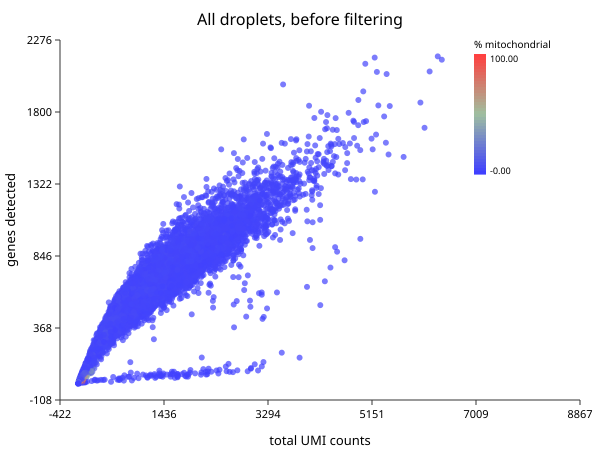
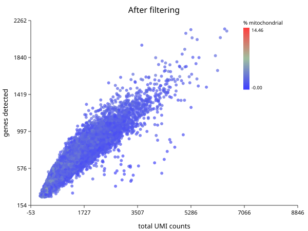

# Quality Control

*Follows HBC lessons 03 (QC setup), 04 (Cell Ranger QC), and 05 (Quality control).*

## The thing being filtered is not a cell

The matrix has one column per barcode, and the course is careful to say
*barcode* rather than *cell*, because 737,280 of them are not cells:

- **Empty droplets** that caught only ambient RNA — transcripts from cells that
  lysed during dissociation. Few genes, low counts, and the vast majority of the
  matrix.
- **Dying cells**, which leak cytoplasmic RNA while mitochondria stay intact
  longer, so the mitochondrial fraction climbs as the cytoplasm drains.
- **Doublets** — two cells in one droplet, appearing as one barcode with roughly
  twice the content and an impossible hybrid identity.

## Look before you cut

`sc.qc` computes per-cell and per-gene metrics and attaches them without
removing anything.

```biolang
import "singlecell" as sc

let raw = sc.load("ctrl_raw")
let scored = sc.qc(raw)

write_text("qc-raw.svg",
    sc.plot_qc_scatter(scored, "All droplets, before filtering"))
```



That is every barcode in the run. Two features carry the whole decision.

The **dense wedge running up and to the right** is the real cells: as a droplet
captures more UMIs it detects more distinct genes, and the two rise together.

The **flat spur along the bottom** is the problem. Those droplets accumulate
UMIs without accumulating genes — the signature of low-complexity content:
ambient RNA, dying cells, or a population dominated by a handful of transcripts.
Neither histogram shows this on its own. A cell with few genes *and* few UMIs is
an empty droplet; few genes but many UMIs is a different animal entirely, and
only the joint view distinguishes them.

The enormous blob at the origin is the empty droplets, and it is most of the
737,280.

## The three metrics

| Metric | Low means | High means |
|---|---|---|
| UMIs per cell | empty droplet, or a small cell | doublet, or a large cell |
| Genes per cell | empty droplet, low complexity | doublet |
| % mitochondrial | usually fine | dying or stressed cell |

Note the second column. **Every one of these has a benign explanation.** A plasma
cell genuinely has fewer distinct genes because it is devoting itself to
antibody transcripts. Cardiomyocytes are genuinely full of mitochondria. A
threshold right for PBMCs will delete a real population in heart tissue. This is
why the course insists on plotting distributions rather than applying remembered
numbers.

## Applying the cuts

```biolang
import "singlecell" as sc

let raw = sc.load("ctrl_raw")
let clean = raw
    |> sc.filter_genes(3)
    |> sc.filter_cells(250, 100000, 20.0)

println("before: " + str(raw.n_cells) + " droplets, " + str(raw.n_genes) + " genes")
println("after:  " + str(clean.n_cells) + " cells, " + str(clean.n_genes) + " genes")
```

```text
before: 737280 droplets, 33538 genes
after:  15049 cells, 15576 genes
```

**737,280 barcodes down to 15,049 cells**, and 33,538 genes to 15,576. The HBC
course reports about 15,000 cells for this sample, so the filter is landing where
theirs does.

Two filters, in this order and for a reason. `filter_genes(3)` drops genes seen
in fewer than three cells — a gene detected once cannot support a statistical
claim, and carrying eighteen thousand such genes costs memory and inflates the
multiple-testing burden later. `filter_cells(min_genes, max_genes, max_pct_mito)`
drops barcodes: the lower bound removes empty droplets, the upper catches
doublets, the mitochondrial cap removes dying cells.

The thresholds here are the course's: at least 250 genes, mitochondrial fraction
under 20%. The upper gene bound is deliberately loose because the lower bound and
the mitochondrial cap are doing the work on this dataset.

## What survived

```biolang
import "singlecell" as sc

let clean = sc.load("ctrl_raw")
    |> sc.filter_genes(3)
    |> sc.filter_cells(250, 100000, 20.0)

write_text("qc-clean.svg", sc.plot_qc_scatter(sc.qc(clean), "After filtering"))
```



The spur along the bottom is gone and the blob at the origin with it. What
remains is the diagonal band, which is what a clean sample looks like.

## The mitochondrial cap needs gene symbols

`max_pct_mito` finds genes whose symbol starts with `MT-`. If your features file
carries Ensembl IDs (`ENSG00000198804`) rather than symbols, nothing matches, the
mitochondrial fraction is zero for every cell, and the filter silently does
nothing.

It will not warn you. This dataset's `features.tsv` has three columns — Ensembl
ID, symbol, feature type — and `sc.load` takes the symbol, so the cap works here.
Check that your gene names look like names.

## What Cell Ranger knew that you no longer do

The course spends a lesson on Cell Ranger's `web_summary.html`. **BioLang cannot
read that file**, and most of what it reports can be recomputed from the matrix
anyway — cell counts, median genes per cell, UMI distributions.

Two things cannot. **Sequencing saturation** (how much another lane would buy)
and **fraction of reads mapped to the transcriptome** are properties of the
reads, and the reads are gone by the time you have a matrix. If those matter —
and for judging whether an experiment was deep enough, they do — read them in
Cell Ranger's viewer before moving on.

## Judge the filter by what survives

The only real test of a threshold is whether the biology is still there
afterwards. Filter, cluster, and check you still have the populations you
expected; if a cell type vanished between raw and filtered, the threshold found
it, not the noise.

That check needs clusters, which is
[Normalization and PCA](ch03-normalization-pca.md) and then
[Clustering](ch05-clustering.md). QC is not finished until you have been round
that loop once.
