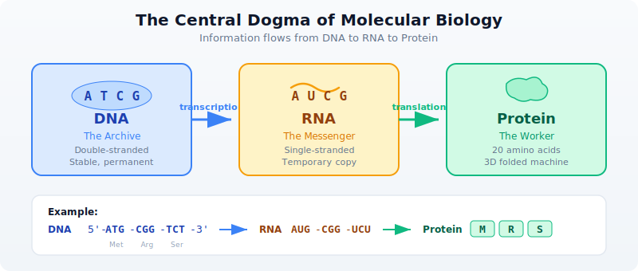
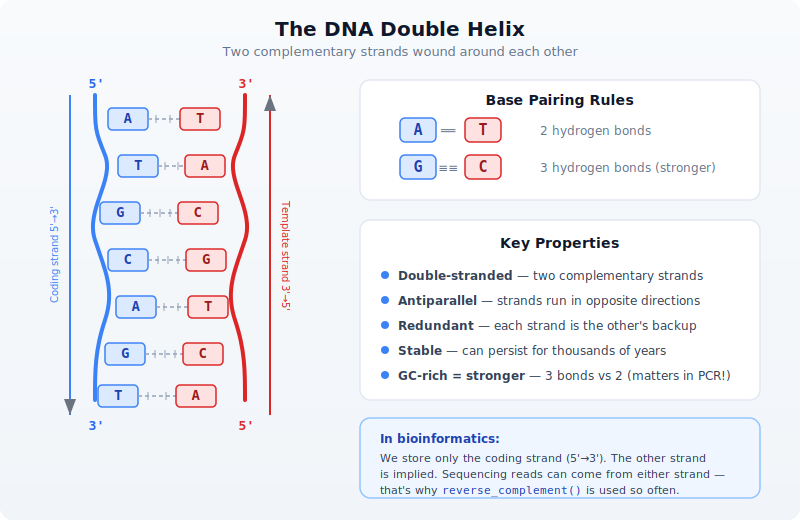
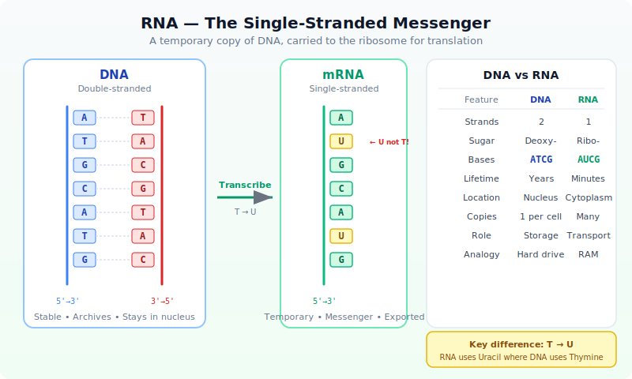
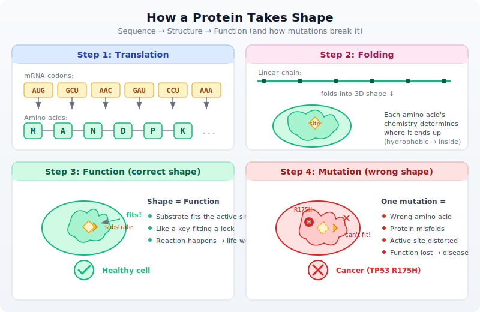
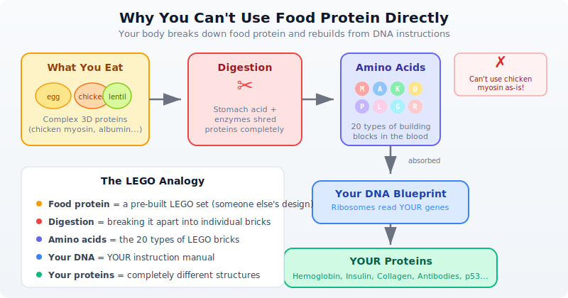
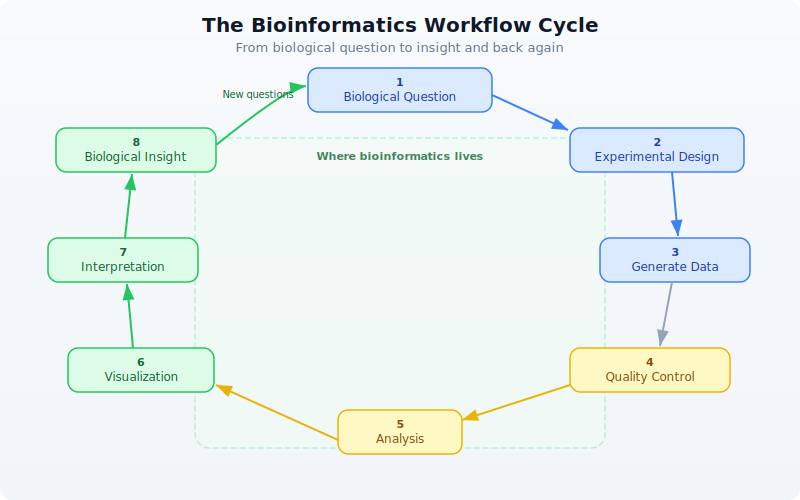

# Day 1: What Is Bioinformatics?

## The Problem

A patient walks into a clinic. Their tumor is sequenced. Three billion base pairs of data arrive on a hard drive. Somewhere in there is the mutation driving their cancer. How do you find it?

You cannot read three billion letters by hand. You cannot compare them against a reference genome by eye. You cannot search for patterns across thousands of patients using a spreadsheet. Biology has become a data science, and the data is enormous.

This is why bioinformatics exists.

## What Is Bioinformatics?

Bioinformatics sits at the intersection of three fields: biology, computer science, and statistics. But it is more than just "biology plus computers." It is the discipline of asking biological questions and answering them with data. When a researcher wants to know which genes are active in a tumor, when a clinician needs to identify a drug-resistant mutation, when an ecologist traces the evolutionary history of a species — that is bioinformatics.

The field was born out of necessity. In 1977, Frederick Sanger published the first complete DNA genome sequence — a bacteriophage with 5,386 base pairs. That was manageable by hand. By 2003, the Human Genome Project had sequenced 3.2 billion base pairs at a cost of $2.7 billion. Today, a single Illumina NovaSeq run produces over 6 terabytes of raw data in less than two days. The cost of sequencing a human genome has dropped below $200. The bottleneck is no longer generating data — it is making sense of it.

Every year, the gap between data generation and data analysis widens. Modern sequencing machines produce data faster than biologists can analyze it. This is where you come in. Whether you are a developer learning biology or a biologist learning to code, bioinformatics needs both perspectives. The biology tells you what questions to ask. The code tells you how to answer them.

## The Central Dogma of Molecular Biology

Before you can analyze biological data, you need to understand what that data represents. The central dogma describes how genetic information flows in living cells:



Let's break this down:

### DNA — The Double Helix

**DNA** is the blueprint. It is a long molecule made of four chemical bases: **A**denine, **T**hymine, **C**ytosine, and **G**uanine. Your entire genome — all the instructions to build and run your body — is written in these four letters. The human genome is about 3.2 billion base pairs long, organized into 23 pairs of chromosomes.

DNA has a unique structure: two strands wound around each other in a **double helix**, connected by base pairs. A always pairs with T (2 hydrogen bonds), and C always pairs with G (3 hydrogen bonds — making CG pairs stronger):



Each DNA strand has a direction, like a one-way street. Every nucleotide has a sugar with numbered carbon atoms. The **5' (five-prime) carbon** connects to the next nucleotide's **3' (three-prime) carbon** via a phosphate bond — so the strand has a built-in direction: 5'→3'. Both strands are built the same way, but they run in **opposite directions** (called **antiparallel**):

```
5'──A──T──G──C──G──3'   ← coding strand (read left to right)
    |  |  |  |  |
3'──T──A──C──G──C──5'   ← template strand (runs the other way)
```

The base pairing (A-T, C-G) holds the two strands together, but notice the 5' and 3' ends are flipped. This antiparallel arrangement is why enzymes like RNA polymerase can only read in one direction (3'→5' on the template, producing mRNA in 5'→3').

When we write a DNA sequence like `ATGCGATCG`, we mean the **coding strand read 5'→3'** — this is the universal convention in biology and bioinformatics. The other strand is implied — you can always reconstruct it using the base pairing rules.

### RNA — The Single-Stranded Messenger

**RNA** is the working copy. When a cell needs to use a gene, it copies that region of DNA into RNA through a process called *transcription*. Remember that DNA has two strands. The cell's RNA polymerase reads the **template strand** (also called the antisense strand) and builds a complementary RNA. The resulting mRNA sequence ends up matching the **coding strand** (the other strand, also called the sense strand) — except RNA uses **U**racil (U) instead of Thymine (T). So in practice, every `T` in the coding strand becomes `U` in the mRNA: `ATGCG` in DNA becomes `AUGCG` in RNA.

> **Why bioinformatics uses the coding strand:** When databases like NCBI store a gene sequence, they store the coding strand (5'→3'). To get the mRNA, just replace T with U. You rarely need to think about the template strand directly.

Unlike DNA's stable double helix, RNA is **single-stranded** — it is a temporary copy meant to be read and then degraded:



There are several types of RNA, but the one most relevant to the central dogma is **mRNA** (messenger RNA) — the copy that carries gene instructions to the ribosome for protein synthesis.

### Protein — The Folded Machine

**Protein** is the machine. Proteins do most of the work in cells — they catalyze reactions, transport molecules, provide structure, and signal between cells. The RNA sequence is read three letters at a time (called *codons*), and each codon maps to one of 20 amino acids. This process is called *translation*. For example, the codon `AUG` always codes for Methionine (abbreviated `M`) and also serves as the "start" signal.

A protein starts as a linear chain of amino acids, but it immediately **folds** into a specific 3D shape. This shape determines its function — and is why mutations can be so devastating:



The key insight: **sequence determines structure determines function**. Change one amino acid (via a DNA mutation) and the entire fold can collapse. This is why the TP53 R175H mutation causes cancer — swapping Arginine for Histidine at position 175 disrupts the DNA-binding domain, and p53 can no longer activate tumor suppression genes.

### Why Proteins Are Essential

Proteins are not optional extras — they are what makes life work. Every function your body performs depends on specific proteins doing their jobs correctly:

**With working proteins — your body functions:**

| Protein | What it does |
|---------|-------------|
| **Hemoglobin** | Carries oxygen from your lungs to every cell in your body |
| **Insulin** | Regulates blood sugar — signals cells to absorb glucose for energy |
| **Collagen** | Provides structure to skin, bones, tendons, and connective tissue |
| **Antibodies** | Recognize and neutralize viruses, bacteria, and foreign invaders |
| **p53** | The "guardian of the genome" — detects DNA damage, triggers repair or cell death |
| **DNA polymerase** | Copies your entire 3.2 billion base genome every time a cell divides |
| **Myosin** | Powers muscle contraction — every heartbeat, every breath, every step |
| **Keratin** | Builds your hair, nails, and outer layer of skin |

**Without working proteins — disease happens:**

| Missing/defective protein | Consequence |
|--------------------------|-------------|
| Hemoglobin | Cells starve for oxygen → **sickle cell anemia** |
| Insulin | Blood sugar spirals out of control → **type 1 diabetes** |
| p53 | Damaged cells keep dividing unchecked → **cancer** (mutated in >50% of all cancers) |
| Dystrophin | Muscles progressively weaken and waste → **muscular dystrophy** |
| CFTR | Thick mucus builds up in lungs and digestive tract → **cystic fibrosis** |
| BRCA1 | DNA repair fails → dramatically increased **breast and ovarian cancer** risk |
| Phenylalanine hydroxylase | Cannot break down phenylalanine → **PKU** (brain damage if untreated) |

This is why a single mutation in a gene can cause devastating disease. The mutation changes the DNA, which changes the RNA, which changes the protein's amino acid sequence, which can alter its 3D shape, which can destroy its function. One wrong letter out of billions — and the protein misfolds, or never gets made, or loses its ability to do its job.

### "But I Eat Protein Every Day — Why Can't I Just Use That?"

You have heard it your whole life: *"Eat protein — eggs, chicken, lentils, fish."* So a natural question is: if proteins are so essential, why does the body need to manufacture them from DNA instructions? Why not just use the protein from food directly?

The answer is that **dietary protein and your body's proteins are completely different things.** When you eat a chicken breast, you are eating chicken muscle proteins — myosin, actin, troponin — proteins designed to make a chicken's wing move. Your body cannot use chicken myosin as-is. It is the wrong shape, the wrong size, the wrong function.

Here is what actually happens:



Think of it like this: eating a wooden chair does not give you furniture. But if you break that chair down into individual planks and nails, you can use those raw materials to build something completely different — a bookshelf, a table, whatever *your* blueprint calls for.

**Food protein = raw materials (amino acids).** Your DNA = the blueprints. Your ribosomes = the factory. The 20 amino acids are like 20 types of LEGO bricks — the same bricks can build completely different structures depending on the instructions. (You will find the complete table of all 20 amino acids with their single-letter codes and properties in [Day 3](day-03.md#the-20-amino-acids).)

This is why the central dogma matters so profoundly:

| What you eat | What your body builds | Why it is different |
|---|---|---|
| Egg albumin (egg white protein) | Hemoglobin (carries oxygen in blood) | Completely different amino acid sequence and 3D fold |
| Casein (milk protein) | Keratin (hair, nails, skin) | Different gene, different structure, different function |
| Soy glycinin (plant protein) | Insulin (regulates blood sugar) | Only 51 amino acids long — assembled from your DNA template |
| Collagen (bone broth) | Antibodies (fight infection) | Your immune system designs these based on threats encountered |

Your body contains roughly **20,000 different proteins**, each encoded by its own gene, each with a unique amino acid sequence and 3D structure. You cannot get these from food. You can only get the raw building blocks (amino acids) from food, and then your cells assemble them according to the instructions in your DNA.

This is also why **protein deficiency** is so dangerous — without enough amino acids from food, your cells cannot build the proteins your DNA encodes. And it is why **genetic mutations** are so consequential — even with perfect nutrition, a mutated gene produces a misfolded or missing protein that no amount of food can fix.

The central dogma is not an abstract concept — it is the reason your body works, and the reason disease happens when it goes wrong. Understanding this chain (DNA encodes RNA, RNA builds protein, protein does the work) is essential for everything in bioinformatics. When we analyze variants, we are asking: *"Does this DNA change affect the protein?"* When we measure gene expression, we are asking: *"How much of this protein is the cell making?"* Every analysis connects back to this fundamental flow.

## Genes, Genomes, and Chromosomes

Now that you understand the molecules (DNA, RNA, Protein), let's define the structures that organize them.

### Genome — The Complete Instruction Manual

A **genome** is the complete set of DNA in an organism — every instruction needed to build and run that organism. Think of it as the entire hard drive, not a single file.

| Organism | Genome size | Genes | Chromosomes |
|----------|-----------|-------|-------------|
| E. coli (bacterium) | 4.6 million bp | ~4,300 | 1 (circular) |
| Yeast (S. cerevisiae) | 12 million bp | ~6,000 | 16 |
| Fruit fly (Drosophila) | 180 million bp | ~14,000 | 4 pairs |
| Human (Homo sapiens) | 3.2 billion bp | ~20,000 | 23 pairs |
| Wheat (Triticum aestivum) | 17 billion bp | ~107,000 | 21 pairs |

Notice something surprising: genome size does not correlate well with organism complexity. Wheat has 5x more DNA than humans. The difference lies not in how much DNA you have, but in how it is organized and regulated.

### Chromosomes — The Volumes

**Chromosomes** are the physical units that DNA is packaged into. If the genome is an encyclopedia, chromosomes are the individual volumes. Humans have 23 pairs (46 total) — one set from each parent. Each chromosome is a single, very long DNA molecule wrapped tightly around proteins called histones.

```
Human Genome (3.2 billion base pairs)
├── Chromosome 1   (249 million bp)   ← largest
├── Chromosome 2   (242 million bp)
├── ...
├── Chromosome 17  (83 million bp)    ← home of TP53 and BRCA1
├── ...
├── Chromosome 22  (51 million bp)    ← smallest autosome
├── Chromosome X   (156 million bp)
└── Chromosome Y   (57 million bp)
```

When we say a gene is "on chromosome 17", we mean its DNA sequence is part of that specific chromosome's molecule.

### Genes — The Individual Instructions

A **gene** is a specific region of DNA that contains the instructions for building one protein (or sometimes a functional RNA molecule). If the genome is the encyclopedia and chromosomes are volumes, genes are individual articles.

Key facts about genes:
- The human genome has roughly **20,000 protein-coding genes**
- Genes make up only about **1.5%** of total human DNA
- The rest includes regulatory sequences (promoters, enhancers), structural elements, and regions still being characterized
- A gene is not just one continuous stretch — it contains **exons** (coding parts) interrupted by **introns** (non-coding parts that get spliced out)
- The same gene can produce **multiple different proteins** through alternative splicing

```
A gene is like a recipe in a cookbook:
- The cookbook = genome
- The chapter = chromosome
- The recipe = gene
- The ingredients list = exons (the parts that matter)
- The chef's notes = introns (removed before cooking)
- The finished dish = protein
```

Some landmark genes you will encounter throughout this book:

| Gene | Chromosome | What it does | Why it matters |
|------|-----------|-------------|---------------|
| **TP53** | chr17 | Encodes p53 tumor suppressor | Mutated in >50% of all cancers |
| **BRCA1** | chr17 | DNA double-strand break repair | Mutations increase breast/ovarian cancer risk |
| **EGFR** | chr7 | Cell growth signaling receptor | Drug target in lung cancer |
| **KRAS** | chr12 | Cell proliferation signal relay | Mutated in pancreatic, lung, colorectal cancer |
| **HBB** | chr11 | Hemoglobin beta chain | Sickle cell disease when mutated |
| **CFTR** | chr7 | Chloride ion channel | Cystic fibrosis when mutated |
| **INS** | chr11 | Insulin hormone | Critical for blood sugar regulation |

## Why Data?

Here is the scale problem that makes bioinformatics necessary:

- A single human genome: **~3 GB** of text (just the bases, no metadata)
- A typical whole-genome sequencing run: **100-500 GB** of raw data (because each position is read multiple times for accuracy)
- NCBI GenBank (the world's public sequence archive): **over 10 trillion nucleotide bases**
- The Sequence Read Archive: **over 80 petabytes** of raw sequencing data

You cannot do this by hand. You need code.

| Task | By Hand | By Code |
|------|---------|---------|
| Find a gene in a genome | Hours searching databases | 1 second |
| Count mutations vs. reference | Essentially impossible | 0.5 seconds |
| Compare 1,000 genomes | Multiple lifetimes | Minutes |
| Quality-check a sequencing run | Days of manual review | 30 seconds |
| Search for a drug target | Years of literature review | Hours with database queries |

This is not an exaggeration. Before computational tools existed, identifying a single disease gene could take a decade of work by large teams. Today, clinical sequencing pipelines identify candidate variants in hours. The biology has not changed. The tools have.

## Your First Bioinformatics

> **Try it right now — no installation needed!** You can run all the code examples in this chapter directly in your browser at **[lang.bio/playground](https://lang.bio/playground)**. The online playground is perfect for the exercises in Days 1 through 5. For later chapters that work with files (FASTQ, VCF, CSV), you will need the local `bl` installation — see [Appendix A](appendix-setup.md) for setup instructions.

Let's write some code. BioLang treats DNA, RNA, and protein sequences as first-class types — not strings, but biological objects that understand what they are.

### Creating a DNA sequence

```bio
# Your first DNA sequence
let seq = dna"ATGCGATCGATCGATCG"
println(f"Sequence: {seq}")
println(f"Length: {len(seq)} bases")
println(f"Type: {type(seq)}")

# Output:
# Sequence: DNA(ATGCGATCGATCGATCG)
# Length: 17
# Type: DNA
```

That `dna"..."` is a sequence literal. BioLang knows this is DNA, not a random string. It will enforce that only valid bases appear. Try putting a `Z` in there — you will get an error, because `Z` is not a nucleotide.

### The central dogma in code

```bio
# Walk through the central dogma
let gene = dna"ATGAAACCCGGGTTTTAA"
println(f"DNA:     {gene}")

let mrna = transcribe(gene)
println(f"RNA:     {mrna}")

let protein = translate(gene)
println(f"Protein: {protein}")

# Output:
# DNA:     DNA(ATGAAACCCGGGTTTTAA)
# RNA:     RNA(AUGAAACCCGGGUUUUAA)
# Protein: Protein(MKPGF)
```

Six codons in that DNA sequence: `ATG` (Met/M), `AAA` (Lys/K), `CCC` (Pro/P), `GGG` (Gly/G), `TTT` (Phe/F), and `TAA` (Stop). The `translate` function reads until the stop codon and returns the protein sequence `MKPGF`. That is the central dogma — DNA to RNA to Protein — in three lines of code.

### Analyzing sequence composition

```bio
# What's in this sequence?
let genome_fragment = dna"ATGCGATCGATCGAATTCGATCG"
let counts = base_counts(genome_fragment)
println(f"Base composition: {counts}")
println(f"GC content: {gc_content(genome_fragment)}")

# Output:
# Base composition: {A: 6, T: 6, G: 6, C: 5, N: 0, GC: 0.4782608695652174}
# GC content: 0.4782608695652174
```

**Why GC content and not AT content?** Since GC% + AT% = 100%, knowing one tells you the other. The convention is to report GC because it's the biologically interesting number:

- **Thermal stability** — G-C base pairs form three hydrogen bonds (versus two for A-T), so GC-rich regions are harder to melt apart. This directly affects PCR primer design — you need primers with the right melting temperature.
- **Gene density** — GC-rich regions in the human genome tend to be gene-dense, and CpG islands (clusters of CG dinucleotides) mark promoter regions where genes start.
- **Sequencing quality** — Illumina sequencers have lower coverage in regions with very high or very low GC content, so checking GC distribution is a standard quality control step.
- **Species fingerprint** — Organisms have characteristic GC content. *Plasmodium falciparum* (malaria parasite) has about 19% GC, while *Streptomyces* bacteria can exceed 70%. If you sequence a sample and see unexpected GC content, it might indicate contamination or a novel organism.

### Finding patterns in DNA

```bio
# Finding a restriction enzyme site
let seq = dna"ATCGATCGAATTCGATCGATCG"
let sites = find_motif(seq, "GAATTC")
println(f"EcoRI cuts at positions: {sites}")

# Output:
# EcoRI cuts at positions: [7]
```

EcoRI is a restriction enzyme — a molecular scissor that cuts DNA at a specific recognition sequence (`GAATTC`). These enzymes are fundamental tools in molecular biology. Before sequencing was cheap, scientists used restriction enzymes to cut genomes into fragments for analysis. Even today, they are essential for cloning, genotyping, and quality control.

### Using the pipe operator

BioLang's pipe operator `|>` lets you chain operations naturally — data flows left to right, just like a bench protocol:

```bio
# Chain operations with pipes
let result = dna"ATGCGATCGATCG"
    |> complement()
    |> reverse_complement()
    |> transcribe()
println(f"Result: {result}")

# Output:
# Result: RNA(AUGCGAUCGAUCG)
```

If you are coming from biology, think of pipes as steps in a lab protocol. If you are coming from programming, think of them as method chaining or Unix pipes. Either way, they make multi-step analyses readable.

## The Bioinformatics Workflow

Every bioinformatics project — from a student homework to a clinical sequencing pipeline — follows the same general pattern:



### The Eight Steps

| Step | Name | Description |
|------|------|-------------|
| 1 | **Biological Question** | What do you want to know? *"Which genes are differentially expressed in tumor vs. normal tissue?"* |
| 2 | **Experimental Design** | How will you answer it? Sample selection, sequencing strategy, controls. |
| 3 | **Generate Data** | Sequencing, mass spectrometry, microarrays, or other assays. |
| 4 | **Quality Control** | Is the data trustworthy? Check for contamination, low-quality reads, batch effects. |
| 5 | **Analysis** | Alignment, variant calling, differential expression, statistical testing. |
| 6 | **Visualization** | Plots, genome browsers, heatmaps that reveal patterns in the results. |
| 7 | **Interpretation** | What do the results mean biologically? Do they support your hypothesis? |
| 8 | **Biological Insight** | New knowledge, which inevitably leads to new questions. |

Steps 4 through 7 are where bioinformatics lives. That is what you will learn in this book.

## What You'll Build in 30 Days

This book is structured as four weeks, each building on the last:

**Week 1: Foundations (Days 1-5)** — You are here. By the end of this week, you will understand the biology behind the data, be comfortable with BioLang's syntax, and know the core data structures used in bioinformatics.

**Week 2: Core Skills (Days 6-12)** — Reading real sequencing data (FASTQ, BAM, VCF), working with biological databases, processing large files efficiently, and finding variants in genomes. This is the bread and butter of bioinformatics.

**Week 3: Applied Analysis (Days 13-20)** — Gene expression analysis, statistics, publication-quality visualization, pathway analysis, protein structure, and multi-species comparison. This is where you start doing real science.

**Week 4: Professional Skills (Days 21-30)** — Performance optimization, reproducible pipelines, batch processing, error handling, and three capstone projects that tie everything together: a clinical variant report, an RNA-seq study, and a multi-species gene family analysis.

By Day 30, you will be able to take raw sequencing data from a public database, process it through a quality control pipeline, identify biologically meaningful results, and produce publication-quality figures. That is not a promise about what you might achieve — it is the actual content of the capstone projects.

## Exercises

**Exercise 1: Sequence Composition**

Create a DNA sequence of at least 20 bases and analyze its composition:

```bio
let my_seq = dna"ATGCCCAAAGGGTTTATGCCC"
let counts = base_counts(my_seq)
println(f"Counts: {counts}")
println(f"GC content: {gc_content(my_seq)}")
```

Is your sequence GC-rich (>50% GC) or AT-rich (<50% GC)?

**Exercise 2: Central Dogma**

Translate this DNA sequence and determine what protein it encodes:

```bio
let gene = dna"ATGGATCCCTAA"
println(f"DNA:     {gene}")
println(f"RNA:     {transcribe(gene)}")
println(f"Protein: {translate(gene)}")

# What amino acids are M, D, and P?
# Hint: M = Methionine, D = Aspartic acid, P = Proline
```

**Exercise 3: Base Counting**

Count the bases in this perfectly balanced sequence:

```bio
let balanced = dna"AAAAATTTTTCCCCCGGGGG"
println(f"Counts: {base_counts(balanced)}")
println(f"GC content: {gc_content(balanced)}")

# Is it GC-rich, AT-rich, or perfectly balanced?
```

**Exercise 4: Motif Search**

Find all start codons (ATG) in this sequence:

```bio
let seq = dna"ATGATGATGATG"
let starts = find_motif(seq, "ATG")
println(f"Start codons at positions: {starts}")

# How many start codons are there?
# What positions are they at?
```

## Key Takeaways

- **Bioinformatics exists because biology generates data at computational scale.** Modern sequencing produces terabytes daily — no human can process that by hand.
- **DNA to RNA to Protein is the central dogma** — the foundation of molecular biology. DNA stores the information, RNA carries it, and proteins do the work.
- **BioLang treats sequences as first-class types, not just strings.** `dna"ATGC"` is a DNA value with biological semantics, not four arbitrary characters.
- **Every bioinformatics project follows the same workflow:** Question, Data, QC, Analysis, Insight. The tools change, but the pattern does not.
- **Scale is the defining challenge.** A single genome is 3 GB. A research project can involve thousands of genomes. Code is the only way to work at this scale.

## Setting Up for the Comparison Scripts

Each day in this book includes equivalent scripts in Python and R alongside the BioLang version, so you can compare approaches. Before starting the exercises, install the required packages once:

**Python** (run in a terminal):

```bash
pip install biopython scipy pandas matplotlib requests openai
```

**R** (run in an R console):

```r
install.packages(c("dplyr", "jsonlite", "httr2", "digest", "logging", "ggplot2"))
# For Bioconductor packages (optional, used in later chapters):
# if (!require("BiocManager")) install.packages("BiocManager")
# BiocManager::install(c("Biostrings", "GenomicRanges"))
```

> **Note:** You do not need Python or R to follow this book — all examples work in BioLang alone. The comparison scripts are provided so you can see how the same analysis looks across languages. See [Appendix A](appendix-setup.md) for detailed setup instructions.

## What's Next

Tomorrow, we go hands-on with BioLang itself — variables, types, pipes, functions, and the interactive REPL. You will learn the language that powers every example in this book. If today was about *why* bioinformatics exists, tomorrow is about *how* you do it.
