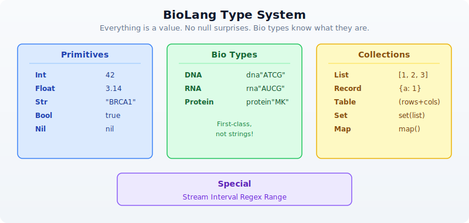

# Day 2: Your First Language — BioLang

## The Problem

You have seen what bioinformatics can do. You know that DNA becomes RNA becomes protein, that genomes are billions of letters long, and that computation is the only way to make sense of this data. Now you need a tool to do it.

Every programming language makes tradeoffs. Python is general-purpose but verbose for biology — you need imports, object wrappers, and ten lines to do what should take two. R is excellent for statistics but awkward for building pipelines. Perl was the original bioinformatics language but has fallen out of favor for good reason. Each of these languages was designed for something else and then adapted for biology.

BioLang was designed for one thing: making biological data analysis as natural as describing it in English. DNA sequences are not strings you have to convert. Pipes are not a library you have to import. The language thinks about biology the way you do.

Today you will learn BioLang from scratch. By the end, you will be writing real analysis code — filtering sequences, computing statistics, and chaining operations together with a fluency that would take weeks in other languages.

## Getting Started: The REPL

A REPL (Read-Eval-Print Loop) is an interactive environment where you type code, it runs immediately, and you see the result. It is the best way to learn a language because you get instant feedback.

> **No installation yet?** You can try all the examples in this chapter at **[lang.bio/playground](https://lang.bio/playground)** — it runs BioLang directly in your browser. Perfect for learning the basics before committing to a local install.

Launch it:

```bash
bl repl
```

Or simply:

```bash
bl
```

You will see a prompt:

```
bl>
```

Try some arithmetic:

```
bl> 2 + 3
5
bl> 10 * 7
70
bl> 2 ** 10
1024
bl> 17 % 5
2
```

Try strings:

```
bl> "Hello, bioinformatics!"
Hello, bioinformatics!
bl> len("ATCGATCG")
8
bl> upper("atcgatcg")
ATCGATCG
```

To exit the REPL, type `Ctrl+D` or `Ctrl+C`.

The REPL is your laboratory bench. Throughout this book, any time you see a new concept, try it there first. Get a feel for it. Break it. Fix it. That is how you learn.

## Variables and Types

BioLang has a clean type system designed for biology. Here is how it is organized:



### Declaring Variables

Use `let` to create a variable. BioLang infers the type automatically — you never need type annotations.

```bio
let name = "BRCA1"           # Str
let length = 81189            # Int
let gc = 0.423                # Float
let is_oncogene = false       # Bool
let seq = dna"ATGCGATCG"     # DNA
```

Use `type()` to check what type a value is:

```bio
println(type(name))     # Str
println(type(length))   # Int
println(type(gc))       # Float
println(type(seq))      # DNA
```

### Reassignment

Once a variable exists, you can update it without `let`:

```bio
let count = 0
count = count + 1
println(count)          # 1
```

### Why Bio Types Matter

In Python, DNA is just a string: `"ATCG"`. You can accidentally concatenate it with a name, reverse it incorrectly, or pass it to a function that expects a protein. Nothing stops you.

In BioLang, `dna"ATCG"` is a DNA value. The language knows it is DNA. Functions like `transcribe()` accept DNA and return RNA. Functions like `gc_content()` accept DNA or RNA and return a float. If you try to transcribe a protein, you get an error — immediately, not three hours into a pipeline run.

```bio
let d = dna"ATGCGATCG"
let r = transcribe(d)         # Works: DNA -> RNA
let p = translate(r)          # Works: RNA -> Protein

# This would fail:
# let bad = transcribe(p)     # Error: transcribe requires DNA
```

## The Pipe Operator

This is the most important concept in BioLang. If you learn one thing today, learn this.

The pipe operator `|>` takes the result of one expression and feeds it as the first argument to the next function. It turns nested, inside-out code into left-to-right, top-to-bottom code that reads like English.

```
  data  ──|>──  transform1()  ──|>──  transform2()  ──|>──  result
```

### Without Pipes vs. With Pipes

```bio
# Without pipes (nested calls — read inside-out)
println(round(gc_content(dna"ATCGATCGATCG"), 3))

# With pipes (left to right — natural reading order)
dna"ATCGATCGATCG"
    |> gc_content()
    |> round(3)
    |> println()
```

Both lines produce the same result: `0.5`. But the pipe version reads like a recipe: take this sequence, compute its GC content, round it, print it.

### How Pipes Work

The rule is simple: `a |> f(b)` becomes `f(a, b)`. The pipe inserts the left side as the **first argument** to the function on the right.

```bio
# These two are identical:
round(gc_content(dna"ATCG"), 3)

dna"ATCG" |> gc_content() |> round(3)
```

### Pipes with Biology

Pipes follow the fundamental bioinformatics pattern: **read, transform, summarize**.

```bio
# Transcribe and translate in one pipeline
dna"ATGAAACCCGGG"
    |> transcribe()
    |> translate()
    |> println()
# Output: Protein(MKPG)

# Find start codons in a sequence
let positions = find_motif(dna"ATGATGCCGATG", "ATG")
println(f"Start codon positions: {positions}")
# Output: Start codon positions: [0, 3, 9]

println(f"Found {len(positions)} start codons")
# Output: Found 3 start codons
```

You will use pipes constantly. Every chapter in this book builds pipe chains. They are the backbone of BioLang.

## Lists and Records

### Lists — Ordered Collections

A list holds values in order. Create one with square brackets:

```bio
# Lists — ordered collections
let genes = ["BRCA1", "TP53", "EGFR", "KRAS"]
println(len(genes))           # 4
println(genes[0])             # BRCA1
println(genes[3])             # KRAS
println(genes[-1])            # KRAS (negative indices count from the end)
println(genes[-2])            # EGFR

# Lists can hold any type
let lengths = [81189, 19149, 188307, 45806]
let mixed = ["BRCA1", 81189, true, dna"ATCG"]
```

Useful list operations:

```bio
let nums = [3, 1, 4, 1, 5, 9]
println(first(nums))          # 3
println(last(nums))           # 9
println(sort(nums))           # [1, 1, 3, 4, 5, 9]
println(reverse(nums))        # [9, 5, 1, 4, 1, 3]
println(contains(nums, 5))    # true
```

### Records — Key-Value Pairs

Records are collections of named fields, like a dictionary or a struct:

```bio
# Records — key-value pairs
let gene = {
    name: "TP53",
    chromosome: "17",
    length: 19149,
    is_tumor_suppressor: true
}
println(gene.name)            # TP53
println(gene.chromosome)      # 17
println(gene.length)          # 19149
```

Records are everywhere in bioinformatics. Every gene has a name, a location, a function. Every experiment has samples, conditions, results. Records let you group related data together naturally.

## Functions

### Defining Functions

Use `fn` to define a function:

```bio
fn gc_rich(seq) {
    gc_content(seq) > 0.6
}

let s = dna"GCGCGCGCATGC"
println(gc_rich(s))            # true

let t = dna"AAAATTTT"
println(gc_rich(t))            # false
```

Functions can take multiple parameters and use any logic:

```bio
fn classify_gc(seq) {
    let gc = gc_content(seq)
    if gc > 0.6 {
        "GC-rich"
    } else if gc < 0.4 {
        "AT-rich"
    } else {
        "balanced"
    }
}

println(classify_gc(dna"GCGCGCGC"))    # GC-rich
println(classify_gc(dna"ATATATATAT"))  # AT-rich
println(classify_gc(dna"ATCGATCG"))    # balanced
```

### Lambdas (Anonymous Functions)

A lambda is a small function without a name. The syntax is `|params| expression`:

```bio
let double = |x| x * 2
println(double(5))             # 10

let add = |a, b| a + b
println(add(3, 7))             # 10
```

Lambdas are used constantly with higher-order functions (coming up next). They let you define behavior inline, right where you need it.

## Control Flow

### If / Else

```bio
let gc = 0.65
if gc > 0.6 {
    println("GC-rich region")
} else if gc < 0.4 {
    println("AT-rich region")
} else {
    println("Balanced composition")
}
# Output: GC-rich region
```

`if` in BioLang is also an expression — it returns a value:

```bio
let label = if gc > 0.6 { "high" } else { "normal" }
println(label)                 # high
```

### For Loops

```bio
let codons = ["ATG", "GCT", "TAA"]
for codon in codons {
    println(f"Codon: {codon}")
}
# Output:
# Codon: ATG
# Codon: GCT
# Codon: TAA
```

### Pattern Matching

`match` is like a more powerful `if/else` chain:

```bio
let base = "A"
match base {
    "A" | "G" => println("Purine"),
    "C" | "T" => println("Pyrimidine"),
    _ => println("Unknown"),
}
# Output: Purine
```

The `_` is a wildcard — it matches anything. Pattern matching is especially useful for handling different cases cleanly.

## Higher-Order Functions

Higher-order functions (HOFs) take a function as an argument. They are the power tools of BioLang. Once you learn `map`, `filter`, and `reduce`, you will rarely need explicit loops.

### map — Transform Each Element

`map` applies a function to every element and returns a new list:

```bio
let sequences = [dna"ATCG", dna"GCGCGC", dna"ATATAT"]
let gc_values = sequences |> map(|s| gc_content(s))
println(gc_values)
# Output: [0.5, 1.0, 0.0]
```

### filter — Keep Elements Matching a Condition

`filter` keeps only elements where the function returns `true`:

```bio
let sequences = [dna"ATCG", dna"GCGCGC", dna"ATATAT"]
let gc_rich = sequences
    |> filter(|s| gc_content(s) > 0.4)
println(gc_rich)
# Output: [DNA(ATCG), DNA(GCGCGC)]
println(len(gc_rich))
# Output: 2
```

### each — Do Something with Each Element

`each` runs a function on every element for its side effects (like printing). It does not collect results:

```bio
["BRCA1", "TP53", "EGFR"]
    |> each(|g| println(f"Gene: {g}"))
# Output:
# Gene: BRCA1
# Gene: TP53
# Gene: EGFR
```

### reduce — Combine into a Single Value

`reduce` combines all elements into one value by applying a function pairwise:

```bio
let sequences = [dna"ATCG", dna"GCGCGC", dna"ATATAT"]
let total_length = sequences
    |> map(|s| len(s))
    |> reduce(|a, b| a + b)
println(f"Total bases: {total_length}")
# Output: Total bases: 16
```

### Combining HOFs with Pipes

The real power comes from chaining these together:

```bio
# Find names of all GC-rich sequences
[dna"ATCG", dna"GCGCGCGC", dna"AAAA", dna"CCGG"]
    |> filter(|s| gc_content(s) > 0.5)
    |> map(|s| f"GC={round(gc_content(s), 2)}: {s}")
    |> each(|line| println(line))
# Output:
# GC=1.0: DNA(GCGCGCGC)
# GC=0.75: DNA(CCGG)
```

## Putting It All Together

Here is a mini-analysis that uses everything you have learned today — variables, records, pipes, functions, and HOFs:

```bio
# Analyze a set of gene fragments
let fragments = [
    {name: "exon1", seq: dna"ATGCGATCGATCG"},
    {name: "exon2", seq: dna"GCGCGCATATAT"},
    {name: "exon3", seq: dna"TTTTAAAACCCC"},
]

# Find GC-rich exons using pipes + HOFs
let gc_rich_exons = fragments
    |> filter(|f| gc_content(f.seq) > 0.5)
    |> map(|f| f.name)

println(f"GC-rich exons: {gc_rich_exons}")
# Output: GC-rich exons: [exon1]

# Summary statistics
let gc_values = fragments |> map(|f| round(gc_content(f.seq), 3))
println(f"GC contents: {gc_values}")
# Output: GC contents: [0.538, 0.5, 0.333]

println(f"Mean GC: {round(mean(gc_values), 3)}")
# Output: Mean GC: 0.457

# Classify each fragment
fn classify_gc(gc) {
    if gc > 0.6 { "GC-rich" }
    else if gc < 0.4 { "AT-rich" }
    else { "balanced" }
}

fragments |> each(|f| {
    let gc = round(gc_content(f.seq), 3)
    println(f"{f.name}: GC={gc} ({classify_gc(gc)})")
})
# Output:
# exon1: GC=0.538 (balanced)
# exon2: GC=0.5 (balanced)
# exon3: GC=0.333 (AT-rich)
```

This is the pattern you will use for the rest of this book: load data, transform it with pipes and HOFs, summarize the results. The data gets more complex — FASTQ files, VCF variants, gene expression tables — but the pattern stays the same.

## BioLang vs Python vs R

Let's see the same task in all three languages: given a list of DNA sequences, find the GC-rich ones and display them with their GC content.

### BioLang (6 lines, 0 imports)

```bio
let seqs = [dna"ATCGATCG", dna"GCGCGCGC", dna"ATATATAT"]
seqs
    |> filter(|s| gc_content(s) > 0.5)
    |> map(|s| {seq: s, gc: round(gc_content(s), 3)})
    |> each(|r| println(f"{r.seq}: {r.gc}"))
```

### Python (15 lines)

```python
from Bio.Seq import Seq
from Bio.SeqUtils import gc_fraction

sequences = [Seq("ATCGATCG"), Seq("GCGCGCGC"), Seq("ATATATAT")]

gc_rich = []
for seq in sequences:
    gc = gc_fraction(seq)
    if gc > 0.5:
        gc_rich.append({"seq": str(seq), "gc": round(gc, 3)})

for item in gc_rich:
    print(f"{item['seq']}: {item['gc']}")

# Or with list comprehension (more compact but harder to read):
# [print(f"{s}: {round(gc_fraction(s),3)}") for s in sequences if gc_fraction(s)>0.5]
```

### R (12 lines)

```r
library(Biostrings)

sequences <- DNAStringSet(c("ATCGATCG", "GCGCGCGC", "ATATATAT"))

gc_values <- letterFrequency(sequences, letters="GC", as.prob=TRUE)
gc_rich_idx <- which(gc_values > 0.5)

gc_rich_seqs <- sequences[gc_rich_idx]
gc_rich_vals <- round(gc_values[gc_rich_idx], 3)

for (i in seq_along(gc_rich_seqs)) {
  cat(sprintf("%s: %s\n", as.character(gc_rich_seqs[i]), gc_rich_vals[i]))
}
```

### Why the Difference Matters

BioLang is not shorter because it is a toy. It is shorter because:
- **No imports**: DNA, GC content, and pipes are built in
- **Bio types**: `dna"..."` is a type, not a string you convert
- **Pipes**: chaining reads top-to-bottom, not inside-out
- **HOFs**: `filter`, `map`, `each` replace loops

When your script is 6 lines instead of 15, you spend less time writing boilerplate and more time thinking about biology. That advantage compounds — a 200-line pipeline in BioLang would be 500 lines in Python.

## Exercises

Try these in the REPL or in a `.bl` script file.

**Exercise 1: Longest Sequence**

Create a list of 5 DNA sequences of different lengths. Find the longest one using `sort_by` and `last`:

```bio
let seqs = [dna"ATG", dna"ATCGATCG", dna"ATCG", dna"AT", dna"ATCGATCGATCG"]
# Hint: sort_by takes a lambda that returns the sort key
# seqs |> sort_by(|s| len(s)) |> last() |> print()
```

**Exercise 2: Classify Bases**

Write a function `classify_base(base)` that uses `match` to return `"purine"` for A or G, `"pyrimidine"` for C or T, and `"unknown"` for anything else:

```bio
# fn classify_base(base) { ... }
# Test: classify_base("A") should return "purine"
```

**Exercise 3: Central Dogma Pipeline**

Use pipes to: create a DNA sequence, transcribe it to RNA, translate it to protein, and get its length — all in one pipeline:

```bio
# dna"ATGAAACCCGGGTTTTAA" |> transcribe() |> translate() |> len() |> print()
```

**Exercise 4: Filter Records**

Given a list of gene expression records, keep only those with expression above 3.0:

```bio
let genes = [
    {gene: "BRCA1", expr: 5.2},
    {gene: "TP53", expr: 1.8},
    {gene: "EGFR", expr: 7.1},
    {gene: "KRAS", expr: 2.3},
    {gene: "MYC", expr: 4.0},
]
# Hint: genes |> filter(|g| g.expr > 3.0) |> each(|g| print(f"{g.gene}: {g.expr}"))
```

**Exercise 5: Join vs Reduce**

Use `reduce` to concatenate a list of strings with `" | "` as separator. Then discover that `join` does it more simply:

```bio
let items = ["DNA", "RNA", "Protein"]
# Hard way: items |> reduce(|a, b| a + " | " + b) |> print()
# Easy way: join(items, " | ") |> print()
```

## Key Takeaways

Here is what you learned today, distilled:

| Concept | Syntax | Example |
|---------|--------|---------|
| Variable | `let x = value` | `let seq = dna"ATCG"` |
| Function | `fn name(params) { body }` | `fn gc_rich(s) { gc_content(s) > 0.6 }` |
| Lambda | `\|params\| expr` | `\|x\| x * 2` |
| Pipe | `a \|> f(b)` | `seq \|> gc_content() \|> print()` |
| map | Transform each | `list \|> map(\|x\| x * 2)` |
| filter | Keep matching | `list \|> filter(\|x\| x > 0)` |
| reduce | Combine all | `list \|> reduce(\|a, b\| a + b)` |
| each | Side effects | `list \|> each(\|x\| print(x))` |
| Comment | `#` | `# this is a comment` |

The pipe `|>` is the core of BioLang. It makes data flow visible. When you read `data |> transform() |> summarize() |> print()`, you know exactly what happens at each step. No nesting, no temporary variables, no ambiguity.

Bio types (`DNA`, `RNA`, `Protein`) are not strings. They carry meaning, and the language enforces it. You cannot accidentally transcribe a protein or translate a string.

`map`, `filter`, and `reduce` replace most loops. They are cleaner, less error-prone, and they compose with pipes beautifully.

## What's Next

You now have a working language. You can write variables, functions, pipes, and HOFs. But so far, all our sequences have been short strings we typed by hand.

Tomorrow, we step back from code and into biology: genomes, genes, mutations, and why they matter. You need this foundation before you can analyze real data. Understanding *what* a VCF file represents matters as much as knowing *how* to parse it.

**Day 3: The Biology You Need** — genomes, chromosomes, variants, and the questions bioinformatics answers.
