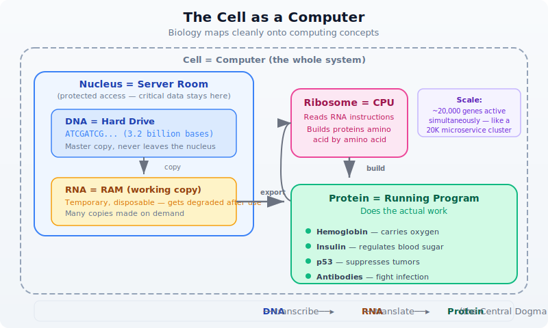
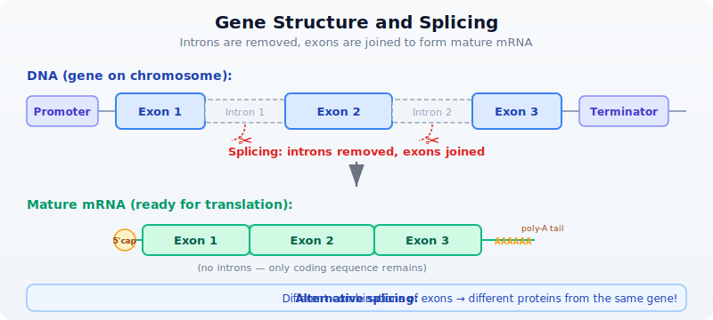
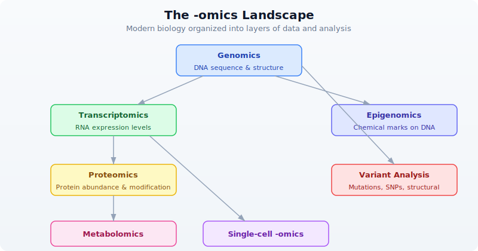

# Day 3: Biology Crash Course for Developers

## The Problem

You can write code, but you do not know what a gene actually is, why mutations matter, or what "expression" means. Without this foundation, bioinformatics code is just meaningless data shuffling. Every variable name, every file format, every analysis pipeline assumes you understand the biology underneath. Today we build the biological intuition you need.

If you already have a biology background, skim this chapter or use it as a refresher. For everyone else: this is the day that makes everything else click.

## The Cell: Biology's Computer

If you understand computers, you already have the mental framework for molecular biology. A living cell is an information-processing system, and the analogy is surprisingly precise.



Your DNA is the master copy of every instruction your body needs. It never leaves the nucleus, just like critical data stays in a server room. When the cell needs to build something, it copies the relevant section of DNA into RNA — a temporary, disposable working copy. That RNA travels to a ribosome, which reads it and assembles a protein, amino acid by amino acid.

This flow — DNA to RNA to Protein — is called the **central dogma** of molecular biology. Nearly everything in bioinformatics relates to measuring, comparing, or interpreting data at one of these three levels.

The analogy breaks down at scale, of course. Your cells are not running one program at a time. A single human cell has about 20,000 genes, thousands of which are active simultaneously, producing millions of protein molecules. It is less like a laptop and more like a data center running 20,000 microservices.

## DNA: The Source Code

DNA is built from four chemical bases, each represented by a single letter:

| Base | Letter | Pairs with |
|------|--------|------------|
| **A**denine | A | T |
| **T**hymine | T | A |
| **C**ytosine | C | G |
| **G**uanine | G | C |

These bases pair up in a strict pattern called **Watson-Crick base pairing**: A always pairs with T, and C always pairs with G. This gives DNA its famous double-helix structure — two complementary strands wound around each other.

```
    5'─A─T─G─C─G─A─T─C─G─3'    (coding strand)
        |  |  |  |  |  |  |  |  |
    3'─T─A─C─G─C─T─A─G─C─5'    (template strand)
```

**Direction matters.** DNA strands have a chemical directionality called 5' (five-prime) to 3' (three-prime). By convention, sequences are always written 5' to 3', just like we read text left to right. When bioinformatics tools say "the sequence is ATGCGATCG," they mean reading the coding strand from 5' to 3'.

The **complement** of a sequence flips each base according to the pairing rules: A becomes T, T becomes A, C becomes G, G becomes C. The **reverse complement** also reverses the order, giving you the other strand read in its own 5'-to-3' direction.

```bio
let coding = dna"ATGCGATCG"
let comp = complement(coding)
let rc = reverse_complement(coding)
println(f"Coding:     5'-{coding}-3'")
println(f"Complement: 3'-{comp}-5'")
println(f"RevComp:    5'-{rc}-3'")
# Output:
# Coding:     5'-ATGCGATCG-3'
# Complement: 3'-TACGCTAGC-5'
# RevComp:    5'-CGATCGCAT-3'
```

Why does the reverse complement matter? Because sequencing machines can read either strand. If a read comes from the opposite strand, you need the reverse complement to map it back to the reference. This is one of the most common operations in bioinformatics.

## Genes: Functions in the Genome

If DNA is the source code, a **gene** is a function — a defined region with a specific purpose. A gene contains the instructions for building one protein (a simplification, but a useful one; some genes produce functional RNA instead).

The numbers are humbling:

- The human genome has about **3.2 billion** base pairs
- Only about **1.5%** of that codes for proteins
- We have roughly **20,000 protein-coding genes**
- The rest used to be called "junk DNA," but much of it has regulatory roles

A gene is not a simple, contiguous stretch of code. It has structure:



- **Exons** are the coding sections — the parts that actually encode protein
- **Introns** are non-coding sections between exons — they get removed
- **Splicing** is the process of cutting out introns and joining exons together
- The result is **mRNA** (messenger RNA), the template used to build the protein

Think of it this way: a gene in DNA is like a source file full of commented-out blocks. Splicing is the preprocessor that strips the comments and produces clean, executable code.

```bio
# Simulating exon splicing
let exon1 = dna"ATGCGA"
let exon2 = dna"TCGATC"
let exon3 = dna"GCGTAA"

# In reality, splicing is done by the cell's machinery
# In BioLang, we can transcribe individual exons
let mrna = transcribe(exon1)
println(f"Exon 1 transcribed: {mrna}")
# Output:
# Exon 1 transcribed: AUGCGA
```

One of the most surprising facts in biology: the same gene can produce different proteins depending on which exons are included. This is called **alternative splicing**, and it is one reason humans can get by with only 20,000 genes — each one can produce multiple protein variants.

## Proteins: The Machines

Proteins are the workhorses of the cell. They are built from **20 amino acids**, and the sequence of amino acids determines what the protein does. The mapping from DNA to amino acid uses a three-letter code: every group of three bases (a **codon**) specifies one amino acid.

The math works out neatly: 4 bases taken 3 at a time gives 4^3 = 64 possible codons. Those 64 codons map to just 20 amino acids plus 3 stop signals. This redundancy is important — it means some mutations are harmless because different codons can encode the same amino acid.

Key codons to remember:

| Codon (DNA) | Codon (RNA) | Amino acid | Role |
|-------------|-------------|------------|------|
| ATG | AUG | Methionine (M) | **Start codon** — every protein begins here |
| TAA | UAA | — | **Stop codon** |
| TAG | UAG | — | **Stop codon** |
| TGA | UGA | — | **Stop codon** |

Let's trace through the central dogma in code:

```bio
# Exploring the genetic code
let seq = dna"ATGGCTAACTGA"
let rna = transcribe(seq)
let protein = translate(seq)
println(f"DNA:     {seq}")
println(f"RNA:     {rna}")
println(f"Protein: {protein}")
# Output:
# DNA:     ATGGCTAACTGA
# RNA:     AUGGCUAACUGA
# Protein: MAN
# M = Methionine (start), A = Alanine, N = Asparagine
# (TGA = stop codon, translation halts before it)
```

Notice that `translate()` accepts DNA directly — BioLang handles the T-to-U conversion internally. The function stops at the first stop codon, which is the biologically correct behavior.

```bio
# Codon usage in a sequence
let gene = dna"ATGGCTGCTTCTGATTGA"
let usage = codon_usage(gene)
println(usage)
# Output:
# {ATG: 1, GCT: 2, TCT: 1, GAT: 1, TGA: 1}
# Notice GCT appears twice — both encode Alanine
```

Protein function depends on how the amino acid chain folds into a 3D structure. A single change in the sequence can alter the fold and destroy the protein's function. This is why mutations matter.

## Mutations: Bugs in the Code

A **mutation** is any change in the DNA sequence. Like a bug in software, the consequences depend entirely on where it happens and what changes. Some mutations are invisible; others are catastrophic.

### Types of mutations

```
Normal:      ATG GCT AAC TGA  -->  M-A-N  (stop)
                                    |||
Missense:    ATG GCT GAC TGA  -->  M-A-D  (stop)   one amino acid changed (N->D)
                                    ||
Nonsense:    ATG TAA AAC TGA  -->  M  (premature stop!)   protein truncated
                                    |
Frameshift:  ATG -CT AAC TGA  -->  reading frame destroyed — total chaos
```

- **SNP** (Single Nucleotide Polymorphism): one base swapped for another. The most common type of variation.
- **Synonymous** (silent): the codon changes but still encodes the same amino acid, thanks to redundancy in the genetic code. No effect on the protein.
- **Missense**: the codon changes to encode a different amino acid. May or may not affect protein function, depending on how different the new amino acid is.
- **Nonsense**: the codon changes to a stop codon, truncating the protein. Almost always damaging.
- **Frameshift**: an insertion or deletion that is not a multiple of 3 shifts the entire reading frame. Every codon downstream is wrong. This is the biological equivalent of an off-by-one error that corrupts everything after it.

```bio
# Comparing normal vs mutant
let normal = dna"ATGGCTAACTGA"
let mutant = dna"ATGGCTGACTGA"  # A->G at position 7 (0-indexed)

let normal_protein = normal |> translate()
let mutant_protein = mutant |> translate()

println(f"Normal:  {normal_protein}")
println(f"Mutant:  {mutant_protein}")
println(f"Changed: {normal_protein != mutant_protein}")
# Output:
# Normal:  MAN
# Mutant:  MAD
# Changed: true
# One base change (A->G) changed Asparagine (N) to Aspartate (D)
```

The position within a codon matters enormously. The third position (called the "wobble position") is the most tolerant of mutations because of codon redundancy. Mutations at the first or second position almost always change the amino acid.

## The 20 Amino Acids

Every protein in every living organism is built from the same 20 amino acids. Each has a three-letter abbreviation and a single-letter code — the one-letter codes are what you will see constantly in bioinformatics data:

| Amino Acid | 3-Letter | 1-Letter | Property | Found abundantly in |
|-----------|----------|----------|----------|-------------------|
| Alanine | Ala | **A** | Hydrophobic | Silk fibroin |
| Arginine | Arg | **R** | Positive charge | Histones (DNA packaging) |
| Asparagine | Asn | **N** | Polar | Cell surface glycoproteins |
| Aspartate | Asp | **D** | Negative charge | Neurotransmitter receptors |
| Cysteine | Cys | **C** | Disulfide bonds | Keratin (hair), antibodies |
| Glutamate | Glu | **E** | Negative charge | Taste receptors (umami) |
| Glutamine | Gln | **Q** | Polar | Blood proteins, muscle fuel |
| Glycine | Gly | **G** | Smallest, flexible | Collagen (every 3rd position!) |
| Histidine | His | **H** | pH-sensitive charge | Hemoglobin (oxygen binding site) |
| Isoleucine | Ile | **I** | Hydrophobic | Muscle proteins |
| Leucine | Leu | **L** | Hydrophobic | Most abundant amino acid in proteins |
| Lysine | Lys | **K** | Positive charge | Collagen cross-linking |
| Methionine | Met | **M** | Start signal | **Every protein begins with M** |
| Phenylalanine | Phe | **F** | Hydrophobic, aromatic | Neurotransmitter precursor |
| Proline | Pro | **P** | Rigid, helix-breaker | Collagen (structural kinks) |
| Serine | Ser | **S** | Polar, phosphorylation | Signaling proteins (on/off switches) |
| Threonine | Thr | **T** | Polar, phosphorylation | Mucin (gut lining protection) |
| Tryptophan | Trp | **W** | Largest, aromatic | Serotonin precursor (mood) |
| Tyrosine | Tyr | **Y** | Aromatic, phosphorylation | Insulin receptor signaling |
| Valine | Val | **V** | Hydrophobic | Hemoglobin (sickle cell: E6V mutation) |

> **Why this table matters:** When you see a protein sequence like `MEEPQSDP` in bioinformatics, each letter is one of these 20 amino acids. When a mutation report says "R175H", it means Arginine (R) at position 175 was changed to Histidine (H). The single-letter codes are the language of protein bioinformatics.

Notice the **properties** column. Amino acids are not interchangeable:
- **Hydrophobic** amino acids (A, V, I, L, F, W, M) cluster in the protein's interior, away from water
- **Charged** amino acids (R, K, D, E) sit on the surface and interact with other molecules
- **Polar** amino acids (S, T, N, Q) form hydrogen bonds and participate in catalysis

This is why a mutation that swaps a hydrophobic amino acid for a charged one (like V600E in BRAF — Valine to Glutamate) can be catastrophic: it puts a charged residue where a hydrophobic one should be, disrupting the protein's entire 3D fold.

## Gene Expression: Which Programs Are Running?

Every cell in your body contains the same DNA — the same complete set of ~20,000 genes. But a liver cell looks and behaves nothing like a neuron. The difference is **gene expression**: which genes are turned on and how strongly.

Gene expression is measured by how much RNA is being produced from a gene. A highly expressed gene produces thousands of RNA copies; a silenced gene produces none. Different cell types have dramatically different expression profiles:

- **Housekeeping genes** are always on — they handle basic cell maintenance (like system services that always run)
- **Tissue-specific genes** are only active in certain cell types (like applications that only launch on specific servers)
- **Stress-response genes** activate only under certain conditions — heat, DNA damage, infection (like error handlers)

The developer analogy is precise: gene expression is like running `ps aux` on a server. You see which processes are active, how much CPU they are using, and which ones just started or stopped. In biology, the equivalent tool is **RNA-seq** — a sequencing technology that counts RNA molecules, telling you exactly which genes are active and at what level.

**Differential expression analysis** compares expression between conditions. Which genes are more active in tumor tissue versus normal tissue? Which genes turn on when a cell is infected by a virus? These comparisons are one of the most common tasks in bioinformatics.

## Reference Genomes and Coordinates

Just as every address system needs a map, genomics needs a **reference genome** — a canonical, consensus sequence for a species. The current human reference genome is called **GRCh38** (Genome Reference Consortium Human Build 38), released in 2013 and continually patched.

Genomic coordinates use a simple system: **chromosome + position**. The location `chr17:7,687,490` means chromosome 17, position 7,687,490. This is the universal addressing system in genomics — every variant, every gene, every regulatory element has coordinates on the reference.

Two coordinate conventions matter:

| Format | Coordinates | Example | Note |
|--------|------------|---------|------|
| **BED** | 0-based, half-open | chr17  7687489  7687490 | Like Python slicing: `seq[start:end]` |
| **VCF** | 1-based, inclusive | chr17  7687490  .  A  G | Like what humans say: "position 7,687,490" |

If you have ever been bitten by off-by-one errors in code, genomic coordinates will give you sympathy pain. The BED-vs-VCF coordinate difference is responsible for more bioinformatics bugs than any other single issue.

```bio
# Genomic intervals
let brca1_location = interval("chr17", 43044295, 43125483)
let tp53_location = interval("chr17", 7668402, 7687550)

println(f"BRCA1: {brca1_location}")
println(f"TP53:  {tp53_location}")
println(f"Same chromosome: {brca1_location.chrom == tp53_location.chrom}")
# Output:
# BRCA1: chr17:43044295-43125483
# TP53:  chr17:7668402-7687550
# Same chromosome: true
```

Both BRCA1 and TP53 are on chromosome 17, but they are millions of base pairs apart. BRCA1 is a breast/ovarian cancer gene; TP53 is the most commonly mutated gene across all cancers. We will meet both again throughout this book.

## The "-omics" Landscape

Modern biology is organized into layers, each with its own data types and analysis methods:



- **Genomics**: the study of complete DNA sequences — finding genes, identifying variants, comparing species
- **Transcriptomics**: measuring which genes are expressed and at what level, usually via RNA-seq
- **Proteomics**: identifying and quantifying proteins in a sample using mass spectrometry
- **Metabolomics**: profiling small molecules (metabolites) that result from cellular processes
- **Epigenomics**: studying chemical modifications to DNA that affect gene expression without changing the sequence
- **Variant analysis**: cataloging mutations and polymorphisms, assessing their clinical significance
- **Single-cell -omics**: any of the above, but measured in individual cells rather than bulk tissue

Each -omics field has its own file formats, databases, and analytical pipelines. This book will focus on genomics, transcriptomics, and variant analysis — the areas where most bioinformatics work happens.

## Putting It All Together: A Gene Story

Let's make this concrete with **TP53**, the most studied gene in cancer biology. TP53 encodes the protein p53, sometimes called the "guardian of the genome." When DNA gets damaged, p53 activates to either repair the damage or trigger cell death. When TP53 is mutated, this safety mechanism fails — damaged cells keep dividing, leading to cancer.

TP53 is mutated in more than 50% of all human cancers. It is the single most commonly mutated gene across cancer types. Understanding why requires everything we have covered today.

> **Requires CLI:** This example uses file I/O / network APIs not available in the browser. Run with `bl run`.

```bio
# The story of TP53 — the most mutated gene in cancer
# Requires internet connection for NCBI lookup
# Optional: set NCBI_API_KEY for higher rate limits

let tp53 = ncbi_gene("TP53")
println(f"Gene:        {tp53.symbol}")
println(f"Description: {tp53.description}")
println(f"Chromosome:  {tp53.chromosome}")
println(f"Location:    {tp53.location}")
# Output (approximate — NCBI data updates):
# Gene:        TP53
# Description: tumor protein p53
# Chromosome:  17
# Location:    17p13.1
```

```bio
# A normal TP53 fragment — the start of the coding sequence
let normal = dna"ATGGAGGAGCCGCAGTCAGATCCTAGC"
let protein = normal |> translate()
println(f"Normal protein starts: {protein}")
# Output:
# Normal protein starts: MEEPQSDPS
# M=Met, E=Glu, E=Glu, P=Pro, Q=Gln, S=Ser, D=Asp, P=Pro, S=Ser

# GC content of this region
let gc = gc_content(normal)
println(f"GC content: {gc}")
# Output:
# GC content: 0.5555555555555556
```

The most common TP53 mutation in cancer is **R248W**: a single base change that swaps Arginine (R, coded by CGG) for Tryptophan (W, coded by TGG) at position 248 of the protein. One letter changes. The protein misfolds. The guardian is disabled. Cells lose their brake pedal.

This is why we study mutations with such care. A single base out of 3.2 billion can be the difference between a cell that functions normally and one that becomes cancerous.

## Exercises

### Exercise 1: Hand-translate a sequence

Given `dna"ATGAAAGCTTGA"`, what protein does it encode? Work it out by hand first:
- Split into codons: ATG | AAA | GCT | TGA
- Look up each codon: ATG=M, AAA=K, GCT=A, TGA=Stop
- Expected protein: MKA

Then verify with BioLang:

```bio
let seq = dna"ATGAAAGCTTGA"
let protein = translate(seq)
println(f"Protein: {protein}")
# Output:
# Protein: MKA
```

### Exercise 2: Wobble position experiment

Create two DNA sequences that differ by one base. Translate both. Does the amino acid change? Try mutating position 1, 2, and 3 of the second codon to see which position tolerates mutations best:

```bio
# Original: GCT = Alanine (A)
let original = dna"ATGGCTTGA"
let mut_pos1 = dna"ATGTCTTGA"   # G->T at codon position 1
let mut_pos2 = dna"ATGGATTGA"   # C->A at codon position 2
let mut_pos3 = dna"ATGGCATGA"   # T->A at codon position 3

println(f"Original (GCT): {translate(original)}")
println(f"Pos1 mut (TCT): {translate(mut_pos1)}")
println(f"Pos2 mut (GAT): {translate(mut_pos2)}")
println(f"Pos3 mut (GCA): {translate(mut_pos3)}")
# Output:
# Original (GCT): MA
# Pos1 mut (TCT): MS   (Alanine -> Serine — changed!)
# Pos2 mut (GAT): MD   (Alanine -> Aspartate — changed!)
# Pos3 mut (GCA): MA   (Alanine -> Alanine — silent! same amino acid)
# The third position is most tolerant of mutations (wobble position)
```

### Exercise 3: Look up a gene

Look up what chromosome EGFR is on using `ncbi_gene("EGFR")`. EGFR (Epidermal Growth Factor Receptor) is a major drug target in lung cancer.

> **Requires CLI:** This example uses file I/O / network APIs not available in the browser. Run with `bl run`.

```bio
# Requires internet connection
let egfr = ncbi_gene("EGFR")
println(f"EGFR chromosome: {egfr.chromosome}")
println(f"EGFR description: {egfr.description}")
# Expected: chromosome 7
```

### Exercise 4: Interval overlap check

Create intervals for two genes on chromosome 7 and check whether they overlap:

```bio
let egfr = interval("chr7", 55019017, 55211628)
let braf = interval("chr7", 140719327, 140924929)

# Manual overlap check: two intervals overlap if
# they are on the same chrom AND start < other.end AND other.start < end
let same_chrom = egfr.chrom == braf.chrom
let overlaps = same_chrom and egfr.start < braf.end and braf.start < egfr.end

println(f"EGFR: {egfr}")
println(f"BRAF: {braf}")
println(f"Same chromosome: {same_chrom}")
println(f"Overlap: {overlaps}")
# Output:
# EGFR: chr7:55019017-55211628
# BRAF: chr7:140719327-140924929
# Same chromosome: true
# Overlap: false
# (They're ~85 million bases apart — same chromosome, but far away)
```

## Key Takeaways

- **DNA -> RNA -> Protein**: the central dogma governs how genetic information becomes function. DNA is transcribed into RNA; RNA is translated into protein.
- **Genes** are regions of DNA that encode proteins. Humans have approximately 20,000 protein-coding genes in a 3.2-billion-base genome.
- **Mutations** are changes in DNA. They can be silent (synonymous), damaging (missense/nonsense), or catastrophic (frameshift). The wobble position (third base of a codon) is the most tolerant.
- **Gene expression** tells us which genes are active. It varies by cell type, condition, and time. RNA-seq measures it by counting RNA molecules.
- **Genomic coordinates** (chromosome + position) are the universal addressing system. Watch out for 0-based (BED) vs 1-based (VCF) conventions.
- **The reference genome** (GRCh38) is the baseline. Variants are always described relative to it.

## What's Next

Tomorrow: **Day 4 — Coding Crash Course for Biologists**. The complementary perspective — thinking in data structures, debugging strategies, and building confidence with code. Biologists learn the computational thinking they need; developers can skip or skim.
