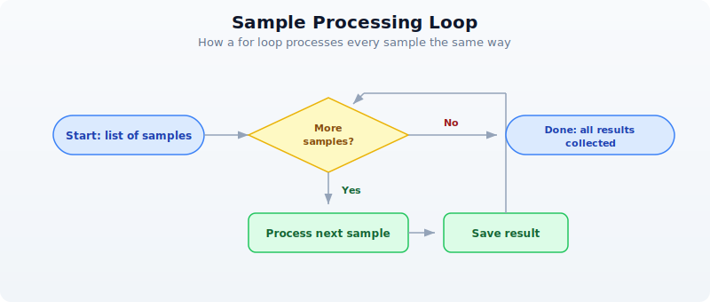

# Day 4: Coding Crash Course for Biologists

## The Problem

You understand biology deeply. You can design a CRISPR experiment, interpret a Western blot, and explain the Krebs cycle from memory. But your data analysis is stuck in Excel. You copy-paste between spreadsheets, manually rename files, and spend hours on repetitive tasks that a script could do in seconds.

Today you learn to think like a programmer — not to become one, but to become a more effective biologist. By the end of this chapter, you will be able to read and write short programs that automate the tedious parts of your research.

If you already know how to code, skim this chapter or use it to understand how biologists think about data. The lab analogies here will help you communicate with your biology collaborators.

## Why Code Beats Spreadsheets

Every biologist has been there: a spreadsheet with 500 gene names in column A, sequences in column B, and a formula in column C that took 20 minutes to get right. Then someone asks you to do the same thing with a different dataset. Or worse, asks you to prove your analysis is reproducible.

Code solves four problems that spreadsheets cannot:

**Reproducibility.** A script runs the same way every time. No forgotten steps, no accidental edits, no "I think I sorted column B before filtering." You can hand your script to a colleague and they get the exact same results.

**Scale.** Processing 1,000 samples is exactly as hard as processing 1. You do not manually drag formulas down 1,000 rows or open 1,000 files by hand.

**Automation.** Chain steps together. Run overnight. Schedule weekly analyses. Code does not get tired, does not skip a step, and does not introduce random errors at 3 AM.

**Sharing.** Send a colleague a script, not a 47-step protocol with screenshots. They run it, it works. Done.

Here is a concrete example. Suppose you need to count how many genes in a list of 500 sequences have GC content above 60%.

In Excel: create a column with a `LEN` formula, another column to count G and C characters, a third column for the ratio, then a `COUNTIF` on that column. Manually set up. Fifteen minutes if nothing goes wrong.

In BioLang:

```bio
# What takes 15 minutes in Excel takes 2 lines in BioLang
let sequences = [dna"GCGCGCATGC", dna"ATATATATAT", dna"GCGCGCGCGC", dna"ATCGATCGAT", dna"GCGCTAGCGC"]
let count = sequences |> filter(|s| gc_content(s) > 0.6) |> len()
println(f"{count} sequences are GC-rich")
```

Two lines. Instant. And when your collaborator gives you a new list of 5,000 sequences, you change nothing — the same two lines handle it.

## Thinking in Steps

You already know how to think in steps. Every wet lab protocol is a sequence of instructions, executed in order, with decisions along the way. Programming is exactly that, except you write the protocol in a language the computer understands.

```
Lab Protocol:                Code Equivalent:
─────────────────────────    ─────────────────────────
1. Get sample                1. Read input file
2. Extract DNA               2. Parse sequences
3. Run PCR                   3. Filter / transform
4. Gel electrophoresis       4. Analyze results
5. Photograph gel            5. Visualize / save output
```

The point: you already think in recipes. Code just writes them down so a computer can follow them. Every program you will ever write follows this pattern — get data in, do something to it, get results out.

Throughout this chapter, we will use lab analogies to make each concept click. If you can run a protocol, you can write a program.

## Variables: Labeling Your Tubes

In the lab, you label every tube. Without labels, you have mystery liquids and ruined experiments. Variables work the same way — they are named labels attached to data.

```bio
# Variables are like labeled tubes in your rack
let sample_name = "Patient_042"
let concentration = 23.5       # ng/uL
let is_contaminated = false
let bases_sequenced = 3200000

println(f"Sample: {sample_name}")
println(f"Concentration: {concentration} ng/uL")
println(f"Clean: {not is_contaminated}")
```

Every variable has a type — the kind of data it holds. You already know these types from your lab notebook:

| Type | What it holds | Biology example |
|------|---------------|-----------------|
| `Str` | Text | Sample name, gene name, file path |
| `Int` | Whole number | Read count, base position, chromosome number |
| `Float` | Decimal number | Concentration, p-value, fold change |
| `Bool` | True or false | Passed QC? Is control? Is coding strand? |
| `DNA` | DNA sequence | `dna"ATGCGA"` — a first-class biological type |
| `RNA` | RNA sequence | `rna"AUGCGA"` — U instead of T |
| `Protein` | Amino acid sequence | `protein"MANK"` — single-letter codes |

Notice that BioLang has types specifically for biology. You do not store DNA as plain text and hope nobody passes it to a function expecting a gene name. The type system catches mistakes before they become wrong results.

```bio
# Types prevent mistakes — like labeling tubes correctly
let gene = dna"ATGGCTAACTGA"
let name = "BRCA1"

# These work:
let gc = gc_content(gene)       # gc_content expects DNA
println(f"GC content: {gc}")

# This would be an error:
# let gc = gc_content(name)     # "BRCA1" is a string, not DNA!
```

The `let` keyword creates a new variable. Think of it as reaching for a fresh tube and writing a label on it. Without `let`, you get an error — the computer does not know what you are referring to.

## Lists: Your Sample Rack

A list is an ordered collection of items — like a rack of labeled tubes. Each tube has a position (starting from 0), and you can add, remove, or check what is in the rack.

```bio
# A list is like a rack of tubes
let samples = ["Control_1", "Control_2", "Treated_1", "Treated_2"]
println(f"Number of samples: {len(samples)}")
println(f"First sample: {first(samples)}")

# Add a new sample
let updated = push(samples, "Treated_3")
println(f"Now have {len(updated)} samples")

# Check if a sample exists
println(contains(samples, "Control_1"))  # true
println(contains(samples, "Control_9"))  # false
```

Lists can hold any type of data — strings, numbers, even DNA sequences:

```bio
# A rack of DNA samples
let primers = [
    dna"ATCGATCGATCG",
    dna"GCGCGCGCGCGC",
    dna"AAATTTAAATTT"
]

println(f"Number of primers: {len(primers)}")
println(f"First primer: {first(primers)}")
```

## Records: Your Lab Notebook Entry

A record groups related information together — like one entry in your lab notebook. Instead of five separate variables for one experiment, you have one record with named fields.

```bio
# A record is like one entry in your lab notebook
let experiment = {
    date: "2024-03-15",
    investigator: "Dr. Chen",
    cell_line: "HeLa",
    treatment: "Doxorubicin",
    concentration_uM: 0.5,
    viability_percent: 72.3
}

println(f"Cell line: {experiment.cell_line}")
println(f"Viability: {experiment.viability_percent}%")
```

You access fields with a dot — `experiment.cell_line` pulls out the cell line, just like flipping to the right page in your notebook. Records keep related data together, which prevents the spreadsheet problem of accidentally sorting one column without the others.

```bio
# A list of records — like a table in your notebook
let qc_results = [
    {sample: "S001", reads: 25000000, quality: 35.2},
    {sample: "S002", reads: 18000000, quality: 33.1},
    {sample: "S003", reads: 500000,   quality: 28.7}
]

println(f"First sample: {first(qc_results).sample}")
println(f"Its quality: {first(qc_results).quality}")
```

## Loops: Processing Every Sample the Same Way

In the lab, you rarely process one sample. You process twenty, or a hundred, or a thousand — all with the same protocol. A loop does exactly that: repeat a set of instructions for every item in a list.

Without a loop, you would write:

```bio
# Without loops — painful and error-prone
# print("Analyzing BRCA1...")
# print("Analyzing TP53...")
# print("Analyzing EGFR...")
# ... what if you have 500 genes?
```

With a loop:

```bio
# With a loop — works for 5 genes or 5,000
let genes = ["BRCA1", "TP53", "EGFR", "KRAS", "MYC"]
for gene in genes {
    println(f"Analyzing {gene}...")
}
```

The `for` loop takes each item from the list, one at a time, assigns it to the variable `gene`, and runs the code inside the curly braces. When the list is done, the loop stops.

Think of it as a protocol where you say "do this for every tube in the rack":



Here is a more practical example — processing actual sequences:

```bio
# Calculate GC content for each sequence
let sequences = [dna"ATCGATCG", dna"GCGCGCGC", dna"AATTAATT"]

for seq in sequences {
    let gc = gc_content(seq)
    let gc_pct = round(gc * 100.0, 1)
    println(f"{seq} -> GC: {gc_pct}%")
}
```

## Conditions: Quality Control Decisions

Every lab has QC checkpoints. Is the concentration high enough? Is the sample contaminated? Did we get enough reads? In code, you make these decisions with `if`, `else if`, and `else`.

```bio
# Making QC decisions in code — just like at the bench
let read_count = 15000000
let gc_bias = 0.52
let duplication_rate = 0.15

if read_count < 1000000 {
    println("FAIL: Too few reads — resequence")
} else if duplication_rate > 0.3 {
    println("WARNING: High duplication — check library prep")
} else {
    println("PASS: Sample meets QC thresholds")
}
```

You can combine conditions with `and` and `or`:

```bio
# Multiple criteria
let reads = 20000000
let quality = 32.5

if reads > 10000000 and quality > 30.0 {
    println("High-quality sample — proceed to analysis")
} else {
    println("Sample needs review")
}
```

Conditions are especially powerful inside loops. Here is QC on a whole batch:

```bio
let samples = [
    {name: "S001", reads: 25000000, quality: 35.2},
    {name: "S002", reads: 500000,   quality: 28.7},
    {name: "S003", reads: 18000000, quality: 33.1},
    {name: "S004", reads: 12000000, quality: 22.0}
]

for s in samples {
    if s.reads < 1000000 {
        println(f"  {s.name}: FAIL (too few reads: {s.reads})")
    } else if s.quality < 25.0 {
        println(f"  {s.name}: FAIL (low quality: {s.quality})")
    } else {
        println(f"  {s.name}: PASS")
    }
}
```

## Functions: Reusable Protocols

A function is a reusable protocol. You write it once, name it, and use it whenever you need it — just like an SOP in your lab manual.

```bio
# A function is a reusable protocol
fn qc_check(reads, min_reads) {
    if reads < min_reads {
        "FAIL"
    } else {
        "PASS"
    }
}

# Use it on any sample
println(qc_check(25000000, 1000000))   # PASS
println(qc_check(500000, 1000000))     # FAIL
println(qc_check(12000000, 5000000))   # PASS
```

The beauty of functions is that when you change your QC threshold, you change it in one place — not in 50 spreadsheet cells.

Functions can take any number of inputs and return a result. The last expression in the function is the result (no need to write "return"):

```bio
# Calculate fold change between conditions
fn fold_change(control, treated) {
    round(treated / control, 2)
}

println(f"FC: {fold_change(5.2, 12.8)}")   # 2.46
println(f"FC: {fold_change(8.1, 7.9)}")    # 0.98
println(f"FC: {fold_change(3.4, 15.2)}")   # 4.47
```

You can use functions together with loops for powerful batch processing:

```bio
# Apply QC to every sample
let results = [12000000, 500000, 8000000, 25000000]
    |> map(|r| {reads: r, status: qc_check(r, 1000000)})

for r in results {
    println(f"Reads: {r.reads} -> {r.status}")
}
```

The `|r| ...` syntax is a shorthand function — a quick, unnamed protocol you use once and throw away. Think of it as a sticky note with one instruction, versus a full SOP in the lab manual.

## Pipes: Connecting Steps Together

In the lab, you chain steps: take sample, extract DNA, measure concentration, decide if you have enough, proceed. Each step feeds into the next. Pipes (`|>`) work the same way in BioLang — the result of one step flows into the next.

```bio
# Lab protocol as pipes:
# Take sample -> extract DNA -> measure concentration -> decide -> proceed

# In BioLang, pipes connect processing steps:
let result = dna"ATGCGATCGATCGATCGATCGATCG"
    |> gc_content()
    |> round(3)

println(f"GC content: {result}")
```

Read it left to right: start with a DNA sequence, calculate its GC content, round to 3 decimal places. The `|>` operator takes the result from the left side and feeds it as the first input to the right side.

Without pipes, you would nest functions inside each other, which gets hard to read:

```bio
# Without pipes — hard to follow
let result_nested = round(gc_content(dna"ATGCGATCGATCGATCGATCGATCG"), 3)
println(f"Same result: {result_nested}")
```

Both produce the same answer, but the pipe version reads like English: "take this sequence, get its GC content, round it."

Here is a more realistic pipeline:

```bio
# Multi-step analysis pipeline
let sequences = [
    dna"ATCGATCGATCG",
    dna"GCGCGCGCGCGC",
    dna"ATATATATATATAT",
    dna"GCGCATATAGCGC",
    dna"TTTTTAAAAACCCCC"
]

let gc_rich_count = sequences
    |> map(|s| {seq: s, gc: gc_content(s)})
    |> filter(|r| r.gc > 0.5)
    |> len()

println(f"{gc_rich_count} out of {len(sequences)} sequences are GC-rich")
```

Read the pipeline step by step:
1. Start with a list of sequences
2. `map`: for each sequence, create a record with the sequence and its GC content
3. `filter`: keep only records where GC content is above 50%
4. `len`: count how many passed the filter

This is the power of pipes — complex multi-step analyses that read like a protocol.

## Errors: When Things Go Wrong

Code errors are like failed experiments — they give you information. A PCR that does not work tells you the primers are wrong, the temperature is off, or the DNA is degraded. Code errors tell you exactly what went wrong and where.

```bio
# Errors are informative, not catastrophic
try {
    let x = int("not_a_number")
    println(f"This won't print: {x}")
} catch e {
    println(f"Error: {e}")
    # Just like a failed PCR tells you something useful
}
```

The `try`/`catch` pattern says: "try this, and if it fails, do this instead." It prevents your whole analysis from crashing when one step goes wrong — like having a backup plan in your protocol.

Common errors you will see:

| Error message | What it means | Lab analogy |
|---------------|---------------|-------------|
| "undefined variable" | You forgot `let` | Unlabeled tube |
| "type mismatch" | Wrong data type | Wrong reagent |
| "index out of bounds" | Position does not exist | Tube slot is empty |
| "division by zero" | Dividing by zero | Dilution with zero volume |

Do not fear errors. Read them, understand them, fix them. Every error makes you a better programmer, just like every failed experiment makes you a better scientist.

## Your First Complete Analysis

Let us combine everything into a realistic mini-project. You have gene expression data from a control and treated condition, and you want to find which genes are upregulated.

```bio
# Experiment: Analyze gene expression across treatments
let samples = [
    {gene: "BRCA1", control: 5.2,  treated: 12.8},
    {gene: "TP53",  control: 8.1,  treated: 7.9},
    {gene: "EGFR",  control: 3.4,  treated: 15.2},
    {gene: "MYC",   control: 6.7,  treated: 6.5},
    {gene: "KRAS",  control: 4.1,  treated: 11.3}
]

# Calculate fold changes
fn fold_change(control, treated) {
    round(treated / control, 2)
}

let results = samples |> map(|s| {
    gene: s.gene,
    fold_change: fold_change(s.control, s.treated),
    direction: if s.treated > s.control { "UP" } else { "DOWN" }
})

# Find significantly upregulated genes (fold change > 2)
let upregulated = results
    |> filter(|r| r.fold_change > 2.0)
    |> sort_by(|r| r.fold_change)
    |> reverse()

println("=== Upregulated Genes (FC > 2.0) ===")
for gene in upregulated {
    println(f"  {gene.gene}: {gene.fold_change}x {gene.direction}")
}
println(f"\nTotal: {len(upregulated)} of {len(samples)} genes upregulated")
```

Let us trace through what this does:

1. **Data**: five genes, each with a control and treated expression value
2. **Function**: `fold_change` calculates the ratio and rounds it
3. **Map**: transforms each sample into a result with fold change and direction
4. **Filter**: keeps only genes with fold change above 2.0
5. **Sort and reverse**: orders by fold change, highest first
6. **Print**: displays the results

This is a complete analysis pipeline. It is reproducible (run it again, get the same answer), scalable (add 500 more genes to the list, nothing else changes), and readable (anyone can follow the logic).

## Common Mistakes and How to Fix Them

Every programmer makes these mistakes. They are not signs that you are doing it wrong — they are a normal part of learning.

**Forgetting `let`**

```bio
# Wrong — x is not defined
# x = 42
# print(x)

# Right — use let to create a variable
let x = 42
println(x)
```

**Wrong type**

```bio
# Wrong — gc_content needs DNA, not a string
# let gc = gc_content("ATGCGA")

# Right — use a DNA literal
let gc = gc_content(dna"ATGCGA")
println(f"GC: {gc}")
```

**Positions start at 0, not 1**

In biology, we count from 1 (base 1, exon 1). In most programming, counting starts at 0. This trips up everyone at first. Just remember: the first item is at position 0.

**Using `=` when you mean `==`**

```bio
# Single = assigns a value
let x = 5

# Double == compares values
if x == 5 {
    println("x is five")
}
```

## Exercises

**Exercise 1: QC Filter**

Create a list of 5 samples, each with `name`, `read_count`, and `quality_score` fields. Use `filter` to keep only high-quality samples (quality above 30). Print how many passed.

<details>
<summary>Hint</summary>

```bio
let samples = [
    {name: "S1", read_count: 20000000, quality_score: 35.0},
    # ... add 4 more
]
let passed = samples |> filter(|s| s.quality_score > 30.0)
```
</details>

**Exercise 2: Fold Change Function**

Write a function `calc_fc(control, treated)` that returns the fold change (treated divided by control, rounded to 2 decimal places). Test it with at least 3 pairs of values.

<details>
<summary>Hint</summary>

```bio
fn calc_fc(control, treated) {
    round(treated / control, 2)
}
```
</details>

**Exercise 3: GC Content Pipeline**

Build a pipeline that takes a list of DNA sequences, calculates GC content for each, finds the average GC content using `mean`, and prints a summary.

<details>
<summary>Hint</summary>

```bio
let seqs = [dna"ATCGATCG", dna"GCGCGCGC", dna"AATTAATT"]
let gc_values = seqs |> map(|s| gc_content(s))
let avg_gc = mean(gc_values)
```
</details>

**Exercise 4: Dilution Table**

Use nested `for` loops to print a dilution table. Starting concentrations: `[0.1, 0.5, 1.0, 5.0, 10.0]`. Dilution factors: `[1, 2, 4]`. Print each combination.

<details>
<summary>Hint</summary>

```bio
let concentrations = [0.1, 0.5, 1.0, 5.0, 10.0]
let dilutions = [1, 2, 4]
for conc in concentrations {
    for dil in dilutions {
        let final_conc = round(conc / dil, 3)
        println(f"  {conc} / {dil} = {final_conc}")
    }
}
```
</details>

## Key Takeaways

- **Code is a lab protocol** written in a language computers understand
- **Variables** are labeled tubes — `let name = value` creates one
- **Lists** are sample racks — ordered collections you can loop through
- **Records** are notebook entries — groups of related fields accessed with `.`
- **Loops** process every sample the same way — write the protocol once
- **Conditions** make QC decisions — `if`/`else` branches based on thresholds
- **Functions** are reusable SOPs — write once, use everywhere
- **Pipes** (`|>`) connect processing steps — like a lab workflow, left to right
- **Errors** are informative — they tell you what went wrong, just like a failed experiment

You do not need to memorize all of this. You will look things up, copy patterns from previous scripts, and gradually build fluency — exactly like learning any other lab technique.

## What's Next

Tomorrow: data structures designed specifically for biology — how to work with collections of sequences, genomic intervals, and tables of results. You will see how BioLang's built-in types make common bioinformatics tasks concise and safe.
