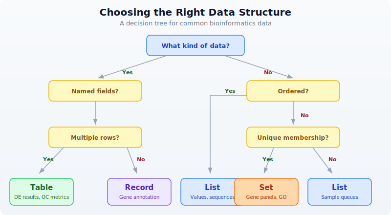

# Day 5: Data Structures for Biology

## The Problem

You have got 500 gene expression values, 20,000 variants, and 3 reference databases to cross-check. How do you organize this data so your analysis does not drown in complexity?

The difference between a messy script and a clean one is rarely the algorithm. It is the data structure. Pick the right container for your data, and filtering, comparing, and summarizing become one-liners. Pick the wrong one, and you spend hours writing code to work around it.

Today you learn five structures that cover virtually every bioinformatics task: lists, records, tables, sets, and genomic intervals. By the end of this chapter you will know which one to reach for and why.

## Lists: Ordered Collections

A list holds items in a specific order. Use lists when sequence matters: time-series measurements, ordered coordinates, ranked gene lists, sample queues.

```bio
# Gene expression values in order
let expression = [2.1, 5.4, 3.2, 8.7, 1.1, 6.3]

# Statistics on lists
println(f"Mean: {round(mean(expression), 2)}")
println(f"Median: {round(median(expression), 2)}")
println(f"Stdev: {round(stdev(expression), 2)}")
println(f"Min: {min(expression)}, Max: {max(expression)}")

# Sorting and slicing
let sorted_expr = sort(expression) |> reverse()
let top3 = sorted_expr |> take(3)
println(f"Top 3 values: {top3}")
```

Expected output:

```
Mean: 4.47
Median: 4.3
Stdev: 2.65
Min: 1.1, Max: 8.7
Top 3 values: [8.7, 6.3, 5.4]
```

Lists hold any type. You can filter, transform, and reduce them with pipes:

```bio
# Sample names
let samples = ["control_1", "control_2", "treated_1", "treated_2", "treated_3"]

# Filter to treated samples
let treated = samples |> filter(|s| contains(s, "treated"))
println(f"Treated: {treated}")

# Count elements
println(f"Total: {len(samples)}, Treated: {len(treated)}")
```

Nested lists model matrix-like data when you need something quick:

```bio
# Matrix-like data: samples x genes
let data = [
    [2.1, 3.4, 5.6],
    [1.8, 4.2, 6.1],
    [3.0, 2.9, 4.8],
]
# Access: data[1][2] = 6.1 (Sample 2, Gene 3)
println(f"Sample 2, Gene 3: {data[1][2]}")
```

## Records: Structured Metadata

A record groups named fields together. Use records when you have heterogeneous data about a single entity: a gene, a sample, a variant, an experiment.

```bio
# A gene record
let gene = {
    symbol: "BRCA1",
    name: "BRCA1 DNA repair associated",
    chromosome: "17",
    start: 43044295,
    end: 43125483,
    strand: "+",
    biotype: "protein_coding"
}

# Access fields
println(f"{gene.symbol} on chr{gene.chromosome}")
println(f"Length: {gene.end - gene.start} bp")
println(f"Keys: {keys(gene)}")

# Check if field exists
println(f"Has strand: {has_key(gene, "strand")}")
println(f"Has expression: {has_key(gene, "expression")}")
```

Expected output:

```
BRCA1 on chr17
Length: 81188 bp
Keys: [symbol, name, chromosome, start, end, strand, biotype]
Has strand: true
Has expression: false
```

The most common pattern in bioinformatics is a list of records. Each record describes one item (a variant, a sample, a gene), and the list collects them:

```bio
let variants = [
    {chrom: "chr17", pos: 43091434, ref_allele: "A", alt_allele: "G", gene: "BRCA1"},
    {chrom: "chr17", pos: 7674220,  ref_allele: "C", alt_allele: "T", gene: "TP53"},
    {chrom: "chr7",  pos: 55249071, ref_allele: "C", alt_allele: "T", gene: "EGFR"},
]

# Filter to chromosome 17
let chr17_vars = variants |> filter(|v| v.chrom == "chr17")
println(f"Chr17 variants: {len(chr17_vars)}")

# Extract just gene names
let genes = variants |> map(|v| v.gene)
println(f"Affected genes: {genes}")
```

## Tables: The Bioinformatician's Workhorse

Tables are the primary structure for analysis results. If you have named columns and multiple rows, you want a table. Differential expression results, sample sheets, variant annotations, QC metrics -- all tables.

```
┌──────┬──────────┬──────────┐
│ gene │ log2fc   │ pval     │
├──────┼──────────┼──────────┤
│ BRCA1│  2.4     │ 0.001    │
│ TP53 │ -1.1     │ 0.23     │
│ EGFR │  3.8     │ 0.000001 │
│ MYC  │  1.9     │ 0.04     │
│ KRAS │ -0.3     │ 0.67     │
└──────┴──────────┴──────────┘
```

Create a table from a list of records with `to_table()`:

```bio
# Creating tables from records
let results = [
    {gene: "BRCA1", log2fc: 2.4,  pval: 0.001},
    {gene: "TP53",  log2fc: -1.1, pval: 0.23},
    {gene: "EGFR",  log2fc: 3.8,  pval: 0.000001},
    {gene: "MYC",   log2fc: 1.9,  pval: 0.04},
    {gene: "KRAS",  log2fc: -0.3, pval: 0.67},
] |> to_table()

println(f"Rows: {nrow(results)}, Columns: {ncol(results)}")
println(f"Columns: {colnames(results)}")

# Filter and sort
let significant = results
    |> filter(|r| r.pval < 0.05)
    |> arrange("log2fc")

println(significant |> head(5))
```

Expected output:

```
Rows: 5, Columns: 3
Columns: [gene, log2fc, pval]
```

Tables support the operations you know from dplyr or pandas, all connected with pipes:

```bio
# select -- choose columns
let gene_pvals = results |> select("gene", "pval")
println(gene_pvals |> head(3))

# mutate -- add or transform columns
let annotated = results |> mutate("significant", |r| r.pval < 0.05)
println(annotated |> head(3))

# group_by + summarize
let direction_table = results
    |> mutate("direction", |r| if r.log2fc > 0 { "up" } else { "down" })
    |> group_by("direction")
    |> summarize(|key, rows| {direction: key, count: len(rows)})
println(direction_table)
```

Here is what each operation does:

| Operation | Purpose | Example |
|-----------|---------|---------|
| `select` | Choose columns | `select("gene", "pval")` |
| `filter` | Keep rows matching condition | `filter(\|r\| r.pval < 0.05)` |
| `mutate` | Add or transform columns | `mutate("sig", \|r\| r.pval < 0.05)` |
| `arrange` | Sort rows by column | `arrange("log2fc")` |
| `group_by` | Group rows by column value | `group_by("direction")` |
| `summarize` | Aggregate groups | `summarize(\|k, rows\| {g: k, n: len(rows)})` |
| `head` | First N rows | `head(3)` |
| `nrow` | Row count | `nrow(table)` |
| `ncol` | Column count | `ncol(table)` |
| `colnames` | Column names | `colnames(table)` |

## Sets: Unique Membership and Comparisons

A set holds unique items with no duplicates and no particular order. Use sets when you care about membership: Which genes appear in both experiments? Which samples are unique to one cohort? Sets give you Venn diagram logic in code.

```bio
# Genes from two experiments
let experiment_a = set(["BRCA1", "TP53", "EGFR", "MYC", "KRAS"])
let experiment_b = set(["TP53", "EGFR", "PTEN", "RB1", "MYC"])

# Set operations
let shared = intersection(experiment_a, experiment_b)
let only_a = difference(experiment_a, experiment_b)
let only_b = difference(experiment_b, experiment_a)
let all_genes = union(experiment_a, experiment_b)

println(f"Shared genes: {shared}")
println(f"Only in A: {only_a}")
println(f"Only in B: {only_b}")
println(f"Total unique: {len(all_genes)}")
```

Expected output:

```
Shared genes: {TP53, EGFR, MYC}
Only in A: {BRCA1, KRAS}
Only in B: {PTEN, RB1}
Total unique: 7
```

Sets are the natural fit whenever you ask "which items overlap?" -- a question that appears constantly in bioinformatics. Gene panels, GO term lists, differentially expressed gene sets, sample cohorts.

## Genomic Intervals: Coordinates and Overlaps

Genomic data lives on coordinates. A promoter spans chr17:43125283-43125483. An exon runs from chr17:43124017 to chr17:43124115. You need to ask: do these regions overlap? What falls within this window?

BioLang has built-in interval types and an interval tree for fast overlap queries:

```bio
# Working with genomic regions
let promoter = interval("chr17", 43125283, 43125483)
let exon1 = interval("chr17", 43124017, 43124115)
let enhancer = interval("chr17", 43125000, 43125600)

println(f"Promoter: {promoter}")
println(f"Exon 1: {exon1}")
println(f"Enhancer: {enhancer}")

# Build an interval tree for fast overlap queries
let regions = [
    {chrom: "chr17", start: 43125283, end: 43125483, name: "promoter"},
    {chrom: "chr17", start: 43124017, end: 43124115, name: "exon1"},
    {chrom: "chr17", start: 43125000, end: 43125600, name: "enhancer"},
] |> to_table()

let tree = interval_tree(regions)

# Query: what overlaps this 100bp window?
let hits = query_overlaps(tree, "chr17", 43125300, 43125400)
println(f"Overlapping regions: {nrow(hits)}")
println(hits)
```

The `interval_tree` function builds a searchable index from a table containing `chrom`, `start`, and `end` columns. The `query_overlaps` function takes the tree, a chromosome name, a start position, and an end position, and returns a table of matching rows. This is the same algorithm that powers tools like bedtools -- but built into the language.

## Choosing the Right Structure

When you sit down with a new dataset, ask yourself three questions:

1. Does my data have named fields? (record or table)
2. Do I have one item or many? (record vs table)
3. Do I need order, or just membership? (list vs set)



Here is the summary:

| Structure | Use When | Example |
|-----------|----------|---------|
| List | Ordered items, sequences | Gene expression values, sample queues |
| Record | Named fields, one item | Sample metadata, gene annotation |
| Table | Named columns, many rows | DE results, variant tables, QC metrics |
| Set | Unique membership, comparisons | Gene panels, GO terms, sample cohorts |
| Interval | Genomic coordinates | BED regions, exons, promoters |

## Real-World Pattern: Combining Structures

Real analyses combine multiple structures. Here is a pattern you will see repeatedly: samples described by records, gene sets for comparison, and results collected into a table.

```bio
# Combining data structures in a real analysis

# Each sample is a record with a set of detected genes
let samples = [
    {id: "S1", condition: "control", genes: set(["BRCA1", "TP53", "EGFR"])},
    {id: "S2", condition: "treated", genes: set(["TP53", "MYC", "KRAS", "EGFR"])},
    {id: "S3", condition: "treated", genes: set(["BRCA1", "TP53", "PTEN"])},
]

# Find genes detected in ALL samples
let all_genes = samples |> map(|s| s.genes)
let common = all_genes |> reduce(|a, b| intersection(a, b))
println(f"Core genes (in all samples): {common}")

# Find genes unique to treated samples
let treated_genes = samples
    |> filter(|s| s.condition == "treated")
    |> map(|s| s.genes)
    |> reduce(|a, b| union(a, b))

let control_genes = samples
    |> filter(|s| s.condition == "control")
    |> map(|s| s.genes)
    |> reduce(|a, b| union(a, b))

let treatment_specific = difference(treated_genes, control_genes)
println(f"Treatment-specific genes: {treatment_specific}")

# Build a summary table
let summary = [
    {category: "Core (all samples)", count: len(common)},
    {category: "Treatment-specific", count: len(treatment_specific)},
    {category: "Control genes", count: len(control_genes)},
    {category: "Treated genes", count: len(treated_genes)},
] |> to_table()

println(summary)
```

Expected output:

```
Core genes (in all samples): {TP53}
Treatment-specific genes: {MYC, KRAS, PTEN}
```

Notice how naturally the structures compose. Records hold per-sample metadata. Sets enable Venn-diagram logic. Lists let you iterate over samples with `map` and `filter`. Tables collect the final summary. Each structure does what it is best at.

## Exercises

1. **List statistics.** Create a list of 10 expression values (make up realistic numbers between 0 and 50). Compute the mean, median, min, max, and standard deviation. Sort the list in descending order and print the top 5 values.

2. **Variant record.** Build a record representing a VCF variant with fields: `chrom`, `pos`, `ref_allele`, `alt_allele`, `qual`, `filter_status`, `gene`. Print each field. Use `keys()` to list all field names and `has_key()` to check for a field called `annotation`.

3. **Table filtering.** Create a table from 5 gene records, each with `gene`, `chromosome`, and `expression` fields. Filter to genes on chromosome 17. Use `select` to show only the `gene` and `expression` columns.

4. **Set overlap.** Define two gene panels as sets: a cancer panel (10 genes) and a cardiac panel (10 genes) with 3 genes in common. Use `intersection`, `difference`, and `union` to find shared genes, genes unique to each panel, and the total gene count.

5. **Interval queries.** Create a table with 3 genomic regions (give them names like "promoter", "exon1", "enhancer" with realistic coordinates on the same chromosome). Build an `interval_tree` and use `query_overlaps` to find which regions overlap a given 200bp window.

## Key Takeaways

- **Lists** hold ordered data. Use them for expression values, sample queues, ranked results. Key operations: `sort`, `filter`, `map`, `reduce`, `take`.

- **Records** group named fields. Use them for metadata about a single entity -- one gene, one sample, one experiment. Access fields with dot notation. Check fields with `has_key`.

- **Tables** are the workhorse. Named columns, many rows. Use `to_table()` to create them from lists of records. Manipulate with `select`, `filter`, `mutate`, `arrange`, `group_by`, `summarize`.

- **Sets** eliminate duplicates and enable Venn-diagram logic. `intersection` finds shared items, `difference` finds unique items, `union` combines everything.

- **Intervals** represent genomic coordinates. Build an `interval_tree` for fast overlap queries with `query_overlaps`. This is the same approach that powers bedtools.

- **Choose the right structure upfront.** It makes everything downstream easier. When in doubt: if it has named fields and multiple rows, it is a table. If you need unique membership, it is a set. If order matters, it is a list.

## What's Next

Week 1 is complete. You now have the foundations: biological sequences, sequence analysis, coding skills, and data structures. Starting in Week 2, you will work with real sequencing data. Day 6 opens with FASTA and FASTQ files -- the raw material of genomics.
