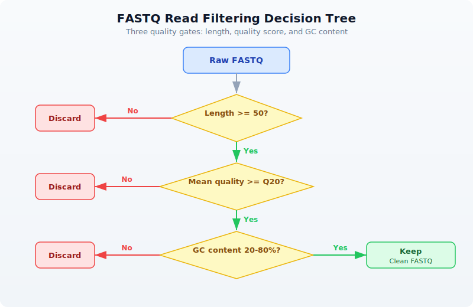

# Day 6: Reading Sequencing Data

## The Problem

Your sequencing facility sends you a 50 GB FASTQ file. It contains millions of short DNA reads, each with a quality score for every base. Some reads are garbage --- adapter contamination, low quality, too short. Before any analysis, you must separate the good reads from the bad. This is quality control, and it is the first step of every sequencing project.

Today is the first day we work with real bioinformatics data formats. Everything before this was foundations. From here on, the biology gets real.

---

## What Is a FASTQ File?

FASTQ is the universal format for sequencing data. Every sequencing platform --- Illumina, PacBio, Oxford Nanopore --- outputs FASTQ files. Each record in a FASTQ file has exactly four lines:

```
@SRR123456.1 length=150        <- Read name (starts with @)
ATCGATCGATCGATCGATCG...         <- DNA sequence
+                               <- Separator (always a single +)
IIIIIIIHHHHHGGGFFF...           <- Quality scores (ASCII-encoded)
```

The first line is the read identifier --- it starts with `@` and usually contains a unique ID, sometimes with metadata like instrument name, flowcell, and tile coordinates.

The second line is the DNA sequence itself --- the bases called by the sequencer.

The third line is a separator. It is always `+`, sometimes followed by the read name again.

The fourth line is the quality string. Every character encodes the confidence the sequencer has in the corresponding base call. This is where the real information lives.

### Phred Quality Scores

Quality scores use the Phred scale, named after the original base-calling program from the Human Genome Project. The formula is:

```
Q = -10 * log10(P_error)
```

A higher Q means lower error probability. The score is encoded as an ASCII character by adding 33 to the numeric value (this is the Sanger/Illumina 1.8+ encoding used by all modern sequencers):

| Phred Score | Error Rate | Accuracy | ASCII Character |
|-------------|------------|----------|-----------------|
| 10 | 1 in 10 | 90% | `+` |
| 20 | 1 in 100 | 99% | `5` |
| 30 | 1 in 1,000 | 99.9% | `?` |
| 40 | 1 in 10,000 | 99.99% | `I` |

Most Illumina sequencers produce reads with average quality between Q28 and Q35. A Q30 average is generally considered good. Reads below Q20 are usually discarded.

To decode: take the ASCII value of the character and subtract 33. The character `I` has ASCII value 73, so its Phred score is 73 - 33 = 40.

---

## Reading FASTQ Files in BioLang

BioLang provides two ways to read FASTQ files: eager loading and streaming.

### Eager Loading

> **Requires CLI:** This example uses file I/O not available in the browser. Run with `bl run`.

```bio
# Read a FASTQ file (eager --- loads all into memory)
let reads = read_fastq("data/reads.fastq")
println(f"Total reads: {len(reads)}")
println(f"First read: {first(reads)}")
```

```
Total reads: 100
First read: {name: "read_001", seq: "ATCGATCG...", qual: "IIIIIIII..."}
```

Each read is a record with three fields:
- `name` --- the read identifier (without the `@`)
- `seq` --- the DNA sequence
- `qual` --- the quality string (same length as `seq`)

### Streaming

For large files, loading everything into memory is impractical. A 50 GB FASTQ file might contain 300 million reads. Use streaming instead:

> **Requires CLI:** This example uses file I/O not available in the browser. Run with `bl run`.

```bio
# Streaming --- process one at a time, constant memory
let stream = fastq("data/large_sample.fastq")
let count = stream |> count()
println(f"Read count: {count}")
```

```
Read count: 300000000
```

| Function | Memory | Use Case |
|----------|--------|----------|
| `read_fastq()` | Loads all reads | Small files (< 1 GB), random access needed |
| `fastq()` | Constant (one read at a time) | Large files, sequential processing |

The rule of thumb: if the file fits comfortably in RAM, use `read_fastq()`. Otherwise, use `fastq()`. For this chapter, we use `read_fastq()` because our sample data is small.

---

## Exploring Read Quality

Before filtering, you need to know what you are working with. BioLang's `read_stats()` gives you a summary in one call:

> **Requires CLI:** This example uses file I/O not available in the browser. Run with `bl run`.

```bio
# Quality statistics for a FASTQ file
let stats = read_stats("examples/sample.fastq")
println(f"Total reads: {stats.total_reads}")
println(f"Total bases: {stats.total_bases}")
println(f"Mean length: {round(stats.mean_length, 1)}")
println(f"Mean quality: {round(stats.mean_quality, 1)}")
println(f"GC content: {round(stats.gc_content * 100, 1)}%")
```

```
Total reads: 100
Total bases: 15000
Mean length: 150.0
Mean quality: 28.4
GC content: 48.2%
```

For deeper analysis, you can compute per-read quality scores using pipes:

> **Requires CLI:** This example uses file I/O not available in the browser. Run with `bl run`.

```bio
# Per-read quality analysis
let reads = read_fastq("data/reads.fastq")
let qualities = reads |> map(|r| mean_phred(r.qual))
println(f"Quality range: {round(min(qualities), 1)} - {round(max(qualities), 1)}")
println(f"Mean quality: {round(mean(qualities), 1)}")
```

```
Quality range: 12.3 - 38.7
Mean quality: 28.4
```

The `mean_phred()` function takes a quality string and returns the average Phred score across all bases. This is the single most useful number for judging a read.

### Quality Visualization

> **Requires CLI:** This example uses file I/O not available in the browser. Run with `bl run`.

```bio
# Quality distribution as ASCII plot
let reads = read_fastq("data/reads.fastq")
reads
    |> map(|r| mean_phred(r.qual))
    |> quality_plot()
```

```
Quality Distribution
  Q10-15: ####          (8)
  Q15-20: ########      (15)
  Q20-25: ##########    (22)
  Q25-30: ############  (28)
  Q30-35: ##########    (19)
  Q35-40: ######        (8)
```

This immediately tells you the shape of your quality distribution. A good library will be skewed toward the right (higher quality). If most reads pile up below Q20, something went wrong with sequencing.

---

## Filtering Reads

Not every read deserves to continue to analysis. Filtering removes reads that would introduce noise or artifacts. A typical filtering pipeline applies three checks:



### Built-in Filtering

BioLang provides `filter_reads()` for the most common quality filters:

> **Requires CLI:** This example uses file I/O not available in the browser. Run with `bl run`.

```bio
# Filter reads by quality and length
let reads = read_fastq("data/reads.fastq")

let clean = reads |> filter_reads(min_length: 50, min_quality: 20)
println(f"Before: {len(reads)} reads")
println(f"After:  {len(clean)} reads")
println(f"Kept:   {round(len(clean) / len(reads) * 100, 1)}%")
```

```
Before: 100 reads
After:  82 reads
Kept:   82.0%
```

### Custom Filtering with Pipes

For more specific criteria, compose your own filters using `filter()`:

> **Requires CLI:** This example uses file I/O not available in the browser. Run with `bl run`.

```bio
# Custom filtering with pipes
let reads = read_fastq("data/reads.fastq")

let clean = reads
    |> filter(|r| len(r.seq) >= 50)
    |> filter(|r| mean_phred(r.qual) >= 20)
    |> filter(|r| gc_content(r.seq) > 0.2 and gc_content(r.seq) < 0.8)
    |> collect()

println(f"Clean reads: {len(clean)}")
```

```
Clean reads: 78
```

Each `filter()` call removes reads that fail the predicate. The pipe chain reads like a checklist: keep reads that are long enough, high enough quality, and have reasonable GC content.

Why filter on GC content? Extreme GC values (below 20% or above 80%) often indicate contamination --- adapter dimers, primer artifacts, or DNA from a different organism. A typical mammalian genome has ~40% GC content.

---

## Trimming Low-Quality Bases

Sometimes a read has good bases at the start but degrades toward the end. This is normal --- Illumina quality drops along the read. Rather than throwing away the entire read, you can trim off the bad bases:

> **Requires CLI:** This example uses file I/O not available in the browser. Run with `bl run`.

```bio
# Quality trimming --- remove low-quality bases from ends
let reads = read_fastq("data/reads.fastq")
let trimmed = trim_quality(reads, min_quality: 20)

# Check how trimming affected lengths
let original_lengths = reads |> map(|r| len(r.seq))
let trimmed_lengths = trimmed |> map(|r| len(r.seq))

println(f"Mean length before: {round(mean(original_lengths), 1)}")
println(f"Mean length after:  {round(mean(trimmed_lengths), 1)}")
```

```
Mean length before: 150.0
Mean length after:  138.6
```

`trim_quality()` uses a sliding window from the 3' end of the read. It removes bases until the average quality in the window meets the threshold. This is the same algorithm used by Trimmomatic's SLIDINGWINDOW mode.

After trimming, you typically filter again to remove reads that became too short:

```bio
let trimmed_and_filtered = trimmed
    |> filter(|r| len(r.seq) >= 50)
    |> collect()
println(f"Reads after trim + length filter: {len(trimmed_and_filtered)}")
```

---

## Adapter Detection and Removal

Sequencing adapters are synthetic DNA sequences ligated to your library fragments. If the insert is shorter than the read length, the sequencer reads through into the adapter. These adapter sequences must be removed because they are not part of the genome.

> **Requires CLI:** This example uses file I/O not available in the browser. Run with `bl run`.

```bio
# Detect adapters in reads
let adapters = detect_adapters("examples/sample.fastq")
println(f"Detected adapters: {adapters}")
```

```
Detected adapters: [AGATCGGAAGAGC, CTGTCTCTTATACACATCT]
```

> **Requires CLI:** This example uses file I/O not available in the browser. Run with `bl run`.

```bio
# Trim adapters
let reads = read_fastq("data/reads.fastq")
let trimmed = trim_adapters(reads)
println(f"Adapter-trimmed reads: {len(trimmed)}")
```

```
Adapter-trimmed reads: 100
```

`detect_adapters()` scans the reads and identifies overrepresented sequences at read ends --- these are almost always adapters. `trim_adapters()` removes any adapter contamination it finds.

Common adapters include:
- **Illumina TruSeq**: `AGATCGGAAGAGC`
- **Nextera**: `CTGTCTCTTATACACATCT`
- **Small RNA**: `TGGAATTCTCGG`

---

## K-mer Analysis for Quality Assessment

K-mers are subsequences of length k. Counting k-mer frequencies across your reads can reveal contamination, library bias, or technical artifacts. In a clean library, k-mer frequencies should follow a roughly normal distribution. Spikes at specific k-mers suggest adapter contamination or PCR duplicates.

> **Requires CLI:** This example uses file I/O not available in the browser. Run with `bl run`.

```bio
# K-mer frequency analysis
let reads = read_fastq("data/reads.fastq")

# Count k-mers in the first read
let first_seq = first(reads).seq
let kmer_freq = kmer_count(first_seq, 5)
println(f"5-mers found: {nrow(kmer_freq)}")
println(kmer_freq |> head(10))
```

```
5-mers found: 146
 kmer  | count
 ATCGA | 3
 TCGAT | 3
 CGATC | 2
 GATCG | 2
 GCTAG | 2
 TAGCA | 2
 ACGTA | 1
 CGTAC | 1
 GTACG | 1
 TACGT | 1
```

If you see a single 5-mer appearing hundreds of times, that is a red flag --- it likely corresponds to adapter sequence or a PCR artifact.

---

## Writing Clean Reads

After filtering and trimming, save the clean reads to a new FASTQ file:

> **Requires CLI:** This example uses file I/O not available in the browser. Run with `bl run`.

```bio
# Save filtered reads to a new file
let reads = read_fastq("data/reads.fastq")
let clean = reads |> filter_reads(min_length: 50, min_quality: 20)
write_fastq(clean, "results/clean_reads.fastq")
println(f"Wrote {len(clean)} clean reads")
```

```
Wrote 82 clean reads
```

The output FASTQ preserves the original read names, sequences (potentially trimmed), and quality scores. Downstream tools like aligners (BWA, Bowtie2) expect standard FASTQ input, so this step ensures compatibility.

---

## Complete QC Pipeline

Here is a complete quality control pipeline that combines everything from this chapter. This is the kind of script you would run on every new sequencing dataset:

> **Requires CLI:** This example uses file I/O not available in the browser. Run with `bl run`.

```bio
# Complete FASTQ QC Pipeline

println("=== FASTQ Quality Control Pipeline ===")

# Step 1: Read stats
let stats = read_stats("examples/sample.fastq")
println(f"\n1. Raw data summary:")
println(f"   Reads: {stats.total_reads}")
println(f"   Bases: {stats.total_bases}")
println(f"   Mean quality: {round(stats.mean_quality, 1)}")

# Step 2: Load and filter
let reads = read_fastq("data/reads.fastq")
let clean = reads
    |> filter(|r| len(r.seq) >= 50)
    |> filter(|r| mean_phred(r.qual) >= 20)
    |> collect()

let pass_rate = round(len(clean) / len(reads) * 100, 1)
println(f"\n2. Filtering results:")
println(f"   Input:  {len(reads)} reads")
println(f"   Passed: {len(clean)} reads ({pass_rate}%)")

# Step 3: Quality summary of clean reads
let clean_quals = clean |> map(|r| mean_phred(r.qual))
println(f"\n3. Clean read quality:")
println(f"   Mean: {round(mean(clean_quals), 1)}")
println(f"   Min:  {round(min(clean_quals), 1)}")

# Step 4: GC content check
let gc_values = clean |> map(|r| gc_content(r.seq))
println(f"\n4. GC content:")
println(f"   Mean GC: {round(mean(gc_values) * 100, 1)}%")

# Step 5: Write output
write_fastq(clean, "results/qc_passed.fastq")
println(f"\n5. Output written to results/qc_passed.fastq")
println("=== Pipeline complete ===")
```

```
=== FASTQ Quality Control Pipeline ===

1. Raw data summary:
   Reads: 100
   Bases: 15000
   Mean quality: 28.4

2. Filtering results:
   Input:  100 reads
   Passed: 82 reads (82.0%)

3. Clean read quality:
   Mean: 30.6
   Min:  20.3

4. GC content:
   Mean GC: 49.1%

5. Output written to results/qc_passed.fastq
=== Pipeline complete ===
```

This pipeline takes about 5 seconds on a 100-read sample file. On a real 50 GB FASTQ with 300 million reads, you would switch to streaming with `fastq()` and it would take a few minutes.

---

## Exercises

1. **Top 10 longest reads.** Write a script that reads a FASTQ file and prints the 10 longest reads by sequence length. Hint: use `sort()` on a mapped list of lengths, or `arrange()` on a table.

2. **Q30 percentage.** Calculate what percentage of reads have a mean quality score >= Q30. This is a standard QC metric reported by sequencing facilities.

3. **Strict base filter.** Build a custom filter that keeps only reads where *every* base has quality >= Q15. Use `min_phred()` instead of `mean_phred()`. How many reads survive compared to the mean-based filter?

4. **GC shift analysis.** Compare GC content distributions before and after quality filtering. Does removing low-quality reads change the GC distribution? Calculate mean GC for raw reads and for filtered reads.

---

## Key Takeaways

- **FASTQ = sequence + quality** for every base. Four lines per record, always.
- **Phred scores**: Q20 = 99% accurate, Q30 = 99.9%, Q40 = 99.99%. Higher is better.
- **Always QC before analysis** --- garbage in, garbage out. This is not optional.
- Use `fastq()` streaming for large files, `read_fastq()` for small ones.
- `filter_reads()` handles standard filtering; custom `filter()` chains handle special cases.
- `trim_quality()` removes low-quality bases from read ends --- better than discarding entire reads.
- K-mer analysis can reveal contamination and artifacts before they corrupt your results.

---

## What's Next

Tomorrow we tackle the rest of the bioinformatics file format zoo: FASTA for reference genomes, VCF for variants, BED for genomic regions, GFF for gene annotations, and BAM for alignments. You will learn when to use each format and how to convert between them.
