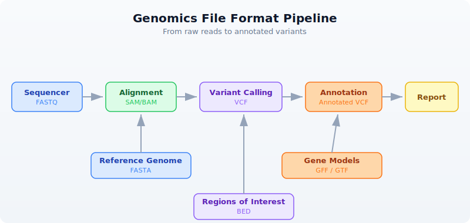

# Day 7: Bioinformatics File Formats

## The Problem

Bioinformatics has accumulated dozens of file formats over 30 years. Each stores different information in a different way. FASTA for sequences, VCF for variants, BED for regions, GFF for annotations, BAM for alignments. Knowing which format holds what --- and how to read each --- is essential.

Every analysis you will ever do starts by reading one of these files and ends by writing another. Get the formats wrong and your pipeline silently produces garbage. Get the coordinate systems confused and every interval is off by one. Today we build the mental map that prevents those mistakes.

---

## The Format Landscape

Where does each format appear in a typical genomics workflow?



The sequencer produces raw reads in FASTQ (Day 6). Those reads get aligned to a reference genome (FASTA), producing alignments (SAM/BAM). Variant callers compare the alignments to the reference and output differences (VCF). Annotators overlay gene models (GFF/GTF) and region lists (BED) onto the variants.

Every arrow in that diagram is a file format conversion. Today you learn to read and write each one.

---

## FASTA --- Reference Sequences

FASTA is the oldest and simplest bioinformatics format. It stores named sequences --- DNA, RNA, or protein. Every reference genome, every transcript database, every protein collection uses FASTA.

### Anatomy

```
>chr1 Homo sapiens chromosome 1     <- Header line (starts with >)
ATCGATCGATCGATCGATCGATCGATCG        <- Sequence (can span multiple lines)
ATCGATCGATCGATCG
>chr2 Homo sapiens chromosome 2     <- Next sequence
GCGCGCATATATATGCGCGCGCGC
>BRCA1_mRNA NM_007294.4             <- Can be any named sequence
ATGGATTTATCTGCTCTTCGCGTTGAAG
```

The header line starts with `>` followed by an identifier and optional description. The sequence follows on one or more lines. There is no quality information --- FASTA is for known sequences, not raw reads.

### Reading FASTA

> **Requires CLI:** This example uses file I/O not available in the browser. Run with `bl run`.

```bio
let seqs = read_fasta("data/sequences.fasta")
println(f"Sequences: {len(seqs)}")

for s in seqs {
    println(f"  {s.id}: {len(s.seq)} bp, GC={round(gc_content(s.seq) * 100, 1)}%")
}
```

```
Sequences: 5
  chr1_fragment: 200 bp, GC=49.0%
  chr17_brca1: 150 bp, GC=52.0%
  chrX_region: 180 bp, GC=41.1%
  ecoli_16s: 120 bp, GC=54.2%
  insulin_mrna: 100 bp, GC=47.0%
```

Each sequence is a record with two fields:
- `id` --- the identifier from the header line (text after `>` up to the first space)
- `seq` --- the full sequence as a string

### Streaming for Large Genomes

A human reference genome is 3.1 billion bases across 24 chromosomes. Loading it all into memory uses ~3 GB. For large FASTA files, stream instead:

> **Requires CLI:** This example uses file I/O not available in the browser. Run with `bl run`.

```bio
let total_bases = fasta("data/sequences.fasta")
    |> map(|s| len(s.seq))
    |> reduce(|a, b| a + b)
println(f"Total bases: {total_bases}")
```

```
Total bases: 750
```

### FASTA Statistics

> **Requires CLI:** This example uses file I/O not available in the browser. Run with `bl run`.

```bio
let stats = fasta_stats("data/sequences.fasta")
println(f"Sequences: {stats.count}")
println(f"Total bases: {stats.total_bases}")
println(f"Mean length: {round(stats.mean_length, 1)}")
```

```
Sequences: 5
Total bases: 750
Mean length: 150.0
```

---

## VCF --- Variant Calls

VCF (Variant Call Format) stores genetic variants --- positions where a sample's DNA differs from the reference genome. It is the standard output of every variant caller (GATK, bcftools, DeepVariant, etc.).

### Anatomy

```
##fileformat=VCFv4.3                                <- Meta-information lines
##INFO=<ID=DP,Number=1,Type=Integer,Description="Read Depth">
##FILTER=<ID=LowQual,Description="Low quality">
#CHROM  POS     ID      REF  ALT  QUAL FILTER INFO  <- Column header
chr1    100     .       A    G    30   PASS   DP=45  <- SNP (A -> G)
chr1    200     rs123   CT   C    45   PASS   DP=62  <- Deletion (T deleted)
chr17   43091   .       G    A    99   PASS   DP=88  <- High-quality SNP
chr17   43200   .       C    T    12   LowQual DP=5  <- Low-quality, filtered
```

The file has three sections:

1. **Meta-information lines** (start with `##`) --- describe the file structure, INFO fields, FILTER definitions, and sample metadata.
2. **Column header** (starts with `#CHROM`) --- names the eight mandatory columns plus any sample columns.
3. **Data lines** --- one variant per line.

The key columns:
- **CHROM** and **POS** --- where the variant is (1-based coordinate)
- **REF** and **ALT** --- what the reference has vs what the sample has
- **QUAL** --- confidence score (Phred-scaled)
- **FILTER** --- `PASS` if the variant passed all filters, otherwise a filter name
- **INFO** --- semicolon-delimited key=value annotations

### Reading VCF

> **Requires CLI:** This example uses file I/O not available in the browser. Run with `bl run`.

```bio
let variants = read_vcf("data/variants.vcf")
println(f"Total variants: {len(variants)}")

# Examine first variant
let v = first(variants)
println(f"Chrom: {v.chrom}, Pos: {v.pos}, Ref: {v.ref}, Alt: {v.alt}")

# Filter to passing variants
let passed = variants |> filter(|v| v.filter == "PASS")
println(f"PASS variants: {len(passed)}")

# Count by chromosome
let by_chrom = passed
    |> to_table()
    |> group_by("chrom")
    |> summarize(|chrom, rows| {chrom: chrom, count: len(rows)})
println(by_chrom)
```

```
Total variants: 10
Chrom: chr1, Pos: 100, Ref: A, Alt: G
PASS variants: 8

 chrom | count
 chr1  | 3
 chr17 | 3
 chrX  | 2
```

### Variant Types

Not all variants are the same. The REF and ALT lengths tell you what kind of variant you have:

| REF length | ALT length | Variant Type | Example |
|-----------|-----------|--------------|---------|
| 1 | 1 | SNP (single nucleotide polymorphism) | A -> G |
| > 1 | 1 | Deletion | CT -> C |
| 1 | > 1 | Insertion | A -> ATG |
| > 1 | > 1 | Complex | CT -> GA |

```bio
# Classify variants by type
let snps = variants |> filter(|v| len(v.ref) == 1 and len(v.alt) == 1)
let indels = variants |> filter(|v| len(v.ref) != len(v.alt))
println(f"SNPs: {len(snps)}")
println(f"Indels: {len(indels)}")
```

```
SNPs: 7
Indels: 3
```

### Streaming Large VCF Files

Whole-genome VCF files can contain millions of variants. Stream them:

> **Requires CLI:** This example uses file I/O not available in the browser. Run with `bl run`.

```bio
let snp_count = vcf("data/variants.vcf")
    |> filter(|v| len(v.ref) == 1 and len(v.alt) == 1)
    |> count()
println(f"SNPs (streaming): {snp_count}")
```

```
SNPs (streaming): 7
```

---

## BED --- Genomic Regions

BED (Browser Extensible Data) stores genomic intervals --- regions of a chromosome with a start and end position. It is used for gene coordinates, exon boundaries, peaks from ChIP-seq, target capture regions, blacklisted regions, and anything else that can be described as "chromosome X from position A to position B."

### Anatomy

```
chr1    1000    2000    gene_A    100    +      <- 6-column BED
chr1    3000    4000    gene_B    200    -
chr17   43044295 43125483 BRCA1   0      +
```

The columns are tab-separated:
1. **chrom** --- chromosome name
2. **start** --- start position (0-based)
3. **end** --- end position (exclusive, half-open)
4. **name** --- feature name (optional, columns 4+)
5. **score** --- numeric score (optional)
6. **strand** --- `+` or `-` (optional)

### The Critical Coordinate Convention

BED uses **0-based, half-open** coordinates. This is the single most important thing to remember about BED files.

```
Position:  0  1  2  3  4  5  6  7  8  9
Bases:     A  T  C  G  A  T  C  G  A  T

BED:       chr1  2  5     <- Covers bases at positions 2, 3, 4 (= C, G, A)
                          <- Start is inclusive, end is exclusive
                          <- Length = end - start = 5 - 2 = 3

VCF/GFF:   chr1  3        <- Position 3 refers to the base at 1-based position 3
                          <- Which is the same base C at 0-based position 2
```

This means:
- BED `chr1 100 200` covers 100 bases (positions 100 through 199)
- The length of a BED interval is always `end - start`
- To convert VCF position (1-based) to BED: subtract 1 from the start

### Reading BED

> **Requires CLI:** This example uses file I/O not available in the browser. Run with `bl run`.

```bio
let regions = read_bed("data/regions.bed")
println(f"Regions: {len(regions)}")

# Calculate total covered bases
let total = regions
    |> map(|r| r.end - r.start)
    |> reduce(|a, b| a + b)
println(f"Total bases covered: {total}")

# Filter to a specific chromosome
let chr17 = regions |> filter(|r| r.chrom == "chr17")
println(f"Chr17 regions: {len(chr17)}")
```

```
Regions: 10
Total bases covered: 92500
Chr17 regions: 3
```

### Region Statistics

```bio
let sizes = regions |> map(|r| r.end - r.start)
println(f"Region sizes:")
println(f"  Min: {min(sizes)}")
println(f"  Max: {max(sizes)}")
println(f"  Mean: {round(mean(sizes), 1)}")
```

```
Region sizes:
  Min: 500
  Max: 81189
  Mean: 9250.0
```

---

## GFF/GTF --- Gene Annotations

GFF (General Feature Format) and GTF (Gene Transfer Format) store gene structure annotations --- where genes are, where their exons are, where the coding regions start and stop. GFF3 is the current standard; GTF is an older Ensembl-specific variant that is still widely used.

### Anatomy

```
chr1  ensembl  gene   11869  14409  .  +  .  gene_id "ENSG00000223972"; gene_name "DDX11L1"
chr1  ensembl  exon   11869  12227  .  +  .  gene_id "ENSG00000223972"; exon_number "1"
chr1  ensembl  exon   12613  12721  .  +  .  gene_id "ENSG00000223972"; exon_number "2"
chr1  ensembl  exon   13221  14409  .  +  .  gene_id "ENSG00000223972"; exon_number "3"
```

The nine tab-separated columns:
1. **seqid** --- chromosome or contig name
2. **source** --- who produced the annotation (ensembl, refseq, etc.)
3. **type** --- feature type (gene, exon, mRNA, CDS, etc.)
4. **start** --- start position (1-based, inclusive)
5. **end** --- end position (1-based, inclusive)
6. **score** --- numeric score or `.` if not applicable
7. **strand** --- `+`, `-`, or `.`
8. **phase** --- reading frame for CDS features (0, 1, or 2) or `.`
9. **attributes** --- semicolon-delimited key-value pairs

### Coordinates: 1-Based, Inclusive

GFF uses **1-based, fully inclusive** coordinates. A feature at `11869..14409` covers all 2541 bases from position 11869 through position 14409 inclusive.

```
To convert GFF to BED:
  BED_start = GFF_start - 1
  BED_end   = GFF_end          (already exclusive in the half-open sense)

Example:
  GFF:  chr1  11869  14409     (1-based inclusive, covers 14409 - 11869 + 1 = 2541 bases)
  BED:  chr1  11868  14409     (0-based half-open, covers 14409 - 11868 = 2541 bases)
```

### Reading GFF

> **Requires CLI:** This example uses file I/O not available in the browser. Run with `bl run`.

```bio
let features = read_gff("data/annotations.gff")
println(f"Features: {len(features)}")

# Count feature types
let genes = features |> filter(|f| f.type == "gene")
let exons = features |> filter(|f| f.type == "exon")
let cds = features |> filter(|f| f.type == "CDS")
println(f"Genes: {len(genes)}")
println(f"Exons: {len(exons)}")
println(f"CDS:   {len(cds)}")
```

```
Features: 15
Genes: 3
Exons: 8
CDS:   4
```

### Extracting Gene Information

```bio
# List all gene names
let gene_names = features
    |> filter(|f| f.type == "gene")
    |> map(|f| f.attributes.gene_name)
println(f"Genes: {gene_names}")
```

```
Genes: [DDX11L1, BRCA1, TP53]
```

### Streaming

> **Requires CLI:** This example uses file I/O not available in the browser. Run with `bl run`.

```bio
let exon_count = gff("data/annotations.gff")
    |> filter(|f| f.type == "exon")
    |> count()
println(f"Exons (streaming): {exon_count}")
```

```
Exons (streaming): 8
```

---

## SAM/BAM --- Alignments

SAM (Sequence Alignment/Map) stores read alignments --- which reads mapped where on the reference genome, and how. BAM is the binary compressed version of SAM. You almost always work with BAM files because they are smaller and indexed for fast random access.

### Anatomy

```
@HD  VN:1.6  SO:coordinate                           <- Header: format version, sort order
@SQ  SN:chr1  LN:248956422                           <- Header: reference sequence lengths
@SQ  SN:chr17 LN:83257441
read_001  99   chr1   100   60   150M        *  0  0  ATCG...  IIII...  <- Alignment
read_002  83   chr1   250   42   75M2I73M    *  0  0  ATCG...  IIII...  <- Alignment with insertion
read_003  4    *      0     0    *           *  0  0  ATCG...  IIII...  <- Unmapped read
```

The key fields in each alignment record:
- **QNAME** --- read name
- **FLAG** --- bitwise flags encoding paired-end status, strand, mapping status
- **RNAME** --- reference chromosome
- **POS** --- leftmost mapping position (1-based)
- **MAPQ** --- mapping quality (0-60, higher is better)
- **CIGAR** --- alignment description string (e.g., `150M` = 150 matches, `75M2I73M` = 75 matches + 2 inserted bases + 73 matches)

### SAM Flags

The FLAG field is a bitwise integer. Common values:

| Flag | Meaning |
|------|---------|
| 4 | Read is unmapped |
| 16 | Read mapped to reverse strand |
| 99 | Read paired, mapped in proper pair, mate reverse strand, first in pair |
| 83 | Read paired, mapped in proper pair, read reverse strand, second in pair |
| 256 | Secondary alignment |
| 2048 | Supplementary alignment |

### Reading BAM

> **Requires CLI:** This example uses file I/O not available in the browser. Run with `bl run`.

```bio
let alignments = read_bam("data/alignments.bam")
println(f"Total alignments: {len(alignments)}")

# Basic alignment statistics
let mapped = alignments |> filter(|r| r.is_mapped)
let unmapped = alignments |> filter(|r| not r.is_mapped)
println(f"Mapped: {len(mapped)}")
println(f"Unmapped: {len(unmapped)}")

# Mapping quality distribution
let mapqs = mapped |> map(|r| r.mapq)
println(f"Mean MAPQ: {round(mean(mapqs), 1)}")
println(f"High quality (MAPQ >= 30): {len(mapqs |> filter(|q| q >= 30))}")
```

```
Total alignments: 20
Mapped: 17
Unmapped: 3
Mean MAPQ: 48.2
High quality (MAPQ >= 30): 14
```

### Streaming BAM

BAM files from a whole-genome sequencing run can be 50-100 GB. Always stream:

> **Requires CLI:** This example uses file I/O not available in the browser. Run with `bl run`.

```bio
let mapped_count = bam("data/alignments.bam")
    |> filter(|r| r.is_mapped)
    |> count()
println(f"Mapped reads (streaming): {mapped_count}")
```

```
Mapped reads (streaming): 17
```

### BAM vs SAM

| Property | SAM | BAM |
|----------|-----|-----|
| Format | Text | Binary (compressed) |
| Size | Large (~10x BAM) | Compact |
| Indexable | No | Yes (with .bai index) |
| Human readable | Yes | No |
| Use for | Debugging, small files | Everything else |

Rule: **always store BAM, never SAM.** Convert to SAM only when you need to visually inspect a few records.

---

## The Coordinate System Trap

The single biggest source of bugs in bioinformatics is mixing up coordinate systems. Here is the definitive comparison:

```
Genome:    A  T  C  G  A  T  C  G
0-based:   0  1  2  3  4  5  6  7      <- BED, BAM (internal)
1-based:   1  2  3  4  5  6  7  8      <- VCF, GFF/GTF, SAM (POS)

The region covering "CGAT" (4 bases):
  BED:     chr1  2  6     (0-based, half-open: positions 2,3,4,5)
  GFF:     chr1  3  6     (1-based, inclusive: positions 3,4,5,6)
  VCF:     POS=3          (1-based: position 3 for a single variant)
```

| Format | Base | End Convention | "CGAT" region |
|--------|------|----------------|---------------|
| BED | 0-based | Half-open (exclusive) | 2..6 |
| GFF/GTF | 1-based | Inclusive | 3..6 |
| VCF | 1-based | N/A (single position) | POS=3 |
| SAM | 1-based | Inclusive | POS=3, CIGAR=4M |

### Conversion Rules

```
# VCF (1-based) to BED (0-based, half-open)
bed_start = vcf_pos - 1
bed_end   = vcf_pos - 1 + len(ref)

# GFF (1-based, inclusive) to BED (0-based, half-open)
bed_start = gff_start - 1
bed_end   = gff_end              # already correct for half-open

# BED (0-based) to GFF (1-based, inclusive)
gff_start = bed_start + 1
gff_end   = bed_end              # already correct for inclusive
```

---

## Format Conversion Patterns

Converting between formats is a daily task. Here are the most common conversions:

### VCF to BED --- Variant Positions as Intervals

> **Requires CLI:** This example uses file I/O not available in the browser. Run with `bl run`.

```bio
let variants = read_vcf("data/variants.vcf")
let beds = variants |> map(|v| {
    chrom: v.chrom,
    start: v.pos - 1,
    end: v.pos - 1 + len(v.ref)
})
println(f"Converted {len(beds)} variants to BED intervals")
println(f"First: {first(beds).chrom}:{first(beds).start}-{first(beds).end}")
```

```
Converted 10 variants to BED intervals
First: chr1:99-100
```

### GFF Genes to BED

> **Requires CLI:** This example uses file I/O not available in the browser. Run with `bl run`.

```bio
let features = read_gff("data/annotations.gff")
let gene_beds = features
    |> filter(|f| f.type == "gene")
    |> map(|f| {
        chrom: f.seqid,
        start: f.start - 1,
        end: f.end,
        name: f.attributes.gene_name
    })
println(f"Gene BED regions: {len(gene_beds)}")
```

```
Gene BED regions: 3
```

---

## Writing Files

BioLang can write all the formats it reads.

### Writing FASTA

> **Requires CLI:** This example uses file I/O not available in the browser. Run with `bl run`.

```bio
let seqs = [
    {id: "seq1", seq: dna"ATCGATCGATCG"},
    {id: "seq2", seq: dna"GCGCGCATATGC"},
]
write_fasta(seqs, "results/output.fasta")
println("Wrote 2 sequences to FASTA")
```

```
Wrote 2 sequences to FASTA
```

### Writing BED

> **Requires CLI:** This example uses file I/O not available in the browser. Run with `bl run`.

```bio
let regions = [
    {chrom: "chr1", start: 100, end: 200},
    {chrom: "chr1", start: 300, end: 400},
    {chrom: "chr17", start: 43044295, end: 43125483},
]
write_bed(regions, "results/output.bed")
println(f"Wrote {len(regions)} regions to BED")
```

```
Wrote 3 regions to BED
```

### Tables to CSV

> **Requires CLI:** This example uses file I/O not available in the browser. Run with `bl run`.

```bio
let results = [
    {gene: "BRCA1", pval: 0.001, chrom: "chr17"},
    {gene: "TP53", pval: 0.05, chrom: "chr17"},
    {gene: "EGFR", pval: 0.003, chrom: "chr7"},
] |> to_table()

write_csv(results, "results/output.csv")
println(f"Wrote {nrow(results)} rows to CSV")
println(f"Columns: {colnames(results)}")
```

```
Wrote 3 rows to CSV
Columns: [gene, pval, chrom]
```

---

## Putting It All Together

Here is a realistic mini-pipeline that reads multiple formats and produces a summary:

> **Requires CLI:** This example uses file I/O not available in the browser. Run with `bl run`.

```bio
# Multi-format analysis pipeline
println("=== Multi-Format Analysis ===")

# 1. Read reference sequences
let ref_seqs = read_fasta("data/sequences.fasta")
println(f"Reference: {len(ref_seqs)} sequences, {fasta_stats('data/sequences.fasta').total_bases} bp")

# 2. Read variants
let variants = read_vcf("data/variants.vcf")
let passed = variants |> filter(|v| v.filter == "PASS")
println(f"Variants: {len(variants)} total, {len(passed)} PASS")

# 3. Read target regions
let targets = read_bed("data/regions.bed")
let target_bp = targets |> map(|r| r.end - r.start) |> reduce(|a, b| a + b)
println(f"Target regions: {len(targets)}, covering {target_bp} bp")

# 4. Read gene annotations
let features = read_gff("data/annotations.gff")
let genes = features |> filter(|f| f.type == "gene")
println(f"Annotations: {len(features)} features, {len(genes)} genes")

# 5. Summary table
let snps = passed |> filter(|v| len(v.ref) == 1 and len(v.alt) == 1)
let indels = passed |> filter(|v| len(v.ref) != len(v.alt))
let summary = [
    {metric: "Reference sequences", value: len(ref_seqs)},
    {metric: "Total variants", value: len(variants)},
    {metric: "PASS variants", value: len(passed)},
    {metric: "SNPs", value: len(snps)},
    {metric: "Indels", value: len(indels)},
    {metric: "Target regions", value: len(targets)},
    {metric: "Target bases", value: target_bp},
    {metric: "Genes", value: len(genes)},
] |> to_table()
println(summary)
```

```
=== Multi-Format Analysis ===
Reference: 5 sequences, 750 bp
Variants: 10 total, 8 PASS
Target regions: 10, covering 92500 bp
Annotations: 15 features, 3 genes

 metric              | value
 Reference sequences | 5
 Total variants      | 10
 PASS variants       | 8
 SNPs                | 6
 Indels              | 2
 Target regions      | 10
 Target bases        | 92500
 Genes               | 3
```

---

## Format Cheat Sheet

Keep this table handy. You will refer to it constantly.

| Format | Extension | Content | Coordinates | Eager Reader | Stream Reader |
|--------|-----------|---------|-------------|--------------|---------------|
| FASTA | .fa, .fasta | Sequences | --- | `read_fasta()` | `fasta()` |
| FASTQ | .fq, .fastq | Reads + quality | --- | `read_fastq()` | `fastq()` |
| VCF | .vcf | Variants | 1-based | `read_vcf()` | `vcf()` |
| BED | .bed | Regions | 0-based, half-open | `read_bed()` | `bed()` |
| GFF/GTF | .gff, .gtf | Annotations | 1-based, inclusive | `read_gff()` | `gff()` |
| SAM/BAM | .sam, .bam | Alignments | 1-based | `read_bam()` | `bam()` |
| CSV/TSV | .csv, .tsv | Tables | --- | `csv()`, `tsv()` | same (streaming) |

When to use eager vs stream:

| Approach | Function | Memory | Use When |
|----------|----------|--------|----------|
| Eager | `read_fasta()`, `read_vcf()`, etc. | Loads all data | Small files, need random access, multiple passes |
| Stream | `fasta()`, `vcf()`, etc. | Constant (one record at a time) | Large files, single-pass processing |

---

## Exercises

**Exercise 1: FASTA GC Champion.** Read `data/sequences.fasta` and find the sequence with the highest GC content. Print its ID and GC percentage.

<details>
<summary>Solution</summary>

```bio
let seqs = read_fasta("data/sequences.fasta")
let best = seqs
    |> sort(|a, b| gc_content(b.seq) - gc_content(a.seq))
    |> first()
println(f"Highest GC: {best.id} at {round(gc_content(best.seq) * 100, 1)}%")
```

</details>

**Exercise 2: SNP Census.** Read `data/variants.vcf`, filter to SNPs only (single-base REF and ALT), and count them by chromosome.

<details>
<summary>Solution</summary>

```bio
let snps = read_vcf("data/variants.vcf")
    |> filter(|v| len(v.ref) == 1 and len(v.alt) == 1)
let by_chrom = snps
    |> to_table()
    |> group_by("chrom")
    |> summarize(|chrom, rows| {chrom: chrom, count: len(rows)})
println(by_chrom)
```

</details>

**Exercise 3: Mean Region Size.** Read `data/regions.bed` and calculate the mean region size in base pairs.

<details>
<summary>Solution</summary>

```bio
let regions = read_bed("data/regions.bed")
let sizes = regions |> map(|r| r.end - r.start)
println(f"Mean region size: {round(mean(sizes), 1)} bp")
```

</details>

**Exercise 4: VCF to BED.** Convert all variants in `data/variants.vcf` to BED format, properly adjusting the coordinate system (1-based to 0-based).

<details>
<summary>Solution</summary>

```bio
let variants = read_vcf("data/variants.vcf")
let bed_regions = variants |> map(|v| {
    chrom: v.chrom,
    start: v.pos - 1,
    end: v.pos - 1 + len(v.ref)
})
for b in bed_regions {
    println(f"{b.chrom}\t{b.start}\t{b.end}")
}
```

</details>

**Exercise 5: Feature Types.** Read `data/annotations.gff` and list all unique feature types with their counts.

<details>
<summary>Solution</summary>

```bio
let features = read_gff("data/annotations.gff")
let type_counts = features
    |> to_table()
    |> group_by("type")
    |> summarize(|feat_type, rows| {type: feat_type, count: len(rows)})
println(type_counts)
```

</details>

---

## Key Takeaways

- **FASTA** = sequences, **FASTQ** = sequences + quality, **VCF** = variants, **BED** = regions, **GFF** = annotations, **BAM** = alignments.
- **BED is 0-based half-open**, **VCF and GFF are 1-based** --- coordinate conversion is a constant source of bugs. Always check which system you are in.
- Use **streaming readers** (`fasta()`, `vcf()`, `bam()`) for large files --- they process one record at a time in constant memory.
- Use **eager readers** (`read_fasta()`, `read_vcf()`) for small files you need to access multiple times or sort.
- Every format has a BioLang reader --- you never need to parse tab-separated text manually.
- When converting between formats, always account for the coordinate system difference. VCF position 100 becomes BED start 99.

---

## What's Next

Tomorrow: when files are too big to fit in memory. Day 8 covers streaming, lazy evaluation, and constant-memory processing --- the techniques that let you handle whole-genome data on a laptop.
