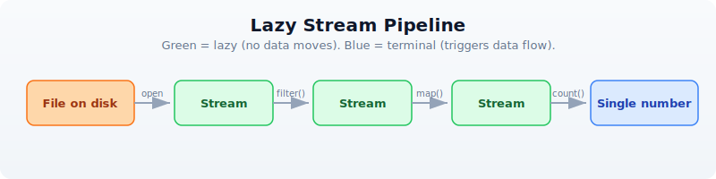
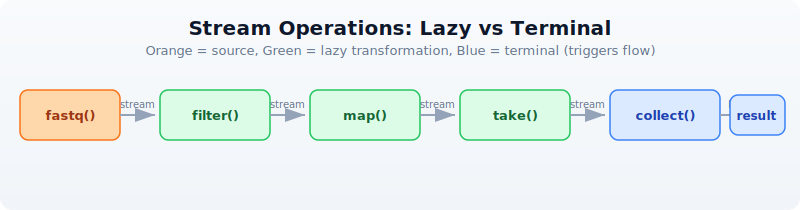

# Day 8: Processing Large Files

## The Problem

Your laptop has 16 GB of RAM. Your FASTQ file is 50 GB. Your BAM file is 200 GB. Loading everything into memory crashes your machine. You need to process data one piece at a time --- like reading a book page by page instead of memorizing the whole thing at once.

This is not a theoretical problem. A single Illumina NovaSeq run produces 1--3 TB of FASTQ data. Whole-genome sequencing at 30x coverage yields ~100 GB of compressed FASTQ per sample. If your analysis script starts with "load the entire file," it will never finish.

The solution is **streaming**: reading and processing one record at a time, keeping only what you need in memory. BioLang makes this the default for large-file operations.

---

## Eager vs Streaming

There are two fundamentally different approaches to processing a file:

**Eager** --- load everything, then process:

```
[File: 50 GB] --> [RAM: Load all 50 GB] --> [Process] --> [Result]
                       Out of memory!
```

The eager approach reads every record into a list in memory. This is simple and works fine for small files, but fails catastrophically on large ones.

**Streaming** --- process one record at a time:

```
[File: 50 GB] --> [RAM: 1 record] --> [Process] --> [Next record] --> ... --> [Result]
                       ~10 MB constant
```

The streaming approach reads one record, processes it, discards it, then reads the next. Memory usage stays constant regardless of file size. A 1 GB file and a 100 GB file use the same amount of RAM.

BioLang streaming functions return a `StreamValue` --- a lazy iterator that is consumed once. No data is loaded until you ask for it.



Every green box is lazy --- no data moves until the blue terminal operation runs.

---

## Stream Basics

BioLang provides two ways to read every file format: an **eager** function that loads everything into a list, and a **streaming** function that returns a lazy iterator.

| Format | Eager (loads all) | Streaming (lazy) |
|--------|-------------------|------------------|
| FASTQ  | `read_fastq()`    | `fastq()`        |
| FASTA  | `read_fasta()`    | `fasta()`        |
| VCF    | `read_vcf()`      | `vcf()`          |
| BED    | `read_bed()`      | `bed()`          |
| GFF    | `read_gff()`      | `gff()`          |
| BAM    | `read_bam()`      | `bam()`          |

The eager versions are the ones you used in Days 6 and 7. They are convenient for small files. The streaming versions are what you use for anything large.

> **Requires CLI:** This example uses file I/O not available in the browser. Run with `bl run`.

```bio
# Eager: loads everything into a list
let all_reads = read_fastq("data/reads.fastq")
println(type(all_reads))  # List

# Streaming: nothing loaded yet
let stream = fastq("data/reads.fastq")
println(type(stream))  # Stream

# Streams are lazy — nothing happens until you consume
let count = stream |> count()
println(f"Reads: {count}")
```

```
List
Stream
Reads: 500
```

The key rule: **streams can only be consumed once**. Once you have iterated through a stream, the data is gone. You cannot rewind. If you need multiple passes over the same file, create a new stream each time.

```bio
let s = fastq("data/reads.fastq")
let n = s |> count()    # consumes the stream
# let m = s |> count()  # ERROR: stream already exhausted
```

This is not a limitation --- it is the reason streaming works. If you could rewind, the system would need to keep all the data in memory or re-read the file from scratch. The one-pass constraint is what guarantees constant memory.

---

## Stream Operations

Stream operations are **lazy**: they build up a processing pipeline without moving any data. Data only flows when you call a **terminal operation** like `count()`, `collect()`, or `reduce()`.



Orange is the source. Green boxes are lazy transformations --- each returns a new stream. Blue boxes are terminal operations that trigger data flow.

### Lazy operations (return streams)

| Operation | Description |
|-----------|-------------|
| `filter(\|r\| ...)` | Keep records matching a condition |
| `map(\|r\| ...)` | Transform each record |
| `take(n)` | Keep only the first n records |
| `drop(n)` | Skip the first n records |
| `tee(\|r\| ...)` | Inspect each record without consuming |

### Terminal operations (consume the stream)

| Operation | Description |
|-----------|-------------|
| `count()` | Count records |
| `collect()` | Gather all records into a list |
| `reduce(\|a, b\| ...)` | Combine all records into one value |
| `first()` | Get the first record |
| `last()` | Get the last record |
| `frequencies()` | Count occurrences of each value |

Here is a complete lazy pipeline:

> **Requires CLI:** This example uses file I/O not available in the browser. Run with `bl run`.

```bio
# This builds a pipeline — no data moves yet
let pipeline = fastq("data/reads.fastq")
    |> filter(|r| mean_phred(r.qual) >= 30)
    |> map(|r| {id: r.id, gc: gc_content(r.seq), length: len(r.seq)})
    |> take(1000)

# NOW data flows — only when you collect
let results = pipeline |> collect()
println(f"Got {len(results)} high-quality reads")
```

```
Got 170 high-quality reads
```

The `fastq()` call opens the file but reads nothing. The `filter()` call attaches a predicate but reads nothing. The `map()` call attaches a transformation but reads nothing. The `take(1000)` call sets a limit but reads nothing. Only when `collect()` runs does data actually flow through the pipeline, one record at a time.

---

## Constant-Memory Patterns

These five patterns cover the vast majority of large-file processing tasks in bioinformatics. Each uses constant memory regardless of input size.

### Pattern 1: Count without loading

The simplest streaming operation. Count the records in a file without loading any of them.

> **Requires CLI:** This example uses file I/O not available in the browser. Run with `bl run`.

```bio
# Count reads in a large file using ~10 MB of RAM
let total = fastq("data/reads.fastq") |> count()
println(f"Total reads: {total}")
```

```
Total reads: 500
```

### Pattern 2: Filter and count

Apply a quality filter and count how many records pass, without storing any of them.

> **Requires CLI:** This example uses file I/O not available in the browser. Run with `bl run`.

```bio
# How many reads pass quality filter?
let passed = fastq("data/reads.fastq")
    |> filter(|r| mean_phred(r.qual) >= 20)
    |> count()
println(f"Passed Q20: {passed}")
```

```
Passed Q20: 392
```

### Pattern 3: Reduce to a single value

Combine all records into a single summary value. The `reduce()` function maintains a running accumulator, so only two values are ever in memory at once.

> **Requires CLI:** This example uses file I/O not available in the browser. Run with `bl run`.

```bio
# Calculate mean GC content without loading all reads
let result = fastq("data/reads.fastq")
    |> map(|r| {gc: gc_content(r.seq), n: 1})
    |> reduce(|a, b| {gc: a.gc + b.gc, n: a.n + b.n})
let mean_gc = result.gc / result.n
println(f"Mean GC: {round(mean_gc * 100, 1)}%")
```

```
Mean GC: 49.8%
```

### Pattern 4: Take a sample

Peek at the first few records to verify file contents without reading the entire file. The stream stops after `take(n)` records.

> **Requires CLI:** This example uses file I/O not available in the browser. Run with `bl run`.

```bio
# Peek at the first 5 reads
let sample = fastq("data/reads.fastq") |> take(5) |> collect()
for r in sample {
    println(f"{r.id}: {len(r.seq)} bp, Q={round(mean_phred(r.qual), 1)}")
}
```

```
read_0001: 150 bp, Q=33.2
read_0002: 148 bp, Q=27.1
read_0003: 150 bp, Q=35.0
read_0004: 145 bp, Q=22.8
read_0005: 150 bp, Q=31.4
```

### Pattern 5: Stream, filter, write

Read from one file, filter, and write to another. The entire operation uses constant memory --- the input and output files can be any size.

> **Requires CLI:** This example uses file I/O not available in the browser. Run with `bl run`.

```bio
# Filter a FASTQ to keep only high-quality, long reads
# Memory: constant regardless of input size
let filtered = fastq("data/reads.fastq")
    |> filter(|r| len(r.seq) >= 100 and mean_phred(r.qual) >= 25)
    |> collect()
write_fastq(filtered, "results/filtered.fastq")
println(f"Wrote {len(filtered)} filtered reads")
```

```
Wrote 264 filtered reads
```

---

## Chunked Processing

Some operations need groups of records rather than individual ones --- for example, computing statistics on batches. The `stream_chunks()` function groups a stream into fixed-size chunks.

> **Requires CLI:** This example uses file I/O not available in the browser. Run with `bl run`.

```bio
# Process reads in chunks of 100
let stream = fastq("data/reads.fastq")
let chunks = stream_chunks(stream, 100)

let batch_num = 0
for chunk in chunks {
    batch_num = batch_num + 1
    let gc_vals = chunk |> map(|r| gc_content(r.seq))
    let mean_gc = mean(gc_vals)
    println(f"Batch {batch_num}: {len(chunk)} reads, mean GC: {round(mean_gc * 100, 1)}%")
}
```

```
Batch 1: 100 reads, mean GC: 50.2%
Batch 2: 100 reads, mean GC: 49.5%
Batch 3: 100 reads, mean GC: 49.9%
Batch 4: 100 reads, mean GC: 50.1%
Batch 5: 100 reads, mean GC: 49.3%
```

Each chunk is a list of records small enough to fit in memory. The stream reads only one chunk at a time, so memory usage stays bounded by the chunk size rather than the file size.

---

## Streaming All Formats

Every BioLang file reader has a streaming counterpart. Here are examples for each format.

### FASTA streaming

> **Requires CLI:** This example uses file I/O not available in the browser. Run with `bl run`.

```bio
# Find the sequence with the highest GC content
let gc_stats = fasta("data/sequences.fasta")
    |> map(|s| {id: s.id, gc: gc_content(s.seq)})
    |> collect()
let gc_sorted = gc_stats |> sort_by(|s| s.gc)
let highest = gc_sorted |> last()
println(f"Highest GC: {highest.id} at {round(highest.gc * 100, 1)}%")
```

```
Highest GC: ecoli_16s at 54.2%
```

### VCF streaming

> **Requires CLI:** This example uses file I/O not available in the browser. Run with `bl run`.

```bio
# Count variants per chromosome, PASS only
let chr_counts = vcf("data/variants.vcf")
    |> filter(|v| v.filter == "PASS")
    |> map(|v| v.chrom)
    |> frequencies()
println(chr_counts)
```

```
{chr1: 3, chr17: 3, chrX: 2}
```

### BED streaming

> **Requires CLI:** This example uses file I/O not available in the browser. Run with `bl run`.

```bio
# Total bases covered by all regions
let total_bp = bed("data/regions.bed")
    |> map(|r| r.end - r.start)
    |> reduce(|a, b| a + b)
println(f"Total covered: {total_bp} bp")
```

```
Total covered: 92500 bp
```

### BAM streaming

> **Requires CLI:** This example uses file I/O not available in the browser. Run with `bl run`.

```bio
# Count mapped reads
let mapped = bam("data/alignments.bam")
    |> filter(|r| r.is_mapped)
    |> count()
println(f"Mapped reads: {mapped}")
```

```
Mapped reads: 17
```

### GFF streaming

> **Requires CLI:** This example uses file I/O not available in the browser. Run with `bl run`.

```bio
# Count exons
let exon_count = gff("data/annotations.gff")
    |> filter(|f| f.type == "exon")
    |> count()
println(f"Exons: {exon_count}")
```

```
Exons: 8
```

Every format follows the same pattern: open a stream, chain lazy operations, terminate with a consumer. Once you learn the pattern for one format, you know it for all of them.

---

## The tee Pattern: Inspect Without Consuming

Sometimes you want to see what is flowing through a pipeline without changing it. The `tee()` function calls a function on each record for its side effect (typically printing) and passes the record through unchanged.

> **Requires CLI:** This example uses file I/O not available in the browser. Run with `bl run`.

```bio
# tee lets you peek at data as it flows through
let high_q = fastq("data/reads.fastq")
    |> tee(|r| println(f"Checking: {r.id}"))
    |> filter(|r| mean_phred(r.qual) >= 30)
    |> take(3)
    |> collect()
println(f"\nKept {len(high_q)} reads")
```

```
Checking: read_0001
Checking: read_0002
Checking: read_0003
Checking: read_0004
Checking: read_0005
Checking: read_0006

Kept 3 reads
```

Notice that `tee()` printed six read IDs but only three passed the filter. The stream stopped early because `take(3)` was satisfied --- the file was not read to the end.

This is extremely useful for debugging pipelines. If your filter is producing zero results, add a `tee()` before the filter to see what records actually look like.

---

## Memory Comparison

Here is why streaming matters, with concrete numbers:

| Approach | 1 GB file | 10 GB file | 100 GB file |
|----------|-----------|------------|-------------|
| `read_fastq()` (eager) | ~1 GB RAM | ~10 GB RAM | Crash (out of memory) |
| `fastq()` (stream) | ~10 MB RAM | ~10 MB RAM | ~10 MB RAM |

The eager approach scales linearly with file size. The streaming approach stays constant.

| File size | Eager load time | Stream count time | Stream advantage |
|-----------|-----------------|-------------------|------------------|
| 1 GB      | ~8 sec          | ~6 sec            | 1.3x faster      |
| 10 GB     | ~80 sec         | ~60 sec           | 1.3x faster      |
| 100 GB    | Fails           | ~600 sec          | Only option       |

Streaming is not just about memory. It is also faster because there is no allocation overhead for storing millions of records in a list. The records are processed and discarded immediately.

**Rule of thumb**: use eager (`read_fastq()`) for files under 100 MB. Use streaming (`fastq()`) for anything larger. When in doubt, stream.

---

## Complete Example: Streaming QC Report

This script generates a quality report for a FASTQ file using streaming. Each pass through the file creates a new stream. Memory usage stays constant at ~20 MB regardless of file size.

> **Requires CLI:** This example uses file I/O not available in the browser. Run with `bl run`.

```bio
# Generate QC report for a FASTQ file
# Memory usage: constant ~20 MB regardless of file size
# requires: data/reads.fastq in working directory

println("=== Streaming QC Report ===")
println("")

# Pass 1: Basic counts using read_stats
let stats = read_stats("data/reads.fastq")
println(f"Total reads: {stats.total_reads}")
println(f"Total bases: {stats.total_bases}")

# Pass 2: Quality distribution (stream again — each pass is a new stream)
let quality_bins = fastq("data/reads.fastq")
    |> map(|r| {
        q: mean_phred(r.qual),
        category: if mean_phred(r.qual) >= 30 { "excellent" }
                  else if mean_phred(r.qual) >= 20 { "good" }
                  else { "poor" }
    })
    |> map(|r| r.category)
    |> frequencies()

println("")
println("Quality distribution:")
for category in keys(quality_bins) {
    println(f"  {category}: {quality_bins[category]}")
}

# Pass 3: Length distribution
let lengths = fastq("data/reads.fastq")
    |> map(|r| len(r.seq))
    |> collect()

println("")
println("Length stats:")
println(f"  Mean: {round(mean(lengths), 1)}")
println(f"  Min: {min(lengths)}")
println(f"  Max: {max(lengths)}")

# Pass 4: Filtered output
let filtered = fastq("data/reads.fastq")
    |> filter(|r| len(r.seq) >= 100 and mean_phred(r.qual) >= 25)
    |> collect()
write_fastq(filtered, "results/filtered.fastq")

println("")
println(f"Filtered reads written: {len(filtered)}")
println("")
println("=== Report complete ===")
```

```
=== Streaming QC Report ===

Total reads: 500
Total bases: 73750

Quality distribution:
  excellent: 170
  good: 222
  poor: 108

Length stats:
  Mean: 147.5
  Min: 100
  Max: 150

Filtered reads written: 264

=== Report complete ===
```

Each of the four passes creates a fresh stream from the file. The file is read four times, but each pass uses only ~10 MB of memory. For a 100 GB file, this script would use 20 MB of RAM and take about 40 minutes --- but it would finish, while an eager approach would crash.

---

## Exercises

1. **Count total bases** in a FASTQ file using streaming. Hint: map each read to its sequence length, then reduce by summing.

2. **Find the read with the highest mean quality** using streaming. Hint: use `reduce()` with a comparator that keeps the better record.

3. **Batch statistics** --- use `stream_chunks()` to process a FASTQ in batches of 50 and print per-batch mean read length and quality.

4. **Stream a VCF** and count how many variants are SNPs (same length ref and alt) vs indels (different length).

5. **FASTA length filter** --- write a streaming pipeline that reads a FASTA file, filters to sequences longer than 100 bp, and writes the results to a new file.

---

## Key Takeaways

- **Streams process data one record at a time** --- constant memory regardless of file size.
- `fastq()`, `fasta()`, `vcf()`, `bed()`, `gff()`, `bam()` all return streams.
- **Streams are lazy** --- nothing happens until you consume with `count()`, `collect()`, or `reduce()`.
- **Streams can only be consumed once** --- create a new stream for each pass over the file.
- Use `collect()` only when you need all data in memory; prefer `count()`, `reduce()`, or stream-to-file.
- `stream_chunks()` groups records for batch processing when you need per-group statistics.
- **Rule of thumb**: eager for files under 100 MB, streaming for anything larger.

---

## What's Next

Tomorrow we connect to the outside world. **Day 9: Biological Databases and APIs** --- looking up what the world already knows about your genes, proteins, and variants.
