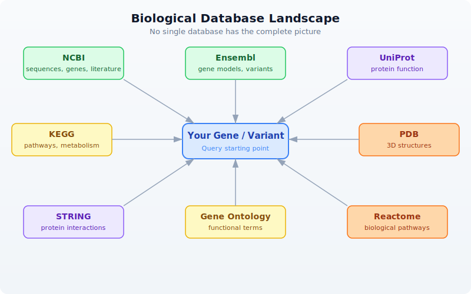

# Day 9: Biological Databases and APIs

## The Problem

You found a mutation in gene BRCA1. What does this gene do? Is this mutation known? What pathway is it in? What protein does it encode? What other proteins does it interact with? What 3D structures are available?

This information exists --- scattered across a dozen databases maintained by organizations around the world. NCBI in Bethesda, EBI in Cambridge, KEGG in Kyoto, RCSB in New Jersey. Manually searching each one, copying identifiers between browser tabs, cross-referencing results --- it takes hours for a single gene. For a list of 50 candidate genes from a screen, it takes days.

With API calls, it takes seconds.

BioLang has built-in clients for 12+ biological databases. No packages to install. No authentication boilerplate. No JSON parsing. You call a function, you get structured data back.

---

## The Database Landscape

Biological knowledge is distributed across specialized databases. Each one is the authoritative source for a particular kind of information:



No single database has the complete picture. NCBI has the sequences but not the pathways. KEGG has the pathways but not the 3D structures. PDB has the structures but not the interaction networks. The real power comes from querying multiple databases and combining the results.

| Database | Maintained By | Speciality | BioLang Functions |
|----------|--------------|-----------|-------------------|
| NCBI | NIH (USA) | Sequences, genes, literature | `ncbi_gene`, `ncbi_search`, `ncbi_sequence` |
| Ensembl | EBI/EMBL | Gene models, variants, orthology | `ensembl_symbol`, `ensembl_sequence`, `ensembl_vep` |
| UniProt | EBI/SIB/PIR | Protein function, features | `uniprot_entry`, `uniprot_search`, `uniprot_features` |
| KEGG | Kyoto Univ | Pathways, metabolism | `kegg_get`, `kegg_find`, `kegg_link` |
| PDB | RCSB (USA) | 3D protein structures | `pdb_entry`, `pdb_search` |
| STRING | EMBL | Protein-protein interactions | `string_network`, `string_enrichment` |
| Gene Ontology | GO Consortium | Functional annotations | `go_term`, `go_annotations` |
| Reactome | EBI/OICR | Biological pathways | `reactome_pathways`, `reactome_search` |

---

## NCBI --- The Central Repository

The National Center for Biotechnology Information (NCBI) is the largest repository of biological data. It hosts GenBank (sequences), PubMed (literature), Gene (gene records), and dozens of other databases. Nearly every bioinformatician interacts with NCBI daily.

BioLang's NCBI functions wrap the E-utilities API, handling the XML parsing, rate limiting, and error recovery for you.

### Looking Up a Gene

The simplest operation: look up a gene by symbol.

> **Requires CLI:** This example uses network APIs not available in the browser. Run with `bl run`.

```bio
# requires: internet connection
# optional: NCBI_API_KEY for higher rate limits

let gene = ncbi_gene("BRCA1")
println(f"Symbol: {gene.symbol}")
println(f"Name: {gene.name}")
println(f"Description: {gene.description}")
println(f"Chromosome: {gene.chromosome}")
println(f"Location: {gene.location}")
println(f"Organism: {gene.organism}")
```

Expected output (approximate --- NCBI data is updated regularly):

```
Symbol: BRCA1
Name: BRCA1 DNA repair associated
Description: BRCA1 DNA repair associated
Chromosome: 17
Location: 17q21.31
Organism: Homo sapiens
```

`ncbi_gene()` returns a record with fields: `id`, `symbol`, `name`, `description`, `organism`, `chromosome`, `location`, `summary`. When the search matches a single gene, you get the full record directly. When it matches multiple genes, you get a list of NCBI Gene IDs.

### Searching NCBI Databases

NCBI hosts over 40 databases. You can search any of them with `ncbi_search()`:

> **Requires CLI:** This example uses network APIs not available in the browser. Run with `bl run`.

```bio
# requires: internet connection
# optional: NCBI_API_KEY for higher rate limits

# Search PubMed for articles about BRCA1 and breast cancer
let pubmed_ids = ncbi_search("pubmed", "BRCA1 breast cancer", 5)
println(f"PubMed hits: {len(pubmed_ids)}")
for id in pubmed_ids {
    println(f"  PMID: {id}")
}

# Search the Gene database
let gene_ids = ncbi_search("gene", "TP53 homo sapiens", 5)
println(f"Gene IDs: {len(gene_ids)}")
```

Note the argument order: `ncbi_search(database, query, max_results)`. The `max_results` parameter is optional (defaults to 20).

### Fetching Sequences

Retrieve a sequence by its accession number:

> **Requires CLI:** This example uses network APIs not available in the browser. Run with `bl run`.

```bio
# requires: internet connection
# optional: NCBI_API_KEY for higher rate limits

# Fetch BRCA1 mRNA sequence (RefSeq accession)
let fasta = ncbi_sequence("NM_007294")
println(f"Sequence (first 100 chars):")
println(fasta |> take(200))
```

`ncbi_sequence()` returns the raw FASTA text. You can parse it further or write it to a file.

---

## Ensembl --- Gene Models and Variants

Ensembl, maintained by the European Bioinformatics Institute (EBI), provides gene annotations, comparative genomics, and variant effect prediction. Its REST API is particularly well-designed and fast.

### Looking Up a Gene by Symbol

> **Requires CLI:** This example uses network APIs not available in the browser. Run with `bl run`.

```bio
# requires: internet connection

let gene = ensembl_symbol("homo_sapiens", "BRCA1")
println(f"Ensembl ID: {gene.id}")
println(f"Symbol: {gene.symbol}")
println(f"Biotype: {gene.biotype}")
println(f"Chromosome: {gene.chromosome}")
println(f"Start: {gene.start}")
println(f"End: {gene.end}")
println(f"Strand: {gene.strand}")
```

Expected output (approximate):

```
Ensembl ID: ENSG00000012048
Symbol: BRCA1
Biotype: protein_coding
Chromosome: 17
Start: 43044295
End: 43170245
Strand: -1
```

Note the argument order: `ensembl_symbol(species, symbol)`. Species uses Ensembl's underscore-separated format: `"homo_sapiens"`, `"mus_musculus"`, `"danio_rerio"`.

### Getting Protein Sequences

Once you have an Ensembl gene ID, you can retrieve its sequence in different forms:

> **Requires CLI:** This example uses network APIs not available in the browser. Run with `bl run`.

```bio
# requires: internet connection

let gene = ensembl_symbol("homo_sapiens", "BRCA1")

# Get the protein sequence
let protein = ensembl_sequence(gene.id, "protein")
println(f"Protein length: {len(protein.seq)} amino acids")
println(f"First 50 aa: {protein.seq |> take(50)}")

# Get the coding sequence (CDS)
let cds = ensembl_sequence(gene.id, "cds")
println(f"CDS length: {len(cds.seq)} bases")
```

`ensembl_sequence()` takes an Ensembl ID and an optional sequence type: `"genomic"` (default), `"cds"`, `"cdna"`, or `"protein"`. It returns a record with `id`, `seq`, and `molecule` fields.

### Variant Effect Prediction (VEP)

One of Ensembl's most powerful features is VEP --- the Variant Effect Predictor. Given a variant, it tells you the predicted biological consequence:

> **Requires CLI:** This example uses network APIs not available in the browser. Run with `bl run`.

```bio
# requires: internet connection

# Predict the effect of a BRCA1 variant (HGVS notation)
let results = ensembl_vep("17:g.43091434G>A")
for r in results {
    println(f"Alleles: {r.allele_string}")
    println(f"Most severe: {r.most_severe_consequence}")
    for tc in r.transcript_consequences {
        println(f"  Transcript: {tc.transcript_id}")
        println(f"  Impact: {tc.impact}")
        println(f"  Consequences: {tc.consequences}")
    }
}
```

VEP accepts HGVS notation (e.g., `"17:g.43091434G>A"`) and returns a list of result records, each containing transcript-level consequence predictions with impact severity (HIGH, MODERATE, LOW, MODIFIER).

---

## UniProt --- Protein Knowledge

UniProt is the definitive resource for protein function, domains, post-translational modifications, and literature. Every well-characterized protein has a UniProt entry curated by expert biologists.

### Looking Up a Protein

> **Requires CLI:** This example uses network APIs not available in the browser. Run with `bl run`.

```bio
# requires: internet connection

# Look up BRCA1 by its UniProt accession
let entry = uniprot_entry("P38398")
println(f"Name: {entry.name}")
println(f"Organism: {entry.organism}")
println(f"Length: {entry.sequence_length} aa")
println(f"Gene names: {entry.gene_names}")
println(f"Function: {entry.function}")
```

Expected output (approximate):

```
Name: BRCA1_HUMAN
Organism: Homo sapiens (Human)
Length: 1863 aa
Gene names: ["BRCA1", "RNF53"]
Function: E3 ubiquitin-protein ligase that...
```

`uniprot_entry()` returns a record with `accession`, `name`, `organism`, `sequence_length`, `gene_names` (a list), and `function`.

### Searching UniProt

> **Requires CLI:** This example uses network APIs not available in the browser. Run with `bl run`.

```bio
# requires: internet connection

# Search for human BRCA1 proteins
let results = uniprot_search("BRCA1 AND organism_name:human", 5)
println(f"Results: {len(results)}")
for entry in results {
    println(f"  {entry.accession}: {entry.name} ({entry.sequence_length} aa)")
}
```

`uniprot_search()` takes a query string (using UniProt's query syntax) and an optional limit (defaults to 10). It returns a list of protein entry records.

### Protein Features and Domains

> **Requires CLI:** This example uses network APIs not available in the browser. Run with `bl run`.

```bio
# requires: internet connection

# Get structural and functional features of BRCA1
let features = uniprot_features("P38398")
println(f"Total features: {len(features)}")

# Find just the domains
let domains = features |> filter(|f| f.type == "Domain")
println(f"Domains: {len(domains)}")
for d in domains {
    println(f"  {d.description} ({d.location})")
}

# Find binding sites
let sites = features |> filter(|f| f.type == "Binding site")
println(f"Binding sites: {len(sites)}")
```

Each feature record has `type`, `location`, and `description` fields. Common types include `"Domain"`, `"Region"`, `"Binding site"`, `"Modified residue"`, `"Disulfide bond"`, and `"Chain"`.

### Gene Ontology Terms from UniProt

> **Requires CLI:** This example uses network APIs not available in the browser. Run with `bl run`.

```bio
# requires: internet connection

# Get GO terms associated with BRCA1
let go_terms = uniprot_go("P38398")
println(f"GO terms: {len(go_terms)}")
for t in go_terms |> take(5) {
    println(f"  {t.id}: {t.term} ({t.aspect})")
}
```

---

## KEGG --- Pathways and Metabolism

The Kyoto Encyclopedia of Genes and Genomes links genes to metabolic and signaling pathways. It is especially valuable for understanding how individual genes fit into larger biological systems.

### Finding Genes in KEGG

> **Requires CLI:** This example uses network APIs not available in the browser. Run with `bl run`.

```bio
# requires: internet connection

# Find BRCA1 in the KEGG database
let results = kegg_find("genes", "BRCA1")
println(f"KEGG hits: {len(results)}")
for r in results |> take(5) {
    println(f"  {r.id}: {r.description}")
}
```

`kegg_find()` takes a database name and a query string. The database can be `"genes"`, `"pathway"`, `"compound"`, `"disease"`, `"drug"`, and more. It returns a list of records with `id` and `description`.

### Getting Detailed Entries

> **Requires CLI:** This example uses network APIs not available in the browser. Run with `bl run`.

```bio
# requires: internet connection

# Get detailed entry for human BRCA1
let entry = kegg_get("hsa:672")
println(f"KEGG entry (first 500 chars):")
println(entry |> take(500))
```

`kegg_get()` returns the raw KEGG flat-file text for any KEGG identifier. KEGG IDs use an organism prefix: `hsa` for Homo sapiens, `mmu` for Mus musculus, etc.

### Linking to Pathways

The real power of KEGG is connecting genes to pathways:

> **Requires CLI:** This example uses network APIs not available in the browser. Run with `bl run`.

```bio
# requires: internet connection

# Find pathways that BRCA1 participates in
let links = kegg_link("pathway", "hsa:672")
println(f"Pathways involving BRCA1: {len(links)}")
for link in links {
    println(f"  {link.source} -> {link.target}")
}
```

`kegg_link()` takes two arguments: target database and source identifier. It returns a list of records with `source` and `target` fields.

---

## PDB --- 3D Protein Structures

The Protein Data Bank (PDB) contains experimentally determined 3D structures of proteins, nucleic acids, and their complexes. If you want to see what a protein actually looks like, this is where you go.

### Looking Up a Structure

> **Requires CLI:** This example uses network APIs not available in the browser. Run with `bl run`.

```bio
# requires: internet connection

# Get information about BRCA1 BRCT domain structure
let structure = pdb_entry("1JM7")
println(f"Title: {structure.title}")
println(f"Method: {structure.method}")
println(f"Resolution: {structure.resolution}")
println(f"Release date: {structure.release_date}")
println(f"Organism: {structure.organism}")
```

Expected output (approximate):

```
Title: Crystal structure of the BRCT repeat region from...
Method: X-RAY DIFFRACTION
Resolution: 2.5
Release date: 2001-07-06
Organism: Homo sapiens
```

`pdb_entry()` returns a record with `id`, `title`, `method`, `resolution` (may be nil for NMR structures), `release_date`, and `organism`.

### Searching for Structures

> **Requires CLI:** This example uses network APIs not available in the browser. Run with `bl run`.

```bio
# requires: internet connection

# Find all PDB structures related to BRCA1
let pdb_ids = pdb_search("BRCA1")
println(f"PDB structures for BRCA1: {len(pdb_ids)}")
for id in pdb_ids |> take(10) {
    println(f"  {id}")
}
```

`pdb_search()` returns a list of PDB ID strings.

### Getting Entity and Sequence Information

> **Requires CLI:** This example uses network APIs not available in the browser. Run with `bl run`.

```bio
# requires: internet connection

# Get entity details for a specific chain
let entity = pdb_entity("1JM7", 1)
println(f"Entity type: {entity.entity_type}")
println(f"Description: {entity.description}")

# Get the protein sequence from the structure
let seq = pdb_sequence("1JM7", 1)
println(f"Sequence: {seq}")
println(f"Length: {len(seq)} aa")
```

---

## STRING --- Protein Interactions

STRING (Search Tool for Recurring Instances of Neighbouring Genes) maps known and predicted protein-protein interactions. Understanding which proteins interact is crucial for interpreting experimental results.

### Getting an Interaction Network

> **Requires CLI:** This example uses network APIs not available in the browser. Run with `bl run`.

```bio
# requires: internet connection

# Get interaction partners for BRCA1
# string_network takes a list of protein identifiers and a species taxonomy ID
let network = string_network(["BRCA1"], 9606)
println(f"Interaction partners: {len(network)}")

# Show top interactors by score
let top = network
    |> sort_by(|n| n.score)
    |> reverse()
    |> take(5)

for partner in top {
    println(f"  {partner.protein_a} <-> {partner.protein_b}: score={partner.score}")
}
```

Note that `string_network()` takes a **list** of protein identifiers (not a single string) and a species taxonomy ID. Common taxonomy IDs: 9606 (human), 10090 (mouse), 7955 (zebrafish), 6239 (C. elegans), 7227 (D. melanogaster).

Each interaction record has `protein_a`, `protein_b`, and `score` fields. The score ranges from 0 to 1, where higher scores indicate more confident interactions.

### Functional Enrichment

> **Requires CLI:** This example uses network APIs not available in the browser. Run with `bl run`.

```bio
# requires: internet connection

# Check if a set of genes is enriched for specific functions
let enrichment = string_enrichment(["BRCA1", "BRCA2", "RAD51", "TP53", "ATM"], 9606)
println(f"Enriched terms: {len(enrichment)}")
for e in enrichment |> take(5) {
    println(f"  [{e.category}] {e.description}: p={e.p_value}, FDR={e.fdr}")
}
```

`string_enrichment()` takes a list of gene symbols and a species taxonomy ID. It returns a list of enrichment records with `category`, `term`, `description`, `gene_count`, `p_value`, and `fdr`.

---

## Gene Ontology and Reactome

### Gene Ontology (GO)

The Gene Ontology provides a standardized vocabulary for describing gene function across all organisms. Every GO term belongs to one of three namespaces:

- **Molecular Function** --- what the protein does (e.g., "kinase activity")
- **Biological Process** --- what pathway it participates in (e.g., "DNA repair")
- **Cellular Component** --- where in the cell it acts (e.g., "nucleus")

> **Requires CLI:** This example uses network APIs not available in the browser. Run with `bl run`.

```bio
# requires: internet connection

# Look up a specific GO term
let term = go_term("GO:0006281")
println(f"ID: {term.id}")
println(f"Name: {term.name}")
println(f"Aspect: {term.aspect}")
println(f"Definition: {term.definition}")
```

Expected output:

```
ID: GO:0006281
Name: DNA repair
Aspect: biological_process
Definition: The process of restoring DNA after damage...
```

### GO Annotations for a Gene

> **Requires CLI:** This example uses network APIs not available in the browser. Run with `bl run`.

```bio
# requires: internet connection

# Get GO annotations for BRCA1 (by UniProt accession)
let annotations = go_annotations("P38398")
println(f"GO annotations: {len(annotations)}")
for a in annotations |> take(5) {
    println(f"  {a.go_id}: {a.go_name} ({a.aspect})")
    println(f"    Evidence: {a.evidence}")
}
```

`go_annotations()` takes a gene/protein identifier and an optional limit (defaults to 25). Each annotation has `go_id`, `go_name`, `aspect`, `evidence`, and `gene_product_id` fields.

### Navigating the GO Hierarchy

GO terms form a directed acyclic graph (DAG). You can traverse it:

> **Requires CLI:** This example uses network APIs not available in the browser. Run with `bl run`.

```bio
# requires: internet connection

# Find child terms of "DNA repair"
let children = go_children("GO:0006281")
println(f"Child terms of DNA repair: {len(children)}")
for c in children |> take(5) {
    println(f"  {c.id}: {c.name}")
}

# Find parent terms
let parents = go_parents("GO:0006281")
println(f"Parent terms: {len(parents)}")
for p in parents {
    println(f"  {p.id}: {p.name}")
}
```

### Reactome --- Biological Pathways

Reactome is a curated database of biological pathways and reactions, maintained by EBI and the Ontario Institute for Cancer Research.

> **Requires CLI:** This example uses network APIs not available in the browser. Run with `bl run`.

```bio
# requires: internet connection

# Find pathways involving BRCA1
let pathways = reactome_pathways("BRCA1")
println(f"Reactome pathways: {len(pathways)}")
for p in pathways |> take(5) {
    println(f"  {p.id}: {p.name} ({p.species})")
}
```

`reactome_pathways()` takes a gene symbol and an optional species (defaults to `"Homo sapiens"`). It returns a list of pathway records with `id`, `name`, and `species`.

You can also search Reactome by keyword:

> **Requires CLI:** This example uses network APIs not available in the browser. Run with `bl run`.

```bio
# requires: internet connection

let results = reactome_search("DNA damage response")
println(f"Search results: {len(results)}")
```

---

## Combining Multiple Databases

The real power of programmatic database access is **cross-referencing**. A single gene symbol unlocks information across every database simultaneously. What would take 30 minutes of browser-tab switching takes 10 lines of code.

### A Complete Gene Profile

> **Requires CLI:** This example uses network APIs not available in the browser. Run with `bl run`.

```bio
# requires: internet connection
# optional: NCBI_API_KEY for higher rate limits

fn gene_profile(symbol) {
    println(f"\n{'=' * 50}")
    println(f"  Gene Profile: {symbol}")
    println(f"{'=' * 50}")

    # NCBI: basic gene info
    let gene = ncbi_gene(symbol)
    println(f"\n[NCBI Gene]")
    println(f"  Description: {gene.description}")
    println(f"  Chromosome: {gene.chromosome}")
    println(f"  Location: {gene.location}")

    # Ensembl: genomic coordinates
    let ens = ensembl_symbol("homo_sapiens", symbol)
    println(f"\n[Ensembl]")
    println(f"  ID: {ens.id}")
    println(f"  Biotype: {ens.biotype}")
    println(f"  Position: chr{ens.chromosome}:{ens.start}-{ens.end}")

    # Ensembl: protein sequence
    let protein = ensembl_sequence(ens.id, "protein")
    println(f"  Protein: {len(protein.seq)} amino acids")

    # UniProt: function
    let results = uniprot_search(f"{symbol} AND organism_name:human", 1)
    if len(results) > 0 {
        let entry = results |> first()
        println(f"\n[UniProt]")
        println(f"  Accession: {entry.accession}")
        println(f"  Name: {entry.name}")
        println(f"  Function: {entry.function}")
    }

    # STRING: interactions
    let network = string_network([symbol], 9606)
    println(f"\n[STRING]")
    println(f"  Interaction partners: {len(network)}")
    let top3 = network
        |> sort_by(|n| n.score)
        |> reverse()
        |> take(3)
    for partner in top3 {
        println(f"    {partner.protein_b}: {partner.score}")
    }

    # PDB: structures
    let structures = pdb_search(symbol)
    println(f"\n[PDB]")
    println(f"  Available structures: {len(structures)}")

    # Reactome: pathways
    let pathways = reactome_pathways(symbol)
    println(f"\n[Reactome]")
    println(f"  Pathways: {len(pathways)}")
    for p in pathways |> take(3) {
        println(f"    {p.name}")
    }

    sleep(1)  # respect rate limits between genes
}
```

### Profiling Multiple Genes

```bio
# requires: internet connection
# optional: NCBI_API_KEY for higher rate limits

# Profile a set of cancer-related genes
let cancer_genes = ["BRCA1", "TP53", "EGFR"]
for gene in cancer_genes {
    gene_profile(gene)
}
```

This is the kind of analysis that is impractical to do manually but trivial with API calls. Three genes, six databases each, complete profiles in under a minute.

### Building a Comparison Table

> **Requires CLI:** This example uses network APIs not available in the browser. Run with `bl run`.

```bio
# requires: internet connection
# optional: NCBI_API_KEY for higher rate limits

# Collect structured data for comparison
let genes = ["BRCA1", "TP53", "EGFR", "KRAS", "MYC"]
let rows = []
for symbol in genes {
    let gene = ncbi_gene(symbol)
    let ens = ensembl_symbol("homo_sapiens", symbol)
    let protein = ensembl_sequence(ens.id, "protein")
    let network = string_network([symbol], 9606)
    let pathways = reactome_pathways(symbol)

    rows = push(rows, {
        gene: symbol,
        chromosome: gene.chromosome,
        protein_length: len(protein.seq),
        interactions: len(network),
        pathways: len(pathways)
    })

    sleep(0.5)  # be respectful
}

let results = rows |> to_table()
println(results)
```

Expected output (approximate):

```
gene   | chromosome | protein_length | interactions | pathways
-------|------------|----------------|--------------|--------
BRCA1  | 17         | 1863           | 10           | 25
TP53   | 17         | 393            | 10           | 18
EGFR   | 7          | 1210           | 10           | 30
KRAS   | 12         | 189            | 10           | 22
MYC    | 8          | 439            | 10           | 15
```

---

## Rate Limiting and Best Practices

Biological databases are shared public resources. Hammering them with thousands of requests per second will get your IP temporarily blocked --- and slow down the service for everyone.

### Rate Limits by Database

| Database | Rate Limit | With API Key |
|----------|-----------|-------------|
| NCBI | 3 requests/second | 10/second with `NCBI_API_KEY` |
| Ensembl | 15 requests/second | --- |
| UniProt | Reasonable use (no hard limit) | --- |
| KEGG | 10 requests/second | --- |
| PDB | No published limit | --- |
| STRING | 1 request/second | --- |
| QuickGO | 10 requests/second | --- |
| Reactome | No published limit | --- |

### Setting Up API Keys

NCBI strongly recommends registering for an API key. It is free and takes 30 seconds:

1. Go to [ncbi.nlm.nih.gov/account/settings](https://www.ncbi.nlm.nih.gov/account/settings/)
2. Click "Create an API Key"
3. Set the environment variable:

```bash
export NCBI_API_KEY="your_key_here"
```

BioLang automatically detects and uses the `NCBI_API_KEY` environment variable for all NCBI calls.

### Batch Queries with Rate Limiting

When querying multiple genes, add delays between requests:

> **Requires CLI:** This example uses network APIs not available in the browser. Run with `bl run`.

```bio
# requires: internet connection
# optional: NCBI_API_KEY for higher rate limits

let genes = ["BRCA1", "TP53", "EGFR", "KRAS", "MYC",
             "PIK3CA", "BRAF", "APC", "RB1", "PTEN"]

let results = []
for gene in genes {
    let info = ncbi_gene(gene)
    results = push(results, {gene: gene, chrom: info.chromosome, desc: info.description})
    sleep(0.5)  # be respectful
}

let results_table = results |> to_table()
println(results_table)
```

### Best Practices

1. **Cache results** --- if you are going to query the same gene repeatedly during development, save the result to a variable or file instead of calling the API each time.

2. **Use `sleep()` in loops** --- add at least 0.3--0.5 seconds between requests when iterating over a list of genes.

3. **Handle errors gracefully** --- API calls can fail due to network issues, maintenance windows, or invalid identifiers. Use `try/catch` for production scripts.

4. **Start small** --- test your query with 2--3 genes before running it on 500.

5. **Set `NCBI_API_KEY`** --- it is free and triples your rate limit.

> **Requires CLI:** This example uses network APIs not available in the browser. Run with `bl run`.

```bio
# requires: internet connection
# optional: NCBI_API_KEY for higher rate limits

# Robust batch query with error handling
let genes = ["BRCA1", "TP53", "INVALID_GENE", "EGFR"]
let results = []
let errors = []

for gene in genes {
    let result = try {
        let info = ncbi_gene(gene)
        push(results, {gene: gene, chrom: info.chromosome})
    } catch e {
        push(errors, {gene: gene, error: e})
    }
    sleep(0.5)
}

println(f"Successful: {len(results)}")
println(f"Failed: {len(errors)}")
for err in errors {
    println(f"  {err.gene}: {err.error}")
}
```

---

## Exercises

1. **Gene Lookup**: Look up your favorite gene in NCBI using `ncbi_gene()` and print its chromosome location, description, and summary. Try at least two different genes.

2. **Protein Size Estimation**: Use `ensembl_symbol()` and `ensembl_sequence()` to get the protein sequence of TP53. Calculate its length and estimate its molecular weight (average amino acid weight is approximately 110 daltons).

3. **UniProt Search**: Search UniProt for `"insulin AND organism_name:human"` and list the accession numbers and names of the results.

4. **Interaction Network**: Use `string_network()` to find interaction partners for MYC (species 9606). Sort by score and print the top 5.

5. **Multi-Database Report**: Write a `gene_report(symbol)` function that queries at least 3 databases (NCBI, Ensembl, and one other) and returns a summary record with fields like `chromosome`, `protein_length`, `num_interactions`, and `num_pathways`. Test it on EGFR and KRAS.

---

## Key Takeaways

- BioLang has built-in clients for 12+ biological databases --- no packages to install, no JSON to parse.

- **NCBI** is the central repository for sequences, genes, and literature. `ncbi_gene()` is often your starting point.

- **Ensembl** provides gene models, coordinates, and the invaluable Variant Effect Predictor (`ensembl_vep()`).

- **UniProt** is the authoritative source for protein function, domains, and curated annotations.

- **KEGG** connects genes to metabolic and signaling pathways. Use `kegg_link()` to find pathway memberships.

- **PDB** gives you 3D protein structures. **STRING** maps protein-protein interaction networks.

- **GO** and **Reactome** provide functional annotations and biological pathway context.

- Combining databases gives a complete picture no single source provides. A 10-line function can profile a gene across six databases.

- Respect rate limits: use `sleep()` in batch queries, set `NCBI_API_KEY` for NCBI, and cache results when possible.

- All API functions require internet access. Some need API keys: NCBI (optional, recommended), COSMIC (required).

---

## What's Next

Tomorrow we move from fetching data to organizing it. **Day 10: Tables --- The Bioinformatician's Workbench** covers selecting, filtering, joining, and reshaping tabular data --- the format that most bioinformatics analysis ultimately lives in.
