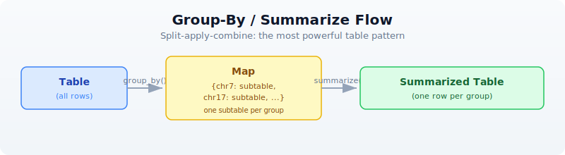

# Day 10: Tables --- The Bioinformatician's Workbench

| | |
|---|---|
| **Difficulty** | Intermediate |
| **Biology knowledge** | Basic (gene names, chromosomes, expression data) |
| **Coding knowledge** | Intermediate (pipes, closures, records) |
| **Time** | ~3 hours |
| **Prerequisites** | Days 1-9 completed, BioLang installed (see Appendix A) |
| **Data needed** | Generated by `init.bl` (CSV files) |
| **Requirements** | None (offline) |

## What You'll Learn

- How to create tables from CSV files, records, and column vectors
- How to select, drop, and rename columns
- How to filter rows with predicates
- How to add and transform columns with mutate
- How to sort, slice, and deduplicate rows
- How to group rows and compute summaries (split-apply-combine)
- How to join tables by key columns (inner, left, right, outer, anti, semi)
- How to reshape between wide and long formats (pivot)
- How to use window functions for running totals and ranks
- How to chain all of these into a complete analysis pipeline

---

## The Problem

Every analysis produces tabular data --- gene expression matrices, variant call results, sample metadata, statistical summaries. A differential expression tool gives you thousands of rows with gene names, fold changes, and p-values. A variant caller gives you chromosomes, positions, and quality scores. A clinical database gives you patient IDs, phenotypes, and treatment groups.

Knowing how to slice, dice, join, reshape, and summarize tables is the single most valuable data skill in bioinformatics. It is the skill that turns raw output into biological insight.

In R, this is dplyr and tidyr. In Python, this is pandas. In BioLang, tables are built in --- no imports, no package managers, no configuration. You load a CSV and start working.

---

## Creating Tables

There are three ways to get data into a table.

### From CSV/TSV Files

The most common case: you have a file from another tool.

> **Requires CLI:** This example uses file I/O not available in the browser. Run with `bl run`.

```bio
let expr = csv("data/expression.csv")
println(f"Rows: {nrow(expr)}, Cols: {ncol(expr)}")
println(f"Columns: {colnames(expr)}")
println(expr |> head(3))
```

Expected output:

```
Rows: 20, Cols: 6
Columns: [gene, log2fc, pval, padj, chr, biotype]
gene   | log2fc | pval     | padj     | chr | biotype
EGFR   | 3.8    | 0.000001 | 0.00001  | 7   | protein_coding
BRCA1  | 2.4    | 0.001    | 0.005    | 17  | protein_coding
VEGFA  | 2.1    | 0.002    | 0.008    | 6   | protein_coding
```

`csv()` reads comma-separated files. For tab-separated files, use `tsv()`. Both auto-detect headers and infer column types (integers, floats, strings).

### From a List of Records

When you construct data programmatically, build a list of records and convert it.

```bio
let data = [
    {gene: "BRCA1", log2fc: 2.4, pval: 0.001, chr: "17"},
    {gene: "TP53", log2fc: -1.1, pval: 0.23, chr: "17"},
    {gene: "EGFR", log2fc: 3.8, pval: 0.000001, chr: "7"},
    {gene: "MYC", log2fc: 1.9, pval: 0.04, chr: "8"},
    {gene: "KRAS", log2fc: -0.3, pval: 0.67, chr: "12"},
] |> to_table()

println(data)
```

Expected output:

```
gene  | log2fc | pval     | chr
BRCA1 | 2.4    | 0.001    | 17
TP53  | -1.1   | 0.23     | 17
EGFR  | 3.8    | 0.000001 | 7
MYC   | 1.9    | 0.04     | 8
KRAS  | -0.3   | 0.67     | 12
```

### From Column Vectors

When you already have parallel arrays, pass a record of lists.

```bio
let t = table({
    gene: ["BRCA1", "TP53", "EGFR"],
    value: [1.0, 2.0, 3.0]
})
println(t)
```

Expected output:

```
gene  | value
BRCA1 | 1.0
TP53  | 2.0
EGFR  | 3.0
```

This is the Polars/R column-oriented style. Each key is a column name, each value is a list of that column's data. All lists must have the same length.

---

## Selecting Columns

Tables often have more columns than you need. `select()` keeps only the ones you name. `drop_cols()` removes the ones you don't want.

```bio
let data = [
    {gene: "BRCA1", log2fc: 2.4, pval: 0.001, chr: "17"},
    {gene: "TP53", log2fc: -1.1, pval: 0.23, chr: "17"},
    {gene: "EGFR", log2fc: 3.8, pval: 0.000001, chr: "7"},
] |> to_table()

# Keep specific columns
let slim = data |> select("gene", "pval")
println(slim)
```

Expected output:

```
gene  | pval
BRCA1 | 0.001
TP53  | 0.23
EGFR  | 0.000001
```

```bio
# Drop a column
let no_chr = data |> drop_cols("chr")
println(no_chr)
```

Expected output:

```
gene  | log2fc | pval
BRCA1 | 2.4    | 0.001
TP53  | -1.1   | 0.23
EGFR  | 3.8    | 0.000001
```

```bio
# Rename a column
let renamed = data |> rename("log2fc", "fold_change")
println(renamed)
```

Expected output:

```
gene  | fold_change | pval     | chr
BRCA1 | 2.4         | 0.001    | 17
TP53  | -1.1        | 0.23     | 17
EGFR  | 3.8         | 0.000001 | 7
```

`select()` takes the table as the first argument (piped) and column names as the remaining arguments. `rename()` takes the old name and the new name.

---

## Filtering Rows

`filter()` keeps only the rows where a predicate returns true. The predicate receives each row as a record.

```bio
let data = [
    {gene: "BRCA1", log2fc: 2.4, pval: 0.001, chr: "17"},
    {gene: "TP53", log2fc: -1.1, pval: 0.23, chr: "17"},
    {gene: "EGFR", log2fc: 3.8, pval: 0.000001, chr: "7"},
    {gene: "MYC", log2fc: 1.9, pval: 0.04, chr: "8"},
    {gene: "KRAS", log2fc: -0.3, pval: 0.67, chr: "12"},
] |> to_table()

# Single condition: significant genes
let sig = data |> filter(|r| r.pval < 0.05)
println(sig)
```

Expected output:

```
gene  | log2fc | pval     | chr
BRCA1 | 2.4    | 0.001    | 17
EGFR  | 3.8    | 0.000001 | 7
MYC   | 1.9    | 0.04     | 8
```

```bio
# Multiple conditions: significant AND upregulated
let sig_up = data |> filter(|r| r.pval < 0.05 and r.log2fc > 1.0)
println(sig_up)
```

Expected output:

```
gene  | log2fc | pval     | chr
BRCA1 | 2.4    | 0.001    | 17
EGFR  | 3.8    | 0.000001 | 7
MYC   | 1.9    | 0.04     | 8
```

```bio
# Filter by category
let chr17 = data |> filter(|r| r.chr == "17")
println(chr17)
```

Expected output:

```
gene  | log2fc | pval  | chr
BRCA1 | 2.4    | 0.001 | 17
TP53  | -1.1   | 0.23  | 17
```

You can combine conditions with `and` and `or`. Parentheses clarify precedence when mixing them:

```bio
# Chromosome 17 OR very significant
let subset = data |> filter(|r| r.chr == "17" or r.pval < 0.001)
println(subset)
```

Expected output:

```
gene  | log2fc | pval     | chr
BRCA1 | 2.4    | 0.001    | 17
TP53  | -1.1   | 0.23     | 17
EGFR  | 3.8    | 0.000001 | 7
```

---

## Mutating: Adding and Transforming Columns

`mutate()` adds a new column (or replaces an existing one) by applying a function to each row. It takes three arguments: the table, the new column name, and a closure that receives each row as a record.

```bio
let data = [
    {gene: "BRCA1", log2fc: 2.4, pval: 0.001},
    {gene: "TP53", log2fc: -1.1, pval: 0.23},
    {gene: "EGFR", log2fc: 3.8, pval: 0.000001},
    {gene: "MYC", log2fc: 1.9, pval: 0.04},
    {gene: "KRAS", log2fc: -0.3, pval: 0.67},
] |> to_table()

# Add a significance flag
let with_sig = data |> mutate("significant", |r| r.pval < 0.05)
println(with_sig)
```

Expected output:

```
gene  | log2fc | pval     | significant
BRCA1 | 2.4    | 0.001    | true
TP53  | -1.1   | 0.23     | false
EGFR  | 3.8    | 0.000001 | true
MYC   | 1.9    | 0.04     | true
KRAS  | -0.3   | 0.67     | false
```

```bio
# Add a direction column
let with_dir = data |> mutate("direction", |r| if r.log2fc > 0 { "up" } else { "down" })
println(with_dir)
```

Expected output:

```
gene  | log2fc | pval     | direction
BRCA1 | 2.4    | 0.001    | up
TP53  | -1.1   | 0.23     | down
EGFR  | 3.8    | 0.000001 | up
MYC   | 1.9    | 0.04     | up
KRAS  | -0.3   | 0.67     | down
```

```bio
# Add a negative log10 p-value (common for volcano plots)
let with_nlp = data |> mutate("neg_log_p", |r| -1.0 * log10(r.pval))
println(with_nlp)
```

Expected output:

```
gene  | log2fc | pval     | neg_log_p
BRCA1 | 2.4    | 0.001    | 3.0
TP53  | -1.1   | 0.23     | 0.638...
EGFR  | 3.8    | 0.000001 | 6.0
MYC   | 1.9    | 0.04     | 1.397...
KRAS  | -0.3   | 0.67     | 0.173...
```

To add multiple columns, chain `mutate()` calls:

```bio
let enriched = data
    |> mutate("significant", |r| r.pval < 0.05)
    |> mutate("direction", |r| if r.log2fc > 0 { "up" } else { "down" })
    |> mutate("neg_log_p", |r| -1.0 * log10(r.pval))
println(enriched)
```

Each `mutate()` adds one column. The pipe chains them together so the result flows naturally.

---

## Sorting

`arrange()` sorts a table by a column in ascending order. For descending order, pipe through `reverse()`.

```bio
let data = [
    {gene: "BRCA1", log2fc: 2.4, pval: 0.001},
    {gene: "TP53", log2fc: -1.1, pval: 0.23},
    {gene: "EGFR", log2fc: 3.8, pval: 0.000001},
    {gene: "MYC", log2fc: 1.9, pval: 0.04},
] |> to_table()

# Sort by p-value (ascending --- most significant first)
let by_pval = data |> arrange("pval")
println(by_pval)
```

Expected output:

```
gene  | log2fc | pval
EGFR  | 3.8    | 0.000001
BRCA1 | 2.4    | 0.001
MYC   | 1.9    | 0.04
TP53  | -1.1   | 0.23
```

```bio
# Sort by fold change descending (largest first)
let by_fc_desc = data |> arrange("log2fc") |> reverse()
println(by_fc_desc)
```

Expected output:

```
gene  | log2fc | pval
EGFR  | 3.8    | 0.000001
BRCA1 | 2.4    | 0.001
MYC   | 1.9    | 0.04
TP53  | -1.1   | 0.23
```

Combine with `head()` to get top-N results:

```bio
# Top 2 most significant genes
let top2 = data |> arrange("pval") |> head(2)
println(top2)
```

Expected output:

```
gene  | log2fc | pval
EGFR  | 3.8    | 0.000001
BRCA1 | 2.4    | 0.001
```

---

## Grouping and Summarizing

The most powerful table operation is split-apply-combine: split the data into groups, apply an aggregation to each group, and combine the results into a new table.

### The Pattern



`group_by()` splits a table into a map of subtables, keyed by the distinct values in the grouping column. `summarize()` then takes that map and a function that receives each key and subtable, and must return a record. The records are assembled into a new table.

```bio
let data = [
    {gene: "BRCA1", log2fc: 2.4, pval: 0.001, chr: "17"},
    {gene: "TP53", log2fc: -1.1, pval: 0.23, chr: "17"},
    {gene: "EGFR", log2fc: 3.8, pval: 0.000001, chr: "7"},
    {gene: "MYC", log2fc: 1.9, pval: 0.04, chr: "8"},
    {gene: "KRAS", log2fc: -0.3, pval: 0.67, chr: "12"},
] |> to_table()

# Count genes per chromosome
let chr_counts = data
    |> group_by("chr")
    |> summarize(|key, subtable| {
        chr: key,
        gene_count: nrow(subtable)
    })
println(chr_counts)
```

Expected output:

```
chr | gene_count
7   | 1
8   | 1
12  | 1
17  | 2
```

```bio
# Mean fold change per chromosome
let chr_means = data
    |> group_by("chr")
    |> summarize(|key, subtable| {
        chr: key,
        mean_fc: col_mean(subtable, "log2fc"),
        n_genes: nrow(subtable)
    })
println(chr_means)
```

Expected output:

```
chr | mean_fc | n_genes
7   | 3.8     | 1
8   | 1.9     | 1
12  | -0.3    | 1
17  | 0.65    | 2
```

The summarize function can compute any aggregation you want. Use `col_mean()`, `col_sum()`, `col_min()`, `col_max()`, `col_stdev()` for numeric columns, and `nrow()` for counts.

### Quick Counts with count_by

For the common case of just counting groups, `count_by()` is a shortcut:

```bio
let chr_counts = data |> count_by("chr")
println(chr_counts)
```

Expected output:

```
chr | count
7   | 1
8   | 1
12  | 1
17  | 2
```

---

## Joining Tables

Joins connect two tables by matching rows on a shared key column. This is how you annotate results with metadata, link identifiers across databases, or combine measurements from different experiments.

### Setting Up Two Tables

```bio
let results = [
    {gene: "BRCA1", log2fc: 2.4, pval: 0.001},
    {gene: "TP53", log2fc: -1.1, pval: 0.23},
    {gene: "EGFR", log2fc: 3.8, pval: 0.000001},
    {gene: "MYC", log2fc: 1.9, pval: 0.04},
    {gene: "KRAS", log2fc: -0.3, pval: 0.67},
] |> to_table()

let annotations = [
    {gene: "BRCA1", full_name: "BRCA1 DNA repair", pathway: "DNA repair"},
    {gene: "TP53", full_name: "Tumor protein p53", pathway: "Apoptosis"},
    {gene: "EGFR", full_name: "EGF receptor", pathway: "Signaling"},
    {gene: "MYC", full_name: "MYC proto-oncogene", pathway: "Cell cycle"},
    {gene: "PTEN", full_name: "Phosphatase tensin homolog", pathway: "Signaling"},
] |> to_table()
```

Note that KRAS is in results but not annotations, and PTEN is in annotations but not results.

### Inner Join

Keeps only rows present in **both** tables.

```bio
let annotated = inner_join(results, annotations, "gene")
println(annotated)
println(f"Inner join: {nrow(annotated)} rows")
```

Expected output:

```
gene  | log2fc | pval     | full_name         | pathway
BRCA1 | 2.4    | 0.001    | BRCA1 DNA repair  | DNA repair
TP53  | -1.1   | 0.23     | Tumor protein p53 | Apoptosis
EGFR  | 3.8    | 0.000001 | EGF receptor      | Signaling
MYC   | 1.9    | 0.04     | MYC proto-oncogene | Cell cycle
Inner join: 4 rows
```

KRAS is dropped (no annotation). PTEN is dropped (no result).

### Left Join

Keeps **all** rows from the left table. Where the right table has no match, those columns are nil.

```bio
let full = left_join(results, annotations, "gene")
println(full)
println(f"Left join: {nrow(full)} rows")
```

Expected output:

```
gene  | log2fc | pval     | full_name         | pathway
BRCA1 | 2.4    | 0.001    | BRCA1 DNA repair  | DNA repair
TP53  | -1.1   | 0.23     | Tumor protein p53 | Apoptosis
EGFR  | 3.8    | 0.000001 | EGF receptor      | Signaling
MYC   | 1.9    | 0.04     | MYC proto-oncogene | Cell cycle
KRAS  | -0.3   | 0.67     | nil               | nil
Left join: 5 rows
```

KRAS is kept with nil annotations. PTEN is dropped (not in results).

### Anti Join

Returns rows from the left table that have **no** match in the right table. This is the "what's missing?" join.

```bio
let missing = anti_join(results, annotations, "gene")
println(missing)
println(f"Missing annotations: {nrow(missing)} genes")
```

Expected output:

```
gene  | log2fc | pval
KRAS  | -0.3   | 0.67
Missing annotations: 1 genes
```

### Semi Join

Returns rows from the left table that **do** have a match in the right table, but without adding columns from the right table. It is a filter, not a column merger.

```bio
let has_annotation = semi_join(results, annotations, "gene")
println(has_annotation)
```

Expected output:

```
gene  | log2fc | pval
BRCA1 | 2.4    | 0.001
TP53  | -1.1   | 0.23
EGFR  | 3.8    | 0.000001
MYC   | 1.9    | 0.04
```

### All Join Types at a Glance

```
inner_join(A, B, key):  A ∩ B     — only matching rows
left_join(A, B, key):   all A     — all of A, matching from B (nil where missing)
right_join(A, B, key):  all B     — all of B, matching from A (nil where missing)
outer_join(A, B, key):  A ∪ B     — all rows from both (nil where missing)
anti_join(A, B, key):   A - B     — rows in A with no match in B
semi_join(A, B, key):   A ∩∃ B    — rows in A that have a match in B (no extra columns)
```

**When to use which:**

| Situation | Join |
|-----------|------|
| Annotate results with gene info | `left_join` (keep all results) |
| Find shared genes between two experiments | `inner_join` |
| Find genes unique to one experiment | `anti_join` |
| Merge all data from both sources | `outer_join` |
| Filter results to genes in a known set | `semi_join` |

---

## Reshaping: Pivot Wider and Longer

Biological data comes in two shapes. **Wide** format has one row per entity (e.g., one row per gene, one column per sample). **Long** format has one row per measurement (e.g., one row per gene-sample combination).

### Long to Wide: pivot_wider

You have expression measurements in long (tidy) format:

```bio
let long = [
    {gene: "BRCA1", sample: "S1", expression: 5.2},
    {gene: "BRCA1", sample: "S2", expression: 8.1},
    {gene: "TP53", sample: "S1", expression: 3.4},
    {gene: "TP53", sample: "S2", expression: 7.6},
] |> to_table()

println("Long format:")
println(long)
```

Expected output:

```
Long format:
gene  | sample | expression
BRCA1 | S1     | 5.2
BRCA1 | S2     | 8.1
TP53  | S1     | 3.4
TP53  | S2     | 7.6
```

`pivot_wider()` spreads the sample names into columns:

```bio
let wide = long |> pivot_wider("sample", "expression")
println("Wide format:")
println(wide)
```

Expected output:

```
Wide format:
gene  | S1  | S2
BRCA1 | 5.2 | 8.1
TP53  | 3.4 | 7.6
```

The first argument (piped) is the table. The second argument is the column whose values become new column names. The third argument is the column whose values fill those new columns. All other columns (here, `gene`) become the row identifiers.

### Wide to Long: pivot_longer

Going the other direction, `pivot_longer()` gathers columns back into rows:

```bio
let back_to_long = wide |> pivot_longer(["S1", "S2"], "sample", "expression")
println("Back to long:")
println(back_to_long)
```

Expected output:

```
Back to long:
gene  | sample | expression
BRCA1 | S1     | 5.2
BRCA1 | S2     | 8.1
TP53  | S1     | 3.4
TP53  | S2     | 7.6
```

The first argument (piped) is the table. The second argument is a list of column names to gather. The third argument is the name for the new "names" column. The fourth argument is the name for the new "values" column.

### The Visual Transformation

```
PIVOT WIDER                         PIVOT LONGER

gene  | sample | expr               gene  | S1  | S2
------+--------+-----    ====>      ------+-----+-----
BRCA1 | S1     | 5.2                BRCA1 | 5.2 | 8.1
BRCA1 | S2     | 8.1                TP53  | 3.4 | 7.6
TP53  | S1     | 3.4
TP53  | S2     | 7.6     <====

  3 columns, 4 rows          2+N columns, 2 rows
  (one row per measurement)   (one row per gene)
```

**When to use which:**

- **Pivot wider** when you need a matrix for computation (e.g., gene-by-sample expression matrix for heatmaps, PCA, clustering)
- **Pivot longer** when you need tidy data for filtering, grouping, and plotting (e.g., faceted plots, group_by + summarize)

---

## Window Functions

Window functions compute a value for each row based on its position or neighbors, without collapsing the table.

### Row Numbers and Ranks

```bio
let data = [
    {gene: "BRCA1", pval: 0.001},
    {gene: "EGFR", pval: 0.000001},
    {gene: "MYC", pval: 0.04},
    {gene: "TP53", pval: 0.23},
] |> to_table()

# Add row numbers
let numbered = data |> row_number()
println(numbered)
```

Expected output:

```
gene  | pval     | row_number
BRCA1 | 0.001    | 1
EGFR  | 0.000001 | 2
MYC   | 0.04     | 3
TP53  | 0.23     | 4
```

```bio
# Rank by p-value
let ranked = data |> rank("pval")
println(ranked)
```

Expected output:

```
gene  | pval     | rank
BRCA1 | 0.001    | 2
EGFR  | 0.000001 | 1
MYC   | 0.04     | 3
TP53  | 0.23     | 4
```

### Cumulative Functions

```bio
let data = [
    {gene: "A", count: 10},
    {gene: "B", count: 25},
    {gene: "C", count: 15},
    {gene: "D", count: 30},
] |> to_table()

# Cumulative sum
let with_cumsum = data |> cumsum("count")
println(with_cumsum)
```

Expected output:

```
gene | count | cumsum
A    | 10    | 10
B    | 25    | 35
C    | 15    | 50
D    | 30    | 80
```

### Rolling Mean

Smooths noisy data by averaging over a sliding window.

```bio
let timeseries = [
    {day: 1, value: 10.0},
    {day: 2, value: 12.0},
    {day: 3, value: 8.0},
    {day: 4, value: 15.0},
    {day: 5, value: 11.0},
    {day: 6, value: 14.0},
] |> to_table()

let smoothed = timeseries |> rolling_mean("value", 3)
println(smoothed)
```

Expected output:

```
day | value | rolling_mean
1   | 10.0  | 10.0
2   | 12.0  | 11.0
3   | 8.0   | 10.0
4   | 15.0  | 11.666...
5   | 11.0  | 11.333...
6   | 14.0  | 13.333...
```

The third argument is the window size. The first few rows use a smaller window (whatever data is available).

### Lag and Lead

Access values from previous or next rows --- useful for computing changes between consecutive measurements.

```bio
let data = [
    {day: 1, expression: 2.0},
    {day: 2, expression: 4.5},
    {day: 3, expression: 3.8},
    {day: 4, expression: 6.1},
] |> to_table()

# Previous day's value
let with_lag = data |> lag("expression")
println(with_lag)
```

Expected output:

```
day | expression | lag
1   | 2.0        | nil
2   | 4.5        | 2.0
3   | 3.8        | 4.5
4   | 6.1        | 3.8
```

---

## Complete Example: Expression Analysis Pipeline

This is the kind of analysis you will do repeatedly in practice: load data, annotate it, filter it, summarize it, and export the results.

> **Requires CLI:** This example uses file I/O not available in the browser. Run with `bl run`.

```bio
# Complete table analysis pipeline
# Run init.bl first to generate CSV files in data/

# Step 1: Read expression results and gene annotations
let expr = csv("data/expression.csv")
let gene_info = csv("data/gene_info.csv")

println(f"Expression data: {nrow(expr)} genes x {ncol(expr)} columns")
println(f"Gene info: {nrow(gene_info)} annotations")

# Step 2: Add derived columns
let analyzed = expr
    |> mutate("significant", |r| r.padj < 0.05)
    |> mutate("direction", |r| if r.log2fc > 0 { "up" } else { "down" })
    |> mutate("neg_log_p", |r| -1.0 * log10(r.pval))

# Step 3: Count by direction among significant genes
let direction_counts = analyzed
    |> filter(|r| r.significant)
    |> count_by("direction")
println("Significant genes by direction:")
println(direction_counts)

# Step 4: Annotate with gene info
let annotated = left_join(analyzed, gene_info, "gene")

# Step 5: Top 10 most significant genes
let top10 = annotated
    |> filter(|r| r.significant)
    |> arrange("padj")
    |> head(10)
    |> select("gene", "log2fc", "padj", "pathway")
println("Top 10 significant genes:")
println(top10)

# Step 6: Summary statistics per pathway
let pathway_summary = annotated
    |> filter(|r| r.significant)
    |> group_by("pathway")
    |> summarize(|key, subtable| {
        pathway: key,
        n_genes: nrow(subtable),
        mean_fc: col_mean(subtable, "log2fc")
    })
println("Pathway summary:")
println(pathway_summary)

# Step 7: Export
write_csv(annotated, "results/annotated_results.csv")
println("Results saved to results/annotated_results.csv")
```

This pipeline reads data, enriches it, filters it, summarizes it, and exports it --- all in a single readable chain of piped operations. Each step is self-documenting.

---

## Table Operations Cheat Sheet

### Structure

| Operation | Syntax | Description |
|-----------|--------|-------------|
| `nrow(t)` | `data \|> nrow()` | Number of rows |
| `ncol(t)` | `data \|> ncol()` | Number of columns |
| `colnames(t)` | `data \|> colnames()` | List of column names |
| `describe(t)` | `data \|> describe()` | Summary statistics for all columns |

### Column Operations

| Operation | Syntax | Description |
|-----------|--------|-------------|
| `select` | `data \|> select("a", "b")` | Keep only named columns |
| `drop_cols` | `data \|> drop_cols("x")` | Remove named columns |
| `rename` | `data \|> rename("old", "new")` | Rename a column |
| `mutate` | `data \|> mutate("col", \|r\| expr)` | Add or replace a column |

### Row Operations

| Operation | Syntax | Description |
|-----------|--------|-------------|
| `filter` | `data \|> filter(\|r\| cond)` | Keep rows where condition is true |
| `arrange` | `data \|> arrange("col")` | Sort by column (ascending) |
| `reverse` | `data \|> reverse()` | Reverse row order |
| `head` | `data \|> head(n)` | First n rows |
| `tail` | `data \|> tail(n)` | Last n rows |
| `slice` | `data \|> slice(start, end)` | Rows from start to end |
| `sample` | `data \|> sample(n)` | Random n rows |
| `distinct` | `data \|> distinct()` | Remove duplicate rows |

### Aggregation

| Operation | Syntax | Description |
|-----------|--------|-------------|
| `group_by` | `data \|> group_by("col")` | Split into map of subtables |
| `summarize` | `groups \|> summarize(\|k, t\| rec)` | Aggregate each group into a record |
| `count_by` | `data \|> count_by("col")` | Count rows per group (shortcut) |
| `col_mean` | `col_mean(t, "col")` | Mean of a numeric column |
| `col_sum` | `col_sum(t, "col")` | Sum of a numeric column |
| `col_min` | `col_min(t, "col")` | Minimum of a column |
| `col_max` | `col_max(t, "col")` | Maximum of a column |
| `col_stdev` | `col_stdev(t, "col")` | Standard deviation of a column |

### Joins

| Operation | Syntax | Description |
|-----------|--------|-------------|
| `inner_join` | `inner_join(a, b, "key")` | Rows in both tables |
| `left_join` | `left_join(a, b, "key")` | All rows from left, matching from right |
| `right_join` | `right_join(a, b, "key")` | All rows from right, matching from left |
| `outer_join` | `outer_join(a, b, "key")` | All rows from both tables |
| `anti_join` | `anti_join(a, b, "key")` | Left rows with no right match |
| `semi_join` | `semi_join(a, b, "key")` | Left rows that have a right match |

### Reshaping

| Operation | Syntax | Description |
|-----------|--------|-------------|
| `pivot_wider` | `data \|> pivot_wider("names_col", "values_col")` | Long to wide |
| `pivot_longer` | `data \|> pivot_longer(["c1","c2"], "name", "value")` | Wide to long |

### Window Functions

| Operation | Syntax | Description |
|-----------|--------|-------------|
| `row_number` | `data \|> row_number()` | Add sequential row numbers |
| `rank` | `data \|> rank("col")` | Rank by column value |
| `cumsum` | `data \|> cumsum("col")` | Cumulative sum |
| `cummax` | `data \|> cummax("col")` | Cumulative maximum |
| `cummin` | `data \|> cummin("col")` | Cumulative minimum |
| `lag` | `data \|> lag("col")` | Previous row's value |
| `lead` | `data \|> lead("col")` | Next row's value |
| `rolling_mean` | `data \|> rolling_mean("col", n)` | Rolling average over n rows |
| `rolling_sum` | `data \|> rolling_sum("col", n)` | Rolling sum over n rows |

### I/O

| Operation | Syntax | Description |
|-----------|--------|-------------|
| `csv` | `csv("file.csv")` | Read CSV file into table |
| `tsv` | `tsv("file.tsv")` | Read TSV file into table |
| `write_csv` | `write_csv(t, "out.csv")` | Write table to CSV |
| `write_tsv` | `write_tsv(t, "out.tsv")` | Write table to TSV |

---

## Exercises

1. **Fold change calculator.** Create a table of 10 genes with columns: `gene`, `expression_control`, `expression_treated`. Add a `fold_change` column (`treated / control`), then filter to keep only genes where fold change is greater than 2.0.

2. **Annotation join.** Create a results table (gene, pval) and an annotations table (gene, pathway, description). Use `left_join` to annotate the results, then filter to keep only genes in the "Apoptosis" pathway.

3. **Wide to long and back.** Create a wide expression matrix with columns `gene`, `sample_A`, `sample_B`, `sample_C`. Pivot it to long format. Then compute the mean expression per gene using `group_by` and `summarize`.

4. **Variant counting.** Create a table of variants with columns `chr`, `pos`, `ref_allele`, `alt_allele`, `quality`. Use `count_by("chr")` to count variants per chromosome, then sort by count descending.

5. **Full pipeline.** Build a complete pipeline that: reads the expression CSV (from `init.bl`), adds a significance column (padj < 0.05), joins with gene info, filters to significant genes only, groups by pathway, counts genes per pathway, sorts by count descending, and writes the result to a new CSV.

---

## Key Takeaways

- **Tables are the central data structure** for analysis results. Most bioinformatics output is tabular.
- **select/filter/mutate/arrange** cover 80% of table operations. Master these four first.
- **group_by + summarize** is the split-apply-combine pattern. It is how you compute summary statistics per category.
- **Joins connect related datasets.** Learn `inner_join` and `left_join` first --- they handle most annotation and linking tasks.
- **Pivot wider/longer** reshapes between wide format (for computation) and long format (for grouping and plotting).
- **Chain operations with pipes** for readable analysis code. Each pipe step does one thing, and the data flows top to bottom.
- **Window functions** (row_number, rank, cumsum, rolling_mean, lag, lead) add context-aware columns without collapsing the table.

---

## What's Next

Tomorrow we compare sequences --- GC content, k-mers, dotplots, motif searching, and multi-species lookups. Day 11 takes the sequence skills from Days 3-4 and scales them up to comparative analysis.
