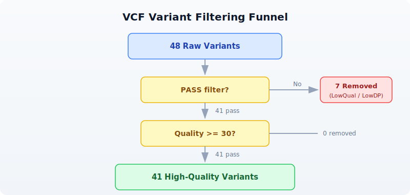

# Day 12: Finding Variants in Genomes

| | |
|---|---|
| **Difficulty** | Intermediate |
| **Biology knowledge** | Intermediate (variant types, Ts/Tv, ACMG classification) |
| **Coding knowledge** | Intermediate (filtering, pipes, records, functions) |
| **Time** | ~3 hours |
| **Prerequisites** | Days 1-11 completed, BioLang installed (see Appendix A) |
| **Data needed** | Generated by `init.bl` (48-variant VCF file) |
| **Requirements** | None (offline); internet optional for Section 8 VEP annotation |

## What You'll Learn

- How to read and explore VCF files with `read_vcf()`
- How to classify variants by type: SNP, insertion, deletion, MNV
- What the transition/transversion ratio means and why it matters
- How to filter variants by quality metrics
- How to annotate variants using Ensembl VEP
- The basics of clinical variant interpretation (ACMG/AMP framework)

---

## The Problem

A clinical sequencing lab returns a VCF file with 4 million variants. Your patient's diagnosis depends on finding the 1--3 variants that actually cause disease. Filtering 4 million down to a handful requires understanding variant types, quality metrics, population frequencies, and clinical databases.

Today you will build the tools and intuition for this process --- from loading raw VCF files to classifying, filtering, and annotating variants. The dataset is small (48 variants) so you can see every step clearly, but the techniques scale to millions of variants.

---

## What Are Variants?

A **variant** is any position where a genome differs from the reference sequence. Variants come in several types:

```
Reference:  ...A T C G A T C G A T C G...
                        *
SNP:        ...A T C G A T T G A T C G...    (C -> T at one position)

Reference:  ...A T C G A - - T C G A T C G...
Insertion:  ...A T C G A A A T C G A T C G...  (AA inserted)

Reference:  ...A T C G A T C G A T C G...
Deletion:   ...A T C G - - - G A T C G...    (ATC deleted)

Reference:  ...A T C G A T C G A T C G...
MNV:        ...A T C G T T C G A T C G...    (AT -> TT, multi-nucleotide)
```

- **SNP** (Single Nucleotide Polymorphism): one base changed. The most common variant type.
- **Insertion**: bases added that are not in the reference.
- **Deletion**: bases present in the reference are missing.
- **MNV** (Multi-Nucleotide Variant): multiple adjacent bases changed simultaneously.

Insertions and deletions are collectively called **indels**. They are harder to detect accurately than SNPs because they shift the reading frame of the sequencer's alignment.

---

## Reading and Exploring VCF Files

VCF (Variant Call Format) is the standard file format for storing variant data. Each row describes one variant: its chromosome, position, reference allele, alternate allele, quality score, and filter status.

> **Requires CLI:** This example uses file I/O / network APIs not available in the browser. Run with `bl run`.

```bio
# requires: data/variants.vcf in working directory (run init.bl first)
let variants = read_vcf("data/variants.vcf")
println(f"Total variants: {len(variants)}")
```

Expected output:

```
Total variants: 48
```

`read_vcf()` returns a list of **Variant** values. Each variant has properties you can access with dot notation:

```bio
let v = first(variants)
println(f"Chrom: {v.chrom}")
println(f"Position: {v.pos}")
println(f"ID: {v.id}")
println(f"Ref: {v.ref}, Alt: {v.alt}")
println(f"Quality: {v.qual}")
println(f"Filter: {v.filter}")
```

Expected output:

```
Chrom: chr1
Position: 14907
ID: rs6682375
Ref: A, Alt: G
Quality: 45.3
Filter: PASS
```

The key fields are:

| Field | Meaning |
|-------|---------|
| `chrom` | Chromosome name |
| `pos` | 1-based position on the chromosome |
| `id` | Variant identifier (e.g. rs number from dbSNP), or `.` if unknown |
| `ref` | Reference allele (what the reference genome has) |
| `alt` | Alternate allele (what this sample has instead) |
| `qual` | Phred-scaled quality score (higher = more confident) |
| `filter` | `PASS` if the variant passed all quality filters, otherwise the filter name |

---

## Variant Classification

BioLang's Variant values have built-in properties for classification. You do not need to write your own classification function --- the runtime does it for you:

```bio
let v = first(variants)
println(f"Type: {v.variant_type}")    # "Snp", "Indel", "Mnp", or "Other"
println(f"Is SNP? {v.is_snp}")        # true or false
println(f"Is indel? {v.is_indel}")    # true or false
```

Expected output:

```
Type: Snp
Is SNP? true
Is indel? false
```

Use these properties with `filter()` to separate variants by type:

```bio
let snps = variants |> filter(|v| v.is_snp) |> collect()
let indels = variants |> filter(|v| v.is_indel) |> collect()
println(f"SNPs: {len(snps)}")
println(f"Indels: {len(indels)}")
```

Expected output:

```
SNPs: 38
Indels: 10
```

You can also inspect individual variants with their type:

```bio
let first_ten = variants |> take(10) |> map(|v| {
    chrom: v.chrom, pos: v.pos,
    ref: v.ref, alt: v.alt,
    type: v.variant_type
})
for item in first_ten {
    println(f"  {item.chrom}:{item.pos} {item.ref}>{item.alt} ({item.type})")
}
```

Expected output:

```
  chr1:14907 A>G (Snp)
  chr1:69511 A>G (Snp)
  chr1:817186 G>A (Snp)
  chr1:949654 C>T (Snp)
  chr1:984971 G>A (Snp)
  chr1:1018704 T>C (Snp)
  chr1:1110294 G>A (Snp)
  chr1:1234567 ATG>A (Indel)
  chr1:1567890 C>CTAG (Indel)
  chr1:2045678 A>T (Snp)
```

---

## Transition/Transversion Ratio

Not all SNPs are equally likely. There are two categories:

- **Transitions (Ts)**: purine-to-purine or pyrimidine-to-pyrimidine changes. A&harr;G and C&harr;T. These are chemically more likely because the molecular shape is similar.
- **Transversions (Tv)**: purine-to-pyrimidine or vice versa. A&harr;C, A&harr;T, G&harr;C, G&harr;T. These require a bigger structural change.

```
         Transitions (Ts)
     A  <===============>  G       (purines)

     C  <===============>  T       (pyrimidines)

         Transversions (Tv)
     A  <------>  C     A  <------>  T
     G  <------>  C     G  <------>  T
```

Because transitions are chemically favored, the expected Ts/Tv ratio for real biological variants is approximately **2.0--2.1** for whole-genome sequencing. A significantly lower ratio (say, 1.0) suggests many false-positive variant calls --- the errors are random and equally likely to be transitions or transversions.

BioLang computes this in one call:

```bio
let ratio = tstv_ratio(variants)
println(f"Ts/Tv ratio: {round(ratio, 2)}")
```

Expected output:

```
Ts/Tv ratio: 1.92
```

You can also use the per-variant properties to count manually:

```bio
let ts_count = variants |> filter(|v| v.is_snp and v.is_transition) |> count()
let tv_count = variants |> filter(|v| v.is_snp and v.is_transversion) |> count()
println(f"Transitions: {ts_count}")
println(f"Transversions: {tv_count}")
```

Expected output:

```
Transitions: 25
Transversions: 13
```

The `.is_transition` and `.is_transversion` properties are only meaningful for SNPs. For indels and MNVs, both return `false`.

---

## Quality Filtering

Raw variant calls contain many false positives. The first step in any analysis is filtering. A typical filtering cascade:



In BioLang:

```bio
# Filter by PASS status
let passed = variants |> filter(|v| v.filter == "PASS") |> collect()
println(f"PASS variants: {len(passed)} / {len(variants)}")

# Add quality threshold
let high_quality = variants
    |> filter(|v| v.filter == "PASS")
    |> filter(|v| v.qual >= 30)
    |> collect()
println(f"PASS + quality >= 30: {len(high_quality)}")
```

Expected output:

```
PASS variants: 41 / 48
PASS + quality >= 30: 41
```

It is informative to examine what was filtered out:

```bio
let low_qual = variants |> filter(|v| v.filter != "PASS") |> collect()
println(f"Filtered out (non-PASS): {len(low_qual)}")
for lq in low_qual {
    println(f"  {lq.chrom}:{lq.pos} {lq.ref}>{lq.alt} qual={lq.qual} filter={lq.filter}")
}
```

Expected output:

```
Filtered out (non-PASS): 7
  chr1:984971 G>A qual=12.5 filter=LowQual
  chr1:2045678 A>T qual=8.1 filter=LowQual
  chr2:6123456 T>C qual=15.2 filter=LowDP
  chr3:4567890 T>A qual=10.4 filter=LowQual
  chr7:5678901 A>C qual=9.7 filter=LowQual
  chr11:5678901 G>T qual=14.3 filter=LowDP
  chrX:5678901 C>A qual=11.8 filter=LowQual
```

Notice that the filtered variants have low quality scores (all under 16) and were flagged as either `LowQual` (low confidence) or `LowDP` (low read depth). These are exactly the variants you want to remove --- they are likely sequencing errors, not real biological variation.

---

## Variant Summary and Statistics

For a quick overview, `variant_summary()` computes all key statistics in one call:

```bio
let summary = variant_summary(variants)
println(f"Total alleles: {summary.total}")
println(f"  SNPs: {summary.snp}")
println(f"  Indels: {summary.indel}")
println(f"  MNPs: {summary.mnp}")
println(f"  Transitions: {summary.transitions}")
println(f"  Transversions: {summary.transversions}")
println(f"  Ts/Tv ratio: {round(summary.ts_tv_ratio, 2)}")
println(f"  Multiallelic: {summary.multiallelic}")
```

Expected output:

```
Total alleles: 48
  SNPs: 38
  Indels: 10
  MNPs: 0
  Transitions: 25
  Transversions: 13
  Ts/Tv ratio: 1.92
  Multiallelic: 0
```

The **het/hom ratio** measures the balance between heterozygous calls (one copy of the variant) and homozygous-alternate calls (both copies). For a diploid organism like humans, the expected ratio is roughly 1.5--2.0.

```bio
let hh_ratio = het_hom_ratio(variants)
println(f"Het/Hom ratio: {round(hh_ratio, 2)}")

let het_count = variants |> filter(|v| v.is_het) |> count()
let hom_count = variants |> filter(|v| v.is_hom_alt) |> count()
println(f"Heterozygous: {het_count}")
println(f"Homozygous alt: {hom_count}")
```

Expected output:

```
Het/Hom ratio: 4.33
Heterozygous: 39
Homozygous alt: 9
```

Our small test dataset has a higher-than-expected het/hom ratio because we deliberately included more heterozygous variants. In a real whole-genome dataset, this ratio is a useful quality indicator --- an abnormally high or low ratio may indicate contamination or incorrect variant calling.

---

## Chromosome Distribution

Knowing how variants are distributed across chromosomes helps spot problems. An unexpected spike on one chromosome might indicate a copy number variant or a systematic alignment issue.

```bio
let by_chrom = variants
    |> map(|v| {chrom: v.chrom, type: v.variant_type})
    |> to_table()
    |> group_by("chrom")
    |> summarize(|chrom, rows| {chrom: chrom, count: len(rows)})
println(by_chrom)
```

Expected output:

```
chrom | count
chr1  | 10
chr11 | 5
chr17 | 5
chr2  | 7
chr3  | 6
chr5  | 5
chr7  | 5
chrX  | 5
```

In a real dataset, the variant count would be roughly proportional to chromosome length. Chromosome 1 (the longest) would have the most variants, and chromosome 21 (the shortest autosome) would have the fewest.

---

## Variant Annotation with Ensembl VEP

Knowing that a variant exists is only the first step. To understand its biological significance, you need to **annotate** it: determine which gene it falls in, what effect it has on the protein, and whether it has been seen before in clinical databases.

The Ensembl Variant Effect Predictor (VEP) does this. BioLang wraps the Ensembl REST API in a single function call:

> **Requires CLI:** This example uses file I/O / network APIs not available in the browser. Run with `bl run`.

```bio
# requires: internet connection
let annotation = ensembl_vep("17:7577120:G:A")
let result = first(annotation)
println(f"Allele string: {result.allele_string}")
println(f"Most severe consequence: {result.most_severe_consequence}")

let tcs = result.transcript_consequences
if len(tcs) > 0 {
    let tc = first(tcs)
    println(f"Gene: {tc.gene_id}")
    println(f"Impact: {tc.impact}")
    println(f"Consequences: {tc.consequences}")
}
```

The `ensembl_vep()` function takes a string in the format `"chrom:pos:ref:alt"` and returns a list of annotation results. Each result contains:

| Field | Meaning |
|-------|---------|
| `allele_string` | The ref/alt alleles |
| `most_severe_consequence` | The worst predicted effect (e.g., `missense_variant`) |
| `transcript_consequences` | Per-transcript details with gene ID, impact, and consequence terms |

VEP classifies consequences by severity. From most to least severe:

| Impact | Examples |
|--------|----------|
| HIGH | frameshift, stop_gained, splice_donor |
| MODERATE | missense_variant, inframe_deletion |
| LOW | synonymous_variant, splice_region |
| MODIFIER | intron_variant, upstream_gene_variant |

For batch annotation, wrap the call in `try/catch` to handle network errors gracefully:

```bio
let annotated = variants |> take(5) |> map(|v| {
    chrom: v.chrom, pos: v.pos, ref: v.ref, alt: v.alt,
    annotation: try { ensembl_vep(f"{v.chrom}:{v.pos}:{v.ref}:{v.alt}") } catch e { nil }
})
```

> **Note**: The Ensembl REST API has rate limits (15 requests per second without an API key). For large-scale annotation, use the standalone VEP command-line tool instead.

---

## Clinical Variant Interpretation

Finding and annotating variants is a technical problem. Interpreting their clinical significance is a medical one. The standard framework is the **ACMG/AMP guidelines** (American College of Medical Genetics / Association for Molecular Pathology), which classify variants into five tiers:

| Classification | Meaning |
|---------------|---------|
| **Pathogenic** | Causes disease. Strong evidence from multiple sources. |
| **Likely pathogenic** | Probably causes disease. High confidence but not conclusive. |
| **Variant of uncertain significance (VUS)** | Not enough evidence to classify. The most frustrating category. |
| **Likely benign** | Probably does not cause disease. |
| **Benign** | Does not cause disease. Common in the population. |

The classification uses several types of evidence:

- **Population frequency**: If a variant is common in healthy populations (e.g., >1% in gnomAD), it is unlikely to cause rare disease.
- **Computational predictions**: Tools like SIFT, PolyPhen-2, and CADD predict whether a protein change is damaging.
- **Functional data**: Laboratory experiments showing the variant disrupts protein function.
- **Segregation**: Whether the variant co-occurs with disease in families.
- **Clinical databases**: ClinVar aggregates clinical interpretations from laboratories worldwide.

> **Important**: Clinical variant interpretation requires specialized training. The code in this chapter teaches the computational steps --- reading VCF files, filtering, and annotating --- but the medical interpretation of results should always involve a trained clinical geneticist or genetic counselor.

---

## Complete Variant Analysis Pipeline

Here is the full pipeline, from raw VCF to classified, filtered results:

> **Requires CLI:** This example uses file I/O / network APIs not available in the browser. Run with `bl run`.

```bio
# Complete Variant Analysis Pipeline
# requires: data/variants.vcf in working directory

println("=== Variant Analysis Pipeline ===\n")

# Step 1: Load
let variants = read_vcf("data/variants.vcf")
println(f"1. Total variants: {len(variants)}")

# Step 2: Quality filtering
let passed = variants
    |> filter(|v| v.filter == "PASS")
    |> filter(|v| v.qual >= 30)
    |> collect()
println(f"2. After filtering: {len(passed)} variants")

# Step 3: Classify
let snps = passed |> filter(|v| v.is_snp) |> count()
let indels = passed |> filter(|v| v.is_indel) |> count()
println(f"3. SNPs: {snps}, Indels: {indels}")

# Step 4: Ts/Tv ratio
let ratio = tstv_ratio(passed)
println(f"4. Ts/Tv ratio: {round(ratio, 2)}")

# Step 5: Chromosome distribution
let by_chrom = passed
    |> map(|v| {chrom: v.chrom, type: v.variant_type})
    |> to_table()
    |> group_by("chrom")
    |> summarize(|chrom, rows| {chrom: chrom, count: len(rows)})
println(f"\n5. Variants per chromosome:")
println(by_chrom)

# Step 6: Export
let results = passed |> map(|v| {
    chrom: v.chrom, pos: v.pos, id: v.id,
    ref: v.ref, alt: v.alt,
    qual: v.qual, type: v.variant_type
}) |> to_table()
write_csv(results, "results/classified_variants.csv")
println(f"\n6. Results saved to results/classified_variants.csv")
println("\n=== Pipeline complete ===")
```

Expected output:

```
=== Variant Analysis Pipeline ===

1. Total variants: 48
2. After filtering: 41 variants
3. SNPs: 31, Indels: 10
4. Ts/Tv ratio: 1.92

5. Variants per chromosome:
chrom | count
chr1  | 8
chr11 | 4
chr17 | 5
chr2  | 6
chr3  | 5
chr5  | 5
chr7  | 4
chrX  | 4

6. Results saved to results/classified_variants.csv

=== Pipeline complete ===
```

This pipeline reduces 48 raw variants to 41 high-confidence calls, classifies them, checks the quality metric (Ts/Tv near 2.0 --- good), and exports the results. In a clinical setting, the next steps would be frequency filtering (against gnomAD), functional annotation (VEP), and manual review of candidates.

---

## Exercises

1. **SNP-to-indel ratio**: Load the VCF file and calculate the ratio of SNPs to indels. A typical whole-genome ratio is about 10:1. How does our test data compare?

2. **Classify transitions and transversions**: Write a function that takes a variant and returns `"transition"` or `"transversion"` (or `"not_snp"` for indels). Apply it to all variants and print the counts.

3. **Region filter**: Filter variants to chromosome `chr17` between positions 7,500,000 and 42,000,000. This spans the TP53 and BRCA1 genes. How many variants fall in this region?

4. **VEP annotation**: Annotate 5 variants from your VCF using `ensembl_vep()` and print the predicted consequence for each. Which has the highest impact?

5. **Summary report**: Build a report that shows: total variants, variants per chromosome, SNP/indel counts, Ts/Tv ratio, and het/hom ratio. Export it as a CSV table.

---

## Key Takeaways

- **Variants** are differences from the reference genome: SNPs, insertions, deletions, and multi-nucleotide variants.
- **Quality filtering** is the first step in any variant analysis --- remove low-confidence calls before doing anything else.
- The **Ts/Tv ratio** (~2.0 for whole genome) is a quick quality check for your variant calls.
- **VEP annotation** predicts the biological effect of each variant, from benign intronic changes to damaging frameshift mutations.
- **Clinical interpretation** follows the ACMG/AMP framework and requires domain expertise --- code can filter and annotate, but a human expert interprets.
- The goal of variant analysis: start with millions of raw calls, filter down to the few that matter for your biological question.

---

## What's Next

Week 3 starts tomorrow with **Day 13: Gene Expression and RNA-seq**. You will move from DNA variants to measuring which genes are active --- how much RNA each gene produces, and how expression changes between conditions. This is the foundation of transcriptomics and differential expression analysis.
