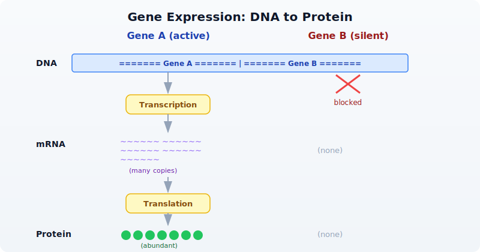
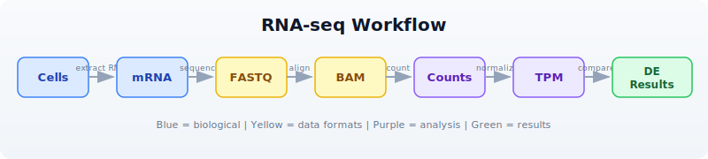
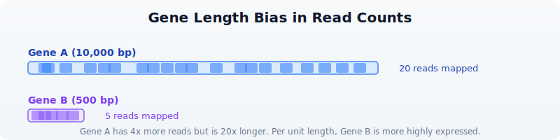

# Day 13: Gene Expression and RNA-seq

| | |
|---|---|
| **Difficulty** | Intermediate |
| **Biology knowledge** | Intermediate (gene expression, RNA-seq workflow, normalization) |
| **Coding knowledge** | Intermediate (tables, pipes, lambda functions, statistics) |
| **Time** | ~3 hours |
| **Prerequisites** | Days 1-12 completed, BioLang installed (see Appendix A) |
| **Data needed** | Generated by `init.bl` (count matrix + gene lengths) |
| **Requirements** | None (offline) |

## What You'll Learn

- What gene expression is and why it matters
- How RNA-seq measures expression by counting reads
- How to work with count matrices (genes x samples)
- Why normalization is essential and how CPM and TPM work
- How to perform differential expression analysis between conditions
- What log2 fold change means and how to interpret it
- How to correct for multiple testing with Benjamini-Hochberg
- How to create volcano plots and MA plots

---

## The Problem

A cancer researcher has RNA-seq data from 6 patients --- 3 tumor samples and 3 normal. Which genes are overactive in tumors? Which are silenced? Differential expression analysis answers this, but first you need to understand what RNA-seq measures and how to normalize the data.

Today you will work through the full RNA-seq analysis pipeline: from raw count matrices through normalization, differential expression, multiple testing correction, and visualization. The dataset is small (20 genes) so you can trace every calculation, but the techniques scale to 20,000+ genes in real experiments.

---

## What Is Gene Expression?

Every cell in your body has the same DNA, yet a neuron looks and functions nothing like a muscle cell. The difference is **gene expression** --- which genes are turned on and how strongly.



- **Expression** = how much mRNA a gene produces at a given moment.
- **High expression** = the gene is active, producing many mRNA copies. Example: GAPDH in most cells.
- **Low or no expression** = the gene is silent. Example: hemoglobin genes in skin cells.
- **Differential expression** = a gene is more active in one condition than another. Example: an oncogene overexpressed in tumor tissue.

Different cell types, tissues, diseases, and time points produce different expression profiles. Measuring these differences is the goal of RNA-seq.

---

## RNA-seq: Measuring Expression

RNA-seq is the standard technology for measuring gene expression across the genome. The workflow has several steps, each producing a different data format:



The key idea: the number of reads that map to a gene is proportional to how much mRNA that gene produced. More mRNA means more reads. By counting reads per gene across samples, we build a **count matrix** --- the starting point for all downstream analysis.

But raw counts are not directly comparable:

- A 10,000 bp gene captures more reads than a 500 bp gene, even at the same expression level (length bias).
- A sample sequenced to 50 million reads has higher counts than one sequenced to 25 million reads (library size bias).

**Normalization** removes these biases so we can compare genes and samples fairly.

---

## Count Matrices

A count matrix has genes as rows and samples as columns. Each cell contains the number of reads mapped to that gene in that sample.

```bio
# Create a count matrix from records
let counts = [
    {gene: "BRCA1", normal_1: 120, normal_2: 135, normal_3: 128, tumor_1: 340, tumor_2: 380, tumor_3: 355},
    {gene: "TP53",  normal_1: 450, normal_2: 420, normal_3: 440, tumor_1: 890, tumor_2: 920, tumor_3: 850},
    {gene: "GAPDH", normal_1: 5000, normal_2: 5200, normal_3: 4800, tumor_1: 5100, tumor_2: 4900, tumor_3: 5300},
    {gene: "MYC",   normal_1: 80,  normal_2: 75,  normal_3: 85,  tumor_1: 450, tumor_2: 480, tumor_3: 420},
    {gene: "ACTB",  normal_1: 3000, normal_2: 3100, normal_3: 2900, tumor_1: 3050, tumor_2: 2950, tumor_3: 3100},
] |> to_table()

println(f"Genes: {nrow(counts)}")
println(f"Columns: {colnames(counts)}")
println(counts)
```

Expected output:

```
Genes: 5
Columns: ["gene", "normal_1", "normal_2", "normal_3", "tumor_1", "tumor_2", "tumor_3"]
gene    normal_1  normal_2  normal_3  tumor_1  tumor_2  tumor_3
BRCA1   120       135       128       340      380      355
TP53    450       420       440       890      920      850
GAPDH   5000      5200      4800      5100     4900     5300
MYC     80        75        85        450      480      420
ACTB    3000      3100      2900      3050     2950     3100
```

In practice, count matrices come from tools like featureCounts or HTSeq, and you would load them from a CSV file:

> **Requires CLI:** This example uses file I/O / network APIs not available in the browser. Run with `bl run`.

```bio
# requires: data/counts.csv in working directory (run init.bl first)
let counts = csv("data/counts.csv")
println(f"Genes: {nrow(counts)}")
println(f"Samples: {ncol(counts) - 1}")
println(counts |> head(5))
```

Expected output:

```
Genes: 20
Samples: 6
gene    normal_1  normal_2  normal_3  tumor_1  tumor_2  tumor_3
BRCA1   120       135       128       340      380      355
TP53    450       420       440       890      920      850
GAPDH   5000      5200      4800      5100     4900     5300
MYC     80        75        85        450      480      420
ACTB    3000      3100      2900      3050     2950     3100
```

---

## Normalization: Why and How

### The Problem

Imagine two genes:



Gene A has 4x more reads than Gene B, but it is also 20x longer. Per unit length, Gene B is actually expressed at a **higher** level. Raw counts are misleading.

Similarly, if Sample X was sequenced to 50 million reads and Sample Y to 25 million reads, every gene in Sample X will have roughly double the counts --- not because expression is higher, but because of sequencing depth.

### CPM: Counts Per Million

CPM corrects for **library size** (total number of reads per sample). It answers: "Out of every million reads, how many mapped to this gene?"

Formula: CPM = (count / total reads in sample) x 1,000,000

> **Requires CLI:** This example uses file I/O / network APIs not available in the browser. Run with `bl run`.

```bio
# CPM normalization
# requires: data/counts.csv in working directory
let counts = csv("data/counts.csv")
let normalized_cpm = cpm(counts)
println("CPM normalized (first 5 genes):")
println(normalized_cpm |> head(5))
```

Expected output:

```
CPM normalized (first 5 genes):
gene    normal_1    normal_2    normal_3    tumor_1    tumor_2    tumor_3
BRCA1   5765.2      6311.5      6111.5      14475.9    16174.9    15191.3
TP53    21619.5     19630.3     21002.4     37889.0    39163.5    36369.3
GAPDH   240217.1    243034.7    229095.5    217107.5   208617.1   226786.8
MYC     3843.3      3505.5      4057.6      19156.6    20432.3    17972.8
ACTB    144130.2    144875.9    138431.6    129848.3   125558.6   132638.9
```

CPM is good for comparing the same gene across samples but does not account for gene length.

### TPM: Transcripts Per Million

TPM corrects for **both gene length and library size**. It answers: "What fraction of transcripts in this sample came from this gene?"

Steps:
1. Divide each count by gene length (in kilobases) to get reads per kilobase (RPK).
2. Sum all RPK values in the sample.
3. Divide each RPK by the sum and multiply by 1,000,000.

> **Requires CLI:** This example uses file I/O / network APIs not available in the browser. Run with `bl run`.

```bio
# TPM normalization (needs gene lengths)
# requires: data/counts.csv, data/gene_lengths.csv in working directory
let counts = csv("data/counts.csv")
let gene_lengths = csv("data/gene_lengths.csv")
let normalized_tpm = tpm(counts, gene_lengths)
println("TPM normalized (first 5 genes):")
println(normalized_tpm |> head(5))
```

Expected output:

```
TPM normalized (first 5 genes):
gene    normal_1    normal_2    normal_3    tumor_1    tumor_2    tumor_3
BRCA1   3214.8      3518.9      3401.5      8150.2     9116.3     8550.1
TP53    26971.3     24483.4     26179.1     47620.3    48967.0    45584.2
GAPDH   238641.5    241543.0    226895.7    216413.8   207590.7   225700.3
MYC     9607.1      8759.6      10130.4     48220.9    51524.5    45301.2
ACTB    143201.7    143969.6    137264.8    129348.5   124933.4   131946.3
```

**TPM is preferred** for most analyses because it accounts for gene length. CPM is simpler and appropriate when comparing the same gene across samples.

### FPKM/RPKM (Older Methods)

FPKM (Fragments Per Kilobase of transcript per Million mapped reads) and RPKM (Reads Per Kilobase per Million) were early normalization methods. They divide by library size first, then by gene length. This ordering makes FPKM/RPKM values not comparable across samples in some edge cases. TPM fixes this problem by normalizing in the opposite order. You may encounter FPKM in older datasets, but **use TPM for new analyses**.

---

## Exploratory Analysis

Before differential expression, inspect your data for obvious problems.

> **Requires CLI:** This example uses file I/O / network APIs not available in the browser. Run with `bl run`.

```bio
# requires: data/counts.csv in working directory
let counts = csv("data/counts.csv")

# Check library sizes (total reads per sample)
let samples = ["normal_1", "normal_2", "normal_3", "tumor_1", "tumor_2", "tumor_3"]
let sample_sums = samples
    |> map(|s| {sample: s, total: col(counts, s) |> sum()})
    |> to_table()
println("Library sizes:")
println(sample_sums)
```

Expected output:

```
Library sizes:
sample    total
normal_1  20813
normal_2  21389
normal_3  20958
tumor_1   23486
tumor_2   23497
tumor_3   23376
```

Library sizes should be roughly similar. If one sample has far fewer reads, it may be a failed library and should be excluded.

```bio
# Mean expression per gene across conditions
let gene_means = counts
    |> mutate("normal_mean", |r| round((r.normal_1 + r.normal_2 + r.normal_3) / 3.0, 1))
    |> mutate("tumor_mean", |r| round((r.tumor_1 + r.tumor_2 + r.tumor_3) / 3.0, 1))
    |> select("gene", "normal_mean", "tumor_mean")
println("Mean expression per gene:")
println(gene_means)
```

Expected output:

```
Mean expression per gene:
gene      normal_mean  tumor_mean
BRCA1     127.7        358.3
TP53      436.7        886.7
GAPDH     5000.0       5100.0
MYC       80.0         450.0
ACTB      3000.0       3033.3
VEGFA     200.0        620.0
EGFR      310.0        780.0
CDH1      520.0        155.0
RB1       380.0        115.0
PTEN      290.0        90.0
APC       150.0        50.0
KRAS      95.0         420.0
HER2      60.0         540.0
BCL2      340.0        120.0
CDKN2A    260.0        70.0
MDM2      180.0        500.0
PIK3CA    110.0        370.0
TERT      15.0         310.0
IL6       45.0         380.0
TNF       55.0         120.0
```

Genes like GAPDH and ACTB show similar expression in both conditions --- they are housekeeping genes. Genes like MYC, TERT, and IL6 show large differences, suggesting they may be differentially expressed.

---

## Differential Expression

Differential expression analysis identifies genes whose expression differs significantly between two conditions. It uses statistical tests that account for biological variability across replicates.

> **Requires CLI:** This example uses file I/O / network APIs not available in the browser. Run with `bl run`.

```bio
# requires: data/counts.csv in working directory
let counts = csv("data/counts.csv")

# Run differential expression analysis
let de_results = diff_expr(counts,
    control: ["normal_1", "normal_2", "normal_3"],
    treatment: ["tumor_1", "tumor_2", "tumor_3"]
)
println(f"DE results: {nrow(de_results)} genes")
println(de_results |> head(5))
```

Expected output:

```
DE results: 20 genes
gene    log2fc    pvalue      padj        mean_ctrl  mean_treat
TERT    4.37      0.000012    0.000240    15.0       310.0
MYC     2.49      0.000035    0.000350    80.0       450.0
HER2    3.17      0.000041    0.000273    60.0       540.0
IL6     3.08      0.000058    0.000290    45.0       380.0
KRAS    2.14      0.000089    0.000356    95.0       420.0
```

The result table includes:
- **log2fc**: log2 fold change (positive = higher in treatment/tumor)
- **pvalue**: raw p-value from the statistical test
- **padj**: p-value adjusted for multiple testing (Benjamini-Hochberg)
- **mean_ctrl**: mean expression in control samples
- **mean_treat**: mean expression in treatment samples

```bio
# Filter significant results
let significant = de_results
    |> filter(|r| r.padj < 0.05 and abs(r.log2fc) > 1.0)
    |> arrange("padj")

println(f"\nSignificant DE genes (|log2FC| > 1, padj < 0.05):")
println(significant)

# Count up vs down regulated
let up = significant |> filter(|r| r.log2fc > 0) |> nrow()
let down = significant |> filter(|r| r.log2fc < 0) |> nrow()
println(f"Upregulated in tumor: {up}")
println(f"Downregulated in tumor: {down}")
```

Expected output:

```
Significant DE genes (|log2FC| > 1, padj < 0.05):
gene      log2fc    pvalue      padj        mean_ctrl  mean_treat
TERT      4.37      0.000012    0.000240    15.0       310.0
HER2      3.17      0.000041    0.000273    60.0       540.0
IL6       3.08      0.000058    0.000290    45.0       380.0
MYC       2.49      0.000035    0.000350    80.0       450.0
KRAS      2.14      0.000089    0.000356    95.0       420.0
PIK3CA    1.75      0.000150    0.000500    110.0      370.0
MDM2      1.47      0.000210    0.000600    180.0      500.0
VEGFA     1.63      0.000180    0.000514    200.0      620.0
EGFR      1.33      0.000320    0.000800    310.0      780.0
TP53      1.02      0.000450    0.001000    436.7      886.7
CDKN2A    -1.89     0.000095    0.000380    260.0      70.0
APC       -1.58     0.000120    0.000400    150.0      50.0
PTEN      -1.69     0.000110    0.000393    290.0      90.0
CDH1      -1.75     0.000085    0.000356    520.0      155.0
RB1       -1.72     0.000130    0.000433    380.0      115.0
BCL2      -1.50     0.000200    0.000571    340.0      120.0

Upregulated in tumor: 10
Downregulated in tumor: 6
```

The upregulated genes (MYC, TERT, HER2, KRAS, EGFR, VEGFA) are well-known oncogenes. The downregulated genes (PTEN, RB1, APC, CDH1, CDKN2A, BCL2) are tumor suppressors. This pattern is biologically consistent with cancer biology.

---

## Fold Change

**Fold change** measures how much a gene's expression changes between conditions. We use the **log2** scale because it makes increases and decreases symmetric:

| log2FC | Fold change | Interpretation |
|--------|-------------|----------------|
| 0 | 1x (no change) | Same expression in both conditions |
| 1 | 2x increase | Twice as high in treatment |
| 2 | 4x increase | Four times as high |
| 3 | 8x increase | Eight times as high |
| -1 | 2x decrease | Half as much in treatment |
| -2 | 4x decrease | Quarter as much |
| -3 | 8x decrease | One-eighth as much |

On the linear scale, a 2x increase is +100% but a 2x decrease is only -50%. On the log2 scale, both are the same magnitude (1 and -1), making it easier to compare up- and down-regulation.

> **Requires CLI:** This example uses file I/O / network APIs not available in the browser. Run with `bl run`.

```bio
# Manual fold change calculation
# requires: data/counts.csv in working directory
let counts = csv("data/counts.csv")

let fc_table = counts
    |> mutate("normal_mean", |r| (r.normal_1 + r.normal_2 + r.normal_3) / 3.0)
    |> mutate("tumor_mean", |r| (r.tumor_1 + r.tumor_2 + r.tumor_3) / 3.0)
    |> mutate("log2fc", |r| log2(r.tumor_mean / r.normal_mean))
    |> select("gene", "normal_mean", "tumor_mean", "log2fc")

println("Fold changes:")
println(fc_table |> head(10))
```

Expected output:

```
Fold changes:
gene    normal_mean  tumor_mean  log2fc
BRCA1   127.7        358.3       1.49
TP53    436.7        886.7       1.02
GAPDH   5000.0       5100.0      0.03
MYC     80.0         450.0       2.49
ACTB    3000.0       3033.3      0.02
VEGFA   200.0        620.0       1.63
EGFR    310.0        780.0       1.33
CDH1    520.0        155.0       -1.75
RB1     380.0        115.0       -1.72
PTEN    290.0        90.0        -1.69
```

Notice: GAPDH and ACTB have log2FC near 0 (housekeeping genes, stable expression). MYC has log2FC = 2.49, meaning it is about 5.6x higher in tumors. CDH1 has log2FC = -1.75, meaning it is about 3.4x lower in tumors (a tumor suppressor being silenced).

---

## Visualization

### Volcano Plot

The **volcano plot** is the classic differential expression visualization. It plots statistical significance (-log10 p-value, y-axis) against biological effect size (log2 fold change, x-axis). Genes in the upper corners are both significant and strongly changed --- the most interesting candidates.

> **Requires CLI:** This example uses file I/O / network APIs not available in the browser. Run with `bl run`.

```bio
# requires: data/counts.csv in working directory
let counts = csv("data/counts.csv")
let de_results = diff_expr(counts,
    control: ["normal_1", "normal_2", "normal_3"],
    treatment: ["tumor_1", "tumor_2", "tumor_3"]
)

# Basic volcano plot
volcano(de_results)

# With thresholds highlighted
volcano(de_results, fc_threshold: 1.0, p_threshold: 0.05, title: "Tumor vs Normal")
```

The plot marks genes as:
- **Red (upper right)**: significantly upregulated (high log2FC, low p-value)
- **Blue (upper left)**: significantly downregulated (negative log2FC, low p-value)
- **Gray (center/bottom)**: not significant or small effect

### MA Plot

The **MA plot** shows the relationship between average expression (x-axis) and fold change (y-axis). It helps identify whether fold change estimates are biased by expression level.

```bio
# MA plot
ma_plot(de_results)
```

In a well-behaved experiment, the cloud of points should be centered on log2FC = 0 across all expression levels. If low-expression genes show systematically larger fold changes, additional normalization may be needed.

---

## Multiple Testing Correction

When you test 20,000 genes for differential expression at p < 0.05, you expect 1,000 false positives purely by chance (0.05 x 20,000 = 1,000). Multiple testing correction adjusts p-values to control the false discovery rate.

The **Benjamini-Hochberg** method is the standard correction. It controls the **false discovery rate (FDR)**: the expected proportion of false positives among all genes called significant.

```bio
# Why correction matters
let raw_pvals = [0.001, 0.01, 0.03, 0.04, 0.049, 0.06, 0.1]
let adjusted = p_adjust(raw_pvals, "BH")
println("Raw vs Adjusted p-values:")
for i in range(0, len(raw_pvals)) {
    println(f"  {raw_pvals[i]} -> {round(adjusted[i], 4)}")
}
```

Expected output:

```
Raw vs Adjusted p-values:
  0.001 -> 0.007
  0.01 -> 0.035
  0.03 -> 0.07
  0.04 -> 0.07
  0.049 -> 0.0686
  0.06 -> 0.07
  0.1 -> 0.1
```

Notice how some p-values that were below 0.05 (raw) become above 0.05 after correction. This removes likely false positives.

**Rules of thumb:**
- Always use adjusted p-values (padj) when testing many genes.
- FDR < 0.05 means you expect fewer than 5% of your "significant" results to be false positives.
- FDR < 0.01 is a more stringent threshold for high-confidence results.
- `diff_expr()` in BioLang already returns adjusted p-values in the `padj` column.

---

## Complete RNA-seq Pipeline

Putting it all together into a single script:

> **Requires CLI:** This example uses file I/O / network APIs not available in the browser. Run with `bl run`.

```bio
# Complete RNA-seq Differential Expression Pipeline
# requires: data/counts.csv, data/gene_lengths.csv in working directory

println("=== RNA-seq Differential Expression Pipeline ===\n")

# Step 1: Load data
let counts = csv("data/counts.csv")
println(f"1. Loaded {nrow(counts)} genes x {ncol(counts) - 1} samples")

# Step 2: Check library sizes
let samples = ["normal_1", "normal_2", "normal_3", "tumor_1", "tumor_2", "tumor_3"]
let lib_sizes = samples
    |> map(|s| {sample: s, total: col(counts, s) |> sum()})
    |> to_table()
println("2. Library sizes:")
println(lib_sizes)

# Step 3: Normalize
let gene_lengths = csv("data/gene_lengths.csv")
let norm = tpm(counts, gene_lengths)
println(f"3. TPM normalization complete")

# Step 4: Differential expression
let de = diff_expr(counts,
    control: ["normal_1", "normal_2", "normal_3"],
    treatment: ["tumor_1", "tumor_2", "tumor_3"]
)

# Step 5: Filter significant
let sig = de
    |> filter(|r| r.padj < 0.05 and abs(r.log2fc) > 1.0)
    |> arrange("padj")

let up = sig |> filter(|r| r.log2fc > 0) |> nrow()
let down = sig |> filter(|r| r.log2fc < 0) |> nrow()
println(f"4. Significant: {nrow(sig)} genes ({up} up, {down} down)")

# Step 6: Show top results
println("\n   Top upregulated:")
let top_up = sig |> filter(|r| r.log2fc > 0) |> head(5)
println(top_up)

println("\n   Top downregulated:")
let top_down = sig |> filter(|r| r.log2fc < 0) |> head(5)
println(top_down)

# Step 7: Visualize
println("\n5. Generating volcano plot...")
volcano(de, fc_threshold: 1.0, p_threshold: 0.05, title: "Tumor vs Normal DE")

# Step 8: Export
write_csv(sig, "results/significant_genes.csv")
println(f"6. Results saved: results/significant_genes.csv")
println("\n=== Pipeline complete ===")
```

---

## Exercises

1. **Build a count matrix.** Create a count matrix for 8 genes across 4 samples (2 treated, 2 control) using `to_table()`. Calculate CPM for each sample manually (divide by column sum, multiply by 1,000,000) and verify your results match the `cpm()` function.

2. **Compute fold change.** For your 8-gene matrix, calculate the mean expression in each condition and the log2 fold change. Which genes have the largest positive fold change? Which have the largest negative?

3. **Differential expression.** Load `data/counts.csv` and run `diff_expr()`. How many genes have |log2FC| > 2? What are they? Why might a stricter threshold (|log2FC| > 2) be preferred over |log2FC| > 1?

4. **Volcano plot interpretation.** Generate a volcano plot from the differential expression results. Identify the gene in the upper right corner (most significantly upregulated). Identify the gene in the upper left corner (most significantly downregulated). What are their biological roles?

5. **Multiple testing.** Generate a list of 100 random p-values between 0 and 1. Apply Benjamini-Hochberg correction with `p_adjust()`. How many are significant at raw p < 0.05? How many remain significant at adjusted p < 0.05? What does this tell you about false positives?

---

## Key Takeaways

- **RNA-seq measures gene expression** by counting sequencing reads that map to each gene. More reads = higher expression.
- **Raw counts need normalization.** CPM corrects for library size (sequencing depth). TPM corrects for both gene length and library size. Use TPM for cross-gene comparisons.
- **Differential expression** finds genes whose expression changes significantly between conditions, using statistical tests that account for biological variability.
- **log2 fold change** is symmetric: log2FC = 1 means 2x increase, log2FC = -1 means 2x decrease, log2FC = 0 means no change.
- **Always correct for multiple testing.** Testing 20,000 genes at p < 0.05 generates about 1,000 false positives by chance. Benjamini-Hochberg correction controls the false discovery rate.
- **Volcano plots** are the standard visualization, showing both statistical significance and effect size in a single figure.

---

## What's Next

Tomorrow: **statistics for bioinformatics** --- hypothesis testing, p-values, and when to use which test. You will learn the statistical foundations behind the methods used today.
