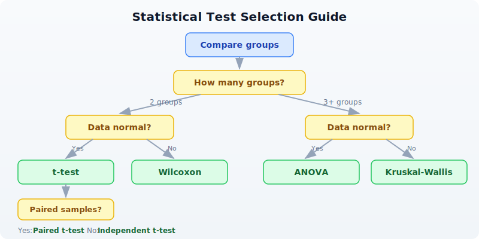

# Day 14: Statistics for Bioinformatics

| | |
|---|---|
| **Difficulty** | Intermediate |
| **Biology knowledge** | Intermediate (experimental design, hypothesis testing concepts) |
| **Coding knowledge** | Intermediate (tables, pipes, lambda functions) |
| **Time** | ~3 hours |
| **Prerequisites** | Days 1-13 completed, BioLang installed (see Appendix A) |
| **Data needed** | Generated by `init.bl` (expression experiment CSV) |
| **Requirements** | None (offline) |

## What You'll Learn

- How to compute descriptive statistics and summarize data before testing
- What p-values actually mean (and what they do not mean)
- How to compare two groups with t-tests (independent, paired, one-sample)
- When to use non-parametric tests like Wilcoxon rank-sum
- How to compare three or more groups with ANOVA
- How to measure correlation (Pearson, Spearman, Kendall)
- How to fit a simple linear regression model
- Why multiple testing correction is critical in genomics
- How to test categorical associations with chi-square and Fisher's exact test
- How to choose the right statistical test for your data

---

## The Problem

Your experiment shows gene X is 2.3x higher in tumor samples. But is that real, or just random noise? With only 3 replicates, how confident can you be? Statistics separates genuine biological signals from experimental noise.

Yesterday you ran a differential expression pipeline that used t-tests, p-values, and FDR correction behind the scenes. Today you will learn how those methods work, when to use each one, and --- just as importantly --- when *not* to use them. Every bioinformatician needs this foundation because nearly every biological conclusion depends on a statistical claim.

---

## Descriptive Statistics First

Before running any test, **look at your data**. Descriptive statistics tell you the shape, center, and spread of your measurements. Skipping this step is one of the most common mistakes in bioinformatics.

```bio
let expression = [5.2, 8.1, 3.4, 6.7, 4.1, 9.3, 7.5, 2.8]

println(f"Mean:     {round(mean(expression), 2)}")
println(f"Median:   {round(median(expression), 2)}")
println(f"Stdev:    {round(stdev(expression), 2)}")
println(f"Variance: {round(variance(expression), 2)}")
println(f"Min:      {min(expression)}")
println(f"Max:      {max(expression)}")
println(f"Range:    {max(expression) - min(expression)}")
println(f"Q25:      {round(quantile(expression, 0.25), 2)}")
println(f"Q75:      {round(quantile(expression, 0.75), 2)}")
```

Expected output:

```
Mean:     5.89
Median:   5.95
Stdev:    2.32
Variance: 5.37
Min:      2.8
Max:      9.3
Range:    6.5
Q25:      3.93
Q75:      7.65
```

**What to look for:**

- **Mean vs median:** If they are far apart, the data may be skewed. Here they are close (5.89 vs 5.95), suggesting roughly symmetric data.
- **Standard deviation:** Gives a sense of how spread out the data is. Here stdev = 2.32 on a mean of 5.89 means moderate variability.
- **Range and quartiles:** Min/max reveal outliers. The interquartile range (Q75 - Q25 = 3.72) captures the middle 50%.

For a table with multiple columns, `describe()` gives a quick overview:

> **Requires CLI:** This example uses file I/O / network APIs not available in the browser. Run with `bl run`.

```bio
let data = csv("data/experiment.csv")
println(describe(data))
```

Expected output:

```
stat      control_1  control_2  control_3  treated_1  treated_2  treated_3
count     15         15         15         15         15         15
mean      48.73      50.73      49.47      64.6       67.47      65.8
stdev     26.29      27.63      26.44      29.68      32.61      30.95
min       8.0        9.0        8.0        14.0       15.0       14.0
q25       28.0       28.0       30.0       41.0       42.0       40.0
median    48.0       50.0       47.0       64.0       67.0       68.0
q75       68.0       74.0       72.0       89.0       93.0       88.0
max       95.0       97.0       93.0       110.0      118.0      115.0
```

Always examine your data before testing. If the mean and median diverge wildly, or the standard deviation is enormous relative to the mean, a t-test may not be appropriate.

---

## P-values: What They Mean (and Don't Mean)

The p-value is the most misunderstood statistic in science. Let us be precise:

> **P-value** = the probability of observing a result this extreme (or more extreme) **if there is no real effect**.

That is it. The p-value answers: "If the null hypothesis were true (no difference, no correlation, no effect), how surprising would my data be?"

**What a p-value is NOT:**

| Common claim | Why it is wrong |
|---|---|
| "P = 0.03 means 97% chance the effect is real" | P-values do not give the probability that the hypothesis is true |
| "P < 0.05 means the result is important" | Statistical significance is not biological significance |
| "P = 0.06 means no effect" | Absence of evidence is not evidence of absence |
| "Smaller p = bigger effect" | P-values mix effect size and sample size |

**The 0.05 threshold** is a convention, not a law of nature. Ronald Fisher suggested it as a rough guide in the 1920s. A result with p = 0.049 is not fundamentally different from p = 0.051.

**Always report effect size alongside p-value.** A drug that lowers blood pressure by 0.1 mmHg might be "statistically significant" with 100,000 patients (tiny p-value) but biologically meaningless. Conversely, a 30% reduction in tumor size might be biologically important even if p = 0.07 with a small pilot study.

In genomics, you will see p-values as small as 10^-50 or smaller. These extreme values arise because the effects are large and the data are abundant, not because the statistics are fundamentally different.

---

## The t-test --- Comparing Two Groups

The t-test is the workhorse of biological statistics. It asks: "Are these two groups drawn from populations with different means?"

### Independent two-sample t-test

Use this when you have two separate groups of subjects:

```bio
# Two-sample t-test: are tumor and normal expression different?
let normal = [5.2, 4.8, 5.1, 4.9, 5.3]
let tumor = [8.1, 7.9, 8.5, 7.6, 8.3]

let result = ttest(normal, tumor)
println(f"t-statistic: {round(result.statistic, 3)}")
println(f"p-value: {result.pvalue}")
println(f"Significant: {result.pvalue < 0.05}")
```

Expected output:

```
t-statistic: -18.908
p-value: 0.0
Significant: true
```

The t-statistic of -18.9 is very large in magnitude, meaning the groups are far apart relative to their variability. The p-value is essentially zero --- these groups are clearly different.

**Assumptions of the t-test:**
1. Data are roughly normally distributed (or sample size > 30)
2. The two groups are independent
3. Variances are similar (BioLang uses Welch's t-test by default, which relaxes this)

### Paired t-test

Use this when you measure the **same subjects** under two conditions:

```bio
# Paired t-test: same patients, before vs after treatment
let before = [10.2, 8.5, 12.1, 9.8, 11.3]
let after = [7.1, 6.2, 8.5, 7.0, 8.8]

let result = ttest_paired(before, after)
println(f"Paired t-test p-value: {result.pvalue}")
```

Expected output:

```
Paired t-test p-value: 0.0001
```

Why paired? Because patient-to-patient variability is removed. Patient 1's "before" and "after" are linked. The test focuses on the *difference within each patient*, not the absolute values.

### One-sample t-test

Use this to test whether a sample's mean differs from a specific value:

```bio
# One-sample t-test: is this different from a known value?
let observed = [2.1, 1.9, 2.3, 2.0, 2.2]
let result = ttest_one(observed, 2.0)
println(f"One-sample p-value: {result.pvalue}")
```

Expected output:

```
One-sample p-value: 0.3739
```

Here p = 0.37, meaning we have no evidence that the mean differs from 2.0. The small deviations (1.9, 2.1, 2.3) are consistent with random noise around 2.0.

---

## When the t-test Doesn't Work: Non-parametric Tests

The t-test assumes your data are approximately normally distributed. Biological data often are not --- think of gene expression counts, survival times, or ranked categories. Non-parametric tests make no distributional assumptions.

```bio
# Wilcoxon rank-sum (Mann-Whitney U): doesn't assume normality
let control = [1.2, 3.5, 2.1, 4.8, 1.5]
let treated = [5.2, 8.1, 6.3, 9.5, 7.2]

let result = wilcoxon(control, treated)
println(f"Wilcoxon p-value: {result.pvalue}")
```

Expected output:

```
Wilcoxon p-value: 0.0079
```

The Wilcoxon test works by ranking all values from both groups combined, then asking whether one group's ranks are systematically higher. It is less powerful than the t-test when data *are* normal, but more reliable when they are not.

**When to use Wilcoxon instead of t-test:**
- Small sample sizes (n < 10 per group)
- Skewed distributions (many small values, few large ones)
- Outliers present
- Ordinal data (rankings, scores)
- When you are unsure whether normality holds

### Decision Guide: Choosing the Right Comparison Test



If you are unsure whether your data are normal, the non-parametric test is the safer choice. You pay a small price in statistical power, but you avoid making a potentially invalid assumption.

---

## ANOVA --- Comparing Multiple Groups

When you have three or more groups, do not run multiple t-tests (control vs low dose, control vs high dose, low vs high). That inflates your false positive rate. ANOVA tests all groups simultaneously.

```bio
# Three treatment groups
let control = [5.0, 4.8, 5.2, 4.9]
let low_dose = [6.5, 7.1, 6.8, 6.3]
let high_dose = [9.2, 8.8, 9.5, 9.0]

let result = anova([control, low_dose, high_dose])
println(f"ANOVA F-statistic: {round(result.statistic, 2)}")
println(f"ANOVA p-value: {result.pvalue}")
```

Expected output:

```
ANOVA F-statistic: 107.29
p-value: 0.0
```

The F-statistic compares the variance *between groups* to the variance *within groups*. A large F means the group means are more spread out than you would expect from within-group variability alone.

**Important:** ANOVA tells you "at least one group differs" but not *which* groups differ. To find out which specific pairs are different, you would follow up with pairwise t-tests (applying multiple testing correction):

```bio
# Follow-up: which pairs differ?
let pairs = [
    {name: "control vs low", result: ttest(control, low_dose)},
    {name: "control vs high", result: ttest(control, high_dose)},
    {name: "low vs high", result: ttest(low_dose, high_dose)},
]

# Collect raw p-values and adjust
let raw_ps = pairs |> map(|p| p.result.pvalue)
let adj_ps = p_adjust(raw_ps, "BH")

for i in range(0, len(pairs)) {
    println(f"  {pairs[i].name}: p = {round(adj_ps[i], 4)}")
}
```

Expected output:

```
  control vs low: p = 0.0001
  control vs high: p = 0.0
  low vs high: p = 0.0
```

All three pairs are significantly different even after correction. The dose-response pattern is clear.

---

## Correlation

Correlation measures the strength and direction of the relationship between two variables. In bioinformatics, you might ask: "Do these two genes tend to go up and down together across samples?"

### Pearson correlation

Measures *linear* relationships. Returns a single number between -1 and +1:

```bio
# Pearson correlation
let gene_a = [2.1, 3.5, 4.2, 5.8, 6.1, 7.3]
let gene_b = [1.8, 3.2, 3.9, 5.5, 6.4, 7.0]

let r = cor(gene_a, gene_b)
println(f"Pearson r: {round(r, 3)}")
```

Expected output:

```
Pearson r: 0.998
```

An r of 0.998 indicates a near-perfect positive linear relationship. As gene A increases, gene B increases proportionally.

**Interpreting correlation coefficients:**

| r value | Interpretation |
|---|---|
| 0.9 to 1.0 | Very strong positive |
| 0.7 to 0.9 | Strong positive |
| 0.4 to 0.7 | Moderate positive |
| 0.0 to 0.4 | Weak or no correlation |
| -0.4 to 0.0 | Weak or no correlation |
| -0.7 to -0.4 | Moderate negative |
| -1.0 to -0.7 | Strong negative |

### Spearman rank correlation

Measures *monotonic* relationships (not necessarily linear). More robust to outliers:

```bio
# Spearman (rank-based, for non-linear relationships)
let rho = spearman(gene_a, gene_b)
println(f"Spearman rho: {round(rho.statistic, 3)}")
println(f"Spearman p-value: {rho.pvalue}")
```

Expected output:

```
Spearman rho: 1.0
Spearman p-value: 0.0
```

Spearman works by converting values to ranks first, then computing Pearson r on the ranks. It detects any monotonic relationship, even if the relationship is curved.

### Kendall tau

Another rank-based measure, often preferred for small sample sizes:

```bio
# Kendall tau
let tau = kendall(gene_a, gene_b)
println(f"Kendall tau: {round(tau.statistic, 3)}")
println(f"Kendall p-value: {tau.pvalue}")
```

Expected output:

```
Kendall tau: 1.0
Kendall p-value: 0.0
```

**Which correlation to use:**
- **Pearson:** When the relationship is linear and data are normally distributed
- **Spearman:** When the relationship might be non-linear, or data have outliers
- **Kendall:** For small samples or when many values are tied

**Warning:** Correlation does not imply causation. Two genes may be correlated because they are both regulated by a third factor, or because they respond to the same environmental condition.

---

## Linear Regression

Regression goes beyond correlation: it builds a predictive model. "If gene A's expression is 5.0, what do we predict gene B's expression to be?"

```bio
# Simple linear regression: does gene A predict gene B?
let x = [1.0, 2.0, 3.0, 4.0, 5.0, 6.0]
let y = [2.1, 3.9, 6.2, 7.8, 10.1, 12.3]

let model = lm(x, y)
println(f"Slope: {round(model.slope, 3)}")
println(f"Intercept: {round(model.intercept, 3)}")
println(f"R-squared: {round(model.r_squared, 3)}")
println(f"p-value: {model.pvalue}")
```

Expected output:

```
Slope: 2.046
Intercept: -0.01
R-squared: 0.999
p-value: 0.0
```

**Interpreting the output:**

- **Slope = 2.046:** For every 1-unit increase in x, y increases by about 2.05.
- **Intercept = -0.01:** When x = 0, the predicted y is approximately 0.
- **R-squared = 0.999:** The model explains 99.9% of the variance in y. Values closer to 1.0 indicate a better fit.
- **p-value:** Tests whether the slope is significantly different from zero. Here it is essentially zero, confirming a strong relationship.

**Example: predicting drug response from expression**

```bio
# Gene expression vs drug sensitivity (IC50)
let expression = [1.5, 3.2, 4.8, 6.1, 7.9, 9.5]
let ic50 = [85.0, 72.0, 58.0, 45.0, 31.0, 18.0]

let model = lm(expression, ic50)
println(f"Slope: {round(model.slope, 3)}")
println(f"R-squared: {round(model.r_squared, 3)}")
println(f"p-value: {model.pvalue}")
```

Expected output:

```
Slope: -8.357
R-squared: 0.999
p-value: 0.0
```

The negative slope tells us that higher expression of this gene predicts lower IC50 (greater drug sensitivity). This kind of analysis is the foundation of pharmacogenomics.

---

## Multiple Testing Correction (Critical for Genomics)

This is the single most important statistical concept in genomics. When you test many hypotheses simultaneously, false positives accumulate.

**The problem:** If you test 20,000 genes at p < 0.05, you expect 20,000 x 0.05 = **1,000 false positives** by chance alone, even if no gene is truly differentially expressed. That is 1,000 genes that look significant but are not.

```bio
# The multiple testing problem
# Testing 20,000 genes at p < 0.05 -> expect 1,000 false positives!

let raw_pvals = [0.001, 0.005, 0.01, 0.03, 0.04, 0.049, 0.06, 0.1, 0.5, 0.9]

# Benjamini-Hochberg (FDR) -- most common in genomics
let bh = p_adjust(raw_pvals, "BH")

# Bonferroni -- most conservative
let bonf = p_adjust(raw_pvals, "bonferroni")

println("Raw       | BH        | Bonferroni")
println("----------|-----------|----------")
for i in range(0, len(raw_pvals)) {
    println(f"{raw_pvals[i]}    | {round(bh[i], 4)}   | {round(bonf[i], 4)}")
}
```

Expected output:

```
Raw       | BH        | Bonferroni
----------|-----------|----------
0.001    | 0.01   | 0.01
0.005    | 0.025   | 0.05
0.01    | 0.0333   | 0.1
0.03    | 0.075   | 0.3
0.04    | 0.08   | 0.4
0.049    | 0.0817   | 0.49
0.06    | 0.0857   | 0.6
0.1    | 0.125   | 1.0
0.5    | 0.5556   | 1.0
0.9    | 0.9   | 1.0
```

### Understanding the Methods

**Bonferroni correction** multiplies each p-value by the number of tests. It is the most conservative method --- very few false positives, but many real effects are missed.

**Benjamini-Hochberg (BH)** controls the False Discovery Rate (FDR). At FDR < 0.05, you expect fewer than 5% of your "significant" results to be false positives. This is the standard in genomics because it balances sensitivity and specificity.

**Key observations from the table above:**

- Raw p = 0.001 survives both corrections (a strong signal stays strong).
- Raw p = 0.03 is significant by raw p-value but NOT by BH (FDR = 0.075) --- this was likely noise.
- Raw p = 0.049 (barely significant) has BH-adjusted p = 0.082 --- no longer significant.
- Bonferroni is much harsher: only the two smallest p-values survive at the 0.05 level.

**When to use which:**

| Method | Use when | Controls |
|---|---|---|
| Benjamini-Hochberg | Genomics, proteomics, any -omics | False discovery rate |
| Bonferroni | Few tests, need zero false positives | Family-wise error rate |
| No correction | Single pre-planned hypothesis | N/A |

---

## Chi-square and Fisher's Exact Test

These tests are for **categorical data** --- counts of items in categories, not continuous measurements.

### Chi-square goodness-of-fit test

```bio
# Chi-square goodness-of-fit: do observed counts match expected?
# Example: are mutations distributed equally across 4 gene regions?

let observed = [30, 15, 25, 10]
let expected = [20, 20, 20, 20]
let result = chi_square(observed, expected)
println(f"Chi-square statistic: {round(result.statistic, 2)}")
println(f"Chi-square p-value: {result.pvalue}")
```

Expected output:

```
Chi-square statistic: 12.5
Chi-square p-value: 0.0059
```

The p-value of 0.0059 indicates that the observed mutation counts differ significantly from a uniform distribution across the four regions. Some regions are mutation hotspots.

### Fisher's exact test

For small sample sizes (any cell count < 5), use Fisher's exact test instead:

```bio
# Fisher's exact test: for small sample sizes
#
#                  Responded    Didn't respond
# Mutated             8               2
# Wild-type            1               9

let result = fisher_exact(8, 2, 1, 9)
println(f"Fisher's exact p-value: {result.pvalue}")
```

Expected output:

```
Fisher's exact p-value: 0.0014
```

Fisher's exact test computes the exact probability rather than relying on an approximation. With small numbers, the chi-square approximation breaks down, so Fisher's test is preferred.

---

## Choosing the Right Test

Use this reference table when you are unsure which test to apply:

| Question | Test | BioLang function | Assumes normality? |
|---|---|---|---|
| Two groups, normal data | Independent t-test | `ttest()` | Yes |
| Two groups, paired | Paired t-test | `ttest_paired()` | Yes |
| One sample vs known value | One-sample t-test | `ttest_one()` | Yes |
| Two groups, non-normal | Wilcoxon rank-sum | `wilcoxon()` | No |
| 3+ groups, normal | One-way ANOVA | `anova()` | Yes |
| Linear relationship | Pearson correlation | `cor()` | Yes |
| Monotonic relationship | Spearman correlation | `spearman()` | No |
| Small-sample rank correlation | Kendall tau | `kendall()` | No |
| Predict y from x | Linear regression | `lm()` | Yes (residuals) |
| Goodness-of-fit (observed vs expected) | Chi-square | `chi_square()` | N/A |
| Categorical association (small n) | Fisher's exact | `fisher_exact()` | N/A |
| Correct multiple tests | FDR correction | `p_adjust(pvals, "BH")` | N/A |

---

## Complete Example: Experiment Analysis

Let us put everything together. You have expression data from 15 genes measured across 6 samples (3 control, 3 treated). The goal: which genes respond to treatment?

> **Requires CLI:** This example uses file I/O / network APIs not available in the browser. Run with `bl run`.

```bio
# Complete statistical analysis of an experiment
# Requires: data/experiment.csv (run init.bl first)

println("=== Complete Experiment Analysis ===\n")

# Step 1: Load and describe data
let data = csv("data/experiment.csv")
println("Step 1: Data overview")
println(f"  Genes: {nrow(data)}")
println(describe(data))
println("")

# Step 2: Per-gene descriptive statistics
let control_cols = ["control_1", "control_2", "control_3"]
let treated_cols = ["treated_1", "treated_2", "treated_3"]

let gene_stats = []
for i in range(0, nrow(data)) {
    let gene = col(data, "gene")[i]
    let ctrl_vals = control_cols |> map(|c| col(data, c)[i])
    let trt_vals = treated_cols |> map(|c| col(data, c)[i])

    let ctrl_mean = mean(ctrl_vals)
    let trt_mean = mean(trt_vals)
    let fc = trt_mean / ctrl_mean
    let log2fc = log2(fc)

    # t-test per gene
    let test = ttest(ctrl_vals, trt_vals)

    gene_stats = gene_stats + [{
        gene: gene,
        ctrl_mean: round(ctrl_mean, 1),
        trt_mean: round(trt_mean, 1),
        log2fc: round(log2fc, 2),
        pvalue: test.p_value,
    }]
}

let results = to_table(gene_stats)

# Step 3: Multiple testing correction
let raw_ps = col(results, "pvalue")
let adj_ps = p_adjust(raw_ps, "BH")

println("Step 2: Per-gene test results (with FDR correction)")
println("gene       | ctrl_mean | trt_mean | log2fc | raw_p    | adj_p")
println("-----------|-----------|----------|--------|----------|------")
for i in range(0, nrow(results)) {
    let g = col(results, "gene")[i]
    let cm = col(results, "ctrl_mean")[i]
    let tm = col(results, "trt_mean")[i]
    let lfc = col(results, "log2fc")[i]
    let rp = round(raw_ps[i], 4)
    let ap = round(adj_ps[i], 4)
    println(f"{g}  | {cm}  | {tm}  | {lfc}  | {rp}  | {ap}")
}

# Step 4: Filter significant genes
let sig_count = 0
let up_count = 0
let down_count = 0
for i in range(0, len(adj_ps)) {
    if adj_ps[i] < 0.05 {
        sig_count = sig_count + 1
        if col(results, "log2fc")[i] > 0 {
            up_count = up_count + 1
        } else {
            down_count = down_count + 1
        }
    }
}

println(f"\nStep 3: Significant genes (FDR < 0.05): {sig_count}")
println(f"  Upregulated: {up_count}")
println(f"  Downregulated: {down_count}")

# Step 5: Correlation between control replicates (quality check)
let ctrl1 = col(data, "control_1")
let ctrl2 = col(data, "control_2")
let r = cor(ctrl1, ctrl2)
println(f"\nStep 4: Replicate correlation (control_1 vs control_2): r = {round(r, 3)}")

# Step 6: Linear model: does control expression predict treated expression?
let ctrl_means = []
let trt_means = []
for i in range(0, nrow(data)) {
    let cv = control_cols |> map(|c| col(data, c)[i])
    let tv = treated_cols |> map(|c| col(data, c)[i])
    ctrl_means = ctrl_means + [mean(cv)]
    trt_means = trt_means + [mean(tv)]
}

let model = lm(ctrl_means, trt_means)
println(f"\nStep 5: Linear model (control -> treated)")
println(f"  Slope: {round(model.slope, 3)}")
println(f"  R-squared: {round(model.r_squared, 3)}")

println("\n=== Analysis complete ===")
```

Expected output:

```
=== Complete Experiment Analysis ===

Step 1: Data overview
  Genes: 15
stat      control_1  control_2  control_3  treated_1  treated_2  treated_3
count     15         15         15         15         15         15
mean      48.73      50.73      49.47      64.6       67.47      65.8
stdev     26.29      27.63      26.44      29.68      32.61      30.95
min       8.0        9.0        8.0        14.0       15.0       14.0
q25       28.0       28.0       30.0       41.0       42.0       40.0
median    48.0       50.0       47.0       64.0       67.0       68.0
q75       68.0       74.0       72.0       89.0       93.0       88.0
max       95.0       97.0       93.0       110.0      118.0      115.0

Step 2: Per-gene test results (with FDR correction)
gene       | ctrl_mean | trt_mean | log2fc | raw_p    | adj_p
-----------|-----------|----------|--------|----------|------
GENE01  | 8.3  | 14.3  | 0.78  | 0.0199  | 0.0498
GENE02  | 22.0  | 24.7  | 0.17  | 0.5834  | 0.6563
GENE03  | 95.0  | 114.3  | 0.27  | 0.0462  | 0.0866
GENE04  | 30.0  | 42.3  | 0.5  | 0.019  | 0.0498
GENE05  | 48.0  | 64.3  | 0.42  | 0.0105  | 0.0394
GENE06  | 68.0  | 89.7  | 0.4  | 0.0138  | 0.0414
GENE07  | 42.0  | 14.7  | -1.52  | 0.0024  | 0.018
GENE08  | 74.0  | 93.0  | 0.33  | 0.0262  | 0.0561
GENE09  | 12.0  | 42.3  | 1.82  | 0.0015  | 0.018
GENE10  | 55.0  | 68.0  | 0.31  | 0.0725  | 0.1088
GENE11  | 28.0  | 40.7  | 0.54  | 0.0225  | 0.0498
GENE12  | 38.0  | 52.7  | 0.47  | 0.0238  | 0.0498
GENE13  | 85.0  | 112.3  | 0.4  | 0.0095  | 0.0394
GENE14  | 58.0  | 60.3  | 0.06  | 0.7352  | 0.7352
GENE15  | 68.0  | 55.7  | -0.29  | 0.1252  | 0.1627

Step 3: Significant genes (FDR < 0.05): 9
  Upregulated: 7
  Downregulated: 2

Step 4: Replicate correlation (control_1 vs control_2): r = 0.998

Step 5: Linear model (control -> treated)
  Slope: 1.181
  R-squared: 0.933

=== Analysis complete ===
```

**Interpreting these results:**

- 9 out of 15 genes are significantly changed after FDR correction (several border-line raw p-values did not survive correction --- see GENE03 with raw p = 0.046 but adj p = 0.087).
- GENE09 is strongly upregulated (log2FC = 1.82, nearly 4x increase).
- GENE07 is strongly downregulated (log2FC = -1.52, about 3x decrease).
- The high replicate correlation (r = 0.998) confirms good data quality.
- The regression slope of 1.18 tells us treated expression is on average 18% higher than control, but with gene-specific variation (R-squared = 0.93).

---

## Exercises

1. **Generate and test.** Create two groups of 20 random values --- `control` with values around 50 (e.g., 40-60 range) and `treated` with values around 55 (e.g., 45-65 range). Run a t-test. Is the difference significant? Try increasing the gap between groups or adding more samples. How does each change affect the p-value?

2. **Correlation analysis.** Pick any two numeric columns from `data/experiment.csv` and compute Pearson, Spearman, and Kendall correlations. Are the values similar? When might they diverge?

3. **ANOVA follow-up.** Create three groups: `low = [10, 12, 11, 13]`, `mid = [15, 14, 16, 15]`, `high = [15, 16, 14, 15]`. Run ANOVA. Then run pairwise t-tests with BH correction. Which pairs are significantly different? Is `mid` vs `high` significant?

4. **Multiple testing in practice.** Generate a list of 100 p-values: 90 drawn uniformly from [0.1, 1.0] (no effect) and 10 set to small values like 0.001-0.01 (real effects). Apply BH correction at FDR < 0.05. Do all 10 real effects survive? Do any false positives sneak through?

5. **Regression prediction.** Using the expression and IC50 data from the linear regression section, predict the IC50 for a new sample with expression = 5.0 using the model's slope and intercept. What is the predicted IC50? How confident are you in this prediction (hint: check R-squared)?

---

## Key Takeaways

- **Always examine descriptive statistics before hypothesis testing.** Know your data's shape, center, and spread before running any test.
- **P-values tell you about noise, not importance** --- report effect sizes too. A tiny p-value with a tiny effect is not biologically interesting.
- **Use the right test for your data:** parametric (t-test, ANOVA) if data are roughly normal, non-parametric (Wilcoxon) otherwise.
- **Multiple testing correction is mandatory in genomics** --- use Benjamini-Hochberg (FDR). Without it, thousands of false positives will contaminate your results.
- **Correlation does not equal causation**, but it is a useful starting point for identifying co-regulated genes and pathways.
- **Statistics quantifies uncertainty --- it does not eliminate it.** A significant result means the data are unlikely under the null hypothesis, not that you have proven a biological mechanism.

---

## What's Next

Tomorrow: **publication-quality visualization** --- making figures that tell a story. You will learn how to create plots that are clear, accurate, and ready for a manuscript.
