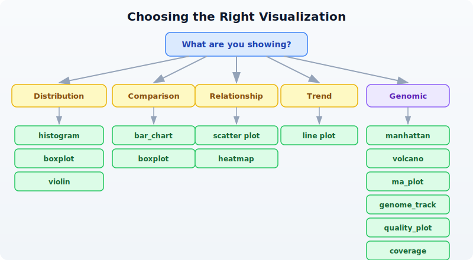

# Day 15: Publication-Quality Visualization

| | |
|---|---|
| **Difficulty** | Intermediate |
| **Biology knowledge** | Intermediate (understanding of common bioinformatics plots) |
| **Coding knowledge** | Intermediate (tables, pipes, lambda functions) |
| **Time** | ~3 hours |
| **Prerequisites** | Days 1-14 completed, BioLang installed (see Appendix A) |
| **Data needed** | Generated by `init.bl` (DE results CSV, sample FASTQ) |
| **Requirements** | None (offline) |

## What You'll Learn

- Why choosing the right plot is the most important visualization decision
- How to create scatter plots, histograms, bar charts, and boxplots in BioLang
- How to use bioinformatics-specific plots: volcano, MA, Manhattan, heatmap, genome track
- How to produce quick ASCII visualizations for terminal work
- How to export SVG figures for publication and presentation
- How to use sparklines, dotplots, quality plots, and coverage charts
- Design principles that make figures clear, honest, and journal-ready

---

## The Problem

Your analysis is done, but the reviewer says "Figure 3 is unclear." Visualization is how you communicate results. The right plot makes your finding obvious; the wrong plot hides it. Today you learn to make figures that journals accept and audiences understand.

Yesterday you ran statistical tests to determine which genes are significantly differentially expressed. But a table of p-values does not tell a story --- a volcano plot does. A list of GWAS hits does not show genomic context --- a Manhattan plot does. Visualization turns numbers into insight.

BioLang includes 30+ built-in plot functions. They produce either ASCII output for quick terminal exploration or SVG for publication-quality figures. No external libraries, no R/Python interop, no dependencies to install.

---

## Choosing the Right Plot

Before writing any code, decide what you are showing. The data type determines the plot type.



**Rule of thumb:**

- One continuous variable? **Histogram** or **density**.
- Two continuous variables? **Scatter plot** (with `plot`).
- One categorical, one continuous? **Boxplot** or **bar chart**.
- Matrix of values? **Heatmap**.
- Differential expression results? **Volcano** or **MA plot**.
- GWAS hits across the genome? **Manhattan plot**.
- Genomic features at a locus? **Genome track**.
- Sequencing quality? **Quality plot**.

---

## Basic Plots

### Scatter Plot

The scatter plot is the workhorse of data visualization. Use it whenever you have two continuous variables and want to see their relationship.

```bio
let data = [
    {x: 1.0, y: 2.1}, {x: 2.0, y: 3.9}, {x: 3.0, y: 6.2},
    {x: 4.0, y: 7.8}, {x: 5.0, y: 10.1},
] |> to_table()

plot(data, {x: "x", y: "y", title: "Gene Expression Correlation"})
```

The `plot` function takes a table and an options record. The `x` and `y` fields name the columns to plot. When data shows a clear linear trend like this, you know correlation is strong before computing any statistic.

### Histogram

Histograms show the distribution of a single variable. Use them to check whether data is normal, skewed, or bimodal --- something you should always do before running parametric tests.

```bio
let values = [2.1, 3.5, 4.2, 5.8, 6.1, 7.3, 3.8, 5.5, 4.9, 6.7, 3.2, 5.1]
histogram(values, {bins: 6, title: "Expression Distribution"})
```

Expected output (ASCII):

```
Expression Distribution

2.00 -  3.00 | ██████████           2
3.00 -  3.87 | ██████████████████   3
3.87 -  4.73 | ██████████           2
4.73 -  5.60 | ██████████████████   3
5.60 -  6.47 | █████                1
6.47 -  7.33 | █████                1
```

The default output is ASCII --- it works in any terminal, over SSH, in log files. For publication, add `format: "svg"` (covered below).

### Bar Chart

Bar charts compare discrete categories. They are the right choice when you have counts or totals for named groups.

```bio
let data = [
    {category: "SNP", count: 3500},
    {category: "Insertion", count: 450},
    {category: "Deletion", count: 520},
    {category: "MNV", count: 30},
]
bar_chart(data)
```

Expected output:

```
SNP       | ████████████████████████████████████████  3500
Insertion | █████                                      450
Deletion  | ██████                                     520
MNV       | ▏                                           30
```

The visual immediately tells you SNPs dominate --- something that is less obvious staring at a column of numbers.

### Boxplot

Boxplots show the distribution of values across groups: median, quartiles, and outliers at a glance. They are better than bar charts for distributions because they show spread, not just a single summary number.

```bio
# boxplot() accepts a Table — renders one boxplot per numeric column
let groups = table({
    control: [5.2, 4.8, 5.1, 4.9, 5.3, 5.0],
    treated: [8.1, 7.9, 8.5, 7.6, 8.3, 8.0],
    resistant: [5.5, 5.3, 5.8, 5.1, 5.6, 5.4]
})
boxplot(groups)
```

Expected output:

```
control   |    ├──[█|█]──┤          4.80 .. 5.30  median=5.05
treated   |              ├──[█|█]──┤ 7.60 .. 8.50  median=8.05
resistant |     ├──[█|█]──┤         5.10 .. 5.80  median=5.45
```

The treated group is clearly elevated. The resistant group overlaps with control --- exactly the kind of visual insight a reviewer needs.

---

## Bioinformatics-Specific Plots

### Volcano Plot

The volcano plot is the standard visualization for differential expression results. It plots fold change (x-axis) against statistical significance (y-axis), making it easy to identify genes that are both large in effect and statistically significant.

> **Requires CLI:** This example uses file I/O / network APIs not available in the browser. Run with `bl run`.

```bio
# requires: data/de_results.csv (run init.bl first)
let de = csv("data/de_results.csv")
volcano(de, {fc_threshold: 1.0, p_threshold: 0.05, title: "Tumor vs Normal"})
```

The function expects columns named `log2fc` (or `log2FoldChange`) and `padj` (or `pvalue`). Points are colored by significance: genes passing both thresholds are highlighted, non-significant genes are dimmed.

### MA Plot

The MA plot (Bland-Altman plot for genomics) shows mean expression (x-axis) versus log fold change (y-axis). It reveals whether fold change depends on expression level --- a sign of normalization problems.

```bio
let de = csv("data/de_results.csv")
ma_plot(de, {title: "MA Plot - Tumor vs Normal"})
```

In a well-normalized dataset, the cloud of points is centered at y=0 across all expression levels. A trend away from zero at low expression suggests the need for better normalization.

### Manhattan Plot

Manhattan plots display GWAS results across the genome. Each point is a variant; the y-axis shows -log10(p-value). Peaks that rise above the genome-wide significance line mark associated loci.

> **Requires CLI:** This example uses file I/O / network APIs not available in the browser. Run with `bl run`.

```bio
# requires: data/gwas_results.csv (run init.bl first)
let gwas = csv("data/gwas_results.csv")
manhattan(gwas, {title: "GWAS Results"})
```

The function expects columns `chr`, `pos`, and `pvalue`. Chromosomes alternate colors. A horizontal line marks the genome-wide significance threshold (5e-8).

### Heatmap

Heatmaps visualize matrix data --- gene expression across samples, correlation matrices, or any row-by-column numeric data. Color intensity encodes value.

```bio
let matrix = [
    {gene: "BRCA1", S1: 2.4, S2: 3.1, S3: 1.8},
    {gene: "TP53", S1: -1.2, S2: -0.8, S3: -1.5},
    {gene: "EGFR", S1: 4.1, S2: 3.8, S3: 4.5},
    {gene: "MYC", S1: 1.9, S2: 2.2, S3: 1.7},
] |> to_table()
heatmap(matrix, {title: "Expression Heatmap"})
```

Expected output (ASCII):

```
Expression Heatmap

       S1     S2     S3
BRCA1  ▓▓▓    ████   ▓▓
TP53   ░░     ░      ░░░
EGFR   █████  ████   █████
MYC    ▓▓     ▓▓▓    ▓▓
```

Darker blocks = higher values. The pattern is immediately visible: EGFR is highly expressed, TP53 is down. For publication, use `format: "svg"` to get a proper color-coded heatmap.

### Genome Track

Genome tracks display genomic features along a chromosomal region. Use them to show gene models, variants, regulatory elements, or any feature with coordinates.

```bio
let features = [
    {chrom: "chr17", start: 43044295, end: 43125483, name: "BRCA1", strand: "+"},
    {chrom: "chr17", start: 43170245, end: 43176514, name: "NBR2", strand: "-"},
    {chrom: "chr17", start: 43104956, end: 43104960, name: "variant1", strand: "+"},
] |> to_table()
genome_track(features, {title: "BRCA1 Locus"})
```

The function renders a linear representation of the region with features drawn at their coordinates. Gene bodies, point mutations, and regulatory regions are distinguishable by size and annotation.

---

## ASCII vs SVG Output

BioLang plot functions produce ASCII by default. This is ideal for quick exploration --- it works in any terminal, renders instantly, and needs no graphics setup. For publication, switch to SVG.

```bio
# ASCII output (default --- works everywhere)
bar_chart(data)

# SVG output (for publications, presentations, web)
bar_chart(data, {format: "svg"})

# Save SVG to file
let svg = bar_chart(data, {format: "svg"})
save_svg(svg, "figures/variant_types.svg")
```

**Why SVG?**

- Vector format: infinite resolution at any zoom level
- Small file size compared to raster images
- Editable in Inkscape, Illustrator, or any text editor
- Most journals accept SVG directly or convert it to PDF
- Web-friendly: renders in any browser

The `save_svg` function writes the SVG string to a file. The `save_plot` function does the same --- they are aliases.

```bio
# These are equivalent
save_svg(svg_string, "figures/plot.svg")
save_plot(svg_string, "figures/plot.svg")
```

---

## Sparklines for Quick Inline Visualization

Sparklines are tiny inline charts --- a single line of Unicode block characters that fit inside a sentence or log message. Use them for quick visual scans of trends.

```bio
let values = [3, 5, 2, 8, 4, 7, 1, 6]
println(sparkline(values))
```

Expected output:

```
▃▅▂█▄▇▁▆
```

Each character represents one value. The tallest block is the maximum (8 = `█`), the shortest is the minimum (1 = `▁`). Sparklines are useful in reports, dashboards, and pipeline logs where you want a quick visual without a full chart.

```bio
# Per-base quality across a read
let quals = [30, 32, 35, 34, 33, 31, 28, 25, 22, 18]
println(f"Quality: {sparkline(quals)}")
```

Output:

```
Quality: ▆▇██▇▆▅▃▂▁
```

The quality drop-off at the read end is immediately visible.

---

## Dotplot for Sequence Comparison

Dotplots compare two sequences by marking positions where they match. Diagonal lines indicate regions of similarity; breaks in the diagonal reveal insertions, deletions, or rearrangements.

```bio
let seq1 = dna"ATCGATCGATCG"
let seq2 = dna"ATCGTTGATCG"
dotplot(seq1, seq2, {window: 3, title: "Pairwise Comparison"})
```

The `window` parameter controls the k-mer size used for matching. Larger windows reduce noise but may miss short matches. A window of 3-5 is typical for short sequences; 10-20 for longer genomic comparisons.

---

## Quality Plot for Sequencing Data

Quality plots show per-base quality scores across read positions. They are the first thing you should look at when evaluating sequencing data.

> **Requires CLI:** This example uses file I/O / network APIs not available in the browser. Run with `bl run`.

```bio
let reads = read_fastq("data/sample.fastq")
let first_read = reads |> first()
quality_plot(first_read.qual)
```

The plot shows quality scores (Phred scale) for each position in the read. Good data has scores above 30 across most positions. A characteristic drop-off at the 3' end is normal for Illumina data and is the reason we trim reads.

For a dataset-level view, you would typically compute mean quality per position across many reads and plot that.

---

## Coverage Visualization

Coverage plots show read depth across a genomic region. They reveal whether sequencing is uniform or has gaps and peaks.

```bio
# coverage() accepts List of [start, end] pairs
let intervals = [
    [100, 300],
    [200, 500],
    [250, 400],
    [600, 800],
]
coverage(intervals)
```

Expected output:

```
100       200       300       400       500       600       700       800
|         |         |         |         |         |         |         |
▁▁▁▁▁▁▁▁▁▁██████████▓▓▓▓▓▓▓▓▓▓██████████▁▁▁▁▁▁▁▁▁▁▁▁▁▁▁▁▁▁▁▁██████████████████▁
```

The height (or density character) reflects how many intervals overlap at each position. The gap between 500-600 indicates no coverage --- a potential problem if that region contains your target gene.

---

## Customization Options

Most plot functions accept an options record as their second argument. Common options work across plot types:

```bio
# Title and dimensions
plot(data, {x: "x", y: "y",
    title: "Gene Expression Correlation",
    width: 800, height: 600})

# SVG format
histogram(values, {bins: 10, title: "Distribution", format: "svg"})

# Volcano with custom thresholds
volcano(de, {fc_threshold: 1.5, p_threshold: 0.01, format: "svg"})
```

Options that are not recognized by a particular plot function are silently ignored, so you do not need to remember exactly which options each function supports.

### Saving Figures

```bio
# Generate SVG and save in one step
let vol = volcano(de, {format: "svg", title: "Differential Expression"})
save_svg(vol, "figures/volcano.svg")

# Or more concisely via pipe
volcano(de, {format: "svg", title: "Differential Expression"})
    |> save_svg("figures/volcano.svg")
```

---

## Plot Gallery

This table lists every plot function available in BioLang, what it does, and when to use it.

| Plot | Function | Best For |
|------|----------|----------|
| Scatter | `plot()` | Two continuous variables |
| Line | `plot()` | Trends over time or position |
| Histogram | `histogram()` | Distribution of one variable |
| Bar chart | `bar_chart()` | Comparing categories |
| Boxplot | `boxplot()` | Distribution comparison across groups |
| Violin | `violin()` | Distribution shape comparison (like boxplot + density) |
| Heatmap | `heatmap()` | Matrix data, expression patterns |
| Heatmap (ASCII) | `heatmap_ascii()` | Quick terminal heatmap |
| Volcano | `volcano()` | Differential expression results |
| MA plot | `ma_plot()` | DE results, mean vs fold change |
| Manhattan | `manhattan()` | GWAS significance across genome |
| QQ plot | `qq_plot()` | Checking p-value distribution |
| Genome track | `genome_track()` | Genomic features along a chromosome |
| Coverage | `coverage()` | Read depth across a region |
| Quality plot | `quality_plot()` | Sequencing quality scores |
| Sparkline | `sparkline()` | Quick inline trend |
| Dotplot | `dotplot()` | Sequence similarity |
| Density | `density()` | Smooth distribution curve |
| PCA plot | `pca_plot()` | Sample clustering / dimensionality reduction |
| Venn diagram | `venn()` | Set overlaps (2-4 sets) |

---

## Design Principles for Scientific Figures

Good figures follow consistent rules. These principles apply regardless of which tool you use.

**1. Label all axes with units.**
"Expression (log2 TPM)" is informative. "Values" is not.

**2. Use colorblind-safe palettes.**
About 8% of men have some form of color vision deficiency. Avoid red-green contrasts. BioLang's default palette is colorblind-safe.

**3. Do not use pie charts.**
Bar charts are always clearer. The human eye is poor at comparing angles but good at comparing lengths.

**4. Show data points alongside summaries.**
A boxplot shows the distribution. A bar chart with error bars hides it. Two very different distributions can produce the same mean and standard error.

**5. Use SVG for publications.**
Raster formats (PNG, JPEG) lose quality when resized. SVG is vector --- it looks sharp at any size and any DPI. Most journals accept SVG, PDF, or EPS.

**6. One figure, one message.**
Every figure should answer one question. If you need to tell two stories, make two figures.

**7. Consistent styling across panels.**
Use the same axis ranges, font sizes, and color coding across related panels so they can be compared directly.

---

## Complete Example: Multi-Panel Figure

This example generates a complete set of figures from differential expression results, ready for a publication supplement.

> **Requires CLI:** This example uses file I/O / network APIs not available in the browser. Run with `bl run`.

```bio
# Generate a complete set of figures for a publication
# requires: data/de_results.csv (run init.bl first)

let de = csv("data/de_results.csv")

# Figure 1: Volcano plot
let vol = volcano(de, {format: "svg", title: "A) Differential Expression"})
save_svg(vol, "figures/fig1_volcano.svg")
println("Saved figures/fig1_volcano.svg")

# Figure 2: MA plot
let ma = ma_plot(de, {format: "svg", title: "B) MA Plot"})
save_svg(ma, "figures/fig2_ma.svg")
println("Saved figures/fig2_ma.svg")

# Figure 3: Expression heatmap of top genes
let top = de |> filter(|r| r.padj < 0.01) |> arrange("padj") |> head(20)
let hm = heatmap(top, {format: "svg", title: "C) Top 20 DE Genes"})
save_svg(hm, "figures/fig3_heatmap.svg")
println("Saved figures/fig3_heatmap.svg")

# Figure 4: Summary bar chart
let up_count = de |> filter(|r| r.padj < 0.05 and r.log2fc > 1.0) |> nrow()
let down_count = de |> filter(|r| r.padj < 0.05 and r.log2fc < -1.0) |> nrow()
let ns_count = nrow(de) - up_count - down_count

let summary = [
    {category: "Up", count: up_count},
    {category: "Down", count: down_count},
    {category: "NS", count: ns_count},
]
bar_chart(summary)

println("All figures saved to figures/")
```

This script produces four coordinated figures. The volcano plot shows the overall landscape. The MA plot checks for normalization artifacts. The heatmap focuses on the top hits. The bar chart gives a simple summary count. Together, they tell a complete story.

---

## Exercises

1. **Histogram of GC content.** Generate 100 random GC content values (between 0.3 and 0.7) and create a histogram with 10 bins. What shape do you expect?

2. **Volcano plot with export.** Load the DE results from `data/de_results.csv`, create a volcano plot with `fc_threshold: 1.5` and `p_threshold: 0.01`, and save it as SVG.

3. **Boxplot comparison.** Create three groups of expression values (control, low dose, high dose) with 8 values each. Make a boxplot. Do the groups look different?

4. **Genome track.** Create a table with 5 genes on chromosome 17, each with start/end coordinates and strand. Display them as a genome track.

5. **Heatmap from expression matrix.** Create a 6-gene by 4-sample expression matrix as a table and visualize it as a heatmap. Which gene has the highest expression?

---

## Key Takeaways

- **Choose the right plot for your data type** --- distributions, comparisons, relationships, and genomic data each have dedicated plot types.
- **BioLang has 30+ plot functions built in** --- no external libraries, no installation, no Python/R interop needed.
- **ASCII plots for exploration, SVG for publication** --- the same function produces both; just add `format: "svg"`.
- **`save_svg()` and `save_plot()` export to files** --- pipe your SVG string directly to a file path.
- **Label axes, use clear titles, avoid pie charts** --- follow the design principles and reviewers will thank you.
- **Visualization is communication** --- your plot should tell the story without needing explanation.

---

## What's Next

Tomorrow: pathway and enrichment analysis --- finding the biological meaning behind your gene lists. You have a set of differentially expressed genes; now you will ask what pathways and functions they share.
