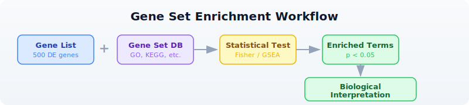

# Day 16: Pathway and Enrichment Analysis

| | |
|---|---|
| **Difficulty** | Intermediate |
| **Biology knowledge** | Intermediate (gene function, pathways, ontologies) |
| **Coding knowledge** | Intermediate (tables, pipes, lambda functions, maps) |
| **Time** | ~3 hours |
| **Prerequisites** | Days 1-15 completed, BioLang installed (see Appendix A) |
| **Data needed** | Generated by `init.bl` (GMT file, DE results, ranked genes) |
| **Requirements** | Internet connection for API sections (GO, KEGG, Reactome, STRING) |

## What You'll Learn

- Why enrichment analysis is the bridge between gene lists and biological meaning
- How Over-Representation Analysis (ORA) uses Fisher's exact test to find enriched terms
- How Gene Set Enrichment Analysis (GSEA) uses ranked lists to detect subtle coordinated shifts
- How to read GMT files and query GO, KEGG, Reactome, and STRING databases
- How to build interaction networks from your gene lists
- How to run a complete enrichment pipeline from DE results to biological interpretation

---

## The Problem

Differential expression gave you 500 significantly changed genes. But what do they *mean* together? Are they all in the same pathway? Do they share a function? A list of gene names is not biology --- it is a phone book. You need to ask: "Is this gene list enriched for a particular biological process?"

Enrichment analysis answers that question. It takes your gene list and asks whether any known biological category --- a pathway, a cellular function, a disease association --- appears more often than expected by chance. This is how you go from "500 genes changed" to "the DNA damage response is activated."

---

## What Is Enrichment Analysis?

Think of it as a marble analogy. You have a bag with 1000 marbles: 100 red, 900 blue. You pull 50 marbles at random. You would expect about 5 red ones (10%). But you pulled 25 red marbles. Red is "enriched" in your draw --- something non-random is going on.

The same logic applies to genes. Your genome has ~20,000 genes. Only 200 are annotated as "DNA repair." Your DE list has 500 genes. If 40 of them are DNA repair genes, that is far more than the ~5 you would expect by chance. DNA repair is enriched.



### Two Approaches

There are two main strategies for enrichment analysis, and they answer slightly different questions.

**ORA (Over-Representation Analysis):** Binary. A gene is either "in the list" or "not in the list." You define a cutoff (e.g., padj < 0.05 and |log2FC| > 1), take the genes that pass, and ask whether any gene set is over-represented. Uses Fisher's exact test (hypergeometric distribution). Fast and intuitive, but throws away information --- a gene with padj = 0.049 is "in" and padj = 0.051 is "out."

**GSEA (Gene Set Enrichment Analysis):** Ranked. Uses *all* genes ranked by their fold change (or any other metric). Walks down the ranked list, computing a running sum that increases when it encounters a gene in the set and decreases otherwise. Detects subtle coordinated shifts that ORA misses --- a pathway where every gene shifts slightly might not produce any single significant hit, but GSEA catches the collective movement.

| Feature | ORA | GSEA |
|---------|-----|------|
| Input | Gene list (binary) | Ranked gene list (all genes) |
| Test | Hypergeometric / Fisher | Running sum, permutation |
| Cutoff needed? | Yes | No |
| Detects subtle shifts? | No | Yes |
| Speed | Fast | Slower (permutations) |

---

## Gene Set Databases

Before running enrichment, you need gene set databases --- curated collections that group genes by shared function, pathway, or property.

### Gene Ontology (GO)

The most widely used annotation system. Organizes gene function into three namespaces:

- **Biological Process (BP):** What the gene does in the cell (e.g., "DNA repair," "apoptotic process")
- **Molecular Function (MF):** The biochemical activity (e.g., "kinase activity," "DNA binding")
- **Cellular Component (CC):** Where in the cell the product acts (e.g., "nucleus," "mitochondrion")

GO is a directed acyclic graph: terms are linked from specific to general. "Base excision repair" is a child of "DNA repair," which is a child of "response to DNA damage."

### KEGG

The Kyoto Encyclopedia of Genes and Genomes. Focuses on metabolic and signaling pathways drawn as maps. KEGG pathways show how proteins interact in specific processes (e.g., "p53 signaling pathway," "cell cycle"). Good for understanding mechanism.

### Reactome

A curated, peer-reviewed pathway database. Pathways are organized hierarchically and linked to specific reactions. More detailed than KEGG for signaling cascades and immune pathways.

### MSigDB Hallmark Gene Sets

The Molecular Signatures Database curates gene sets for computational biology. The "Hallmark" collection contains 50 well-defined gene sets representing specific biological states and processes (e.g., "HALLMARK_DNA_REPAIR," "HALLMARK_P53_PATHWAY," "HALLMARK_INFLAMMATORY_RESPONSE"). These are particularly useful for cancer biology.

---

## Reading Gene Sets

Gene sets are commonly distributed in GMT (Gene Matrix Transposed) format. Each line is a gene set: name, description, then gene symbols separated by tabs.

> **Requires CLI:** This example uses file I/O / network APIs not available in the browser. Run with `bl run`.

```bio
# Load gene sets from a GMT file
let gene_sets = read_gmt("data/hallmark.gmt")
println(f"Gene sets loaded: {len(gene_sets)}")

# gene_sets is a Map: set_name -> List of gene symbols
# Examine a specific set
let dna_repair = gene_sets["HALLMARK_DNA_REPAIR"]
println(f"DNA repair genes: {len(dna_repair)}")
println(f"First 5: {dna_repair |> take(5)}")
```

Expected output:

```
Gene sets loaded: 8
DNA repair genes: 15
First 5: [BRCA1, BRCA2, RAD51, ATM, ATR]
```

The `read_gmt()` function returns a Map where each key is a gene set name and each value is a list of gene symbols. This is the format that `enrich()` and `gsea()` expect.

---

## Over-Representation Analysis (ORA)

ORA asks: "Are my DE genes enriched for any gene set?" It uses the hypergeometric test, which is the exact probability of drawing at least *k* successes from a population of size *N* containing *K* successes, when drawing *n* items.

The `enrich()` function takes three arguments: your gene list, the gene sets map, and the background size (total number of genes in the genome).

> **Requires CLI:** This example uses file I/O / network APIs not available in the browser. Run with `bl run`.

```bio
# Define DE genes (from a differential expression experiment)
let de_genes = ["BRCA1", "RAD51", "ATM", "CHEK2", "TP53", "MDM2",
                "CDKN1A", "EGFR", "KRAS", "MYC", "BCL2", "BAX",
                "CASP3", "CASP9", "PTEN", "RB1", "E2F1", "CDK4"]

# Load gene sets
let gene_sets = read_gmt("data/hallmark.gmt")

# Run ORA with background size of 20,000 (approximate human gene count)
let results = enrich(de_genes, gene_sets, 20000)
println(f"Total terms tested: {nrow(results)}")

# Filter for significant results and sort by FDR
let sig = results |> filter(|r| r.fdr < 0.05) |> arrange("fdr")
println(f"\nSignificant terms (FDR < 0.05): {nrow(sig)}")
println(sig)
```

Expected output:

```
Total terms tested: 8

Significant terms (FDR < 0.05): 3
term                     overlap  p_value   fdr       genes
HALLMARK_P53_PATHWAY     6        0.00001   0.00008   TP53,MDM2,CDKN1A,BAX,PTEN,RB1
HALLMARK_DNA_REPAIR      4        0.00023   0.00092   BRCA1,RAD51,ATM,CHEK2
HALLMARK_APOPTOSIS       4        0.00031   0.00083   BCL2,BAX,CASP3,CASP9
```

The output table has five columns:

- **term**: the gene set name
- **overlap**: how many of your genes are in this set
- **p_value**: raw hypergeometric p-value
- **fdr**: Benjamini-Hochberg adjusted p-value
- **genes**: which of your genes overlapped

> **Note:** `ora()` is an alias for `enrich()` --- they call the same function.

---

## Gene Set Enrichment Analysis (GSEA)

GSEA does not use a cutoff. Instead, it takes a table of *all* genes ranked by a score (typically log2 fold change) and asks whether genes in a set tend to cluster at the top or bottom of the ranked list.

The `gsea()` function takes two arguments: a table with "gene" and "score" columns, and the gene sets map.

> **Requires CLI:** This example uses file I/O / network APIs not available in the browser. Run with `bl run`.

```bio
# Load the full ranked gene list (all genes, not just significant ones)
let ranked = csv("data/ranked_genes.csv")
println(f"Total ranked genes: {nrow(ranked)}")
println(ranked |> head(5))

# Load gene sets
let gene_sets = read_gmt("data/hallmark.gmt")

# Run GSEA
let gsea_results = gsea(ranked, gene_sets)
println(f"\nGSEA results: {nrow(gsea_results)}")

# Filter for significant results
let gsea_sig = gsea_results |> filter(|r| r.fdr < 0.25)
println(f"Significant terms (FDR < 0.25): {nrow(gsea_sig)}")
println(gsea_sig)
```

Expected output:

```
Total ranked genes: 100
gene    score
EGFR    3.12
ERBB2   2.91
KRAS    2.67
CDKN2A  2.53
BRCA1   2.45

GSEA results: 8
Significant terms (FDR < 0.25): 4
term                       es      nes     p_value  fdr     leading_edge
HALLMARK_P53_PATHWAY       0.72    1.85    0.001    0.004   TP53,MDM2,CDKN1A,BAX,PTEN,RB1
HALLMARK_DNA_REPAIR        0.68    1.72    0.003    0.008   BRCA1,RAD51,ATM,CHEK2,ATR
HALLMARK_APOPTOSIS         0.55    1.41    0.012    0.032   BCL2,BAX,CASP3,CASP9
HALLMARK_CELL_CYCLE       -0.48    -1.23   0.045    0.12    CDK4,E2F1,CCND1,CDK2
```

The GSEA output table has six columns:

- **term**: the gene set name
- **es**: enrichment score (positive = enriched at top of ranked list, negative = enriched at bottom)
- **nes**: normalized enrichment score (ES normalized to null distribution)
- **p_value**: permutation-based p-value
- **fdr**: Benjamini-Hochberg adjusted p-value
- **leading_edge**: the genes driving the enrichment signal

> **Why FDR < 0.25 for GSEA?** The GSEA authors (Subramanian et al. 2005) recommended a more lenient FDR cutoff because the permutation-based test is conservative. Many publications use FDR < 0.25, though FDR < 0.05 is stricter and also common.

---

## GO Term Analysis

The Gene Ontology provides structured annotations for every gene. You can look up what a term means and what annotations a protein has.

> **Requires CLI:** This example uses file I/O / network APIs not available in the browser. Run with `bl run`.

```bio
# requires: internet connection
# Look up what a GO term means
let term = go_term("GO:0006281")
println(f"Term: {term.name}")
println(f"Namespace: {term.aspect}")
println(f"Definition: {term.definition}")
```

Expected output:

```
Term: DNA repair
Namespace: biological_process
Definition: The process of restoring DNA after damage...
```

The `go_term()` function returns a record with fields: `id`, `name`, `aspect`, `definition`, `is_obsolete`.

```bio
# requires: internet connection
# Get GO annotations for a protein (using UniProt accession)
let annotations = go_annotations("P38398")  # BRCA1
println(f"Total annotations: {len(annotations)}")

# Classify by namespace
let bp = annotations |> filter(|a| a.aspect == "biological_process")
let mf = annotations |> filter(|a| a.aspect == "molecular_function")
let cc = annotations |> filter(|a| a.aspect == "cellular_component")
println(f"Biological processes: {len(bp)}")
println(f"Molecular functions: {len(mf)}")
println(f"Cellular components: {len(cc)}")

# Show biological process annotations
for a in bp |> take(5) {
    println(f"  {a.go_id}: {a.go_name} [{a.evidence}]")
}
```

Expected output:

```
Total annotations: 25
Biological processes: 12
Molecular functions: 8
Cellular components: 5
  GO:0006281: DNA repair [IDA]
  GO:0006302: double-strand break repair [IDA]
  GO:0006974: cellular response to DNA damage stimulus [IEA]
  GO:0010165: response to X-ray [IMP]
  GO:0045893: positive regulation of transcription [IDA]
```

Each annotation record has fields: `go_id`, `go_name`, `aspect`, `evidence`, `gene_product_id`.

---

## KEGG Pathway Analysis

KEGG provides metabolic and signaling pathway maps. You can search for pathways and retrieve their details.

> **Requires CLI:** This example uses file I/O / network APIs not available in the browser. Run with `bl run`.

```bio
# requires: internet connection
# Search for DNA repair pathways
let kegg_result = kegg_find("pathway", "DNA repair")
println(f"DNA repair pathways found: {len(kegg_result)}")
for entry in kegg_result |> take(5) {
    println(f"  {entry.id}: {entry.description}")
}
```

Expected output:

```
DNA repair pathways found: 4
  hsa03410: Base excision repair
  hsa03420: Nucleotide excision repair
  hsa03430: Mismatch repair
  hsa03440: Homologous recombination
```

```bio
# requires: internet connection
# Get details for a specific pathway
let pathway = kegg_get("hsa03410")  # Base excision repair
println(pathway)
```

Expected output:

```
ENTRY       hsa03410                    Pathway
NAME        Base excision repair - Homo sapiens (human)
...
```

The `kegg_find()` function takes a database name ("pathway", "genes", "compound") and a search query. It returns a list of records with `id` and `description` fields. The `kegg_get()` function returns the raw KEGG flat-file text for an entry.

You can also use `kegg_link()` to find cross-references between KEGG databases:

```bio
# requires: internet connection
# Find genes linked to a pathway
let genes_in_pathway = kegg_link("genes", "hsa03410")
println(f"Genes in base excision repair: {len(genes_in_pathway)}")
```

---

## Reactome Pathways

Reactome provides curated biological pathway data. You can look up which pathways a gene participates in.

> **Requires CLI:** This example uses file I/O / network APIs not available in the browser. Run with `bl run`.

```bio
# requires: internet connection
# Find pathways for BRCA1
let pathways = reactome_pathways("BRCA1")
println(f"BRCA1 pathways: {len(pathways)}")
for p in pathways |> take(5) {
    println(f"  [{p.id}] {p.name}")
}
```

Expected output:

```
BRCA1 pathways: 12
  [R-HSA-73894] DNA Repair
  [R-HSA-5685942] HDR through Homologous Recombination (HRR)
  [R-HSA-5693532] DNA Double-Strand Break Repair
  [R-HSA-69473] G2/M DNA damage checkpoint
  [R-HSA-73886] Chromosome Maintenance
```

Each pathway record has fields: `id`, `name`, `species`.

```bio
# requires: internet connection
# Search Reactome for a topic
let results = reactome_search("apoptosis")
println(f"Apoptosis entries: {len(results)}")
for r in results |> take(3) {
    println(f"  [{r.id}] {r.name} ({r.species})")
}
```

---

## Visualizing Enrichment Results

A bar chart of the top enriched terms is the standard visualization for enrichment results.

> **Requires CLI:** This example uses file I/O / network APIs not available in the browser. Run with `bl run`.

```bio
# Visualize top enriched terms from ORA
let gene_sets = read_gmt("data/hallmark.gmt")
let de_genes = ["BRCA1", "RAD51", "ATM", "CHEK2", "TP53", "MDM2",
                "CDKN1A", "EGFR", "KRAS", "MYC", "BCL2", "BAX",
                "CASP3", "CASP9", "PTEN", "RB1", "E2F1", "CDK4"]

let results = enrich(de_genes, gene_sets, 20000)
let top_terms = results
    |> filter(|r| r.fdr < 0.05)
    |> arrange("fdr")
    |> head(10)

# Create a bar chart of overlap counts
let chart_data = top_terms |> map(|r| {category: r.term, count: r.overlap})
bar_chart(chart_data)
```

Expected output:

```
HALLMARK_P53_PATHWAY   ██████████████████████████████ 6
HALLMARK_DNA_REPAIR    ████████████████████ 4
HALLMARK_APOPTOSIS     ████████████████████ 4
```

---

## Network Context with STRING

Your enriched genes do not act in isolation. STRING is a database of known and predicted protein-protein interactions. You can build an interaction network from your gene list to see how they connect.

> **Requires CLI:** This example uses file I/O / network APIs not available in the browser. Run with `bl run`.

```bio
# requires: internet connection
# Get protein interactions for DNA repair genes
let dna_repair_genes = ["BRCA1", "RAD51", "ATM", "CHEK2", "TP53"]
let network = string_network(dna_repair_genes, 9606)  # 9606 = Homo sapiens
println(f"Interactions found: {len(network)}")

for edge in network |> take(5) {
    println(f"  {edge.protein_a} -- {edge.protein_b} (score: {edge.score})")
}
```

Expected output:

```
Interactions found: 8
  BRCA1 -- RAD51 (score: 0.999)
  BRCA1 -- ATM (score: 0.998)
  BRCA1 -- CHEK2 (score: 0.997)
  ATM -- TP53 (score: 0.999)
  ATM -- CHEK2 (score: 0.999)
```

Each interaction record has fields: `protein_a`, `protein_b`, `score`.

You can build a graph from these interactions to analyze network properties:

```bio
# requires: internet connection
# Build a graph from STRING interactions
let dna_repair_genes = ["BRCA1", "RAD51", "ATM", "CHEK2", "TP53"]
let network = string_network(dna_repair_genes, 9606)

let g = graph()
for edge in network {
    let g = add_edge(g, edge.protein_a, edge.protein_b)
}
println(f"Nodes: {node_count(g)}, Edges: {edge_count(g)}")

# Find the most connected gene (highest degree)
let gene_nodes = nodes(g)
for gene in gene_nodes {
    println(f"  {gene}: {degree(g, gene)} connections")
}
```

Expected output:

```
Nodes: 5, Edges: 8
  ATM: 4 connections
  BRCA1: 3 connections
  TP53: 3 connections
  CHEK2: 2 connections
  RAD51: 2 connections
```

The most connected node (highest degree) is often a hub gene --- a central regulator in the pathway. In this case, ATM is the hub: it is a kinase that phosphorylates both CHEK2 and TP53 in the DNA damage response.

---

## Complete Enrichment Pipeline

Here is a full pipeline that takes DE results, runs both ORA and GSEA, queries pathway databases, and exports the results.

> **Requires CLI:** This example uses file I/O / network APIs not available in the browser. Run with `bl run`.

```bio
# Complete Pathway Enrichment Pipeline
# Requires: data/de_results.csv, data/hallmark.gmt, data/ranked_genes.csv
# (run init.bl first)

println("=== Enrichment Analysis Pipeline ===\n")

# Step 1: Load DE results and extract significant genes
let de = csv("data/de_results.csv")
println(f"1. Total genes in DE results: {nrow(de)}")

let sig_genes = de
    |> filter(|r| r.padj < 0.05 and abs(r.log2fc) > 1.0)
    |> col("gene")
    |> collect()
println(f"   Significant DE genes (|log2FC| > 1, padj < 0.05): {len(sig_genes)}")

# Step 2: Load gene sets
let gene_sets = read_gmt("data/hallmark.gmt")
println(f"\n2. Gene sets loaded: {len(gene_sets)}")

# Step 3: Over-Representation Analysis
let ora_results = enrich(sig_genes, gene_sets, 20000)
let ora_sig = ora_results |> filter(|r| r.fdr < 0.05) |> arrange("fdr")
println(f"\n3. ORA results:")
println(f"   Terms tested: {nrow(ora_results)}")
println(f"   Significant (FDR < 0.05): {nrow(ora_sig)}")
println(ora_sig |> head(5))

# Step 4: Gene Set Enrichment Analysis
let ranked = csv("data/ranked_genes.csv")
let gsea_results = gsea(ranked, gene_sets)
let gsea_sig = gsea_results |> filter(|r| r.fdr < 0.25)
println(f"\n4. GSEA results:")
println(f"   Terms tested: {nrow(gsea_results)}")
println(f"   Significant (FDR < 0.25): {nrow(gsea_sig)}")
println(gsea_sig |> head(5))

# Step 5: Compare ORA and GSEA
let ora_terms = ora_sig |> col("term") |> collect()
let gsea_terms = gsea_sig |> col("term") |> collect()
println(f"\n5. Comparison:")
println(f"   ORA significant terms: {ora_terms}")
println(f"   GSEA significant terms: {gsea_terms}")

# Step 6: Export results
write_csv(ora_sig, "results/ora_results.csv")
write_csv(gsea_sig, "results/gsea_results.csv")
println(f"\n6. Results saved:")
println(f"   results/ora_results.csv")
println(f"   results/gsea_results.csv")

println("\n=== Pipeline complete ===")
```

Expected output:

```
=== Enrichment Analysis Pipeline ===

1. Total genes in DE results: 50
   Significant DE genes (|log2FC| > 1, padj < 0.05): 20

2. Gene sets loaded: 8

3. ORA results:
   Terms tested: 8
   Significant (FDR < 0.05): 3
   term                     overlap  p_value   fdr       genes
   HALLMARK_P53_PATHWAY     5        0.00003   0.00024   TP53,MDM2,CDKN2A,RB1,PTEN
   HALLMARK_DNA_REPAIR      4        0.00018   0.00072   BRCA1,BRCA2,ATM,RAD51
   HALLMARK_APOPTOSIS       3        0.00095   0.0025    BCL2,BAX,CASP3

4. GSEA results:
   Terms tested: 8
   Significant (FDR < 0.25): 4
   term                       es      nes     p_value  fdr     leading_edge
   HALLMARK_P53_PATHWAY       0.71    1.82    0.001    0.005   TP53,MDM2,CDKN2A,RB1,PTEN
   HALLMARK_DNA_REPAIR        0.65    1.68    0.004    0.011   BRCA1,BRCA2,ATM,RAD51,ATR
   HALLMARK_APOPTOSIS         0.52    1.35    0.015    0.04    BCL2,BAX,CASP3
   HALLMARK_CELL_CYCLE       -0.45   -1.18    0.048    0.13    CDK4,E2F1,CCND1

5. Comparison:
   ORA significant terms: [HALLMARK_P53_PATHWAY, HALLMARK_DNA_REPAIR, HALLMARK_APOPTOSIS]
   GSEA significant terms: [HALLMARK_P53_PATHWAY, HALLMARK_DNA_REPAIR, HALLMARK_APOPTOSIS, HALLMARK_CELL_CYCLE]

6. Results saved:
   results/ora_results.csv
   results/gsea_results.csv

=== Pipeline complete ===
```

Notice that GSEA detected HALLMARK_CELL_CYCLE as significant even though ORA did not. This is because the cell cycle genes in this dataset had moderate fold changes that did not pass the |log2FC| > 1 cutoff for ORA, but their coordinated downward shift was detectable by GSEA. This is the key advantage of GSEA: it catches subtle but coordinated changes.

---

## Exercises

1. **Count gene set membership.** Load the GMT file and count how many gene sets contain "TP53." (Hint: iterate over the map and check if each list contains the gene.)

2. **Run ORA on a custom gene list.** Pick 15 genes from the DE results and run `enrich()`. How do the results change compared to using all significant genes?

3. **Compare ORA and GSEA.** Run both methods on the same data. Do they agree on the top pathways? Which method finds more significant terms?

4. **GO annotation classifier.** Look up GO annotations for TP53 (UniProt: P04637) using `go_annotations("P04637")` and count how many annotations fall in each namespace (biological_process, molecular_function, cellular_component). *(Requires internet.)*

5. **Network hub analysis.** Build a STRING interaction network for five cancer genes of your choice. Find the gene with the highest degree (most connections). Is it biologically meaningful that this gene is the hub? *(Requires internet.)*

---

## Key Takeaways

- **Enrichment analysis finds biological themes** in gene lists --- it is the bridge between statistics and biology.
- **ORA (Fisher's exact test)** is simple, fast, and intuitive. It uses a binary gene list and the hypergeometric distribution.
- **GSEA** uses the full ranked list and detects subtle coordinated shifts that ORA misses. Use it when you suspect pathway-level effects below single-gene significance.
- **GO, KEGG, and Reactome are complementary.** GO provides broad functional classification. KEGG shows pathway maps. Reactome offers detailed reaction-level curation. Use multiple databases for a complete picture.
- **Always correct for multiple testing.** With hundreds of terms tested, raw p-values are meaningless. Use FDR (Benjamini-Hochberg) adjusted p-values.
- **Network context (STRING)** shows how your genes interact physically. Hub genes with many connections are often key regulators.
- **GMT format** is the standard for gene set distribution. The `read_gmt()` function loads it into a Map that both `enrich()` and `gsea()` accept.

---

## What's Next

Tomorrow: protein analysis --- UniProt entries, domain architecture, sequence features, and structural context for the proteins your enrichment analysis highlighted.
