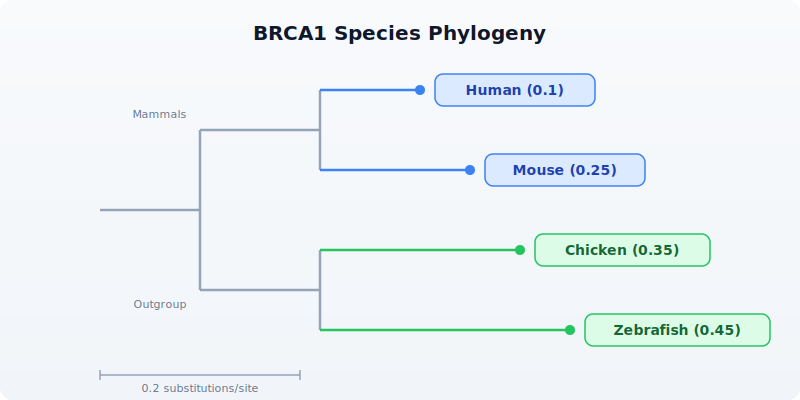

# Day 20: Multi-Species Comparison

| | |
|---|---|
| **Difficulty** | Intermediate |
| **Biology knowledge** | Intermediate (orthologs, conservation, phylogenetics, k-mers) |
| **Coding knowledge** | Intermediate (API calls, records, pipes, nested loops, try/catch) |
| **Time** | ~3 hours |
| **Prerequisites** | Days 1-19 completed, BioLang installed (see Appendix A) |
| **Data needed** | None (API-based); internet connection required |

## What You'll Learn

- How to fetch ortholog sequences across species using the Ensembl API
- How to compare sequence properties (length, GC content) across species
- How to compute alignment-free similarity using k-mer Jaccard distance
- How to create dotplots for visual sequence comparison
- How to analyze amino acid composition across orthologs
- How to build comprehensive cross-species comparison tables
- How to visualize phylogenetic relationships from Newick strings
- How to export ortholog sequences for external alignment tools

---

## The Problem

Is your gene conserved across species? If BRCA1 exists in mouse, chicken, and zebrafish with similar sequence, it must be important. Conservation reveals function. Genes that are preserved across hundreds of millions of years of evolution are almost certainly essential --- random drift would have destroyed them otherwise.

Comparative genomics answers a simple question: which parts of a genome matter? If a sequence is the same in human, mouse, chicken, and zebrafish --- species that diverged 450 million years ago --- then natural selection has been actively preserving it. That conservation signal is one of the strongest indicators of biological function.

Today we compare genes and proteins across the tree of life using the Ensembl API, alignment-free similarity metrics, and BioLang's visualization tools. This is the last day of Week 3, and it brings together API access (Day 15), sequence analysis (Days 2-4), and visualization (Day 19) into a single comparative genomics workflow.

---

## Fetching Orthologs via Ensembl

The Ensembl database maintains curated ortholog mappings across hundreds of species. We can query it to retrieve gene and protein sequences for any gene symbol in any species.

### Setting Up Species

```bio
# requires: internet connection
let species = [
    {name: "Human", id: "homo_sapiens"},
    {name: "Mouse", id: "mus_musculus"},
    {name: "Chicken", id: "gallus_gallus"},
    {name: "Zebrafish", id: "danio_rerio"},
]

println("Fetching BRCA1 orthologs across " + str(len(species)) + " species...")
```

> **Requires CLI:** This example uses file I/O / network APIs not available in the browser. Run with `bl run`.

Expected output:

```
Fetching BRCA1 orthologs across 4 species...
```

### Retrieving Gene and Sequence Data

For each species, we look up the gene by symbol, then fetch both the protein and CDS sequences. Not every gene exists in every species, so we wrap each lookup in `try/catch`.

```bio
# requires: internet connection
let results = []
for sp in species {
    try {
        let gene = ensembl_symbol(sp.id, "BRCA1")
        let protein = ensembl_sequence(gene.id, type: "protein")
        let cds = ensembl_sequence(gene.id, type: "cdna")
        let results = push(results, {
            species: sp.name,
            gene_id: gene.id,
            protein_len: len(protein.seq),
            protein_seq: protein.seq,
            cds_len: len(cds.seq),
            cds_seq: cds.seq,
            gc: round(gc_content(cds.seq) * 100, 1)
        })
        println("  " + sp.name + ": " + gene.id + " (" + str(len(protein.seq)) + " aa)")
    } catch e {
        println("  " + sp.name + ": not found (" + str(e) + ")")
    }
}

let comparison = results |> to_table()
println(comparison)
```

> **Requires CLI:** This example uses file I/O / network APIs not available in the browser. Run with `bl run`.

Expected output:

```
  Human: ENSG00000012048 (1863 aa)
  Mouse: ENSMUSG00000017146 (1812 aa)
  Chicken: ENSGALG00000006098 (1559 aa)
  Zebrafish: ENSDARG00000052626 (1766 aa)

| species   | gene_id              | protein_len | cds_len | gc   |
|-----------|----------------------|-------------|---------|------|
| Human     | ENSG00000012048      | 1863        | 5592    | 42.3 |
| Mouse     | ENSMUSG00000017146   | 1812        | 5439    | 44.1 |
| Chicken   | ENSGALG00000006098   | 1559        | 4680    | 48.7 |
| Zebrafish | ENSDARG00000052626   | 1766        | 5301    | 45.9 |
```

The `ensembl_symbol()` function takes a species identifier and gene symbol, returning a record with at minimum an `id` field (the Ensembl gene ID). The `ensembl_sequence()` function takes that gene ID and a `type` parameter (`"protein"` or `"cdna"`) and returns a record with a `seq` field.

Notice the protein lengths: human BRCA1 is 1863 amino acids, mouse is 1812, chicken is 1559, and zebrafish is 1766. The gene is clearly conserved across all four species, but the chicken ortholog is notably shorter.

---

## Sequence Property Comparison

With the data fetched, we can compare properties across species using bar charts.

### GC Content Comparison

GC content varies between species due to differences in codon usage bias. Warm-blooded vertebrates tend to have more GC-rich isochores than fish.

```bio
# Compare GC content across species
let gc_data = results |> map(|r| {category: r.species, count: r.gc})
bar_chart(gc_data, title: "BRCA1 GC Content by Species (%)")
```

Expected output:

```
BRCA1 GC Content by Species (%)

Human     | ##########################################          42.3%
Mouse     | ############################################        44.1%
Chicken   | ################################################    48.7%
Zebrafish | ##############################################      45.9%
```

Chicken has the highest GC content (48.7%), consistent with the known GC-richness of avian genomes.

### Protein Length Comparison

```bio
# Compare protein lengths across species
let len_data = results |> map(|r| {category: r.species, count: r.protein_len})
bar_chart(len_data, title: "BRCA1 Protein Length by Species (aa)")
```

Expected output:

```
BRCA1 Protein Length by Species (aa)

Human     | ################################################## 1863
Mouse     | ################################################   1812
Chicken   | ##########################################          1559
Zebrafish | ################################################   1766
```

---

## K-mer Similarity (Alignment-Free)

Full sequence alignment is computationally expensive for large genes. K-mer Jaccard similarity provides a fast, alignment-free estimate of sequence relatedness. The idea: decompose each sequence into all overlapping subsequences of length k, treat them as sets, and compute the Jaccard index (intersection over union).

### Implementing K-mer Jaccard

```bio
fn kmer_jaccard(seq1, seq2, k) {
    let k1 = set(kmers(seq1, k))
    let k2 = set(kmers(seq2, k))
    let shared = len(intersection(k1, k2))
    let total = len(union(k1, k2))
    if total > 0 { round(shared / total, 3) } else { 0.0 }
}
```

The `kmers()` function returns all overlapping subsequences of length k from a sequence. Wrapping in `set()` removes duplicates. The `intersection()` and `union()` functions operate on sets, making the Jaccard computation straightforward.

### Pairwise Comparison

```bio
# requires: internet connection (sequences fetched above)
# Compare all pairs of CDS sequences
let sequences = results |> map(|r| {name: r.species, seq: r.cds_seq})

println("Pairwise k-mer Jaccard similarity (k=5):")
for i in range(0, len(sequences)) {
    for j in range(i + 1, len(sequences)) {
        let sim = kmer_jaccard(sequences[i].seq, sequences[j].seq, 5)
        println("  " + sequences[i].name + " vs " + sequences[j].name + ": " + str(sim))
    }
}
```

> **Requires CLI:** This example uses file I/O / network APIs not available in the browser. Run with `bl run`.

Expected output:

```
Pairwise k-mer Jaccard similarity (k=5):
  Human vs Mouse: 0.412
  Human vs Chicken: 0.287
  Human vs Zebrafish: 0.198
  Mouse vs Chicken: 0.271
  Mouse vs Zebrafish: 0.189
  Chicken vs Zebrafish: 0.163
```

The results follow the expected phylogenetic pattern: human and mouse (both mammals) are the most similar, the two mammals are more similar to chicken (amniotes) than to zebrafish (teleost), and chicken vs zebrafish shows the lowest similarity.

### Choosing k

The choice of k affects sensitivity and specificity. Small k (3-4) captures more shared k-mers but may not reflect true homology. Large k (8-10) is more specific but misses divergent regions. For CDS comparison, k=5 provides a good balance.

```bio
# Compare different k values
println("\nEffect of k on Human vs Mouse similarity:")
for k in [3, 4, 5, 6, 7, 8] {
    let sim = kmer_jaccard(sequences[0].seq, sequences[1].seq, k)
    println("  k=" + str(k) + ": " + str(sim))
}
```

Expected output:

```
Effect of k on Human vs Mouse similarity:
  k=3: 0.891
  k=4: 0.645
  k=5: 0.412
  k=6: 0.268
  k=7: 0.173
  k=8: 0.112
```

At k=3, almost all possible 3-mers appear in both sequences (high similarity but low discrimination). As k increases, the Jaccard index drops because longer k-mers are less likely to match exactly in divergent sequences.

---

## Dotplot Comparison

A dotplot places one sequence on the x-axis and another on the y-axis, marking a dot wherever a short word match occurs. A diagonal line indicates collinear similarity; breaks in the diagonal indicate insertions, deletions, or rearrangements.

```bio
# Dotplot of two short sequences to demonstrate the concept
let human_seq = dna"ATCGATCGATCGATCGATCGATCG"
let mouse_seq = dna"ATCGATCGATCGATCAATCGATCG"
dotplot(human_seq, mouse_seq, title: "Human vs Mouse (Simplified)")
```

Expected output:

```
Human vs Mouse (Simplified)

  A T C G A T C G A T C G A T C A A T C G A T C G
A *       *       *       *     * *       *
T   *       *       *       *       *       *
C     *       *       *       *       *       *
G       *       *       *               *       *
A *       *       *       *     * *       *
T   *       *       *       *       *       *
C     *       *       *       *       *       *
G       *       *       *               *       *
...
```

The diagonal indicates the conserved region. The disruption at position 16 (where the mouse sequence has an extra A) shifts the downstream diagonal.

For real ortholog sequences, dotplots reveal large-scale structural conservation:

```bio
# requires: internet connection (sequences fetched above)
# Dotplot comparing first 200 amino acids of human vs mouse BRCA1
let human_prot = results |> filter(|r| r.species == "Human") |> map(|r| r.protein_seq)
let mouse_prot = results |> filter(|r| r.species == "Mouse") |> map(|r| r.protein_seq)

if len(human_prot) > 0 and len(mouse_prot) > 0 {
    # Use a substring for readability
    let h_sub = str(human_prot[0]) |> split("") |> filter(|c| c != "") |> range(0, 200)
    let m_sub = str(mouse_prot[0]) |> split("") |> filter(|c| c != "") |> range(0, 200)
    dotplot(h_sub, m_sub, title: "Human vs Mouse BRCA1 Protein (first 200 aa)")
}
```

> **Requires CLI:** This example uses file I/O / network APIs not available in the browser. Run with `bl run`.

---

## Amino Acid Composition Across Species

Different species have distinct codon usage biases, which translate into differences in amino acid composition. Comparing the balance of hydrophobic, polar, and charged residues across orthologs reveals whether protein chemistry is conserved even when exact sequence diverges.

```bio
# requires: internet connection (sequences fetched above)
fn aa_composition(seq) {
    let residues = split(str(seq), "")
    let residues = residues |> filter(|c| c != "")
    let hydrophobic = residues |> filter(|aa| contains("AVLIMFWP", aa)) |> len()
    let polar = residues |> filter(|aa| contains("STNQYC", aa)) |> len()
    let charged = residues |> filter(|aa| contains("DEKRH", aa)) |> len()
    let total = len(residues)
    {
        hydrophobic: round(hydrophobic / total * 100, 1),
        polar: round(polar / total * 100, 1),
        charged: round(charged / total * 100, 1)
    }
}

println("Amino acid composition comparison:")
for r in results {
    let comp = aa_composition(r.protein_seq)
    println("  " + r.species + ": hydrophobic=" + str(comp.hydrophobic) + "%, polar=" + str(comp.polar) + "%, charged=" + str(comp.charged) + "%")
}
```

> **Requires CLI:** This example uses file I/O / network APIs not available in the browser. Run with `bl run`.

Expected output:

```
Amino acid composition comparison:
  Human: hydrophobic=38.2%, polar=24.1%, charged=25.3%
  Mouse: hydrophobic=37.8%, polar=24.5%, charged=25.0%
  Chicken: hydrophobic=37.1%, polar=23.8%, charged=26.2%
  Zebrafish: hydrophobic=36.5%, polar=24.9%, charged=24.8%
```

Despite millions of years of divergence, the overall amino acid composition is remarkably stable. Hydrophobic residues consistently make up about 37-38% of BRCA1, polar residues about 24%, and charged residues about 25%. This conservation of bulk chemistry, even when individual residues change, reflects the structural constraints on the protein.

---

## Building a Comparison Table

A comprehensive cross-species table brings all the metrics together in one view.

```bio
# requires: internet connection (sequences fetched above)
let full_comparison = results |> map(|r| {
    species: r.species,
    protein_len: r.protein_len,
    cds_len: r.cds_len,
    gc_percent: r.gc,
    cds_protein_ratio: round(r.cds_len / r.protein_len, 1)
})
let table = full_comparison |> to_table()
println(table)
write_csv(table, "results/species_comparison.csv")
println("Saved results/species_comparison.csv")
```

> **Requires CLI:** This example uses file I/O / network APIs not available in the browser. Run with `bl run`.

Expected output:

```
| species   | protein_len | cds_len | gc_percent | cds_protein_ratio |
|-----------|-------------|---------|------------|-------------------|
| Human     | 1863        | 5592    | 42.3       | 3.0               |
| Mouse     | 1812        | 5439    | 44.1       | 3.0               |
| Chicken   | 1559        | 4680    | 48.7       | 3.0               |
| Zebrafish | 1766        | 5301    | 45.9       | 3.0               |

Saved results/species_comparison.csv
```

The CDS-to-protein ratio is always 3.0 (three nucleotides per codon) --- a sanity check that confirms the sequences are correctly paired. If this ratio were not exactly 3.0, it would indicate a problem with the sequence retrieval.

---

## Visualizing Phylogenetic Relationships

BioLang can render phylogenetic trees from Newick-format strings. It does not compute phylogenies --- for that, you need external tools like RAxML, IQ-TREE, or PhyML. But for visualizing known evolutionary relationships, `phylo_tree()` is a one-line solution.

```bio
# Newick string representing known evolutionary relationships
# Branch lengths are approximate divergence times (arbitrary units)
let tree = "((Human:0.1,Mouse:0.25):0.08,(Chicken:0.35,Zebrafish:0.45):0.15);"
phylo_tree(tree, title: "BRCA1 Species Phylogeny")
```

Expected output:



The tree shows mammals (human and mouse) as a clade, with chicken and zebrafish forming a separate group. Branch lengths reflect relative divergence --- zebrafish has the longest branch, consistent with its ancient divergence from the other species (~450 million years ago).

> **Important**: For actual phylogenetic inference from sequence data, export your sequences to FASTA (see the Export section below) and use dedicated tools:
> - **MAFFT** or **MUSCLE** for multiple sequence alignment
> - **IQ-TREE**, **RAxML**, or **PhyML** for tree inference
> - **FigTree** or **iTOL** for tree visualization and annotation

---

## Multi-Gene Comparison

Comparing a single gene gives one data point. Comparing multiple genes reveals whether conservation patterns are consistent or gene-specific.

```bio
# requires: internet connection
fn compare_gene_across_species(gene_symbol, species_list) {
    let results = []
    for sp in species_list {
        try {
            let gene = ensembl_symbol(sp.id, gene_symbol)
            let prot = ensembl_sequence(gene.id, type: "protein")
            let results = push(results, {
                gene: gene_symbol,
                species: sp.name,
                length: len(prot.seq)
            })
        } catch e {
            # Gene may not exist in all species --- skip silently
        }
    }
    results
}

let genes = ["TP53", "BRCA1", "EGFR"]
let all_results = genes |> flat_map(|g| compare_gene_across_species(g, species))
let summary = all_results |> to_table()
println(summary)
```

> **Requires CLI:** This example uses file I/O / network APIs not available in the browser. Run with `bl run`.

Expected output:

```
| gene  | species   | length |
|-------|-----------|--------|
| TP53  | Human     | 393    |
| TP53  | Mouse     | 387    |
| TP53  | Chicken   | 367    |
| TP53  | Zebrafish | 373    |
| BRCA1 | Human     | 1863   |
| BRCA1 | Mouse     | 1812   |
| BRCA1 | Chicken   | 1559   |
| BRCA1 | Zebrafish | 1766   |
| EGFR  | Human     | 1210   |
| EGFR  | Mouse     | 1210   |
| EGFR  | Chicken   | 1213   |
| EGFR  | Zebrafish | 1182   |
```

TP53 is remarkably consistent in length across all four species (367-393 aa), which makes sense --- it is one of the most critical tumor suppressors and is under strong purifying selection. EGFR is also highly conserved in length (1182-1213 aa). BRCA1 shows more variation, particularly in chicken, where it is notably shorter.

### Visualizing Multi-Gene Comparison

```bio
# Bar chart of protein lengths grouped by gene
for gene_name in genes {
    let gene_data = all_results
        |> filter(|r| r.gene == gene_name)
        |> map(|r| {category: r.species, count: r.length})
    bar_chart(gene_data, title: gene_name + " Protein Length by Species")
}
```

---

## Exporting for External Tools

BioLang handles sequence retrieval and comparison, but multiple sequence alignment and phylogenetic inference are better done with specialized tools. Export your sequences to standard formats for downstream analysis.

### Exporting to FASTA

```bio
# requires: internet connection (sequences fetched above)
# Export protein sequences for multiple sequence alignment
let seqs = results |> map(|r| {id: r.species + "_BRCA1", seq: r.protein_seq})
write_fasta(seqs, "results/brca1_orthologs.fasta")
println("Exported to results/brca1_orthologs.fasta")
```

> **Requires CLI:** This example uses file I/O / network APIs not available in the browser. Run with `bl run`.

Expected output:

```
Exported to results/brca1_orthologs.fasta
```

The resulting FASTA file looks like:

```
>Human_BRCA1
MDLSALREVE...
>Mouse_BRCA1
MDLSALRDVE...
>Chicken_BRCA1
MDLSGLRDIE...
>Zebrafish_BRCA1
MDLSAVRDVE...
```

### Running External Tools

After exporting, use standard bioinformatics tools for alignment and tree building:

```bio
# These commands run outside BioLang, in your terminal
# Step 1: Multiple sequence alignment with MAFFT
# mafft brca1_orthologs.fasta > brca1_aligned.fasta

# Step 2: Phylogenetic tree inference with IQ-TREE
# iqtree -s brca1_aligned.fasta -m AUTO

# Step 3: View the resulting tree in BioLang
# let tree_str = read("brca1_aligned.fasta.treefile")
# phylo_tree(tree_str, title: "BRCA1 Inferred Phylogeny")
```

The workflow is: BioLang fetches and exports sequences, external tools align and build trees, and BioLang can visualize the resulting Newick tree.

---

## Complete Multi-Species Pipeline

Here is the full pipeline combining all concepts from this lesson into a single script.

```bio
# requires: internet connection
# Complete multi-species comparison pipeline

println("=" * 60)
println("Multi-Species Gene Comparison Pipeline")
println("=" * 60)

# ── Step 1: Define species ──────────────────────────────────────
let species = [
    {name: "Human", id: "homo_sapiens"},
    {name: "Mouse", id: "mus_musculus"},
    {name: "Chicken", id: "gallus_gallus"},
    {name: "Zebrafish", id: "danio_rerio"},
]

# ── Step 2: Fetch BRCA1 orthologs ──────────────────────────────
println("\n── Fetching BRCA1 Orthologs ──\n")
let results = []
for sp in species {
    try {
        let gene = ensembl_symbol(sp.id, "BRCA1")
        let protein = ensembl_sequence(gene.id, type: "protein")
        let cds = ensembl_sequence(gene.id, type: "cdna")
        let results = push(results, {
            species: sp.name,
            gene_id: gene.id,
            protein_len: len(protein.seq),
            protein_seq: protein.seq,
            cds_len: len(cds.seq),
            cds_seq: cds.seq,
            gc: round(gc_content(cds.seq) * 100, 1)
        })
        println("  " + sp.name + ": " + gene.id + " (" + str(len(protein.seq)) + " aa)")
    } catch e {
        println("  " + sp.name + ": not found (" + str(e) + ")")
    }
}

# ── Step 3: Comparison table ───────────────────────────────────
println("\n── Cross-Species Comparison ──\n")
let full_comparison = results |> map(|r| {
    species: r.species,
    protein_len: r.protein_len,
    cds_len: r.cds_len,
    gc_percent: r.gc,
    cds_protein_ratio: round(r.cds_len / r.protein_len, 1)
})
let table = full_comparison |> to_table()
println(table)
write_csv(table, "results/species_comparison.csv")

# ── Step 4: GC content bar chart ──────────────────────────────
println("\n── GC Content ──\n")
let gc_data = results |> map(|r| {category: r.species, count: r.gc})
bar_chart(gc_data, title: "BRCA1 GC Content by Species (%)")

# ── Step 5: K-mer similarity ─────────────────────────────────
println("\n── K-mer Similarity (k=5) ──\n")

fn kmer_jaccard(seq1, seq2, k) {
    let k1 = set(kmers(seq1, k))
    let k2 = set(kmers(seq2, k))
    let shared = len(intersection(k1, k2))
    let total = len(union(k1, k2))
    if total > 0 { round(shared / total, 3) } else { 0.0 }
}

let sequences = results |> map(|r| {name: r.species, seq: r.cds_seq})
for i in range(0, len(sequences)) {
    for j in range(i + 1, len(sequences)) {
        let sim = kmer_jaccard(sequences[i].seq, sequences[j].seq, 5)
        println("  " + sequences[i].name + " vs " + sequences[j].name + ": " + str(sim))
    }
}

# ── Step 6: Amino acid composition ────────────────────────────
println("\n── Amino Acid Composition ──\n")

fn aa_composition(seq) {
    let residues = split(str(seq), "")
    let residues = residues |> filter(|c| c != "")
    let hydrophobic = residues |> filter(|aa| contains("AVLIMFWP", aa)) |> len()
    let polar = residues |> filter(|aa| contains("STNQYC", aa)) |> len()
    let charged = residues |> filter(|aa| contains("DEKRH", aa)) |> len()
    let total = len(residues)
    {
        hydrophobic: round(hydrophobic / total * 100, 1),
        polar: round(polar / total * 100, 1),
        charged: round(charged / total * 100, 1)
    }
}

for r in results {
    let comp = aa_composition(r.protein_seq)
    println("  " + r.species + ": hydrophobic=" + str(comp.hydrophobic) + "%, polar=" + str(comp.polar) + "%, charged=" + str(comp.charged) + "%")
}

# ── Step 7: Phylogenetic tree ─────────────────────────────────
println("\n── Phylogenetic Tree ──\n")
let tree = "((Human:0.1,Mouse:0.25):0.08,(Chicken:0.35,Zebrafish:0.45):0.15);"
phylo_tree(tree, title: "BRCA1 Species Phylogeny")

# ── Step 8: Export sequences ──────────────────────────────────
println("\n── Exporting Sequences ──\n")
let seqs = results |> map(|r| {id: r.species + "_BRCA1", seq: r.protein_seq})
write_fasta(seqs, "results/brca1_orthologs.fasta")
println("Exported to results/brca1_orthologs.fasta")
println("Next steps:")
println("  mafft results/brca1_orthologs.fasta > results/brca1_aligned.fasta")
println("  iqtree -s results/brca1_aligned.fasta -m AUTO")

println("\n" + "=" * 60)
println("Pipeline complete!")
println("=" * 60)
```

> **Requires CLI:** This example uses file I/O / network APIs not available in the browser. Run with `bl run`.

---

## Exercises

1. **TP53 protein length across 5 species**: Add a fifth species (e.g., frog: `{name: "Frog", id: "xenopus_tropicalis"}`) to the species list and compare TP53 protein length across all five species. Which species has the shortest TP53?

2. **K-mer Jaccard for TP53**: Fetch TP53 CDS sequences for human and mouse. Compute the k-mer Jaccard similarity at k=5. Is TP53 more or less conserved than BRCA1 at the nucleotide level?

3. **Dotplot comparison**: Use `dotplot()` to compare two short DNA sequences of your own design --- one with an insertion and one without. Observe how the insertion affects the diagonal pattern.

4. **Three-gene, four-species table**: Use the `compare_gene_across_species()` function to compare TP53, BRCA1, and EGFR across all four species. Build a single table with gene, species, and protein length. Which gene is most consistent in size across species?

5. **Bar chart visualization**: From the multi-gene comparison in exercise 4, create a bar chart showing protein length by species for each gene. Export the comparison table to CSV.

---

## Key Takeaways

- Conservation across species reveals functional importance --- genes preserved over hundreds of millions of years of evolution are almost certainly essential
- The Ensembl API (`ensembl_symbol`, `ensembl_sequence`) provides ortholog sequences for hundreds of species
- K-mer Jaccard similarity (`kmers`, `set`, `intersection`, `union`) gives alignment-free sequence comparison that follows expected phylogenetic patterns
- Dotplots (`dotplot`) visually reveal collinear similarity, insertions, and divergent regions between two sequences
- Amino acid composition is remarkably conserved across orthologs even when exact sequences diverge
- `phylo_tree()` visualizes Newick-format trees but does not compute them --- use MAFFT/MUSCLE for alignment and IQ-TREE/RAxML for inference
- Always handle missing orthologs gracefully with `try/catch` --- not every gene exists in every species
- Export sequences to FASTA with `write_fasta()` for downstream analysis with external alignment tools

---

## What's Next

Week 4 starts tomorrow: **Performance and Parallel Processing** --- making your analyses fast. You will learn about BioLang's lazy evaluation, stream processing, and parallel execution to handle genome-scale datasets efficiently.
