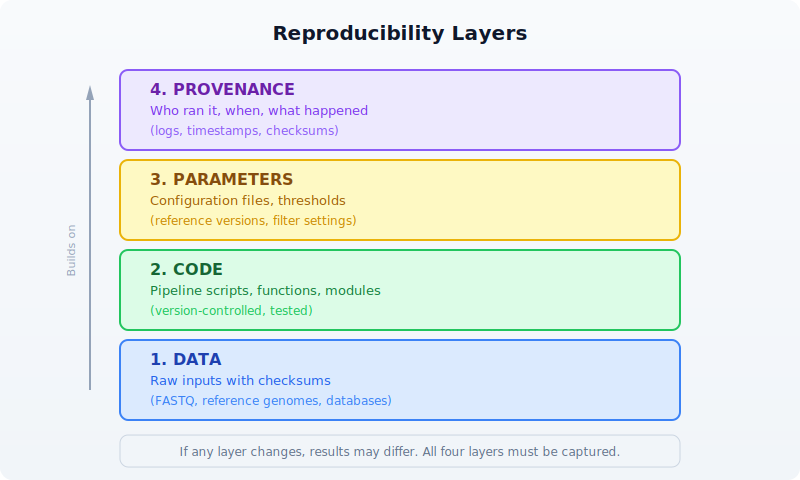
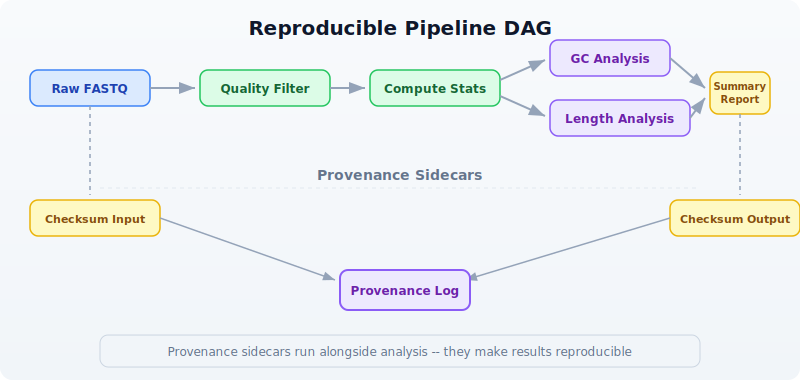
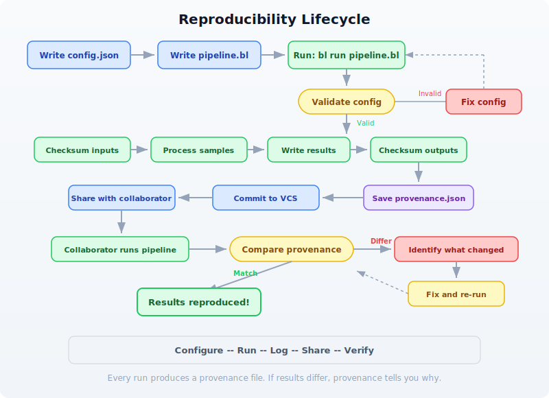

# Day 22: Reproducible Pipelines

| | |
|---|---|
| **Difficulty** | Intermediate |
| **Biology knowledge** | Basic (FASTQ quality, GC content, sequence filtering) |
| **Coding knowledge** | Intermediate (functions, records, file I/O, checksums, JSON) |
| **Time** | ~3 hours |
| **Prerequisites** | Days 1--21 completed, BioLang installed (see Appendix A) |
| **Data needed** | Generated locally via `init.bl` |

## What You'll Learn

- Why reproducibility is the foundation of credible bioinformatics
- How to design pipelines as modular, auditable processing graphs
- How to manage parameters in external configuration files
- How to use checksums to verify data integrity across time and machines
- How to build provenance logs that record every step of an analysis
- How to package and share a complete, self-contained analysis

---

## The Problem

You submit a paper in January. The reviewers come back in April with a question: "Can you re-run the variant filtering with a minimum quality of 30 instead of 20?" You open the script you used four months ago. It references a file called `filtered_reads.fastq` that no longer exists. The script has no comments explaining which parameters you used. You vaguely recall changing a threshold by hand before the final run, but you cannot remember what it was. The conda environment you used has been updated twice since then. You spend three days reconstructing your own analysis.

This is not a hypothetical. A 2019 survey in *PLOS Computational Biology* found that fewer than 40% of published bioinformatics analyses could be reproduced by their own authors six months later. The causes are predictable: hardcoded parameters, missing intermediate files, undocumented manual steps, and environment drift.

Today we solve this. We will build a complete QC pipeline where every parameter is in a config file, every input and output is checksummed, every step is logged with timestamps, and the entire analysis can be re-run with a single command. By the end of this chapter, your future self --- and your collaborators --- will be able to reproduce your results exactly.

---

## Why Reproducibility Matters

Reproducibility is not an academic nicety. It is a practical requirement at every stage of a bioinformatics career:

**For publication**: Journals increasingly require that analyses be reproducible. Nature Methods, Genome Biology, and Bioinformatics all have reproducibility guidelines. Some require depositing code and parameters alongside the manuscript.

**For collaboration**: When you hand off an analysis to a colleague, they need to understand what you did, with what parameters, and on which data. A script alone is not enough --- they need to know the exact inputs and settings.

**For debugging**: When results look wrong, the first question is "what changed?" If you have no record of previous runs, you cannot answer that question.

**For regulation**: Clinical bioinformatics pipelines (variant calling for diagnosis, pharmacogenomics) must be fully auditable. Every result must trace back to specific inputs, parameters, and software versions.

The following diagram shows the four layers of reproducibility. Each layer builds on the one below it:



Most bioinformatics workflows get layers 1 and 2 right (they keep the raw data and the script). But layers 3 and 4 --- the parameters and the provenance --- are where reproducibility breaks down. Hardcoded thresholds, undocumented manual steps, and missing logs make it impossible to know exactly what produced a given result.

---

## Pipeline Design Patterns

A bioinformatics pipeline is a sequence of processing steps where each step's output becomes the next step's input. The simplest representation is a directed acyclic graph (DAG):



This DAG shows a typical QC pipeline. Notice two important features:

1. **Branching**: After computing stats, GC analysis and length analysis can proceed independently. In a parallel system, these would run simultaneously.

2. **Provenance sidecars**: Checksums and logs run alongside the main analysis. They do not affect the results, but they make the results reproducible.

### The Three-File Pattern

A well-structured reproducible analysis uses three files:

```
my_analysis/
├── config.json      # Parameters (what thresholds, which files)
├── pipeline.bl      # Code (what to do)
└── provenance.json  # Log (what happened)
```

The **config file** contains every parameter that could affect results. The **pipeline script** reads the config and executes the analysis. The **provenance log** is written by the pipeline as it runs, capturing timestamps, checksums, and step outcomes.

This separation means you can re-run the exact same analysis by keeping the config file, or run a variation by changing one parameter in the config. The provenance log lets you compare two runs and see exactly what differed.

---

## Setting Up the Project

Our pipeline will perform quality control on a set of FASTQ files: filter reads by quality, compute summary statistics, and produce a report. We will build it step by step, adding reproducibility features at each stage.

First, generate the test data:

```bash
bl run init.bl
```

The `init.bl` script creates the project structure and generates synthetic FASTQ data:

```
# init.bl creates:
# data/sample_A.fastq  — 500 reads, mixed quality
# data/sample_B.fastq  — 500 reads, mixed quality
# config.json          — default parameters
# results/             — output directory
# logs/                — provenance logs
```

---

## Parameter Files

The first rule of reproducible pipelines: **never hardcode parameters**. Every threshold, every file path, every setting that could affect results belongs in a configuration file.

Here is our pipeline's config file:

```json
{
    "pipeline_name": "fastq_qc",
    "version": "1.0.0",
    "input_files": [
        "data/sample_A.fastq",
        "data/sample_B.fastq"
    ],
    "output_dir": "results",
    "log_dir": "logs",
    "min_quality": 20,
    "min_length": 50,
    "gc_low": 0.3,
    "gc_high": 0.7,
    "kmer_size": 5
}
```

In BioLang, we load this config at the start of every pipeline run:

```bio
# Load and parse the configuration file
let config_text = read_lines("config.json") |> reduce(|a, b| a + b)
let config = json_decode(config_text)

# Now every parameter is accessible:
# config.min_quality  → 20
# config.min_length   → 50
# config.input_files  → ["data/sample_A.fastq", "data/sample_B.fastq"]
```

> **Requires CLI:** This example uses file I/O / network APIs not available in the browser. Run with `bl run`.

This is already better than hardcoding, but we can go further. Let us add a function that validates the config before the pipeline runs:

```bio
fn validate_config(config) {
    let errors = []

    # Check required fields exist
    let required = ["pipeline_name", "version", "input_files",
                    "output_dir", "min_quality", "min_length"]
    let config_keys = keys(config)
    let missing = required |> filter(|k| !(config_keys |> filter(|ck| ck == k) |> len() > 0))

    if len(missing) > 0 then {
        errors = errors + ["Missing required fields: " + str(missing)]
    }

    # Validate parameter ranges
    if config.min_quality < 0 then {
        errors = errors + ["min_quality must be >= 0, got " + str(config.min_quality)]
    }
    if config.min_quality > 40 then {
        errors = errors + ["min_quality must be <= 40, got " + str(config.min_quality)]
    }
    if config.min_length < 1 then {
        errors = errors + ["min_length must be >= 1, got " + str(config.min_length)]
    }

    # Check input files exist
    let missing_files = config.input_files |> filter(|f| !file_exists(f))
    if len(missing_files) > 0 then {
        errors = errors + ["Missing input files: " + str(missing_files)]
    }

    errors
}

let errors = validate_config(config)
if len(errors) > 0 then {
    println("Configuration errors:")
    errors |> map(|e| println("  - " + e))
    error("Invalid configuration. Fix errors above and re-run.")
}
println("Configuration validated successfully.")
```

> **Requires CLI:** This example uses file I/O / network APIs not available in the browser. Run with `bl run`.

This validation step catches mistakes *before* the pipeline spends hours processing data. It is a small investment that saves enormous debugging time.

### Why JSON?

We use JSON for config files because BioLang has built-in `json_encode()` and `json_decode()` functions. JSON is also readable by Python, R, and every other language, which matters when collaborators use different tools.

Some teams prefer YAML for its readability. Others use TOML for its simplicity. The format matters less than the principle: **parameters live outside the code**.

---

## Checksums and Data Versioning

A checksum is a fingerprint for a file. If even a single byte changes, the checksum changes. This gives us a reliable way to detect whether inputs or outputs have been modified.

BioLang provides `sha256()` for computing checksums:

```bio
# Compute SHA-256 checksum of a file
let checksum = sha256("data/sample_A.fastq")
println("SHA-256: " + checksum)
# → SHA-256: a3f2b8c91d4e5f6a7b8c9d0e1f2a3b4c5d6e7f8a9b0c1d2e3f4a5b6c7d8e9f0
```

> **Requires CLI:** This example uses file I/O / network APIs not available in the browser. Run with `bl run`.

We use checksums at two points in our pipeline:

1. **Before processing**: Checksum all inputs. This creates a record of exactly which data was analyzed.
2. **After processing**: Checksum all outputs. This lets us verify that outputs have not been tampered with or corrupted.

Here is a function that checksums a list of files and returns a record:

```bio
fn checksum_files(file_paths) {
    file_paths |> map(|path| {
        file: path,
        sha256: sha256(path)
    })
}

# Checksum all inputs
let input_checksums = checksum_files(config.input_files)
println("Input checksums:")
input_checksums |> map(|c| println("  " + c.file + ": " + c.sha256))
```

> **Requires CLI:** This example uses file I/O / network APIs not available in the browser. Run with `bl run`.

Expected output:

```
Input checksums:
  data/sample_A.fastq: e3b0c44298fc1c149afbf4c8996fb924
  data/sample_B.fastq: 7d865e959b2466918c9863afca942d0f
```

### Detecting Data Changes

The power of checksums becomes clear when you run the pipeline again later. Compare the current checksums against the stored ones:

```bio
fn verify_checksums(expected, current) {
    let mismatches = []
    let i = 0
    let result = expected |> map(|exp| {
        let cur = current |> filter(|c| c.file == exp.file)
        if len(cur) > 0 then {
            if cur |> map(|c| c.sha256) |> reduce(|a, b| a) != exp.sha256 then {
                {file: exp.file, status: "CHANGED", old: exp.sha256, new: cur |> map(|c| c.sha256) |> reduce(|a, b| a)}
            } else {
                {file: exp.file, status: "OK"}
            }
        } else {
            {file: exp.file, status: "MISSING"}
        }
    })
    result
}
```

If any input file has changed since the last run, the pipeline can warn you --- or halt entirely. This prevents the silent corruption of results that plagues so many analyses.

---

## Logging and Provenance

A provenance log answers four questions about every pipeline run:

1. **When** did the analysis run?
2. **What** parameters were used?
3. **Which** data was processed (checksums)?
4. **What** happened at each step (timing, counts, outcomes)?

Here is our provenance tracking system:

```bio
fn create_provenance(config) {
    {
        pipeline: config.pipeline_name,
        version: config.version,
        started_at: now() |> format_date("%Y-%m-%d %H:%M:%S"),
        parameters: config,
        input_checksums: [],
        steps: [],
        output_checksums: [],
        finished_at: nil,
        status: "running"
    }
}

fn log_step(prov, step_name, details) {
    let step = {
        name: step_name,
        timestamp: now() |> format_date("%Y-%m-%d %H:%M:%S"),
        details: details
    }
    let new_steps = prov.steps + [step]
    {
        pipeline: prov.pipeline,
        version: prov.version,
        started_at: prov.started_at,
        parameters: prov.parameters,
        input_checksums: prov.input_checksums,
        steps: new_steps,
        output_checksums: prov.output_checksums,
        finished_at: prov.finished_at,
        status: prov.status
    }
}

fn finish_provenance(prov, status) {
    {
        pipeline: prov.pipeline,
        version: prov.version,
        started_at: prov.started_at,
        parameters: prov.parameters,
        input_checksums: prov.input_checksums,
        steps: prov.steps,
        output_checksums: prov.output_checksums,
        finished_at: now() |> format_date("%Y-%m-%d %H:%M:%S"),
        status: status
    }
}
```

Each `log_step` call adds a timestamped entry with a step name and a details record. At the end, we serialize the entire provenance to JSON and save it:

```bio
fn save_provenance(prov, log_dir) {
    let filename = log_dir + "/provenance_" + str(now()) + ".json"
    let json_text = json_encode(prov)
    write_lines(filename, [json_text])
    filename
}
```

> **Requires CLI:** This example uses file I/O / network APIs not available in the browser. Run with `bl run`.

This gives us a complete, machine-readable record of every pipeline run. We can compare two provenance files to find exactly what differed between two analyses.

---

## Building the Pipeline Step by Step

Now we combine everything into a complete, reproducible QC pipeline. We will build it incrementally, explaining each section.

### Step 1: Initialize

```bio
# Load configuration
let config_text = read_lines("config.json") |> reduce(|a, b| a + b)
let config = json_decode(config_text)

# Validate
let errors = validate_config(config)
if len(errors) > 0 then {
    errors |> map(|e| println("ERROR: " + e))
    error("Configuration invalid")
}

# Create output directories
mkdir(config.output_dir)
mkdir(config.log_dir)

# Start provenance tracking
let prov = create_provenance(config)
println("Pipeline " + config.pipeline_name + " v" + config.version + " started")
```

> **Requires CLI:** This example uses file I/O / network APIs not available in the browser. Run with `bl run`.

### Step 2: Checksum Inputs

```bio
# Record input data fingerprints
let input_checksums = checksum_files(config.input_files)
let prov = {
    pipeline: prov.pipeline,
    version: prov.version,
    started_at: prov.started_at,
    parameters: prov.parameters,
    input_checksums: input_checksums,
    steps: prov.steps,
    output_checksums: prov.output_checksums,
    finished_at: prov.finished_at,
    status: prov.status
}
let prov = log_step(prov, "checksum_inputs", {
    file_count: len(input_checksums)
})
println("Checksummed " + str(len(input_checksums)) + " input files")
```

> **Requires CLI:** This example uses file I/O / network APIs not available in the browser. Run with `bl run`.

### Step 3: Process Each Sample

This is the core of the pipeline. For each input file, we filter reads, compute statistics, and record everything:

```bio
fn process_sample(file_path, config) {
    let t = timer_start()

    # Read and filter
    let reads = read_fastq(file_path)
    let total_count = len(reads)

    let filtered = reads |> quality_filter(config.min_quality)
    let length_filtered = filtered |> filter(|r| len(r.seq) >= config.min_length)
    let pass_count = len(length_filtered)

    # Compute statistics on passing reads
    let gc_values = length_filtered |> map(|r| gc_content(r.seq))
    let lengths = length_filtered |> map(|r| len(r.seq))
    let qualities = length_filtered |> map(|r| mean(r.qual))

    let elapsed = timer_elapsed(t)

    # Return results as a record
    {
        file: file_path,
        total_reads: total_count,
        passed_reads: pass_count,
        pass_rate: pass_count / total_count,
        gc_mean: mean(gc_values),
        gc_stdev: stdev(gc_values),
        length_mean: mean(lengths),
        length_min: min(lengths),
        length_max: max(lengths),
        quality_mean: mean(qualities),
        elapsed_seconds: elapsed
    }
}

# Process all samples
let results = config.input_files |> map(|f| {
    println("Processing: " + f)
    let result = process_sample(f, config)
    println("  " + str(result.passed_reads) + "/" + str(result.total_reads) +
          " reads passed (" + str(int(result.pass_rate * 100)) + "%)")
    result
})

let prov = log_step(prov, "process_samples", {
    sample_count: len(results),
    total_reads: results |> map(|r| r.total_reads) |> sum(),
    total_passed: results |> map(|r| r.passed_reads) |> sum()
})
```

> **Requires CLI:** This example uses file I/O / network APIs not available in the browser. Run with `bl run`.

Expected output:

```
Processing: data/sample_A.fastq
  387/500 reads passed (77%)
Processing: data/sample_B.fastq
  392/500 reads passed (78%)
```

### Step 4: Write Results

```bio
# Build summary table
let summary = results |> map(|r| {
    file: r.file,
    total_reads: r.total_reads,
    passed_reads: r.passed_reads,
    pass_rate: r.pass_rate,
    gc_mean: r.gc_mean,
    length_mean: r.length_mean,
    quality_mean: r.quality_mean
}) |> to_table()

# Write CSV output
let output_path = config.output_dir + "/qc_summary.csv"
summary |> write_csv(output_path)
println("Summary written to: " + output_path)

let prov = log_step(prov, "write_results", {
    output_file: output_path
})
```

> **Requires CLI:** This example uses file I/O / network APIs not available in the browser. Run with `bl run`.

### Step 5: K-mer Analysis

For a deeper quality check, we compute k-mer profiles. Unusual k-mer distributions can indicate contamination or adapter sequences:

```bio
fn kmer_profile(reads, k) {
    let all_kmers = reads |> map(|r| kmers(r.seq, k)) |> flatten()
    let freq = frequencies(all_kmers)
    let kmer_counts = keys(freq) |> map(|k| {kmer: k, count: freq[k]})
        |> sort(|a, b| b.count - a.count)
    kmer_counts
}

let kmer_results = config.input_files |> map(|f| {
    let reads = read_fastq(f) |> quality_filter(config.min_quality)
    let profile = kmer_profile(reads, config.kmer_size)
    let top_10 = profile |> filter(|_k, i| i < 10)
    {file: f, top_kmers: top_10, unique_kmers: len(profile)}
})

let prov = log_step(prov, "kmer_analysis", {
    kmer_size: config.kmer_size,
    samples_analyzed: len(kmer_results)
})

println("K-mer analysis complete (" + str(config.kmer_size) + "-mers)")
kmer_results |> map(|r| println("  " + r.file + ": " + str(r.unique_kmers) + " unique " +
    str(config.kmer_size) + "-mers"))
```

> **Requires CLI:** This example uses file I/O / network APIs not available in the browser. Run with `bl run`.

### Step 6: GC Distribution Check

We flag samples where GC content falls outside the expected range. This catches contamination, library prep issues, or species misidentification:

```bio
fn gc_distribution(reads, gc_low, gc_high) {
    let gc_values = reads |> map(|r| gc_content(r.seq))
    let in_range = gc_values |> filter(|gc| gc >= gc_low) |> filter(|gc| gc <= gc_high)
    let out_of_range = len(gc_values) - len(in_range)

    {
        mean: mean(gc_values),
        median: median(gc_values),
        stdev: stdev(gc_values),
        in_range_pct: len(in_range) / len(gc_values),
        outliers: out_of_range
    }
}

let gc_results = config.input_files |> map(|f| {
    let reads = read_fastq(f) |> quality_filter(config.min_quality)
    let gc = gc_distribution(reads, config.gc_low, config.gc_high)
    println("  " + f + ": GC mean=" + str(int(gc.mean * 1000) / 10) +
          "%, " + str(gc.outliers) + " outlier reads")
    {file: f, gc: gc}
})

let prov = log_step(prov, "gc_distribution", {
    gc_range: [config.gc_low, config.gc_high],
    samples_analyzed: len(gc_results)
})
```

> **Requires CLI:** This example uses file I/O / network APIs not available in the browser. Run with `bl run`.

### Step 7: Checksum Outputs and Finalize

```bio
# Checksum all output files
let output_files = [config.output_dir + "/qc_summary.csv"]
let output_checksums = checksum_files(output_files)

let prov = {
    pipeline: prov.pipeline,
    version: prov.version,
    started_at: prov.started_at,
    parameters: prov.parameters,
    input_checksums: prov.input_checksums,
    steps: prov.steps,
    output_checksums: output_checksums,
    finished_at: prov.finished_at,
    status: prov.status
}

# Finalize provenance
let prov = finish_provenance(prov, "success")
let prov_file = save_provenance(prov, config.log_dir)
println("Provenance saved to: " + prov_file)
println("Pipeline completed successfully.")
```

> **Requires CLI:** This example uses file I/O / network APIs not available in the browser. Run with `bl run`.

The complete pipeline, combining all seven steps above, is in the companion file `days/day-22/scripts/analysis.bl`. It is a clean script (no comments, no print statements) that you can run directly with `bl run scripts/analysis.bl`. The Python and R equivalents are in `scripts/analysis.py` and `scripts/analysis.R` respectively.

---

## Modular Pipeline Construction

As pipelines grow, keeping everything in one file becomes unwieldy. BioLang's `import` system lets you split a pipeline into modules:

```
project/
├── config.json
├── pipeline.bl          # Main entry point
├── lib/
│   ├── provenance.bl    # Provenance tracking functions
│   ├── qc.bl            # QC processing functions
│   └── checksums.bl     # Checksum utilities
└── results/
```

The main pipeline becomes clean and readable:

```bio
# pipeline.bl
import "lib/provenance" as prov
import "lib/qc" as qc
import "lib/checksums" as check

let config_text = read_lines("config.json") |> reduce(|a, b| a + b)
let config = json_decode(config_text)

let tracker = prov.create(config)
let input_sums = check.checksum_files(config.input_files)
let results = config.input_files |> map(|f| qc.process_sample(f, config))
let summary = results |> to_table()
summary |> write_csv(config.output_dir + "/qc_summary.csv")
let tracker = prov.finish(tracker, "success")
prov.save(tracker, config.log_dir)
```

> **Requires CLI:** This example uses file I/O / network APIs not available in the browser. Run with `bl run`.

Each module exports its functions and can be tested independently. This is the same principle that makes large software projects manageable: separation of concerns.

---

## Sharing Your Analysis

A reproducible analysis is only useful if others can run it. Here is a checklist for sharing:

```
Sharing Checklist
─────────────────────────────────────────────────────────
✓ config.json        Parameters (committed to version control)
✓ pipeline.bl        Pipeline code (committed to version control)
✓ init.bl            Data setup / generation script
✓ provenance.json    Log from your run (for comparison)
✓ README.md          How to install and run
✓ data/              Raw input files (or download script)
✓ results/           Expected outputs (for validation)
─────────────────────────────────────────────────────────
```

The key insight: **your collaborator should be able to run your analysis with a single command** after installing BioLang. If they need to edit the script, rename files, or guess at parameters, the analysis is not truly reproducible.

### Version Pinning

For long-term reproducibility, record the BioLang version in your config:

```json
{
    "pipeline_name": "fastq_qc",
    "version": "1.0.0",
    "biolang_version": "0.1.0",
    "min_quality": 20,
    ...
}
```

And check it at the start of your pipeline:

```bio
let expected_version = config.biolang_version
let current_version = env("BIOLANG_VERSION")
if current_version != nil then {
    if current_version != expected_version then {
        println("WARNING: Pipeline was developed with BioLang " +
              expected_version + " but running on " + current_version)
    }
}
```

### Comparing Provenance Logs

When debugging a failed reproduction, load two provenance files and compare them:

```bio
fn compare_provenance(file_a, file_b) {
    let a = json_decode(read_lines(file_a) |> reduce(|acc, l| acc + l))
    let b = json_decode(read_lines(file_b) |> reduce(|acc, l| acc + l))

    # Compare parameters
    let a_keys = keys(a.parameters)
    let diffs = a_keys |> filter(|k| str(a.parameters) != str(b.parameters))

    # Compare input checksums
    let a_sums = a.input_checksums |> map(|c| c.sha256)
    let b_sums = b.input_checksums |> map(|c| c.sha256)

    {
        same_version: a.version == b.version,
        same_inputs: str(a_sums) == str(b_sums),
        param_diffs: len(diffs),
        a_status: a.status,
        b_status: b.status
    }
}
```

> **Requires CLI:** This example uses file I/O / network APIs not available in the browser. Run with `bl run`.

---

## Putting It All Together: The Reproducibility Flow

Here is the complete lifecycle of a reproducible analysis:



The cycle is: **configure, run, log, share, verify**. Every run produces a provenance file. Every provenance file can be compared against any other. If results differ, the provenance tells you exactly why.

---

## Exercises

### Exercise 1: Add a New QC Metric

Add a read complexity metric to the pipeline. Compute the number of unique k-mers divided by the total number of k-mers for each read. A low ratio indicates low-complexity (repetitive) sequence. Add this as a new column in the summary CSV and a new step in the provenance log.

*Hint*: For a single read, complexity can be computed as:
```bio
fn read_complexity(seq, k) {
    let all_k = kmers(seq, k)
    let unique_k = unique(all_k) |> len()
    unique_k / len(all_k)
}
```

### Exercise 2: Parameter Sweep

Write a script that runs the pipeline with three different `min_quality` settings (10, 20, 30) and compares the results. Use a separate config file for each run. Produce a comparison table showing how the pass rate changes with quality threshold.

*Hint*: You can modify the config programmatically:
```bio
let base_config = json_decode(read_lines("config.json") |> reduce(|a, b| a + b))
let thresholds = [10, 20, 30]
let sweep_results = thresholds |> map(|q| {
    # Create modified config with new threshold
    # Run pipeline, collect results
    ...
})
```

### Exercise 3: Integrity Checker

Write a standalone script called `verify.bl` that takes a provenance JSON file, re-checksums the input and output files, and reports whether the data is still intact. It should print "PASS" or "FAIL" for each file.

*Hint*: Load the provenance file, extract the checksums, and compare against fresh `sha256()` calls.

### Exercise 4: Multi-Run Comparison

After running the pipeline at least twice (perhaps with different parameters), write a script that loads all provenance files from the `logs/` directory, extracts the key metrics (total reads, pass rate, timing), and produces a comparison table. This is useful for tracking how an analysis evolves over time.

---

## Key Takeaways

```
┌─────────────────────────────────────────────────────────────┐
│                    Day 22 Key Takeaways                     │
├─────────────────────────────────────────────────────────────┤
│                                                             │
│  1. Never hardcode parameters. Use config files (JSON)      │
│     that live alongside your code.                          │
│                                                             │
│  2. Checksum everything. sha256() on inputs before          │
│     processing and outputs after. If data changes,          │
│     you will know immediately.                              │
│                                                             │
│  3. Log provenance automatically. Every pipeline run        │
│     should produce a timestamped record of parameters,      │
│     checksums, and step outcomes.                           │
│                                                             │
│  4. Validate before processing. Catch config errors         │
│     and missing files before wasting compute time.          │
│                                                             │
│  5. Separate concerns. Config, code, and logs are three     │
│     distinct files. Modules split large pipelines into      │
│     testable components.                                    │
│                                                             │
│  6. Make it one-command reproducible. A collaborator         │
│     should be able to run your analysis with:               │
│     bl run init.bl && bl run scripts/analysis.bl            │
│                                                             │
│  7. Compare provenance to debug differences. When           │
│     results diverge, the provenance log tells you           │
│     exactly what changed.                                   │
│                                                             │
└─────────────────────────────────────────────────────────────┘
```

---

## What's Next

Tomorrow in **Day 23**, we move from ensuring reproducibility to scaling up: **cloud and cluster deployment**. You will learn how to take the pipeline you built today and run it on larger datasets using distributed compute resources. The provenance system we built today will be essential --- when your analysis runs on a remote cluster, good logging is the only way to know what happened.
