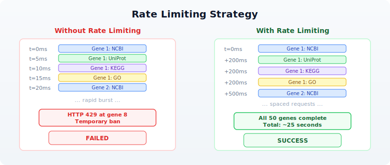

# Day 24: Programmatic Database Access

| | |
|---|---|
| **Difficulty** | Intermediate |
| **Biology knowledge** | Intermediate (gene names, protein accessions, pathway concepts, variant notation) |
| **Coding knowledge** | Intermediate (functions, records, error handling, pipes, tables) |
| **Time** | ~3--4 hours |
| **Prerequisites** | Days 1--23 completed, BioLang installed (see Appendix A) |
| **Data needed** | Generated locally via `init.bl` (gene list) |
| **Requirements** | Internet access for all API examples |

## What You'll Learn

- Why programmatic database access replaces manual copy-paste from web browsers
- How to query NCBI for gene information and nucleotide sequences
- How to retrieve gene annotations from Ensembl and predict variant effects
- How to search UniProt for protein information and functional annotations
- How to explore metabolic pathways via KEGG and Reactome
- How to build protein interaction networks with STRING
- How to look up Gene Ontology terms and annotations
- How to compose multi-database annotation pipelines with error handling
- How to implement rate limiting and result caching strategies

---

## The Problem

*"The gene list from my experiment --- what's already known about these genes?"*

You have just finished a differential expression analysis. The statistics are clean: 50 genes pass your significance threshold (adjusted p-value < 0.05, absolute log2 fold change > 1.5). You have gene symbols, fold changes, and p-values. But gene symbols alone tell you nothing about *biology*.

What do these genes do? What pathways are they in? Do any have known disease associations? Are the upregulated genes in the same protein complex? Does the literature already link any of them to your phenotype?

The answers live in public databases. NCBI has gene summaries and literature links. Ensembl has genomic coordinates and cross-references. UniProt has protein function and domain annotations. KEGG and Reactome have pathway maps. STRING has protein-protein interaction networks. Gene Ontology has standardized functional terms.

You could visit each database's website, type each gene name into a search box, and copy results into a spreadsheet. For 50 genes across 8 databases, that is 400 manual searches. At two minutes each, you are looking at 13 hours of clicking and copying --- and you will make mistakes.

Or you could write a script that does all 400 queries in under five minutes.

---

## The Bioinformatics Database Landscape

Before writing code, you need to know which database answers which question. The following map shows the major public databases and their primary use cases:


Each database has a REST API. BioLang wraps these APIs as built-in functions, so you do not need to construct URLs, parse JSON responses, or handle HTTP status codes yourself.

---

## Section 1: NCBI --- The Central Hub

NCBI (National Center for Biotechnology Information) is the largest biomedical database in the world. Its Entrez system connects dozens of databases: Gene, Nucleotide, Protein, PubMed, and more.

### Searching for Genes

<!-- requires: internet, API access -->

> **Requires CLI:** This example uses network APIs not available in the browser. Run with `bl run`.

The `ncbi_gene()` function searches NCBI Gene by name or symbol:

```bio
let brca1 = ncbi_gene("BRCA1")
```

This returns a record with gene ID, description, chromosome location, and summary. The summary field is particularly valuable --- it is a curated, human-written paragraph describing what the gene does.

To search across any NCBI database, use `ncbi_search()`:

```bio
let results = ncbi_search("gene", "BRCA1 AND Homo sapiens[ORGN]")
```

The first argument is the database name (gene, nuccore, protein, pubmed, etc.), and the second is an Entrez query string. NCBI's query syntax supports Boolean operators, field tags like `[ORGN]` for organism, and range queries.

### Fetching Sequences

<!-- requires: internet, API access -->

Once you have an accession or ID, you can fetch the actual sequence:

```bio
let seq = ncbi_sequence("nuccore", "NM_007294.4")
```

This retrieves the nucleotide sequence for the BRCA1 mRNA transcript. The `ncbi_sequence()` function takes a database name and an accession number.

### NCBI Datasets

<!-- requires: internet, API access -->

For richer, more structured gene data, NCBI Datasets provides a modern API:

```bio
let gene_data = datasets_gene("TP53")
```

This returns detailed gene information including genomic ranges, transcript variants, and cross-references --- often more structured than the classic Entrez output.

---

## Section 2: Ensembl --- Genomic Annotations

Ensembl is the European counterpart to NCBI, maintained by EMBL-EBI. It excels at genomic coordinate mapping, cross-species comparisons, and variant annotation.

### Gene Information

<!-- requires: internet, API access -->

You can look up genes by their Ensembl ID or by symbol:

```bio
let gene_by_id = ensembl_gene("ENSG00000141510")

let gene_by_symbol = ensembl_symbol("homo_sapiens", "TP53")
```

The `ensembl_gene()` function takes an Ensembl stable ID (e.g., ENSG for genes, ENST for transcripts). The `ensembl_symbol()` function takes a species name and gene symbol.

### Fetching Sequences

<!-- requires: internet, API access -->

```bio
let sequence = ensembl_sequence("ENSG00000141510")
```

This returns the genomic sequence for the gene. Ensembl sequences include the full genomic region, not just the coding sequence.

### Variant Effect Prediction

<!-- requires: internet, API access -->

One of Ensembl's most powerful features is VEP (Variant Effect Predictor). Given a variant in HGVS notation, VEP tells you its predicted functional consequence:

```bio
let effects = ensembl_vep("9:g.22125504G>C")
```

VEP returns consequence types (missense, synonymous, splice site, etc.), affected transcripts, protein changes, and pathogenicity predictions. This is essential for variant interpretation in clinical genomics.

---

## Section 3: UniProt --- Protein Knowledge

UniProt is the most comprehensive protein database. It contains manually curated protein function, domain annotations, post-translational modifications, and subcellular localization.

### Searching Proteins

<!-- requires: internet, API access -->

```bio
let results = uniprot_search("gene:BRCA1 AND organism_id:9606")
```

UniProt's query syntax supports field-specific searches. The organism ID 9606 is *Homo sapiens*. Results include accession numbers, protein names, and review status (Swiss-Prot entries are manually curated; TrEMBL entries are automated).

### Getting Protein Details

<!-- requires: internet, API access -->

With an accession number, you can retrieve the full entry:

```bio
let entry = uniprot_entry("P38398")
```

The entry record contains protein name, function description, subcellular location, tissue specificity, disease associations, and cross-references to other databases. This single call often provides more biological context than any other database.

---

## Section 4: Pathways and Ontologies

Genes do not act in isolation. Understanding which pathways and biological processes your genes participate in is often more informative than studying individual genes.

### KEGG Pathways

<!-- requires: internet, API access -->

KEGG (Kyoto Encyclopedia of Genes and Genomes) maps genes to metabolic and signaling pathways:

```bio
let pathway = kegg_get("hsa:7157")

let search = kegg_find("pathway", "apoptosis")
```

The `kegg_get()` function retrieves a specific entry by KEGG identifier. KEGG uses its own ID scheme: `hsa:7157` is human gene 7157 (TP53). The `kegg_find()` function searches within a KEGG database.

### Reactome Pathways

<!-- requires: internet, API access -->

Reactome is another major pathway database, with more detailed reaction-level annotations:

```bio
let pathways = reactome_pathways("TP53")
```

This returns all Reactome pathways that include TP53. Reactome pathways are hierarchically organized, from broad categories ("Signal Transduction") down to specific reactions ("TP53 Regulates Transcription of Cell Death Genes").

### Gene Ontology

<!-- requires: internet, API access -->

Gene Ontology (GO) provides a standardized vocabulary for gene function, organized into three domains:

- **Biological Process** (BP) --- what the gene does (e.g., "apoptotic process")
- **Molecular Function** (MF) --- how it does it (e.g., "DNA binding")
- **Cellular Component** (CC) --- where it does it (e.g., "nucleus")

```bio
let term = go_term("GO:0006915")

let annotations = go_annotations("TP53")
```

The `go_term()` function retrieves details about a specific GO term. The `go_annotations()` function retrieves all GO annotations for a gene, across all three domains.

---

## Section 5: Protein Networks --- STRING

<!-- requires: internet, API access -->

STRING (Search Tool for the Retrieval of Interacting Genes/Proteins) maps known and predicted protein-protein interactions:

```bio
let network = string_network(["TP53", "MDM2", "CDKN1A", "BAX", "BCL2"])
```

Note that `string_network()` takes a **list** of identifiers, not a single string. This is because protein interactions are inherently about relationships between multiple proteins. The result includes interaction scores (from 0 to 1) based on experimental evidence, text mining, co-expression, and genomic context.

STRING is particularly useful for understanding whether your differentially expressed genes form a connected network or are scattered across unrelated pathways.

### PDB Structures

<!-- requires: internet, API access -->

For genes with known 3D structures, the Protein Data Bank provides structural information:

```bio
let structure = pdb_entry("1TUP")
```

This retrieves metadata about PDB entry 1TUP (the TP53 DNA-binding domain), including resolution, experimental method, authors, and ligands.

---

## Section 6: Building an Annotation Pipeline

Now that you know the individual databases, let us combine them into a pipeline that annotates an entire gene list. This is where BioLang's pipe-first design shines --- each annotation step flows naturally into the next.

### The Pipeline Architecture


### Single-Gene Annotation Function

<!-- requires: internet, API access -->

> **Requires CLI:** This example uses network APIs not available in the browser. Run with `bl run`.

Start by writing a function that annotates one gene. Wrap each API call in `try/catch` because any individual query might fail (the gene might not exist in that database, or the API might be temporarily unavailable):

```bio
let annotate_gene = |symbol| {
    let result = {symbol: symbol}

    let gene_info = try {
        ncbi_gene(symbol)
    } catch err {
        nil
    }

    let protein_info = try {
        uniprot_search(f"gene:{symbol} AND organism_id:9606")
    } catch err {
        nil
    }

    let pathways = try {
        reactome_pathways(symbol)
    } catch err {
        nil
    }

    let go = try {
        go_annotations(symbol)
    } catch err {
        nil
    }

    {
        symbol: symbol,
        ncbi: gene_info,
        uniprot: protein_info,
        pathways: pathways,
        go_terms: go
    }
}
```

This function returns a record with all available annotations for one gene. If any database is unreachable or the gene is not found, that field is `nil` rather than crashing the entire pipeline.

### Annotating a Gene List

<!-- requires: internet, API access -->

With the single-gene function defined, annotating an entire list is a single pipe:

```bio
let genes = ["TP53", "BRCA1", "EGFR", "KRAS", "MYC"]

let annotations = genes |> map(|g| annotate_gene(g))
```

This produces a list of annotation records. Each record contains everything we know about that gene from four different databases.

### Rate Limiting

Public APIs have rate limits. NCBI allows 3 requests per second without an API key (10 with one). Ensembl allows 15 requests per second. UniProt allows roughly 25 requests per second.

When you annotate 50 genes with 4 API calls each, you are making 200 requests. Without rate limiting, you will hit rate limits and get errors or temporary bans.

The simplest rate-limiting strategy is to add a delay between requests:

```bio
let annotate_with_delay = |symbol| {
    let result = annotate_gene(symbol)
    sleep(500)
    result
}

let annotations = genes |> map(|g| annotate_with_delay(g))
```

The `sleep(500)` call pauses for 500 milliseconds (half a second) between genes. This keeps you well under all rate limits.

### Rate Limiting Strategy



For 50 genes at 500ms each, the total runtime is about 25 seconds. That is far better than 13 hours of manual browsing.

---

## Section 7: Error Handling for API Calls

Network requests fail. Servers go down. Genes have different names in different databases. A robust annotation pipeline handles all of these cases.

### Retry Logic

<!-- requires: internet, API access -->

Some failures are transient --- a server timeout, a momentary network glitch. For these, retrying often works:

```bio
let retry = |f, max_attempts| {
    let attempt = 1
    let result = nil
    let success = false

    while attempt <= max_attempts and !success {
        let outcome = try {
            f()
        } catch err {
            nil
        }

        if outcome != nil {
            result = outcome
            success = true
        } else {
            attempt = attempt + 1
            sleep(1000 * attempt)
        }
    }
    result
}
```

This function takes a zero-argument closure and retries it up to `max_attempts` times, with exponential backoff (1 second after the first failure, 2 seconds after the second, etc.).

Use it in your annotation pipeline:

```bio
let safe_ncbi = |symbol| retry(|| ncbi_gene(symbol), 3)
```

### Collecting Errors

Rather than silently swallowing errors, track them so you can report which genes failed and why:

```bio
let annotate_with_tracking = |symbol| {
    let errors = []

    let gene_info = try {
        ncbi_gene(symbol)
    } catch err {
        errors = errors + [f"NCBI: {err}"]
        nil
    }

    let protein = try {
        uniprot_search(f"gene:{symbol} AND organism_id:9606")
    } catch err {
        errors = errors + [f"UniProt: {err}"]
        nil
    }

    {
        symbol: symbol,
        ncbi: gene_info,
        uniprot: protein,
        errors: errors,
        error_count: len(errors)
    }
}
```

After annotating all genes, you can filter for problematic ones:

```bio
let failed = annotations |> filter(|a| a.error_count > 0)
```

---

## Section 8: Caching Results

If you run your annotation pipeline multiple times during development, you are making the same API calls repeatedly. This wastes time and strains public servers. A simple file-based cache avoids redundant queries.

### Write-Through Cache Pattern

<!-- requires: internet, API access -->

```bio
let cached_query = |name, query_fn| {
    let cache_file = f"data/cache/{name}.json"

    let cached = try {
        read(cache_file) |> json_decode()
    } catch err {
        nil
    }

    if cached != nil {
        cached
    } else {
        let result = query_fn()
        let json = result |> json_encode()
        write(cache_file, json)
        result
    }
}
```

Use it to wrap any API call:

```bio
let tp53_ncbi = cached_query("tp53_ncbi", || ncbi_gene("TP53"))
```

The first call hits the API and saves the result to disk. Subsequent calls read from disk, completing instantly. This pattern is especially valuable during pipeline development, when you re-run the script dozens of times while tweaking downstream analysis steps.

---

## Section 9: Cross-Database Integration

The real power of programmatic access emerges when you combine data from multiple databases into a unified view. Each database contributes a different facet of biological knowledge.

### Multi-Database Annotation Table

<!-- requires: internet, API access -->

> **Requires CLI:** This example uses network APIs not available in the browser. Run with `bl run`.

Here is a complete pipeline that builds an annotation table from multiple sources:

```bio
let build_annotation = |symbol| {
    let ncbi = try { ncbi_gene(symbol) } catch err { nil }
    sleep(200)

    let ensembl = try { ensembl_symbol("homo_sapiens", symbol) } catch err { nil }
    sleep(200)

    let uniprot = try { uniprot_search(f"gene:{symbol} AND organism_id:9606") } catch err { nil }
    sleep(200)

    let pathways = try { reactome_pathways(symbol) } catch err { nil }
    sleep(200)

    {
        symbol: symbol,
        ncbi_summary: if ncbi != nil { str(ncbi) } else { "N/A" },
        ensembl_id: if ensembl != nil { str(ensembl) } else { "N/A" },
        uniprot_hit: if uniprot != nil { str(uniprot) } else { "N/A" },
        pathway_count: if pathways != nil { len(pathways) } else { 0 }
    }
}

let genes = read_csv("data/gene_list.csv")
    |> select("symbol")

let symbols = genes |> map(|row| row.symbol)

let results = symbols |> map(|s| build_annotation(s))

let annotation_table = results |> to_table()

write_csv(annotation_table, "data/annotations.csv")
```

This pipeline reads a gene list, queries four databases per gene with rate limiting, builds a structured record per gene, converts to a table, and writes the result. The entire workflow is 25 lines of BioLang.

### The Annotation Pipeline Flow

```
  Input: gene_list.csv                   Output: annotations.csv
  ┌────────────────┐                     ┌─────────────────────────────┐
  │ symbol         │                     │ symbol | ncbi_summary | ... │
  │ ──────         │                     │ ────── | ──────────── | ... │
  │ TP53           │──┐                  │ TP53   | Tumor prot...| ... │
  │ BRCA1          │  │  Per gene:       │ BRCA1  | BRCA1 DNA ..| ... │
  │ EGFR           │  ├─► NCBI          │ EGFR   | Epidermal ..| ... │
  │ KRAS           │  ├─► Ensembl       │ KRAS   | GTPase KRa..| ... │
  │ MYC            │  ├─► UniProt       │ MYC    | Transcripti..| ... │
  │ ...            │  ├─► Reactome      │ ...    | ...          | ... │
  └────────────────┘  │  (200ms delay)   └─────────────────────────────┘
                      │
                      └─► to_table() ──► write_csv()
```

---

## Section 10: Practical Patterns

### Pattern 1: Gene Symbol to Protein Structure

<!-- requires: internet, API access -->

Find whether a gene's protein has a solved 3D structure:

```bio
let has_structure = |symbol| {
    let uniprot = try { uniprot_entry(symbol) } catch err { nil }
    let pdb_ids = if uniprot != nil {
        try { uniprot_search(f"gene:{symbol} AND database:pdb AND organism_id:9606") } catch err { nil }
    } else {
        nil
    }
    {symbol: symbol, has_pdb: pdb_ids != nil}
}
```

### Pattern 2: Variant Annotation

<!-- requires: internet, API access -->

Given a list of variants in HGVS notation, predict their functional effects:

```bio
let annotate_variant = |hgvs| {
    let vep = try { ensembl_vep(hgvs) } catch err { nil }
    sleep(200)
    {variant: hgvs, effects: vep}
}

let variants = ["9:g.22125504G>C", "17:g.43093449G>A"]
let effects = variants |> map(|v| annotate_variant(v))
```

### Pattern 3: Interaction Subnetwork

<!-- requires: internet, API access -->

Given your differentially expressed genes, find which ones interact:

```bio
let de_genes = ["TP53", "MDM2", "CDKN1A", "BRCA1", "EGFR"]
let network = try {
    string_network(de_genes)
} catch err {
    nil
}
```

This reveals whether your gene list forms a connected network (suggesting a shared pathway) or consists of isolated nodes (suggesting independent effects).

---

## Exercises

### Exercise 1: Five-Gene Annotation Report

Write a script that takes five gene symbols and produces a TSV file with columns: symbol, ncbi_found (true/false), ensembl_id (or "N/A"), uniprot_accession (or "N/A"), pathway_count, go_term_count. Use `try/catch` for every API call and include 300ms delays between genes.

**Genes to annotate**: TP53, BRCA1, EGFR, KRAS, MYC

### Exercise 2: Variant Effect Batch Processor

Write a function that takes a list of HGVS variant strings, runs `ensembl_vep()` on each with rate limiting, and returns a table of results. Handle failures gracefully --- a failed VEP lookup should produce a row with "error" in the consequence column rather than crashing.

### Exercise 3: Pathway Overlap Finder

Given two gene lists (e.g., upregulated and downregulated), use `reactome_pathways()` to find pathways that contain genes from both lists. These shared pathways suggest biological processes that are being actively remodeled.

### Exercise 4: Build a Cache Layer

Wrap the annotation pipeline from Section 6 with file-based caching (Section 8). The first run should query all APIs and save results to `data/cache/`. The second run should complete in under one second by reading from cache. Verify by timing both runs.

---

## Key Takeaways

1. **Public databases are APIs, not websites.** Every major bioinformatics database has a programmatic interface. BioLang wraps these as built-in functions, so you write `ncbi_gene("TP53")` instead of constructing HTTP requests.

2. **Different databases answer different questions.** NCBI for gene summaries, Ensembl for genomic coordinates and variant effects, UniProt for protein function, KEGG and Reactome for pathways, STRING for interaction networks, GO for standardized functional terms.

3. **Always handle errors.** API calls fail for many reasons: gene not found, server down, rate limit exceeded, network timeout. Wrap every call in `try/catch` and design your pipeline to tolerate partial failures.

4. **Rate limiting is not optional.** Public APIs serve millions of researchers. Adding a `sleep(200)` between calls is a small cost that prevents you from being blocked and keeps the service available for everyone.

5. **Cache aggressively during development.** Gene annotations change slowly (monthly at most). Save API results to files so you can iterate on downstream analysis without repeating queries.

6. **Cross-database integration multiplies value.** A gene name from NCBI, a protein accession from UniProt, pathway membership from Reactome, and interaction data from STRING --- combined, these tell a story that no single database can tell alone.

---

*Next: Day 25 --- Workflow Orchestration, where we chain analysis steps into reproducible, automated pipelines.*
