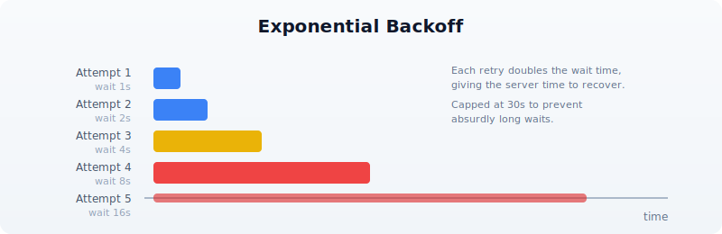

# Day 25: Error Handling in Production

| | |
|---|---|
| **Difficulty** | Intermediate--Advanced |
| **Biology knowledge** | Intermediate (FASTQ quality scores, FASTA format, sequence data) |
| **Coding knowledge** | Intermediate (functions, records, pipes, tables, file I/O) |
| **Time** | ~3 hours |
| **Prerequisites** | Days 1--24 completed, BioLang installed (see Appendix A) |
| **Data needed** | Generated locally via `init.bl` (includes intentionally corrupted files) |

## What You'll Learn

- Why production pipelines need deliberate error handling strategies
- How to use `try/catch` to recover from failures without crashing
- How to validate inputs before processing begins
- How to implement retry logic for transient failures
- How to handle partial failures in batch processing
- How to log errors for post-mortem debugging
- How to build resilient pipelines that degrade gracefully
- How to test error paths systematically

---

## The Problem

*"My pipeline crashed at 3 AM on sample 187 of 200 --- now what?"*

You have built an overnight pipeline that processes 200 FASTQ files, filters them for quality, extracts sequence statistics, and writes a summary report. It ran perfectly on your test set of 10 files. You submitted it at midnight and went to sleep. At 7 AM, you check the results and find: the pipeline crashed on sample 187. Samples 1--186 were processed, but samples 188--200 were never touched. The error message says "unexpected character at line 4" --- a corrupted FASTQ record.

Now you face a cascade of bad options. You could restart the entire pipeline from scratch, wasting 6 hours of compute on samples you already processed. You could manually edit sample 187 out of the input list and run only 188--200, but that requires you to understand exactly where the pipeline state was left. You could fix the corrupted file, but you need to find which of 200 files is sample 187, and you do not know if there are more corrupted files downstream.

All of these problems share a root cause: the pipeline assumed every input would be well-formed. It had no plan for failure.

Production bioinformatics pipelines encounter every category of error:


This chapter teaches you to handle all of them. By the end, you will have a pipeline that processes every valid sample, skips corrupted ones, retries transient failures, logs everything, and produces a report telling you exactly what happened.

---

## Section 1: try/catch Basics

The `try/catch` construct is BioLang's mechanism for recovering from errors. When code inside `try` throws an error, execution jumps to the `catch` block instead of crashing the entire program.

### Your First try/catch

The simplest pattern catches an error and substitutes a default value:

```bio
let result = try { int("not_a_number") } catch err { -1 }
```

The variable `err` in the `catch` block contains the error message as a string. You can inspect it, log it, or ignore it:

```bio
let value = try {
    read_csv("missing_file.csv")
} catch err {
    println(f"Warning: {err}")
    []
}
```

This is fundamentally different from letting the error crash your program. Without `try/catch`, a missing file terminates everything. With it, you decide what happens next.

### try/catch Is an Expression

In BioLang, `try/catch` returns a value. This means you can use it anywhere you would use an expression --- in variable assignments, function arguments, or pipe chains:

```bio
let samples = try { read_csv("samples.csv") } catch err { [] }

let count = len(try { read_lines("data.txt") } catch err { [] })

let safe_mean = try { mean(values) } catch err { 0.0 }
```

This is more concise than languages where `try/catch` is a statement that cannot return a value.

### Nested try/catch

You can nest `try/catch` blocks when different operations need different fallback strategies:

```bio
let result = try {
    let data = try { read_csv("primary.csv") } catch err { read_csv("backup.csv") }
    data |> filter(|row| row.quality > 20)
} catch err {
    println(f"Both data sources failed: {err}")
    []
}
```

The inner `try/catch` tries a primary file and falls back to a backup. The outer `try/catch` handles the case where both files are missing or the filter operation fails.

### Throwing Errors

Use `error()` to throw your own errors. This is how you enforce preconditions and signal problems to callers:

```bio
let validate_quality = |threshold| {
    if threshold < 0 {
        error("Quality threshold cannot be negative")
    }
    if threshold > 41 {
        error("Quality threshold exceeds Phred+33 maximum")
    }
    threshold
}

let q = try { validate_quality(-5) } catch err { println(err) }
```

Custom errors make debugging vastly easier than cryptic runtime errors. When your pipeline fails at 3 AM, `"Quality threshold cannot be negative"` tells you exactly what went wrong and where.

---

## Section 2: Error Types and Messages

Not all errors deserve the same response. A corrupted file is permanent --- retrying will not fix it. A network timeout is transient --- retrying might succeed. Your error handling strategy should distinguish between these.

### Classifying Errors

A practical approach is to examine the error message string:

```bio
let classify_error = |err_msg| {
    if contains(err_msg, "not found") { "missing" }
    else if contains(err_msg, "permission") { "access" }
    else if contains(err_msg, "timeout") { "transient" }
    else if contains(err_msg, "parse") { "data_corrupt" }
    else if contains(err_msg, "disk") { "resource" }
    else { "unknown" }
}
```

This classification drives different recovery strategies:

```bio
let handle_error = |err_msg, context| {
    let category = classify_error(err_msg)
    if category == "transient" {
        { action: "retry", message: err_msg, context: context }
    } else if category == "missing" {
        { action: "skip", message: err_msg, context: context }
    } else if category == "data_corrupt" {
        { action: "skip", message: err_msg, context: context }
    } else if category == "resource" {
        { action: "abort", message: err_msg, context: context }
    } else {
        { action: "log_and_skip", message: err_msg, context: context }
    }
}
```

### Structured Error Records

Instead of returning bare values or `nil` on failure, return structured records that carry context:

```bio
let safe_read_fastq = |path| {
    try {
        let records = read_fastq(path)
        { ok: true, data: records, path: path, error: nil }
    } catch err {
        { ok: false, data: [], path: path, error: err }
    }
}
```

The caller can then inspect the `ok` field:

```bio
let result = safe_read_fastq("sample_01.fastq")
if result.ok {
    let stats = process(result.data)
} else {
    println(f"Skipping {result.path}: {result.error}")
}
```

This pattern --- often called a "result record" --- keeps errors in the data flow rather than in the control flow. You never lose track of which file failed or why.

---

## Section 3: Retry Logic

Transient errors --- network timeouts, rate limits, temporary server unavailability --- often resolve on their own. Retry logic gives your pipeline resilience against these hiccups.

### Simple Retry

The simplest retry pattern loops a fixed number of times:

```bio
let retry = |f, max_attempts| {
    let attempt = 1
    let last_error = ""
    let result = nil
    let succeeded = false

    range(0, max_attempts) |> each(|i| {
        if succeeded == false {
            try {
                result = f()
                succeeded = true
            } catch err {
                last_error = err
                attempt = attempt + 1
                sleep(1000)
            }
        }
    })

    if succeeded { result }
    else { error(f"Failed after {max_attempts} attempts: {last_error}") }
}
```

Usage:

```bio
let data = retry(|| { read_csv("network_share/data.csv") }, 3)
```

### Retry with Exponential Backoff

Fixed-interval retries can overwhelm a struggling server. Exponential backoff increases the wait time between attempts, giving the server time to recover:



```bio
let retry_backoff = |f, max_attempts, base_delay_ms| {
    let last_error = ""
    let result = nil
    let succeeded = false

    range(0, max_attempts) |> each(|i| {
        if succeeded == false {
            try {
                result = f()
                succeeded = true
            } catch err {
                last_error = err
                let delay = base_delay_ms
                range(0, i) |> each(|_| { delay = delay * 2 })
                if delay > 30000 { delay = 30000 }
                sleep(delay)
            }
        }
    })

    if succeeded { result }
    else { error(f"Failed after {max_attempts} attempts: {last_error}") }
}
```

The cap at 30 seconds prevents absurdly long waits. In practice, if a service is not responding after 30 seconds of backoff, it is probably down for maintenance --- not experiencing a brief hiccup.

### Retry Only Transient Errors

Not every error deserves a retry. Retrying a "file not found" error is pointless. Combine error classification with retry logic:

```bio
let retry_if_transient = |f, max_attempts| {
    let last_error = ""
    let result = nil
    let succeeded = false

    range(0, max_attempts) |> each(|i| {
        if succeeded == false {
            try {
                result = f()
                succeeded = true
            } catch err {
                last_error = err
                let category = classify_error(err)
                if category != "transient" {
                    error(err)
                }
                sleep(1000)
            }
        }
    })

    if succeeded { result }
    else { error(f"Failed after {max_attempts} attempts: {last_error}") }
}
```

---

## Section 4: Input Validation

The cheapest error to handle is the one you prevent. Validating inputs before processing begins catches problems early, when the error message can be specific and actionable.

### File Existence and Format

```bio
let validate_input_file = |path, expected_ext| {
    if file_exists(path) == false {
        error(f"Input file not found: {path}")
    }

    if ends_with(path, expected_ext) == false {
        error(f"Expected {expected_ext} file, got: {path}")
    }

    let lines = read_lines(path)
    if len(lines) == 0 {
        error(f"Input file is empty: {path}")
    }

    true
}
```

### FASTQ Record Validation

FASTQ files have a strict four-line structure. A corrupted file might have truncated records, missing quality lines, or mismatched sequence/quality lengths:

```bio
let validate_fastq_record = |record| {
    if typeof(record) != "Record" {
        error("Invalid record type")
    }

    let seq = record.sequence
    let qual = record.quality

    if len(seq) == 0 {
        error(f"Empty sequence in record: {record.id}")
    }

    if len(seq) != len(qual) {
        error(f"Sequence/quality length mismatch in {record.id}: seq={len(seq)} qual={len(qual)}")
    }

    true
}
```

### Batch Input Validation

Before processing 200 files, check them all first. This takes seconds and saves hours:

```bio
let validate_batch = |file_paths| {
    let errors = []

    file_paths |> each(|path| {
        try {
            validate_input_file(path, ".fastq")
        } catch err {
            errors = errors + [{ path: path, error: err }]
        }
    })

    if len(errors) > 0 {
        errors |> each(|e| {
            println(f"INVALID: {e.path} --- {e.error}")
        })
        error(f"Validation failed: {len(errors)} of {len(file_paths)} files have problems")
    }

    true
}
```

The decision flow for whether to abort or continue depends on how many files fail validation:


---

## Section 5: Defensive File I/O

File operations are a leading source of pipeline failures. Files can be missing, empty, corrupted, in the wrong format, or on a filesystem that runs out of space mid-write.

### Safe Reading

Wrap every file read in a function that validates the result:

```bio
let safe_read_csv = |path| {
    if file_exists(path) == false {
        error(f"File not found: {path}")
    }

    let data = try {
        read_csv(path)
    } catch err {
        error(f"Failed to parse CSV {path}: {err}")
    }

    if len(data) == 0 {
        error(f"CSV file is empty: {path}")
    }

    data
}
```

### Safe Writing with Verification

Writing is trickier than reading. A write can appear to succeed but produce a truncated file if the disk fills up mid-write. Write to a temporary file first, then verify:

```bio
let safe_write_csv = |data, path| {
    let tmp_path = path + ".tmp"

    try {
        write_csv(data, tmp_path)
    } catch err {
        error(f"Failed to write {path}: {err}")
    }

    if file_exists(tmp_path) == false {
        error(f"Write appeared to succeed but temp file not found: {tmp_path}")
    }

    let verify = try { read_csv(tmp_path) } catch err {
        error(f"Written file is not valid CSV: {err}")
    }

    if len(verify) != len(data) {
        error(f"Row count mismatch: wrote {len(data)} but read back {len(verify)}")
    }

    try {
        write_csv(data, path)
    } catch err {
        error(f"Failed to write final output to {path}: {err}")
    }

    true
}
```

### Directory Safety

```bio
let ensure_dir = |path| {
    try {
        mkdir(path)
    } catch err {
        if contains(str(err), "exists") == false {
            error(f"Cannot create directory {path}: {err}")
        }
    }
}
```

---

## Section 6: Partial Failure and Recovery

In batch processing, the question is not *if* a sample will fail but *when*. The key design decision is: should a single failure stop everything, or should the pipeline continue with the remaining samples?

### The Accumulator Pattern

Process each item independently and collect successes and failures separately:

```bio
let process_batch = |items, process_fn| {
    let successes = []
    let failures = []

    items |> each(|item| {
        try {
            let result = process_fn(item)
            successes = successes + [result]
        } catch err {
            failures = failures + [{ item: item, error: err }]
        }
    })

    { successes: successes, failures: failures }
}
```

This pattern guarantees that one bad sample never prevents the other 199 from being processed.

### Checkpointing

For long-running pipelines, save progress periodically so you can resume after a crash:

```bio
let process_with_checkpoint = |items, process_fn, checkpoint_path| {
    let completed = if file_exists(checkpoint_path) {
        try { json_decode(read_lines(checkpoint_path) |> join("\n")) } catch err { [] }
    } else {
        []
    }

    let remaining = items |> filter(|item| {
        let done = completed |> filter(|c| c == item)
        len(done) == 0
    })

    remaining |> each(|item| {
        try {
            process_fn(item)
            completed = completed + [item]
            write_lines([json_encode(completed)], checkpoint_path)
        } catch err {
            println(f"Failed: {item} --- {err}")
        }
    })

    completed
}
```

If the pipeline crashes at sample 187, you restart it and it picks up at sample 188 --- no wasted work.

### Error Propagation Flow

Understanding how errors flow through a pipeline helps you place `try/catch` blocks at the right level:


The rule of thumb: catch data errors at the per-sample level (skip and continue), but let resource errors (disk full, out of memory) propagate up and abort the pipeline. There is no point processing 200 samples if you cannot write the results.

---

## Section 7: Logging Errors

When a pipeline runs overnight, `print()` output disappears into a terminal that nobody is watching. Write errors to a structured log file that you can analyze after the fact.

### Error Log as a Table

```bio
let create_error_log = || {
    []
}

let log_error = |log, timestamp, source, severity, message| {
    log + [{
        timestamp: timestamp,
        source: source,
        severity: severity,
        message: message
    }]
}

let save_error_log = |log, path| {
    if len(log) > 0 {
        let table = log |> to_table()
        write_csv(table, path)
    } else {
        write_lines(["timestamp,source,severity,message"], path)
    }
}
```

Usage in a pipeline:

```bio
let errors = create_error_log()
let timestamp = format_date(now(), "%Y-%m-%d %H:%M:%S")

errors = log_error(errors, timestamp, "sample_187.fastq", "ERROR",
    "Truncated record at line 4")
errors = log_error(errors, timestamp, "sample_192.fastq", "WARN",
    "Low quality, 80% filtered")

save_error_log(errors, "output/error_log.csv")
```

After the pipeline finishes (or crashes), the error log tells you exactly what happened:

```
timestamp,source,severity,message
2025-01-15 03:14:22,sample_187.fastq,ERROR,Truncated record at line 4
2025-01-15 03:28:45,sample_192.fastq,WARN,Low quality 80% filtered
```

### Summary Statistics

At the end of a pipeline run, produce a summary that answers the key question: *Did it work?*

```bio
let summarize_run = |total, successes, failures, errors| {
    let success_rate = if total > 0 { (successes * 100) / total } else { 0 }
    {
        total_samples: total,
        succeeded: successes,
        failed: failures,
        success_rate_pct: success_rate,
        error_count: len(errors),
        status: if failures == 0 { "COMPLETE" }
                else if success_rate > 90 { "PARTIAL_SUCCESS" }
                else { "FAILED" }
    }
}
```

---

## Section 8: Building a Resilient Pipeline

Let us put all the pieces together. This section builds a production-grade FASTQ processing pipeline that handles every error category from the taxonomy at the start of this chapter.

### Pipeline Architecture

```
  INPUT FILES                    VALIDATION           PROCESSING          OUTPUT
  ──────────                     ──────────           ──────────          ──────
  sample_001.fastq  ──┐
  sample_002.fastq  ──┤     ┌────────────────┐   ┌──────────────┐   ┌──────────┐
  sample_003.fastq  ──┼────▶│  Check exists   │──▶│  Read FASTQ   │──▶│  Stats   │
  ...               ──┤     │  Check format   │   │  Filter qual  │   │  Table   │
  sample_200.fastq  ──┘     │  Check non-empty│   │  Compute GC   │   │          │
                            └───────┬────────┘   └──────┬───────┘   └────┬─────┘
                                    │                    │                │
                              skip invalid          skip corrupt    write results
                              log reason            log reason      + error log
                                    │                    │                │
                                    ▼                    ▼                ▼
                              error_log.csv        error_log.csv    summary.json
```

### The Complete Pipeline

```bio
let run_pipeline = |input_dir, output_dir| {
    ensure_dir(output_dir)

    let errors = create_error_log()
    let results = []
    let timestamp = format_date(now(), "%Y-%m-%d %H:%M:%S")

    let files = try {
        list_dir(input_dir) |> filter(|f| ends_with(f, ".fastq"))
    } catch err {
        errors = log_error(errors, timestamp, input_dir, "FATAL",
            f"Cannot list directory: {err}")
        save_error_log(errors, output_dir + "/error_log.csv")
        error(f"Cannot access input directory: {err}")
    }

    if len(files) == 0 {
        error(f"No FASTQ files found in {input_dir}")
    }

    files |> each(|file| {
        let path = input_dir + "/" + file
        let ts = format_date(now(), "%Y-%m-%d %H:%M:%S")

        try {
            let records = read_fastq(path)

            if len(records) == 0 {
                errors = log_error(errors, ts, file, "WARN",
                    "Empty file, skipping")
            } else {
                let valid = records |> filter(|r| {
                    let ok = try {
                        len(r.sequence) == len(r.quality)
                    } catch err { false }
                    ok
                })

                let filtered = valid |> quality_filter(20)

                let stats = {
                    file: file,
                    total_records: len(records),
                    valid_records: len(valid),
                    passed_qc: len(filtered),
                    pct_passed: if len(valid) > 0 {
                        (len(filtered) * 100) / len(valid)
                    } else { 0 },
                    mean_gc: if len(filtered) > 0 {
                        filtered
                            |> map(|r| gc_content(r.sequence))
                            |> mean()
                    } else { 0.0 }
                }

                results = results + [stats]

                if len(valid) < len(records) {
                    let dropped = len(records) - len(valid)
                    errors = log_error(errors, ts, file, "WARN",
                        f"{dropped} records had seq/qual length mismatch")
                }
            }
        } catch err {
            errors = log_error(errors, ts, file, "ERROR",
                f"Processing failed: {err}")
        }
    })

    let summary = summarize_run(len(files), len(results),
        len(files) - len(results), errors)

    if len(results) > 0 {
        let table = results |> to_table()
        write_csv(table, output_dir + "/qc_results.csv")
    }

    save_error_log(errors, output_dir + "/error_log.csv")
    write_lines([json_encode(summary)], output_dir + "/summary.json")

    summary
}
```

Call it:

> **Requires CLI:** This example uses file I/O not available in the browser. Run with `bl run`.

```bio
let result = run_pipeline("data/fastq", "data/output")
println(f"Pipeline {result.status}: {result.succeeded}/{result.total_samples} samples processed")
```

---

## Section 9: Testing Error Paths

Most pipelines are tested only with good inputs. Production bugs hide in the error paths --- the code that runs when things go wrong. Test your error handling as deliberately as you test your analysis.

### Testing with Intentionally Bad Data

The `init.bl` script for this chapter generates files specifically designed to trigger errors:

- `good_001.fastq` through `good_005.fastq` --- well-formed, passes all checks
- `truncated.fastq` --- FASTQ file cut off mid-record
- `empty.fastq` --- zero bytes
- `bad_quality.fastq` --- valid format but all low-quality bases
- `mismatched.fastq` --- sequence and quality lines have different lengths

A robust pipeline should handle all five error cases without crashing, processing the good samples and logging the bad ones.

### Testing Error Classification

```bio
let test_classify = || {
    let cases = [
        { input: "file not found: x.fastq", expected: "missing" },
        { input: "permission denied", expected: "access" },
        { input: "connection timeout after 30s", expected: "transient" },
        { input: "parse error at line 4", expected: "data_corrupt" },
        { input: "disk quota exceeded", expected: "resource" },
        { input: "something unexpected", expected: "unknown" }
    ]

    cases |> each(|c| {
        let result = classify_error(c.input)
        if result != c.expected {
            error(f"classify_error failed: got {result}, expected {c.expected}")
        }
    })

    true
}
```

### Testing Retry Logic

```bio
let test_retry = || {
    let call_count = 0

    let flaky_fn = || {
        call_count = call_count + 1
        if call_count < 3 { error("transient failure") }
        "success"
    }

    let result = retry(flaky_fn, 5)

    if result != "success" { error("Retry did not return success") }
    if call_count != 3 { error(f"Expected 3 calls, got {call_count}") }

    true
}
```

---

## Exercises

### Exercise 1: Validate a Sample Sheet

Write a function `validate_sample_sheet(path)` that reads a CSV sample sheet and checks:
- File exists and is non-empty
- Required columns `sample_id`, `fastq_r1`, and `fastq_r2` are present
- No duplicate `sample_id` values
- All referenced FASTQ files exist

Return a record with `{ valid: bool, errors: [...] }`.

### Exercise 2: Retry with Jitter

Modify the `retry_backoff` function to add random jitter to the delay. When multiple pipelines retry against the same server simultaneously, they can synchronize their retries and create "thundering herd" problems. Adding a random component (e.g., 0--50% of the delay) desynchronizes them.

*Hint*: BioLang does not have a random number builtin, but you can derive jitter from `now()` --- the millisecond component changes rapidly enough to serve as a simple source of variation.

### Exercise 3: Circuit Breaker

Implement a "circuit breaker" pattern: after N consecutive failures to the same service, stop trying for a cooldown period. This prevents a dead service from slowing down your entire pipeline with timeouts.

Write a function that returns a record with `{ call: fn, reset: fn, state: fn }` fields. The `call` field wraps a function with circuit breaker logic: if the breaker is "open" (too many failures), it returns an error immediately without calling the wrapped function.

### Exercise 4: Full Recovery Pipeline

Using the corrupted test data from `init.bl`, build a pipeline that:
1. Validates all input files before processing
2. Processes valid files with per-file error handling
3. Writes a checkpoint after each successful file
4. Produces both a results table and an error log
5. Can be run twice --- on the second run, it skips already-processed files

---

## Key Takeaways

1. **try/catch is an expression** --- use it inline to provide default values, not just for control flow.

2. **Classify errors before handling them.** Transient errors deserve retries. Data errors deserve skipping. Resource errors deserve aborting.

3. **Validate inputs early.** Checking 200 files takes seconds. Processing 186 files before discovering a problem takes hours.

4. **Accumulate, do not abort.** The accumulator pattern (collect successes and failures separately) ensures one bad sample never blocks the other 199.

5. **Checkpoint long pipelines.** Saving progress to disk means you never redo work after a crash.

6. **Log structured errors.** A CSV error log is searchable, sortable, and scriptable. `print()` output is none of these.

7. **Test error paths.** Generate intentionally bad data and verify your pipeline handles it. The code that runs when things go wrong is the code that matters most at 3 AM.

---

*Next: [Day 26 --- AI-Assisted Analysis](day-26.md), where you will use large language models to interpret results, generate hypotheses, and accelerate your biological discoveries.*
