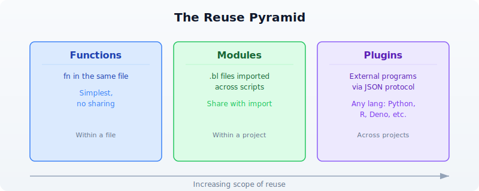

# Day 27: Building Tools and Plugins

| | |
|---|---|
| **Difficulty** | Intermediate--Advanced |
| **Biology knowledge** | Intermediate (sequence analysis, QC metrics, file formats) |
| **Coding knowledge** | Intermediate--Advanced (functions, modules, records, pipes, error handling) |
| **Time** | ~3--4 hours |
| **Prerequisites** | Days 1--26 completed, BioLang installed (see Appendix A) |
| **Data needed** | Generated locally via `init.bl` (simulated sequences, QC data) |

## What You'll Learn

- How to extract reusable functions into BioLang modules
- How to use `import` and `import ... as` to organize code across files
- How to build a sequence utilities library with validation and error handling
- How to build a QC module for quality control workflows
- How to test your modules with `assert()`
- How the BioLang plugin system works (subprocess JSON protocol)
- How to build a Python plugin that extends BioLang
- How to package and share your tools

---

## The Problem

*"I keep copy-pasting the same analysis functions --- can I package them for reuse?"*

You have written the same GC content classifier three times this week. Your FASTA validation function lives in four different scripts, each with slightly different edge-case handling. Last Tuesday you found a bug in your quality score parser and had to fix it in six places. Yesterday your colleague asked for your variant filtering logic and you sent them a script with instructions to "just copy lines 47 through 112."

This is the copy-paste trap, and every bioinformatician falls into it. The solution is packaging your analysis functions into reusable modules and plugins that can be imported, tested, versioned, and shared.



---

## Section 1: The Module System

BioLang's module system lets you split code across files and bring it back together with `import`. Every `.bl` file is a module. Any function or variable defined at the top level of a file is available when that file is imported.

### Basic Import

```biolang
# Import a file — all top-level names become available
import "lib/seq_utils.bl"

# Now you can call functions from that file
let gc = classify_gc("GCGCGCATAT")
```

### Namespaced Import

```biolang
# Import with a namespace — avoids name collisions
import "lib/seq_utils.bl" as seq
import "lib/qc.bl" as qc

let gc = seq.classify_gc("GCGCGCATAT")
let report = qc.summarize(reads)
```

### Module Resolution Order

When you write `import "something"`, BioLang searches in this order:

1. **Relative path** --- relative to the importing file's directory
2. **`BIOLANG_PATH` directories** --- colon-separated paths in the environment variable
3. **`~/.biolang/stdlib/`** --- fallback for unqualified imports

If the path ends with `.bl`, BioLang uses it directly. Otherwise, it tries `<path>.bl` first, then `<path>/main.bl` (for directory-based modules).


### Module Caching

Each module is loaded only once, even if imported from multiple files. BioLang caches modules by their canonical path. Circular imports (A imports B, B imports A) are detected and rejected with a clear error message.


---

## Section 2: Creating a Sequence Utilities Library

Let us build a real library. We will create `lib/seq_utils.bl`, a module that provides sequence analysis functions your whole lab can reuse.

### Project Layout

```
my_project/
├── lib/
│   ├── seq_utils.bl     ← sequence utilities module
│   ├── qc.bl            ← quality control module
│   └── test_utils.bl    ← testing helpers
├── scripts/
│   └── analysis.bl      ← main analysis script
└── tests/
    ├── test_seq.bl      ← tests for seq_utils
    └── test_qc.bl       ← tests for qc
```

### The Sequence Utilities Module

Here is what `lib/seq_utils.bl` looks like. Each function is a self-contained, tested unit:

```biolang
fn validate_dna(seq) {
    let upper_seq = upper(seq)
    let valid = "ACGTN"
    let chars = split(upper_seq, "")
    let invalid = chars |> filter(|c| contains(valid, c) == false)
    if len(invalid) > 0 {
        error(f"Invalid DNA characters: {join(invalid, \", \")}")
    }
    return upper_seq
}

fn classify_gc(seq) {
    let clean = validate_dna(seq)
    let gc = gc_content(clean)
    if gc > 0.6 {
        return { class: "high", gc: gc, label: "GC-rich" }
    } else if gc < 0.4 {
        return { class: "low", gc: gc, label: "AT-rich" }
    } else {
        return { class: "moderate", gc: gc, label: "balanced" }
    }
}

fn find_all_motifs(seq, motif) {
    let clean = validate_dna(seq)
    let positions = find_motif(clean, upper(motif))
    return {
        motif: upper(motif),
        count: len(positions),
        positions: positions
    }
}

fn batch_gc(sequences) {
    sequences |> map(|seq| {
        let result = classify_gc(seq.sequence)
        {
            id: seq.id,
            length: len(seq.sequence),
            gc: result.gc,
            class: result.class,
            label: result.label
        }
    })
}

fn sequence_summary(sequences) {
    let classified = batch_gc(sequences)
    let high = classified |> filter(|s| s.class == "high") |> len()
    let low = classified |> filter(|s| s.class == "low") |> len()
    let moderate = classified |> filter(|s| s.class == "moderate") |> len()
    let gc_values = classified |> map(|s| s.gc)
    return {
        total: len(sequences),
        high_gc: high,
        low_gc: low,
        moderate_gc: moderate,
        mean_gc: mean(gc_values),
        stdev_gc: stdev(gc_values)
    }
}
```

### Using the Module

> **Requires CLI:** This example uses file I/O not available in the browser. Run with `bl run`.

```biolang
import "lib/seq_utils.bl" as seq

let sequences = read_fasta("data/sequences.fasta")

# Classify all sequences by GC content
let classified = seq.batch_gc(sequences)
let gc_table = classified |> to_table()

# Find a motif across all sequences
let tata_hits = sequences |> map(|s| seq.find_all_motifs(s.sequence, "TATAAA"))
let total_hits = tata_hits |> map(|h| h.count) |> sum()
```

---

## Section 3: Creating a QC Module

Quality control is another domain where reusable functions save enormous time. Here is a `lib/qc.bl` module:

```biolang
fn length_stats(sequences) {
    let lengths = sequences |> map(|s| len(s.sequence))
    return {
        count: len(lengths),
        min_len: min(lengths),
        max_len: max(lengths),
        mean_len: mean(lengths),
        median_len: median(lengths)
    }
}

fn gc_distribution(sequences) {
    let gc_values = sequences |> map(|s| gc_content(s.sequence))
    return {
        mean_gc: mean(gc_values),
        min_gc: min(gc_values),
        max_gc: max(gc_values),
        stdev_gc: stdev(gc_values)
    }
}

fn flag_outliers(sequences, min_len, max_len, min_gc, max_gc) {
    sequences |> map(|s| {
        let gc = gc_content(s.sequence)
        let slen = len(s.sequence)
        let flags = []
        if slen < min_len { flags = flags + ["too_short"] }
        if slen > max_len { flags = flags + ["too_long"] }
        if gc < min_gc { flags = flags + ["low_gc"] }
        if gc > max_gc { flags = flags + ["high_gc"] }
        {
            id: s.id,
            length: slen,
            gc: gc,
            flags: flags,
            pass: len(flags) == 0
        }
    })
}

fn qc_summary(sequences) {
    let lstats = length_stats(sequences)
    let gc_dist = gc_distribution(sequences)
    let flagged = flag_outliers(sequences, 50, 10000, 0.2, 0.8)
    let passing = flagged |> filter(|f| f.pass) |> len()
    let failing = flagged |> filter(|f| f.pass == false) |> len()

    return {
        total: lstats.count,
        passing: passing,
        failing: failing,
        pass_rate: passing / lstats.count,
        length: lstats,
        gc: gc_dist
    }
}

fn format_qc_report(summary) {
    return [
        f"Sequences: {summary.total}",
        f"Passing QC: {summary.passing}",
        f"Failing QC: {summary.failing}",
        f"Length range: {summary.length.min_len}-{summary.length.max_len}",
        f"Mean length: {summary.length.mean_len}",
        f"Mean GC: {summary.gc.mean_gc}",
        f"GC stdev: {summary.gc.stdev_gc}"
    ]
}
```

---

## Section 4: Testing Your Modules

Testing is what separates a personal script from a reliable tool. BioLang's `assert()` function is your primary testing mechanism.

### Writing Tests

Create `tests/test_seq.bl`:

```biolang
import "lib/seq_utils.bl" as seq

# --- validate_dna ---
let valid = seq.validate_dna("atcg")
assert(valid == "ATCG", "validate_dna should uppercase")

let caught = try { seq.validate_dna("ATXCG") } catch err { str(err) }
assert(contains(caught, "Invalid"), "validate_dna should reject X")

# --- classify_gc ---
let high = seq.classify_gc("GCGCGCGCGC")
assert(high.class == "high", "pure GC should be high")
assert(high.gc == 1.0, "pure GC should have gc=1.0")

let low = seq.classify_gc("AAAAAATTTT")
assert(low.class == "low", "pure AT should be low")

let balanced = seq.classify_gc("ATCGATCGAT")
assert(balanced.class == "moderate", "ATCGATCGAT should be moderate")

# --- find_all_motifs ---
let hits = seq.find_all_motifs("ATCGATCGATCG", "ATCG")
assert(hits.count > 0, "should find ATCG motif")
assert(hits.motif == "ATCG", "motif should be uppercased")

# --- batch_gc ---
let test_seqs = [
    { id: "high", sequence: "GCGCGCGCGC" },
    { id: "low", sequence: "AAAAAATTTT" }
]
let results = seq.batch_gc(test_seqs)
assert(len(results) == 2, "batch_gc should return 2 results")
assert(results |> filter(|r| r.class == "high") |> len() == 1, "one high GC")
assert(results |> filter(|r| r.class == "low") |> len() == 1, "one low GC")
```

Create `tests/test_qc.bl`:

```biolang
import "lib/qc.bl" as qc

let test_seqs = [
    { id: "normal", sequence: "ATCGATCGATCGATCGATCGATCGATCGATCGATCGATCGATCGATCGATCGATCGATCG" },
    { id: "short", sequence: "ATCG" },
    { id: "gc_rich", sequence: "GCGCGCGCGCGCGCGCGCGCGCGCGCGCGCGCGCGCGCGCGCGCGCGCGCGCGCGCGC" }
]

# --- length_stats ---
let lstats = qc.length_stats(test_seqs)
assert(lstats.count == 3, "should count 3 sequences")
assert(lstats.min_len == 4, "min length should be 4")

# --- gc_distribution ---
let gc_dist = qc.gc_distribution(test_seqs)
assert(gc_dist.mean_gc > 0.0, "mean GC should be positive")
assert(gc_dist.stdev_gc > 0.0, "GC stdev should be positive")

# --- flag_outliers ---
let flagged = qc.flag_outliers(test_seqs, 10, 100, 0.3, 0.7)
let short_flags = flagged |> filter(|f| f.id == "short")
assert(len(short_flags) == 1, "should find short sequence")
assert(contains(str(short_flags), "too_short"), "short seq should be flagged")

# --- qc_summary ---
let summary = qc.qc_summary(test_seqs)
assert(summary.total == 3, "total should be 3")
assert(summary.pass_rate >= 0.0, "pass rate should be non-negative")
assert(summary.pass_rate <= 1.0, "pass rate should be at most 1.0")

# --- format_qc_report ---
let report = qc.format_qc_report(summary)
assert(len(report) > 0, "report should have lines")
assert(contains(report |> join("\n"), "Sequences:"), "report should show count")
```

### Running Tests

```bash
bl tests/test_seq.bl
bl tests/test_qc.bl
```

If all assertions pass, the scripts exit silently with code 0. If any assertion fails, BioLang prints the assertion message and exits with a nonzero code.

### Testing Best Practices

```
     ┌──────────────────────────────────────────────────────────────┐
     │                    TESTING CHECKLIST                         │
     └──────────────────────────────────────────────────────────────┘

     * Test normal inputs          "ATCGATCG" -> expected GC
     * Test edge cases             empty string, single character
     * Test error conditions       invalid characters -> error()
     * Test boundary values        GC exactly 0.4, exactly 0.6
     * Test with real data         actual FASTA from your project
     * Name tests descriptively    "validate_dna should reject X"
```

---

## Section 5: Plugin Architecture

Modules are great for sharing BioLang code. But what if you need functionality that is better implemented in another language --- a Python machine learning model, an R statistical package, or an existing command-line tool? That is where plugins come in.

BioLang plugins use a **subprocess JSON protocol**. The plugin runs as a separate process. BioLang sends it a JSON request on stdin, and the plugin responds with a JSON result on stdout.


### Plugin Manifest: `plugin.json`

Every plugin has a `plugin.json` manifest that tells BioLang how to run it:

```json
{
    "spec_version": "1",
    "name": "seq-analyzer",
    "version": "1.0.0",
    "description": "Sequence analysis plugin with ML classification",
    "kind": "python",
    "entrypoint": "main.py",
    "operations": ["classify", "predict_function", "cluster"]
}
```

The fields:

| Field | Description |
|-------|-------------|
| `spec_version` | Always `"1"` (current protocol version) |
| `name` | Plugin name, used as the import path |
| `version` | Semantic version string |
| `description` | Human-readable description |
| `kind` | Runtime: `python`, `r`, `deno`, `typescript`, or `native` |
| `entrypoint` | Script file that handles JSON requests |
| `operations` | List of operations the plugin provides |

### Plugin Installation Directory

Plugins are installed to `~/.biolang/plugins/<name>/`:

```
~/.biolang/plugins/
├── seq-analyzer/
│   ├── plugin.json        ← manifest
│   ├── main.py            ← entrypoint
│   └── models/            ← any supporting files
├── vcf-annotator/
│   ├── plugin.json
│   └── main.py
└── r-deseq/
    ├── plugin.json
    └── main.R
```

### Supported Plugin Kinds

| Kind | Command | Notes |
|------|---------|-------|
| `python` | `python3 main.py` (or `python`) | Most common for bioinformatics |
| `r` | `Rscript main.R` | For R/Bioconductor packages |
| `deno` | `deno run --allow-all main.ts` | Secure TypeScript runtime |
| `typescript` | `npx tsx main.ts` | Node.js TypeScript |
| `native` | Direct execution | Compiled binary |

---

## Section 6: Building a Python Plugin

Let us build a real plugin that performs sequence analysis using Python's capabilities. This plugin will provide k-mer frequency analysis and basic sequence statistics that complement BioLang's built-in functions.

### Directory Structure

```
~/.biolang/plugins/kmer-tools/
├── plugin.json
└── main.py
```

### The Manifest (`plugin.json`)

```json
{
    "spec_version": "1",
    "name": "kmer-tools",
    "version": "1.0.0",
    "description": "K-mer frequency analysis and sequence statistics",
    "kind": "python",
    "entrypoint": "main.py",
    "operations": ["kmer_freq", "compare_kmers", "complexity"]
}
```

### The Entrypoint (`main.py`)

A plugin entrypoint reads JSON from stdin, dispatches to the requested operation, and writes JSON to stdout:

```python
import json
import sys
from collections import Counter


def kmer_freq(params):
    """Compute k-mer frequencies for a sequence."""
    seq = params.get("sequence", "").upper()
    k = int(params.get("k", 3))
    if len(seq) < k:
        return {"error": "Sequence shorter than k", "exit_code": 1}
    kmers = [seq[i:i+k] for i in range(len(seq) - k + 1)]
    counts = dict(Counter(kmers))
    total = len(kmers)
    freqs = {kmer: count / total for kmer, count in counts.items()}
    top_10 = dict(sorted(freqs.items(), key=lambda x: -x[1])[:10])
    return {
        "total_kmers": total,
        "unique_kmers": len(counts),
        "top_kmers": top_10,
    }


def compare_kmers(params):
    """Compare k-mer profiles of two sequences."""
    seq1 = params.get("seq1", "").upper()
    seq2 = params.get("seq2", "").upper()
    k = int(params.get("k", 3))
    kmers1 = Counter(seq1[i:i+k] for i in range(len(seq1) - k + 1))
    kmers2 = Counter(seq2[i:i+k] for i in range(len(seq2) - k + 1))
    all_kmers = set(kmers1.keys()) | set(kmers2.keys())
    shared = set(kmers1.keys()) & set(kmers2.keys())
    jaccard = len(shared) / len(all_kmers) if all_kmers else 0.0
    return {
        "unique_to_seq1": len(set(kmers1.keys()) - set(kmers2.keys())),
        "unique_to_seq2": len(set(kmers2.keys()) - set(kmers1.keys())),
        "shared": len(shared),
        "jaccard_similarity": jaccard,
    }


def complexity(params):
    """Compute linguistic complexity of a sequence."""
    seq = params.get("sequence", "").upper()
    k = int(params.get("k", 3))
    if len(seq) < k:
        return {"error": "Sequence shorter than k", "exit_code": 1}
    observed = len(set(seq[i:i+k] for i in range(len(seq) - k + 1)))
    possible = min(4 ** k, len(seq) - k + 1)
    lc = observed / possible if possible > 0 else 0.0
    return {
        "observed_kmers": observed,
        "possible_kmers": possible,
        "linguistic_complexity": lc,
    }


OPERATIONS = {
    "kmer_freq": kmer_freq,
    "compare_kmers": compare_kmers,
    "complexity": complexity,
}


def main():
    request = json.loads(sys.stdin.read())
    op = request.get("op", "")
    params = request.get("params", {})
    if op not in OPERATIONS:
        result = {"exit_code": 1, "error": f"Unknown operation: {op}"}
    else:
        try:
            outputs = OPERATIONS[op](params)
            if "exit_code" in outputs:
                result = outputs
            else:
                result = {"exit_code": 0, "outputs": outputs}
        except Exception as e:
            result = {"exit_code": 1, "error": str(e)}
    print(json.dumps(result))


if __name__ == "__main__":
    main()
```

### Using the Plugin from BioLang

Once installed, the plugin's operations become callable functions:

```biolang
import "kmer-tools" as kmer

let seq = "ATCGATCGATCGATCGATCG"

# Get k-mer frequencies
let freq = kmer.kmer_freq({ sequence: seq, k: 3 })

# Compare two sequences
let similarity = kmer.compare_kmers({
    seq1: "ATCGATCGATCG",
    seq2: "GCTAGCTAGCTA",
    k: 3
})

# Compute sequence complexity
let lc = kmer.complexity({ sequence: seq, k: 4 })
```

### Installing a Plugin

Use the `bl add` command to install a plugin from a local directory:

```bash
# Install from local path
bl add kmer-tools --path ./my-plugins/kmer-tools

# Remove a plugin
bl remove kmer-tools

# List installed plugins
bl plugins
```

---

## Section 7: The JSON Protocol in Detail

Understanding the JSON protocol helps you debug plugins and build robust ones.

### Request Format

BioLang sends this JSON object on the plugin's stdin:

```json
{
    "protocol_version": "1",
    "op": "kmer_freq",
    "params": {
        "sequence": "ATCGATCG",
        "k": 3
    },
    "work_dir": "/home/user/project",
    "plugin_dir": "/home/user/.biolang/plugins/kmer-tools"
}
```

| Field | Type | Description |
|-------|------|-------------|
| `protocol_version` | string | Always `"1"` |
| `op` | string | Operation name (must match `operations` in manifest) |
| `params` | object | Parameters passed from BioLang |
| `work_dir` | string | Current working directory of the calling script |
| `plugin_dir` | string | Absolute path to the plugin directory |

### Response Format

The plugin must write a JSON object to stdout:

**Success:**

```json
{
    "exit_code": 0,
    "outputs": {
        "total_kmers": 18,
        "unique_kmers": 3,
        "top_kmers": { "ATC": 0.33, "TCG": 0.33, "CGA": 0.33 }
    }
}
```

**Error:**

```json
{
    "exit_code": 1,
    "error": "Sequence shorter than k"
}
```

The `outputs` object is converted to a BioLang record. Nested objects become nested records. Arrays become lists. Numbers, strings, booleans, and null map to their BioLang equivalents.

### Parameter Passing

When you call a plugin function with a record argument, the record's fields become the `params` object. If you pass a non-record argument, it is wrapped as `{ "arg0": value }`:

```biolang
# Record argument — fields become params directly
kmer.kmer_freq({ sequence: "ATCG", k: 3 })
# params = {"sequence": "ATCG", "k": 3}

# Non-record argument — wrapped as arg0
kmer.complexity("ATCG")
# params = {"arg0": "ATCG"}
```

---

## Section 8: Publishing and Sharing

### Sharing Modules

For BioLang modules (`.bl` files), sharing is straightforward:

1. Put your modules in a git repository
2. Collaborators clone and set `BIOLANG_PATH`:

```bash
git clone https://github.com/yourlab/bio-utils.git
export BIOLANG_PATH="/path/to/bio-utils/lib"
```

3. Now anyone can import:

```biolang
import "seq_utils.bl" as seq
import "qc.bl" as qc
```

### Sharing Plugins

For plugins, package the entire plugin directory:

```bash
# Create a shareable archive
cd ~/.biolang/plugins
tar czf kmer-tools.tar.gz kmer-tools/

# Recipient installs it
cd ~/.biolang/plugins
tar xzf kmer-tools.tar.gz
```

Or use `bl add` with a local path after cloning:

```bash
git clone https://github.com/yourlab/kmer-tools.git
bl add kmer-tools --path ./kmer-tools
```

### Package Initialization

Use `bl init` to create a `biolang.toml` for your project. This establishes a package that others can install:

```bash
bl init --name my-bio-utils
```

This creates a `biolang.toml` with your package metadata. Other users can install your package:

```bash
bl install --git https://github.com/yourlab/my-bio-utils.git
```

---

## Section 9: Best Practices

### Module Design Principles

```
     ┌──────────────────────────────────────────────────────────────┐
     │              MODULE DESIGN PRINCIPLES                        │
     ├──────────────────────────────────────────────────────────────┤
     │                                                              │
     │  1. SINGLE RESPONSIBILITY                                   │
     │     One module = one domain                                  │
     │     seq_utils.bl handles sequences                           │
     │     qc.bl handles quality control                            │
     │     Do not mix unrelated functions                            │
     │                                                              │
     │  2. VALIDATE INPUTS                                          │
     │     Use error() for invalid data                             │
     │     Check types with typeof()                                │
     │     Fail fast with clear messages                             │
     │                                                              │
     │  3. RETURN STRUCTURED DATA                                   │
     │     Return records, not formatted strings                    │
     │     Let the caller decide how to display                     │
     │     { class: "high", gc: 0.72 } not "High GC (72%)"        │
     │                                                              │
     │  4. TEST EVERYTHING                                          │
     │     One test file per module                                 │
     │     Test normal, edge, and error cases                       │
     │     Run tests before sharing                                 │
     │                                                              │
     │  5. DOCUMENT WITH EXAMPLES                                   │
     │     Show usage in a README or test file                      │
     │     Include expected inputs and outputs                      │
     │     Note any dependencies                                    │
     │                                                              │
     └──────────────────────────────────────────────────────────────┘
```

### Plugin Design Principles

1. **Handle all errors.** Never let your plugin crash with an unhandled exception. Catch all errors and return `{"exit_code": 1, "error": "descriptive message"}`.

2. **Validate parameters.** Check that required parameters exist and have correct types before processing.

3. **Keep plugins focused.** Each operation should do one thing. Use multiple operations rather than one operation with mode flags.

4. **Use `work_dir`.** When the plugin needs to read or write files, use the `work_dir` from the request to resolve relative paths.

5. **Print nothing to stdout except the JSON response.** Any debug output should go to stderr. BioLang parses stdout as JSON.

6. **Test your plugin standalone.** You can test a plugin by piping JSON to its stdin:

```bash
echo '{"protocol_version":"1","op":"kmer_freq","params":{"sequence":"ATCGATCG","k":3},"work_dir":".","plugin_dir":"."}' | python3 main.py
```

---

## Exercises

### Exercise 1: Build a Restriction Enzyme Module

Create `lib/restriction.bl` with the following functions:

- `find_sites(seq, enzyme_name)` --- returns a record with the enzyme name, recognition sequence, and list of cut positions. Support at least EcoRI (`GAATTC`), BamHI (`GGATCC`), and HindIII (`AAGCTT`).
- `digest(seq, enzyme_name)` --- returns a list of fragment records with `start`, `end`, and `length` fields.
- `multi_digest(seq, enzyme_list)` --- combines cut sites from multiple enzymes.

Write tests in `tests/test_restriction.bl`.

### Exercise 2: Build an R Plugin

Create a plugin that wraps R's statistical functions:

- Operation `wilcox_test`: takes two lists of numbers, returns the p-value and test statistic from a Wilcoxon rank-sum test.
- Operation `cor_test`: takes two lists of numbers, returns the correlation coefficient, p-value, and method.

The `plugin.json` should use `"kind": "r"` and the entrypoint should be `main.R`. The R script reads JSON from stdin (using `jsonlite::fromJSON`) and writes JSON to stdout (using `jsonlite::toJSON`).

### Exercise 3: Multi-Module Pipeline

Create a pipeline that uses both your sequence utilities module and your QC module together:

1. Load a FASTA file
2. Run QC with your `qc.bl` module
3. Filter to only passing sequences
4. Classify the passing sequences with your `seq_utils.bl` module
5. Find TATA box motifs in all sequences
6. Write a combined report

This exercise tests that your modules compose well and that namespaced imports prevent collisions.

### Exercise 4: Plugin Testing Harness

Write a BioLang script that tests a plugin by:

1. Calling each operation with valid inputs and asserting the output structure
2. Calling each operation with invalid inputs and verifying error handling via `try/catch`
3. Measuring execution time for each operation
4. Writing a test report

---

## Key Takeaways

1. **Every `.bl` file is a module.** Extract reusable functions into separate files and use `import` to bring them into your scripts.

2. **Namespaced imports prevent collisions.** Use `import "path" as name` when combining modules that might define functions with the same name.

3. **Modules are cached.** Each module loads once per program, regardless of how many files import it.

4. **The plugin system bridges languages.** Plugins use a subprocess JSON protocol: BioLang sends a request on stdin, the plugin returns a response on stdout. Any language that can read and write JSON can be a BioLang plugin.

5. **The `plugin.json` manifest is the contract.** It declares the plugin's name, version, runtime, entrypoint, and operations. BioLang uses it to discover and invoke the plugin.

6. **Test your modules with `assert()`.** One test file per module, covering normal inputs, edge cases, and error conditions.

7. **Return structured data from functions.** Records are composable; formatted strings are not. Let the caller decide presentation.

---

## Summary

You started this chapter copying the same GC classifier into every script. You end it with a modular, tested toolkit that your entire lab can import, extend, and trust. The module system handles BioLang-to-BioLang code sharing. The plugin system handles everything else --- wrapping Python ML models, R statistical tests, or any command-line tool into a callable BioLang function.

Tomorrow you begin the capstone projects, where you will combine everything you have learned --- modules, plugins, pipelines, error handling, databases, and visualization --- into production-grade analyses.
