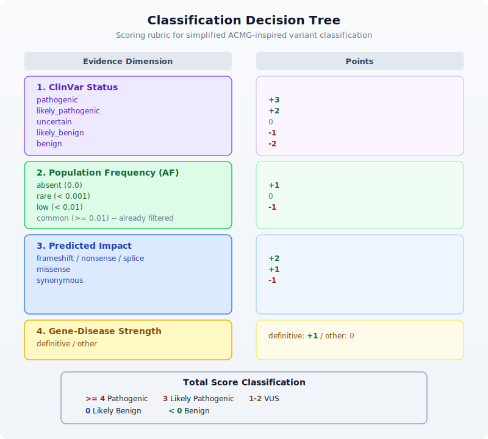

# Day 28: Capstone --- Clinical Variant Report

| | |
|---|---|
| **Difficulty** | Advanced |
| **Biology knowledge** | Advanced (genomic variants, clinical genetics, gene-disease associations) |
| **Coding knowledge** | Advanced (all prior topics: pipes, tables, APIs, error handling, modules) |
| **Time** | ~4--5 hours |
| **Prerequisites** | Days 1--27 completed, BioLang installed (see Appendix A) |
| **Data needed** | Generated locally via `init.bl` (simulated VCF, gene panels, reference files) |

> **CLINICAL DISCLAIMER**: This chapter is **strictly educational**. The pipeline
> demonstrated here is a simplified illustration of clinical genomics concepts. It
> must **never** be used for actual patient care, diagnosis, or clinical
> decision-making. Real clinical variant interpretation requires validated,
> accredited pipelines (CAP/CLIA), board-certified review, and adherence to
> professional guidelines (ACMG/AMP). The classification logic shown here is
> intentionally simplified and does not reflect the full complexity of clinical
> variant interpretation.

## What You'll Learn

- How to load and parse VCF files for variant analysis
- How to apply multi-stage quality and frequency filters
- How to annotate variants with gene information via APIs
- How to implement ACMG-inspired variant classification logic
- How to generate structured clinical-style reports
- How to build clinical-grade error handling into every pipeline stage
- How to integrate skills from all 27 prior days into a single capstone project

---

## The Problem

*"A patient's whole-exome sequencing results are in --- can we build an automated clinical report?"*

A 42-year-old patient with a family history of hereditary breast and ovarian cancer has undergone whole-exome sequencing. The sequencing facility has delivered a VCF file containing thousands of variants. Your task: filter the noise, identify clinically relevant variants, classify them according to established guidelines, cross-reference with gene-disease databases, and produce a structured report suitable for clinical review.

This is not a single-tool problem. It requires everything you have learned: file I/O (Day 6--7), variant fundamentals (Day 12), table operations (Day 10), API access (Day 9, 24), statistics (Day 14), error handling (Day 25), modules (Day 27), and pipeline thinking (Day 22). This capstone ties it all together.


---

## Section 1: Clinical Context

Before we write code, let us understand the clinical workflow this pipeline supports.

### Variant Classification: The ACMG/AMP Framework

The American College of Medical Genetics and Genomics (ACMG) and the Association for Molecular Pathology (AMP) published guidelines in 2015 for classifying sequence variants into five tiers:


Our pipeline implements a simplified version of this logic. Real clinical labs use dozens of evidence criteria (PS1--PS4, PM1--PM6, PP1--PP5, BA1, BS1--BS4, BP1--BP7). We focus on a subset that can be evaluated computationally: population frequency, predicted impact, ClinVar concordance, and gene-disease association.

### What a Clinical Report Contains

A clinical-grade variant report typically includes:

1. **Patient metadata** --- demographics, ordering physician, indication for testing
2. **Methodology** --- sequencing platform, coverage metrics, analysis pipeline version
3. **Reportable findings** --- pathogenic and likely pathogenic variants with gene, transcript, protein change, zygosity, and classification rationale
4. **Variants of uncertain significance** --- listed separately for transparency
5. **Quality metrics** --- coverage, call rate, Ti/Tv ratio
6. **Limitations** --- regions of low coverage, known blind spots
7. **Disclaimer** --- signed interpretation by board-certified geneticist

---

## Section 2: Setting Up the Data

Run the initialization script to generate synthetic clinical data:

```bash
cd days/day-28
bl init.bl
```

This creates:

| File | Description |
|---|---|
| `data/patient.vcf` | Simulated patient VCF with 20 variants |
| `data/gene_db.tsv` | Gene annotation database (gene name, function, OMIM) |
| `data/clinvar_db.tsv` | ClinVar-like classification reference |
| `data/cancer_panel.tsv` | Hereditary cancer gene panel (25 genes) |
| `data/acmg_genes.tsv` | ACMG secondary findings gene list |
| `data/patient_info.tsv` | Patient metadata |

All data is synthetic --- no real patient information is used.

---

## Section 3: Loading and Validating VCF Data

The first step is loading the VCF file and validating its structure. We use `read_vcf()` from Day 12:

```biolang
let variants = read_vcf("data/patient.vcf")
```

The `read_vcf()` function returns a table with columns: `chrom`, `pos`, `id`, `ref`, `alt`, `qual`, `filter`, `info`. Let us inspect its shape:

```biolang
let variant_count = variants |> len()
let columns = variants |> keys()
```

### Validation Checks

Clinical pipelines fail loudly. We validate before proceeding:

```biolang
fn validate_vcf(variants) {
    let n = variants |> len()
    if n == 0 {
        error("VCF file contains no variants")
    }

    let required_cols = ["chrom", "pos", "ref", "alt", "qual"]
    required_cols |> each(|col| {
        let col_names = variants |> keys()
        if contains(col_names, col) == false {
            error(f"Missing required VCF column: {col}")
        }
    })

    return { variant_count: n, status: "valid" }
}
```

This pattern --- validate inputs, fail with clear messages --- should feel familiar from Day 25.

---

## Section 4: Quality Filtering

Raw variant calls include many low-confidence calls. We filter on two standard quality metrics:

- **QUAL** --- Phred-scaled quality score. QUAL >= 30 means the variant call has a 1-in-1000 chance of being wrong.
- **DP** --- Read depth. DP >= 10 ensures sufficient evidence supports the call.

```biolang
fn quality_filter(variants, min_qual, min_dp) {
    variants |> where(|row| {
        let q = float(row.qual)
        let d = try {
            let info_str = row.info
            let parts = split(info_str, ";")
            let dp_part = parts |> filter(|p| starts_with(p, "DP="))
            if len(dp_part) > 0 {
                int(replace(dp_part[0], "DP=", ""))
            } else {
                0
            }
        } catch err {
            0
        }
        q >= min_qual and d >= min_dp
    })
}
```

We extract DP from the INFO field, which is semicolon-delimited. The `try/catch` ensures malformed INFO fields do not crash the pipeline --- they simply get depth zero and are filtered out.

```biolang
let qc_passed = quality_filter(variants, 30.0, 10)
```

---

## Section 5: Variant Annotation

Next we annotate variants with gene information and ClinVar classifications. We load our reference databases as tables and join:

```biolang
let gene_db = read_tsv("data/gene_db.tsv")
let clinvar_db = read_tsv("data/clinvar_db.tsv")
```

### Building an Annotation Key

To join variants with our databases, we need a common key. We construct a variant key from chromosome, position, reference allele, and alternate allele:

```biolang
fn make_variant_key(row) {
    return f"{row.chrom}:{row.pos}:{row.ref}:{row.alt}"
}

let annotated = qc_passed |> mutate("variant_key", |row| make_variant_key(row))
```

### Joining with Gene and ClinVar Data

```biolang
let with_genes = join_tables(annotated, gene_db, "gene")
let with_clinvar = join_tables(with_genes, clinvar_db, "variant_key")
```

The `join_tables()` function (Day 10) performs an inner join on the shared column. Variants without a match in the reference database are retained with empty annotation fields.

### API-Based Annotation (Optional)

<!-- requires: internet, API access -->

For real-world analysis, you would query live databases. Here is how you might enrich a variant with Ensembl VEP:

```biolang
# Annotate a single variant with Ensembl VEP
# WARNING: rate-limited, use sparingly
fn annotate_with_vep(chrom, pos, ref_allele, alt_allele) {
    let hgvs = f"{chrom}:g.{pos}{ref_allele}>{alt_allele}"
    try {
        let vep = ensembl_vep(hgvs)
        return vep
    } catch err {
        return { error: str(err), consequence: "unknown" }
    }
}
```

And for gene-disease associations via NCBI:

```biolang
# Look up gene-disease associations
fn lookup_gene_disease(gene_name) {
    try {
        let gene_info = ncbi_gene(gene_name, "human")
        return {
            gene: gene_name,
            description: gene_info.description,
            source: "NCBI"
        }
    } catch err {
        return { gene: gene_name, description: "lookup failed", source: "none" }
    }
}
```

In our capstone pipeline, we use the pre-built local databases from `init.bl` to keep the pipeline deterministic and offline-capable. The API calls above show how you would extend it for production use.

---

## Section 6: Frequency Filtering

Common variants are unlikely to cause rare disease. We filter out variants with an allele frequency (AF) above 1% in population databases:

```biolang
fn frequency_filter(variants, max_af) {
    variants |> where(|row| {
        let af = try {
            let info_str = row.info
            let parts = split(info_str, ";")
            let af_part = parts |> filter(|p| starts_with(p, "AF="))
            if len(af_part) > 0 {
                float(replace(af_part[0], "AF=", ""))
            } else {
                0.0
            }
        } catch err {
            0.0
        }
        af <= max_af
    })
}

let rare_variants = frequency_filter(with_clinvar, 0.01)
```

The logic mirrors real clinical pipelines: absent AF is treated as zero (novel variant, possibly significant), and we keep only variants with AF <= 0.01 (1%).

---

## Section 7: Gene Panel Filtering

Clinical exome analysis does not report all variants --- it focuses on genes relevant to the clinical indication. For hereditary cancer, we apply the cancer gene panel:

```biolang
let cancer_panel = read_tsv("data/cancer_panel.tsv")
let acmg_genes = read_tsv("data/acmg_genes.tsv")
```

### Panel Matching

```biolang
fn panel_filter(variants, panel) {
    let panel_genes = panel |> select("gene") |> map(|row| row.gene)
    variants |> where(|row| {
        let gene = try { row.gene } catch err { "" }
        panel_genes |> filter(|g| g == gene) |> len() > 0
    })
}

let panel_variants = panel_filter(rare_variants, cancer_panel)
let acmg_variants = panel_filter(rare_variants, acmg_genes)
```

We apply both the disease-specific panel and the ACMG secondary findings list. The ACMG recommends reporting pathogenic/likely pathogenic variants in 81 genes regardless of the clinical indication --- an important safety net.

---

## Section 8: ACMG-Inspired Classification

Now we classify each variant. Our simplified scoring system uses four evidence dimensions:



Here is the BioLang implementation:

```biolang
fn clinvar_score(clinvar_class) {
    if clinvar_class == "pathogenic" { return 3 }
    if clinvar_class == "likely_pathogenic" { return 2 }
    if clinvar_class == "uncertain" { return 0 }
    if clinvar_class == "likely_benign" { return -1 }
    if clinvar_class == "benign" { return -2 }
    return 0
}

fn frequency_score(af) {
    if af == 0.0 { return 1 }
    if af < 0.001 { return 0 }
    return -1
}

fn impact_score(impact) {
    if impact == "frameshift" { return 2 }
    if impact == "nonsense" { return 2 }
    if impact == "splice" { return 2 }
    if impact == "missense" { return 1 }
    if impact == "synonymous" { return -1 }
    return 0
}

fn gene_disease_score(strength) {
    if strength == "definitive" { return 1 }
    return 0
}

fn classify_variant(score) {
    if score >= 4 { return "Pathogenic" }
    if score == 3 { return "Likely Pathogenic" }
    if score >= 1 { return "VUS" }
    if score == 0 { return "Likely Benign" }
    return "Benign"
}

fn score_variant(row) {
    let cv = try { row.clinvar_class } catch err { "unknown" }
    let af = try {
        let parts = split(row.info, ";")
        let af_part = parts |> filter(|p| starts_with(p, "AF="))
        if len(af_part) > 0 { float(replace(af_part[0], "AF=", "")) } else { 0.0 }
    } catch err {
        0.0
    }
    let imp = try { row.impact } catch err { "unknown" }
    let gd = try { row.gene_disease } catch err { "unknown" }

    let s1 = clinvar_score(cv)
    let s2 = frequency_score(af)
    let s3 = impact_score(imp)
    let s4 = gene_disease_score(gd)
    let total = s1 + s2 + s3 + s4

    return {
        variant_key: try { row.variant_key } catch err { "" },
        gene: try { row.gene } catch err { "" },
        chrom: row.chrom,
        pos: row.pos,
        ref_allele: row.ref,
        alt_allele: row.alt,
        impact: imp,
        clinvar: cv,
        af: af,
        score: total,
        classification: classify_variant(total)
    }
}
```

Apply classification to all panel variants:

```biolang
let classified = panel_variants |> map(|row| score_variant(row))
```

### Grouping by Classification

```biolang
let pathogenic = classified |> filter(|v| v.classification == "Pathogenic")
let likely_path = classified |> filter(|v| v.classification == "Likely Pathogenic")
let vus = classified |> filter(|v| v.classification == "VUS")
let likely_benign = classified |> filter(|v| v.classification == "Likely Benign")
let benign = classified |> filter(|v| v.classification == "Benign")
```

---

## Section 9: Report Generation

The final step is generating a structured clinical report. We build it as a list of lines and write to both text and TSV formats:

```biolang
fn format_variant_line(v) {
    return f"  {v.gene} | {v.chrom}:{v.pos} | {v.ref_allele}>{v.alt_allele} | {v.impact} | {v.clinvar} | Score:{v.score}"
}

fn build_report(patient_info, classified, qc_stats) {
    let report = [
        "================================================================",
        "       CLINICAL VARIANT ANALYSIS REPORT (EDUCATIONAL ONLY)",
        "================================================================",
        "",
        "DISCLAIMER: This report is generated by an educational pipeline.",
        "It must NOT be used for clinical decision-making.",
        "",
        "--- PATIENT INFORMATION ---",
        f"Patient ID: {patient_info.patient_id}",
        f"Sample ID: {patient_info.sample_id}",
        f"Indication: {patient_info.indication}",
        f"Report Date: {patient_info.report_date}",
        ""
    ]

    let path_variants = classified |> filter(|v| v.classification == "Pathogenic")
    let lp_variants = classified |> filter(|v| v.classification == "Likely Pathogenic")
    let vus_variants = classified |> filter(|v| v.classification == "VUS")
    let lb_variants = classified |> filter(|v| v.classification == "Likely Benign")
    let b_variants = classified |> filter(|v| v.classification == "Benign")

    report = report + [
        "--- SUMMARY ---",
        f"Total variants analyzed: {qc_stats.total_input}",
        f"Passed quality filter: {qc_stats.passed_qc}",
        f"Rare variants (AF <= 1%): {qc_stats.rare_count}",
        f"In gene panel: {qc_stats.panel_count}",
        f"Classified: {len(classified)}",
        "",
        f"  Pathogenic:        {len(path_variants)}",
        f"  Likely Pathogenic: {len(lp_variants)}",
        f"  VUS:               {len(vus_variants)}",
        f"  Likely Benign:     {len(lb_variants)}",
        f"  Benign:            {len(b_variants)}",
        ""
    ]

    if len(path_variants) > 0 {
        report = report + ["--- PATHOGENIC VARIANTS (Reportable) ---"]
        path_variants |> each(|v| {
            report = report + [format_variant_line(v)]
        })
        report = report + [""]
    }

    if len(lp_variants) > 0 {
        report = report + ["--- LIKELY PATHOGENIC VARIANTS (Reportable) ---"]
        lp_variants |> each(|v| {
            report = report + [format_variant_line(v)]
        })
        report = report + [""]
    }

    if len(vus_variants) > 0 {
        report = report + ["--- VARIANTS OF UNCERTAIN SIGNIFICANCE ---"]
        vus_variants |> each(|v| {
            report = report + [format_variant_line(v)]
        })
        report = report + [""]
    }

    report = report + [
        "--- QUALITY METRICS ---",
        f"Mean QUAL score: {qc_stats.mean_qual}",
        f"Mean depth: {qc_stats.mean_dp}",
        f"Variants filtered (low quality): {qc_stats.total_input - qc_stats.passed_qc}",
        "",
        "--- LIMITATIONS ---",
        "- This analysis covers exonic regions only",
        "- Structural variants and CNVs are not assessed",
        "- Intronic and regulatory variants may be missed",
        "- Classification is based on a simplified scoring model",
        "",
        "--- END OF REPORT ---"
    ]

    return report
}
```

---

## Section 10: Quality Assurance

Clinical pipelines must track their own quality. We compute QA metrics at each stage:

```biolang
fn compute_qc_stats(all_variants, qc_passed, rare, panel_matched) {
    let quals = all_variants |> select("qual") |> map(|row| float(row.qual))
    let depths = all_variants |> map(|row| {
        try {
            let parts = split(row.info, ";")
            let dp_part = parts |> filter(|p| starts_with(p, "DP="))
            if len(dp_part) > 0 { int(replace(dp_part[0], "DP=", "")) } else { 0 }
        } catch err {
            0
        }
    })

    return {
        total_input: len(all_variants),
        passed_qc: len(qc_passed),
        rare_count: len(rare),
        panel_count: len(panel_matched),
        mean_qual: mean(quals),
        mean_dp: mean(depths)
    }
}
```

---

## Section 11: The Complete Pipeline

Here is the entire pipeline, end to end. Each stage flows into the next via pipes and function calls:

```biolang
# --- Load data ---
let variants = read_vcf("data/patient.vcf")
let gene_db = read_tsv("data/gene_db.tsv")
let clinvar_db = read_tsv("data/clinvar_db.tsv")
let cancer_panel = read_tsv("data/cancer_panel.tsv")
let patient_meta = read_tsv("data/patient_info.tsv")
let patient_info = patient_meta[0]

# --- Validate ---
let validation = validate_vcf(variants)

# --- Quality filter ---
let qc_passed = quality_filter(variants, 30.0, 10)

# --- Annotate ---
let annotated = qc_passed |> mutate("variant_key", |row| make_variant_key(row))
let with_genes = join_tables(annotated, gene_db, "gene")
let with_clinvar = join_tables(with_genes, clinvar_db, "variant_key")

# --- Frequency filter ---
let rare_variants = frequency_filter(with_clinvar, 0.01)

# --- Panel filter ---
let panel_variants = panel_filter(rare_variants, cancer_panel)

# --- Classify ---
let classified = panel_variants |> map(|row| score_variant(row))

# --- QC stats ---
let qc_stats = compute_qc_stats(variants, qc_passed, rare_variants, panel_variants)

# --- Generate report ---
let report_lines = build_report(patient_info, classified, qc_stats)
write_lines(report_lines, "data/output/clinical_report.txt")

# --- Export classified variants ---
let classified_table = classified |> to_table()
write_tsv(classified_table, "data/output/classified_variants.tsv")
```

Run it:

```bash
cd days/day-28
bl init.bl
bl scripts/analysis.bl
```

Expected output files:

| File | Contents |
|---|---|
| `data/output/clinical_report.txt` | Full clinical report with all sections |
| `data/output/classified_variants.tsv` | Classified variants in tabular format |

---

## Section 12: Extending with Live API Data

<!-- requires: internet, API access -->

In a production pipeline, you would replace the local databases with live API queries. Here is a sketch of how the annotation stage would change:

```biolang
# Production annotation: query NCBI and Ensembl for each gene
fn annotate_live(variants) {
    variants |> map(|row| {
        let gene_info = try {
            ncbi_gene(row.gene, "human")
        } catch err {
            { description: "unknown", summary: "" }
        }

        let vep_result = try {
            let hgvs = f"{row.chrom}:g.{row.pos}{row.ref}>{row.alt}"
            ensembl_vep(hgvs)
        } catch err {
            { consequence: "unknown" }
        }

        {
            gene: row.gene,
            chrom: row.chrom,
            pos: row.pos,
            ref_allele: row.ref,
            alt_allele: row.alt,
            gene_description: gene_info.description,
            vep_consequence: vep_result.consequence
        }
    })
}
```

The `try/catch` around every API call is essential --- network failures must not crash a clinical pipeline.

---

## Exercises

### Exercise 1: Add a Secondary Findings Module

The ACMG recommends reporting pathogenic variants in 81 genes regardless of the primary indication. Extend the pipeline to:

1. Load the `acmg_genes.tsv` panel
2. Filter `rare_variants` against the ACMG gene list (separately from the cancer panel)
3. Classify the ACMG variants using the same scoring function
4. Add a "Secondary Findings" section to the report

### Exercise 2: Variant Prioritization

Add a prioritization function that sorts classified variants by clinical urgency:

1. Pathogenic variants sorted by score (highest first)
2. Within the same score, sort by gene-disease association strength
3. Output a ranked list with rank numbers

Hint: use `sort_by()` with a custom key function that combines classification tier and score.

### Exercise 3: Coverage Gap Report

Add a quality section that identifies genomic regions with insufficient coverage:

1. Parse the DP values from each variant's INFO field
2. Flag any variant with DP < 20 as "low coverage"
3. Group low-coverage variants by chromosome
4. Add a "Coverage Gaps" section to the report listing affected genes

### Exercise 4: Multi-Sample Comparison

Extend the pipeline to accept two VCF files (e.g., tumor and normal) and:

1. Identify variants present only in the tumor (somatic)
2. Identify variants shared between tumor and normal (germline)
3. Flag somatic variants with high impact for follow-up
4. Generate a comparative report

---

## Key Takeaways

1. **Clinical pipelines are layered** --- each filter stage reduces the variant set, and the order matters (quality before frequency before panel).

2. **Error handling is non-negotiable** --- every I/O operation, every API call, every field access should be wrapped in `try/catch` in clinical code. A crash is unacceptable when patient data is at stake.

3. **Classification is evidence-based** --- even our simplified scoring system combines multiple independent lines of evidence. Real ACMG classification uses 28 criteria across 5 evidence categories.

4. **Reports must be transparent** --- every report includes methodology, limitations, and disclaimers. The pipeline documents what it did and what it could not do.

5. **Modularity pays off** --- by Day 28, you can build a multi-stage pipeline by composing functions. Each scoring function, each filter, each formatter is independently testable.

6. **Local-first, API-enriched** --- the pipeline works entirely offline with local databases, but can be extended with live API queries for production use. This mirrors how clinical labs operate: validated local databases with optional external enrichment.

> **Remember**: Real clinical variant interpretation is a collaborative process between
> computational pipelines and board-certified clinical geneticists. Software identifies
> candidates; humans make diagnoses.

---

## Summary

In this capstone, you built a complete clinical variant analysis pipeline that:

- Loaded and validated VCF data
- Applied multi-stage quality, frequency, and panel filters
- Annotated variants with gene and ClinVar information
- Implemented ACMG-inspired classification logic
- Generated a structured clinical report
- Tracked quality metrics throughout the pipeline

This project integrated skills from nearly every prior day: file I/O (Days 6--7), VCF parsing (Day 12), tables and joins (Day 10), API access (Days 9, 24), statistics (Day 14), error handling (Day 25), modules (Day 27), and pipeline design (Day 22).

Tomorrow in Day 29, we tackle another capstone: a complete RNA-seq differential expression study.
