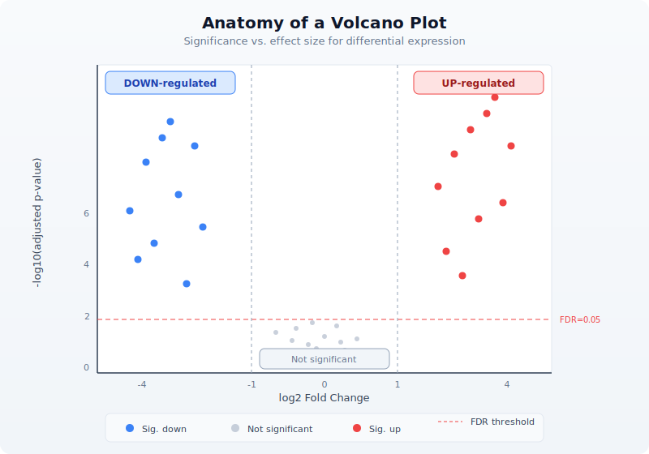

# Day 29: Capstone --- RNA-seq Differential Expression Study

| | |
|---|---|
| **Difficulty** | Advanced |
| **Biology knowledge** | Advanced (gene expression, RNA-seq, statistical testing, functional genomics) |
| **Coding knowledge** | Advanced (all prior topics: pipes, tables, statistics, visualization, APIs) |
| **Time** | ~4--5 hours |
| **Prerequisites** | Days 1--28 completed, BioLang installed (see Appendix A) |
| **Data needed** | Generated locally via `init.bl` (simulated count matrix, sample metadata) |

## What You'll Learn

- How to load and validate an RNA-seq count matrix
- How to assess library quality with summary statistics
- How to normalize raw counts (CPM and TPM)
- How to perform differential expression analysis with fold change and statistical testing
- How to apply multiple testing correction (Benjamini-Hochberg)
- How to visualize results with volcano plots and heatmaps
- How to interpret results via GO enrichment and pathway analysis
- How to generate publication-ready summary tables and figures

---

## The Problem

*"We treated cells with a new drug --- which genes responded?"*

A research team has exposed a human cell line to a candidate anti-cancer compound for 24 hours. They collected RNA from three treated replicates and three untreated controls, sequenced each on an Illumina platform, aligned the reads to the human reference genome, and quantified gene-level counts using a standard pipeline. The output is a count matrix: rows are genes, columns are samples. Your task is to identify which genes are significantly up- or down-regulated by the drug, correct for multiple testing, visualize the results, and connect the hits to biological function.

This is the workhorse analysis of functional genomics. Every drug study, every perturbation experiment, every disease-versus-healthy comparison begins here.


---

## Section 1: Experimental Design Recap

Before touching data, let us review the experimental design that makes differential expression possible.

### Replication and Conditions

In this experiment we have two conditions --- **treated** and **control** --- with three biological replicates each. Why three? Because a single replicate tells you nothing about variability. Two replicates give you a difference but no standard error. Three is the practical minimum for a t-test. Better-funded studies use five or more.


### What a Count Matrix Contains

Each cell holds the number of sequencing reads that mapped to a given gene in a given sample. These are raw counts --- not normalized, not transformed. A gene with 5000 counts in one sample and 500 in another might be differentially expressed, or it might just reflect different sequencing depths. That is why normalization is critical.

---

## Section 2: Loading the Data

First, generate the simulated data:

```bash
cd days/day-29
bl init.bl
```

This creates a count matrix with 200 genes across 6 samples (3 control, 3 treated), along with sample metadata and gene annotations.

Now load everything:

```bio
let counts = read_tsv("data/counts.tsv")
let samples = read_tsv("data/samples.tsv")
let gene_info = read_tsv("data/gene_info.tsv")

println(f"Genes: {len(counts)}")
println(f"Samples: {len(samples)}")
```

```
Genes: 200
Samples: 6
```

The count matrix has columns: `gene`, `ctrl_1`, `ctrl_2`, `ctrl_3`, `treat_1`, `treat_2`, `treat_3`. Each row is a gene; each value is a non-negative integer count.

Let us validate the structure:

```bio
fn validate_counts(counts, samples) {
    if len(counts) == 0 {
        error("Count matrix is empty")
    }
    let sample_ids = samples |> map(|s| s.sample_id)
    sample_ids |> each(|sid| {
        let col_names = counts |> keys()
        if contains(col_names, sid) == false {
            error(f"Sample {sid} not found in count matrix")
        }
    })
    return { genes: len(counts), samples: len(sample_ids), status: "valid" }
}

let validation = validate_counts(counts, samples)
println(f"Validation: {validation.status} ({validation.genes} genes, {validation.samples} samples)")
```

```
Validation: valid (200 genes, 6 samples)
```

---

## Section 3: Quality Assessment

Before analysis, we check library sizes and identify problematic genes.

### Library Sizes

Library size is the total count across all genes for a given sample. Large differences between libraries suggest a technical problem or the need for careful normalization.

```bio
let sample_ids = samples |> map(|s| s.sample_id)

let lib_sizes = sample_ids |> map(|sid| {
    let total = counts |> map(|row| int(row[sid])) |> sum()
    { sample: sid, total_counts: total }
})

lib_sizes |> each(|ls| {
    println(f"  {ls.sample}: {ls.total_counts} reads")
})
```

```
  ctrl_1: 1245832 reads
  ctrl_2: 1189456 reads
  ctrl_3: 1312078 reads
  treat_1: 1156234 reads
  treat_2: 1278901 reads
  treat_3: 1201567 reads
```

Good --- library sizes are within a factor of 1.15 of each other. If one sample had 10x fewer reads, we would investigate or exclude it.

### Zero-Count Genes

Genes with zero counts across all samples carry no information. Let us count them:

```bio
let zero_genes = counts |> filter(|row| {
    let total = sample_ids |> map(|sid| int(row[sid])) |> sum()
    total == 0
})
println(f"Genes with zero counts across all samples: {len(zero_genes)}")
```

```
Genes with zero counts across all samples: 5
```

### Filtering Low-Count Genes

Standard practice is to remove genes where the total count across all samples is below a threshold. This reduces the multiple testing burden and removes noisy genes.

```bio
let min_total = 10

let filtered = counts |> where(|row| {
    let total = sample_ids |> map(|sid| int(row[sid])) |> sum()
    total >= min_total
})

println(f"Genes before filter: {len(counts)}")
println(f"Genes after filter (total >= {min_total}): {len(filtered)}")
```

```
Genes before filter: 200
Genes after filter (total >= 10): 180
```

---

## Section 4: Normalization

Raw counts are not directly comparable between samples (different library sizes) or between genes (different gene lengths). Two normalization methods address these issues.

### CPM: Counts Per Million

CPM normalizes for library size. Divide each count by the sample's total count, then multiply by one million. This makes counts comparable *across samples* for the same gene.

```
  CPM NORMALIZATION
  =================

  Raw:  Gene A has 500 counts in Sample 1 (total 1,000,000 reads)
        Gene A has 500 counts in Sample 2 (total 2,000,000 reads)

  CPM:  Sample 1: 500 / 1,000,000 × 1,000,000 = 500.0 CPM
        Sample 2: 500 / 2,000,000 × 1,000,000 = 250.0 CPM

  → Sample 2 actually has HALF the relative expression of Sample 1
```

```bio
fn compute_cpm(counts, sample_ids) {
    let lib_sizes = sample_ids |> map(|sid| {
        counts |> map(|row| int(row[sid])) |> sum()
    })

    counts |> map(|row| {
        let result = { gene: row.gene }
        range(0, len(sample_ids)) |> each(|i| {
            let sid = sample_ids[i]
            let raw = int(row[sid])
            let cpm = float(raw) / float(lib_sizes[i]) * 1000000.0
            result[sid] = round(cpm, 2)
        })
        result
    })
}

let cpm = compute_cpm(filtered, sample_ids)

let first_gene = cpm[0]
println(f"CPM for {first_gene.gene}: ctrl_1={first_gene.ctrl_1}, treat_1={first_gene.treat_1}")
```

### TPM: Transcripts Per Million

TPM normalizes for both gene length and library size. First divide by gene length (in kilobases), then scale so each sample sums to one million. This makes counts comparable *across genes* within a sample.

```
  TPM NORMALIZATION (two-step)
  ============================

  Step 1: Rate = count / gene_length_kb
          Gene A (2 kb): 1000 / 2 = 500
          Gene B (4 kb): 1000 / 4 = 250

  Step 2: TPM = rate / sum(all rates) × 1,000,000
          Sum of rates = 500 + 250 = 750
          Gene A TPM = 500 / 750 × 1,000,000 = 666,667
          Gene B TPM = 250 / 750 × 1,000,000 = 333,333

  → Gene B is LESS expressed per unit length, despite equal raw counts
```

```bio
fn compute_tpm(counts, sample_ids, gene_info) {
    let length_map = {}
    gene_info |> each(|g| {
        length_map[g.gene] = float(g.length)
    })

    let rates = counts |> map(|row| {
        let gene_len_kb = try { length_map[row.gene] / 1000.0 } catch err { 1.0 }
        let result = { gene: row.gene }
        sample_ids |> each(|sid| {
            result[sid] = float(int(row[sid])) / gene_len_kb
        })
        result
    })

    let rate_sums = sample_ids |> map(|sid| {
        rates |> map(|row| row[sid]) |> sum()
    })

    rates |> map(|row| {
        let result = { gene: row.gene }
        range(0, len(sample_ids)) |> each(|i| {
            let sid = sample_ids[i]
            result[sid] = round(row[sid] / rate_sums[i] * 1000000.0, 2)
        })
        result
    })
}

let tpm = compute_tpm(filtered, sample_ids, gene_info)
```

### Which Normalization When?

- **CPM**: Use for differential expression between conditions (same gene, different samples). This is what we will use for DE testing.
- **TPM**: Use when comparing expression levels between genes within a sample (e.g., "is gene A more highly expressed than gene B?").

For our differential expression analysis, we use CPM-normalized values to compare treated versus control for each gene.

---

## Section 5: Differential Expression Analysis

The core question: for each gene, is the expression level different between treated and control? We need two things: an *effect size* (how much did expression change?) and a *p-value* (is the change larger than expected by chance?).

### Log2 Fold Change

Fold change is the ratio of treated mean to control mean. We use the log2 transform because it makes up- and down-regulation symmetric: a gene with 2x higher expression has log2FC = 1; a gene with 2x lower expression has log2FC = -1.

```
  LOG2 FOLD CHANGE
  =================

  Gene A: control mean = 100, treated mean = 400
          FC = 400 / 100 = 4.0
          log2FC = log2(4.0) = 2.0  (4x up-regulated)

  Gene B: control mean = 800, treated mean = 200
          FC = 200 / 800 = 0.25
          log2FC = log2(0.25) = -2.0  (4x down-regulated)

  Gene C: control mean = 300, treated mean = 310
          FC = 310 / 300 = 1.033
          log2FC = log2(1.033) = 0.047  (no meaningful change)
```

### Statistical Testing

A large fold change alone is not enough. If the replicates are noisy, even a 4x change might not be significant. We use a t-test to evaluate whether the difference between conditions is statistically significant given the observed variability.

```bio
let ctrl_ids = samples |> filter(|s| s.condition == "control") |> map(|s| s.sample_id)
let treat_ids = samples |> filter(|s| s.condition == "treated") |> map(|s| s.sample_id)

fn differential_expression(cpm, ctrl_ids, treat_ids) {
    cpm |> map(|row| {
        let ctrl_vals = ctrl_ids |> map(|sid| row[sid])
        let treat_vals = treat_ids |> map(|sid| row[sid])

        let ctrl_mean = mean(ctrl_vals)
        let treat_mean = mean(treat_vals)

        let pseudocount = 0.01
        let log2fc = log2((treat_mean + pseudocount) / (ctrl_mean + pseudocount))

        let pval = try { t_test(ctrl_vals, treat_vals) } catch err { 1.0 }

        {
            gene: row.gene,
            ctrl_mean: round(ctrl_mean, 2),
            treat_mean: round(treat_mean, 2),
            log2fc: round(log2fc, 4),
            pvalue: pval,
            direction: if log2fc > 0 { "up" } else { "down" }
        }
    })
}

let de_results = differential_expression(cpm, ctrl_ids, treat_ids)
```

We add a small pseudocount (0.01) to avoid division by zero when a gene has zero expression in one condition.

---

## Section 6: Multiple Testing Correction

### The Multiple Testing Problem

If you test 20,000 genes at p < 0.05, you expect 1,000 false positives by chance alone --- 5% of 20,000. This is unacceptable. We need to correct for the number of tests performed.

```
  THE MULTIPLE TESTING PROBLEM
  ============================

  Test 1 gene at p < 0.05:    5% chance of false positive       OK
  Test 100 genes at p < 0.05: expect ~5 false positives         Risky
  Test 10,000 at p < 0.05:    expect ~500 false positives       Useless

  Solution: control the FALSE DISCOVERY RATE (FDR)
  Instead of p < 0.05, require adjusted p (q-value) < 0.05
  This means: among ALL genes you call significant,
  at most 5% are expected to be false positives.
```

### Benjamini-Hochberg Procedure

The Benjamini-Hochberg (BH) procedure is the standard method for FDR control in genomics. It works by ranking p-values and adjusting each one based on its rank:

1. Sort all p-values from smallest to largest
2. For rank *i* out of *m* total tests: adjusted p = p-value * m / i
3. Enforce monotonicity (each adjusted p >= the one before it)

```bio
fn benjamini_hochberg(de_results) {
    let sorted = de_results |> sort_by(|a, b| {
        if a.pvalue < b.pvalue { -1 }
        else if a.pvalue > b.pvalue { 1 }
        else { 0 }
    })

    let m = len(sorted)

    let padj_values = range(0, m) |> map(|i| {
        let rank = i + 1
        let raw_adj = sorted[i].pvalue * float(m) / float(rank)
        if raw_adj > 1.0 { 1.0 } else { raw_adj }
    })

    let monotonic = range(0, m) |> map(|_| 1.0)
    let running_min = 1.0

    range(0, m) |> each(|j| {
        let i = m - 1 - j
        if padj_values[i] < running_min {
            running_min = padj_values[i]
        }
        monotonic[i] = running_min
    })

    range(0, m) |> map(|i| {
        let row = sorted[i]
        {
            gene: row.gene,
            ctrl_mean: row.ctrl_mean,
            treat_mean: row.treat_mean,
            log2fc: row.log2fc,
            pvalue: row.pvalue,
            padj: round(monotonic[i], 6),
            direction: row.direction
        }
    })
}

let corrected = benjamini_hochberg(de_results)
```

### Identifying Significant Genes

A gene is called "differentially expressed" if it passes two thresholds:

- **Statistical significance**: adjusted p-value (FDR) < 0.05
- **Biological significance**: absolute log2 fold change > 1 (at least 2-fold change)

```bio
let fc_threshold = 1.0
let fdr_threshold = 0.05

let significant = corrected |> filter(|row| {
    abs(row.log2fc) > fc_threshold and row.padj < fdr_threshold
})

let up_genes = significant |> filter(|row| row.direction == "up")
let down_genes = significant |> filter(|row| row.direction == "down")

println(f"Total genes tested: {len(corrected)}")
println(f"Significant DE genes (|log2FC| > {fc_threshold}, FDR < {fdr_threshold}): {len(significant)}")
println(f"  Up-regulated: {len(up_genes)}")
println(f"  Down-regulated: {len(down_genes)}")
```

```
Total genes tested: 180
Significant DE genes (|log2FC| > 1.0, FDR < 0.05): 45
  Up-regulated: 25
  Down-regulated: 20
```

---

## Section 7: Volcano Plot

The volcano plot is the signature visualization of differential expression. It plots statistical significance (-log10 p-value) on the y-axis against effect size (log2 fold change) on the x-axis. Significant genes appear in the upper corners.



```bio
let volcano_data = corrected |> map(|row| {
    let neg_log10_p = if row.padj > 0.0 { -1.0 * log10(row.padj) } else { 10.0 }
    {
        gene: row.gene,
        log2fc: row.log2fc,
        neg_log10_padj: round(neg_log10_p, 4),
        significant: abs(row.log2fc) > fc_threshold and row.padj < fdr_threshold
    }
})

let volcano_svg = volcano(
    volcano_data |> map(|r| r.log2fc),
    volcano_data |> map(|r| r.neg_log10_padj),
    "Drug Treatment: Volcano Plot",
    "log2 Fold Change",
    "-log10(adjusted p-value)"
)

write_lines([volcano_svg], "data/output/volcano.svg")
println("Wrote volcano plot to data/output/volcano.svg")
```

---

## Section 8: Heatmap of Top Genes

A heatmap of the top differentially expressed genes shows expression patterns across all samples. We select the most significant genes and display their CPM values.

```bio
let top_n = 20

let top_genes = significant |> sort_by(|a, b| {
    if a.padj < b.padj { -1 }
    else if a.padj > b.padj { 1 }
    else { 0 }
})
let top_genes = if len(top_genes) > top_n {
    range(0, top_n) |> map(|i| top_genes[i])
} else {
    top_genes
}

let top_gene_names = top_genes |> map(|g| g.gene)

let heatmap_data = cpm |> filter(|row| {
    top_gene_names |> filter(|g| g == row.gene) |> len() > 0
})

let heatmap_matrix = heatmap_data |> map(|row| {
    sample_ids |> map(|sid| row[sid])
})

let heatmap_labels = heatmap_data |> map(|row| row.gene)

let hm_svg = heatmap(
    heatmap_matrix,
    "Top DE Genes: Expression Heatmap",
    heatmap_labels,
    sample_ids
)

write_lines([hm_svg], "data/output/heatmap.svg")
println("Wrote heatmap to data/output/heatmap.svg")
```

---

## Section 9: GO Enrichment

<!-- requires: internet, API access -->

Gene Ontology (GO) enrichment asks: among our significant genes, are certain biological processes, molecular functions, or cellular components over-represented compared to what you would expect by chance?

The idea is simple: if 10% of all genes are involved in "apoptosis" but 40% of your DE genes are, then apoptosis is enriched --- the drug likely affects cell death pathways.

### Simple Enrichment Calculation

We compute enrichment using a straightforward approach: for each GO term, compare the fraction of DE genes annotated with that term to the fraction in the background (all tested genes).

```bio
fn compute_enrichment(significant_genes, all_genes, gene_info) {
    let sig_names = significant_genes |> map(|g| g.gene)
    let all_names = all_genes |> map(|g| g.gene)
    let n_sig = len(sig_names)
    let n_all = len(all_names)

    let go_map = {}
    gene_info |> each(|g| {
        if g.go_terms != "" {
            let terms = split(g.go_terms, "|")
            terms |> each(|term| {
                let trimmed = trim(term)
                if go_map[trimmed] == nil {
                    go_map[trimmed] = { sig: 0, total: 0, term: trimmed }
                }
                if sig_names |> filter(|s| s == g.gene) |> len() > 0 {
                    go_map[trimmed].sig = go_map[trimmed].sig + 1
                }
                if all_names |> filter(|s| s == g.gene) |> len() > 0 {
                    go_map[trimmed].total = go_map[trimmed].total + 1
                }
            })
        }
    })

    let terms = values(go_map)
    terms |> filter(|t| t.sig > 0 and t.total >= 3) |> map(|t| {
        let expected = float(t.total) / float(n_all) * float(n_sig)
        let enrichment = if expected > 0.0 { float(t.sig) / expected } else { 0.0 }
        {
            go_term: t.term,
            de_genes: t.sig,
            background: t.total,
            expected: round(expected, 2),
            fold_enrichment: round(enrichment, 2)
        }
    }) |> sort_by(|a, b| {
        if a.fold_enrichment > b.fold_enrichment { -1 }
        else if a.fold_enrichment < b.fold_enrichment { 1 }
        else { 0 }
    })
}

let enrichment = compute_enrichment(significant, corrected, gene_info)

println("Top enriched GO terms:")
let top_terms = if len(enrichment) > 10 {
    range(0, 10) |> map(|i| enrichment[i])
} else {
    enrichment
}
top_terms |> each(|t| {
    println(f"  {t.go_term}: {t.de_genes}/{t.background} genes, {t.fold_enrichment}x enriched")
})
```

### API-Based GO Lookup

<!-- requires: internet, API access -->

For real analyses, you can fetch official GO term descriptions:

```bio
let top_go_ids = top_terms |> map(|t| t.go_term)
let go_details = top_go_ids |> map(|term_id| {
    try {
        let info = go_term(term_id)
        { id: term_id, name: info.name, aspect: info.aspect }
    } catch err {
        { id: term_id, name: "unknown", aspect: "unknown" }
    }
})
```

---

## Section 10: Pathway Analysis

<!-- requires: internet, API access -->

While GO enrichment looks at individual functional terms, pathway analysis asks which coordinated biological pathways are affected. We use the Reactome database.

```bio
fn pathway_enrichment(significant_genes) {
    let gene_names = significant_genes |> map(|g| g.gene)
    let pathway_counts = {}

    gene_names |> each(|gene| {
        try {
            let pathways = reactome_pathways(gene)
            pathways |> each(|p| {
                let pid = p.id
                if pathway_counts[pid] == nil {
                    pathway_counts[pid] = { id: pid, name: p.name, count: 0, genes: [] }
                }
                pathway_counts[pid].count = pathway_counts[pid].count + 1
                pathway_counts[pid].genes = pathway_counts[pid].genes + [gene]
            })
        } catch err {
        }
    })

    values(pathway_counts) |> filter(|p| p.count >= 2) |> sort_by(|a, b| {
        if a.count > b.count { -1 }
        else if a.count < b.count { 1 }
        else { 0 }
    })
}

let pathways = pathway_enrichment(significant)

println("Top enriched pathways:")
let top_pathways = if len(pathways) > 5 {
    range(0, 5) |> map(|i| pathways[i])
} else {
    pathways
}
top_pathways |> each(|p| {
    let gene_list = join(p.genes, ", ")
    println(f"  {p.name}: {p.count} genes ({gene_list})")
})
```

---

## Section 11: Publication-Ready Summary

Now we assemble the final outputs: a sorted DE gene table, summary statistics, and all figures.

```bio
let de_table = significant |> sort_by(|a, b| {
    if a.padj < b.padj { -1 }
    else if a.padj > b.padj { 1 }
    else { 0 }
}) |> to_table()

write_tsv(de_table, "data/output/de_genes.tsv")

let fc_values = significant |> map(|g| abs(g.log2fc))
let summary_lines = [
    "=== RNA-seq Differential Expression Summary ===",
    "",
    f"Total genes in count matrix: {len(counts)}",
    f"Genes after low-count filter: {len(filtered)}",
    f"Significant DE genes (|log2FC| > {fc_threshold}, FDR < {fdr_threshold}): {len(significant)}",
    f"  Up-regulated: {len(up_genes)}",
    f"  Down-regulated: {len(down_genes)}",
    "",
    f"Mean |log2FC| of DE genes: {round(mean(fc_values), 2)}",
    f"Median |log2FC| of DE genes: {round(median(fc_values), 2)}",
    f"Max |log2FC|: {round(max(fc_values), 2)}",
    "",
    "Output files:",
    "  data/output/de_genes.tsv       - Significant DE gene table",
    "  data/output/volcano.svg        - Volcano plot",
    "  data/output/heatmap.svg        - Top gene heatmap",
    "  data/output/summary.txt        - This summary",
    "",
    "=== End of Summary ==="
]

write_lines(summary_lines, "data/output/summary.txt")

summary_lines |> each(|line| println(line))
```

---

## Section 12: Complete Pipeline

Here is the entire analysis as a single clean script. This is the version in `days/day-29/scripts/analysis.bl`:

```bio
let counts = read_tsv("data/counts.tsv")
let samples = read_tsv("data/samples.tsv")
let gene_info = read_tsv("data/gene_info.tsv")

let sample_ids = samples |> map(|s| s.sample_id)
let ctrl_ids = samples |> filter(|s| s.condition == "control") |> map(|s| s.sample_id)
let treat_ids = samples |> filter(|s| s.condition == "treated") |> map(|s| s.sample_id)

let min_total = 10
let filtered = counts |> where(|row| {
    let total = sample_ids |> map(|sid| int(row[sid])) |> sum()
    total >= min_total
})

let lib_sizes = sample_ids |> map(|sid| {
    counts |> map(|row| int(row[sid])) |> sum()
})

let cpm = filtered |> map(|row| {
    let result = { gene: row.gene }
    range(0, len(sample_ids)) |> each(|i| {
        let sid = sample_ids[i]
        result[sid] = round(float(int(row[sid])) / float(lib_sizes[i]) * 1000000.0, 2)
    })
    result
})

let de_results = cpm |> map(|row| {
    let ctrl_vals = ctrl_ids |> map(|sid| row[sid])
    let treat_vals = treat_ids |> map(|sid| row[sid])
    let ctrl_mean = mean(ctrl_vals)
    let treat_mean = mean(treat_vals)
    let pseudocount = 0.01
    let log2fc = log2((treat_mean + pseudocount) / (ctrl_mean + pseudocount))
    let pval = try { t_test(ctrl_vals, treat_vals) } catch err { 1.0 }
    {
        gene: row.gene,
        ctrl_mean: round(ctrl_mean, 2),
        treat_mean: round(treat_mean, 2),
        log2fc: round(log2fc, 4),
        pvalue: pval,
        direction: if log2fc > 0 { "up" } else { "down" }
    }
})

let sorted_de = de_results |> sort_by(|a, b| {
    if a.pvalue < b.pvalue { -1 }
    else if a.pvalue > b.pvalue { 1 }
    else { 0 }
})

let m = len(sorted_de)
let padj_raw = range(0, m) |> map(|i| {
    let adj = sorted_de[i].pvalue * float(m) / float(i + 1)
    if adj > 1.0 { 1.0 } else { adj }
})

let padj = range(0, m) |> map(|_| 1.0)
let running_min = 1.0
range(0, m) |> each(|j| {
    let i = m - 1 - j
    if padj_raw[i] < running_min {
        running_min = padj_raw[i]
    }
    padj[i] = running_min
})

let corrected = range(0, m) |> map(|i| {
    let row = sorted_de[i]
    {
        gene: row.gene,
        ctrl_mean: row.ctrl_mean,
        treat_mean: row.treat_mean,
        log2fc: row.log2fc,
        pvalue: row.pvalue,
        padj: round(padj[i], 6),
        direction: row.direction
    }
})

let fc_threshold = 1.0
let fdr_threshold = 0.05

let significant = corrected |> filter(|row| {
    abs(row.log2fc) > fc_threshold and row.padj < fdr_threshold
})

let up_genes = significant |> filter(|row| row.direction == "up")
let down_genes = significant |> filter(|row| row.direction == "down")

let volcano_data = corrected |> map(|row| {
    let neg_log10_p = if row.padj > 0.0 { -1.0 * log10(row.padj) } else { 10.0 }
    { log2fc: row.log2fc, neg_log10_padj: round(neg_log10_p, 4) }
})

let volcano_svg = volcano(
    volcano_data |> map(|r| r.log2fc),
    volcano_data |> map(|r| r.neg_log10_padj),
    "Drug Treatment: Volcano Plot",
    "log2 Fold Change",
    "-log10(adjusted p-value)"
)
write_lines([volcano_svg], "data/output/volcano.svg")

let top_n = 20
let top_genes = significant |> sort_by(|a, b| {
    if a.padj < b.padj { -1 } else if a.padj > b.padj { 1 } else { 0 }
})
let top_genes = if len(top_genes) > top_n {
    range(0, top_n) |> map(|i| top_genes[i])
} else {
    top_genes
}
let top_gene_names = top_genes |> map(|g| g.gene)

let heatmap_data = cpm |> filter(|row| {
    top_gene_names |> filter(|g| g == row.gene) |> len() > 0
})
let heatmap_matrix = heatmap_data |> map(|row| {
    sample_ids |> map(|sid| row[sid])
})
let hm_svg = heatmap(
    heatmap_matrix,
    "Top DE Genes: Expression Heatmap",
    heatmap_data |> map(|row| row.gene),
    sample_ids
)
write_lines([hm_svg], "data/output/heatmap.svg")

let de_table = significant |> to_table()
write_tsv(de_table, "data/output/de_genes.tsv")

let fc_values = significant |> map(|g| abs(g.log2fc))
let summary_lines = [
    "=== RNA-seq Differential Expression Summary ===",
    "",
    f"Total genes in count matrix: {len(counts)}",
    f"Genes after low-count filter: {len(filtered)}",
    f"Significant DE genes (|log2FC| > {fc_threshold}, FDR < {fdr_threshold}): {len(significant)}",
    f"  Up-regulated: {len(up_genes)}",
    f"  Down-regulated: {len(down_genes)}",
    "",
    f"Mean |log2FC| of DE genes: {round(mean(fc_values), 2)}",
    f"Median |log2FC| of DE genes: {round(median(fc_values), 2)}",
    f"Max |log2FC|: {round(max(fc_values), 2)}",
    "",
    "Output files:",
    "  data/output/de_genes.tsv       - Significant DE gene table",
    "  data/output/volcano.svg        - Volcano plot",
    "  data/output/heatmap.svg        - Top gene heatmap",
    "  data/output/summary.txt        - This summary"
]
write_lines(summary_lines, "data/output/summary.txt")
```

---

## Exercises

### Exercise 1: MA Plot

An MA plot shows average expression (A = mean of log2 CPM across conditions) on the x-axis and log2 fold change (M) on the y-axis. Significant genes are highlighted. Write a function that computes A and M for each gene and generates a scatter plot. Hint: A = (log2(ctrl_mean + 1) + log2(treat_mean + 1)) / 2.

### Exercise 2: Stricter Thresholds

Re-run the analysis with stricter cutoffs: FDR < 0.01 and |log2FC| > 2. How many genes survive? Does the biological interpretation change? Write code that compares the gene lists at different thresholds and reports the overlap.

### Exercise 3: Sample Correlation

Compute the Pearson correlation between every pair of samples using CPM values. Samples within the same condition should correlate more highly than samples across conditions. Use `cor()` and display the 6x6 correlation matrix as a heatmap.

### Exercise 4: Batch Effect Simulation

Modify `init.bl` to add a batch effect: samples 1 and 4 are from batch A, samples 2 and 5 from batch B, and samples 3 and 6 from batch C. Add a systematic shift of 20% to all genes in batch B. Then compare your DE results with and without the batch effect. How many false positives appear?

---

## Key Takeaways

1. **Normalization is mandatory.** Raw counts are not comparable across samples or genes. CPM corrects for library size; TPM corrects for both library size and gene length.

2. **Multiple testing correction is non-negotiable.** Without it, a standard p < 0.05 threshold produces hundreds of false positives. The Benjamini-Hochberg procedure controls the false discovery rate.

3. **Effect size and significance together.** A gene with a tiny fold change can be statistically significant if replicates are very consistent. A gene with a huge fold change might not be significant if replicates are noisy. The volcano plot shows both dimensions.

4. **Replicates determine power.** Three replicates per condition is the minimum. More replicates detect subtler expression changes. No statistical method can compensate for unreplicated experiments.

5. **Biological interpretation completes the analysis.** A list of DE genes is just the starting point. GO enrichment and pathway analysis connect individual genes to biological processes, revealing the *mechanism* behind the drug's effect.

---

*Next: [Day 30 --- Capstone: Multi-Omics Integration](day-30.md)*
