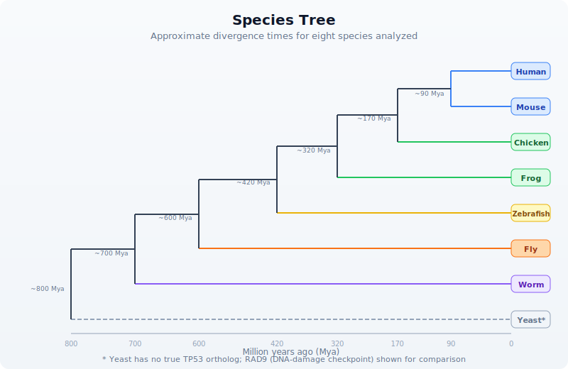
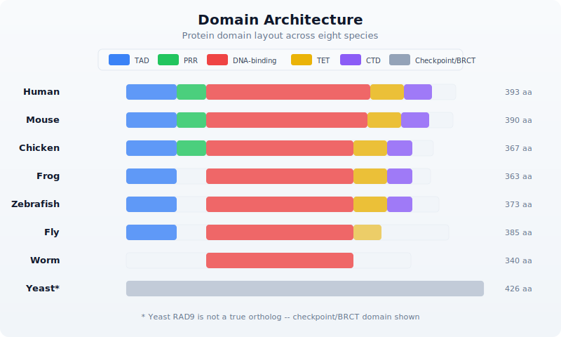
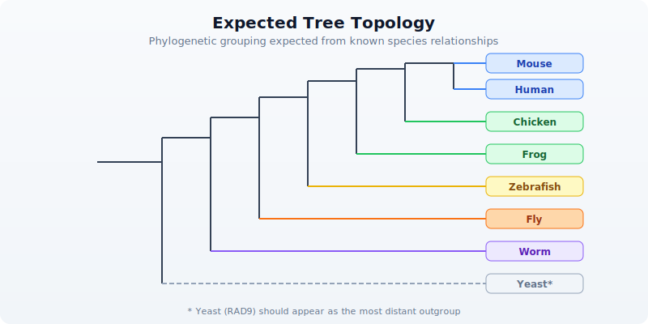
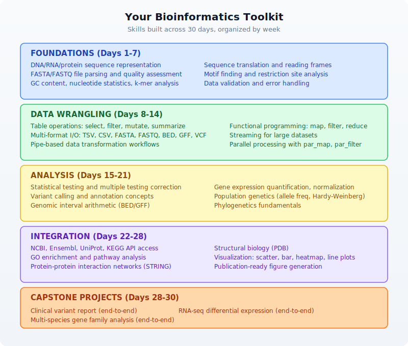

# Day 30: Capstone --- Multi-Species Gene Family Analysis

| | |
|---|---|
| **Difficulty** | Advanced |
| **Biology knowledge** | Advanced (molecular evolution, protein domains, phylogenetics, comparative genomics) |
| **Coding knowledge** | Advanced (all prior topics: pipes, tables, statistics, visualization, APIs) |
| **Time** | ~5--6 hours |
| **Prerequisites** | Days 1--29 completed, BioLang installed (see Appendix A) |
| **Data needed** | Generated locally via `init.bl` (synthetic ortholog sequences for 8 species) |

## What You'll Learn

- How to gather orthologous gene sequences from multiple species
- How to compare sequences pairwise using dotplots and k-mer similarity
- How to score conservation across species at the residue level
- How to identify protein domains and compare domain architectures
- How to build distance matrices from sequence divergence
- How to visualize phylogenetic relationships
- How to detect functional divergence using evolutionary rate analysis
- How to integrate cross-species data from multiple biological databases
- How to build a complete comparative genomics pipeline

---

## The Problem

*"This gene is critical in humans --- is it conserved across species, and what can evolution tell us about its function?"*

Your lab has identified a tumor suppressor gene --- TP53 --- that is essential for preventing cancer in humans. The principal investigator asks a deceptively simple question: how conserved is this gene across species? If a gene has been preserved across hundreds of millions of years of evolution, every part of it that remains unchanged is likely essential. Regions that have diverged may have acquired new functions or lost old ones. And species where the gene is absent may have evolved alternative mechanisms.

This is the core logic of comparative genomics. Evolution is nature's longest-running experiment, and conservation is its strongest signal of function.


---

## Section 1: Why Comparative Genomics?

Every gene in your genome has a history. Some genes appeared billions of years ago in single-celled organisms and still perform the same function today. Others are recent innovations found only in mammals or primates. The degree to which a gene is conserved across species tells you how important it is --- and how long it has been important.

Consider TP53, the "guardian of the genome." This gene encodes the p53 protein, which detects DNA damage and triggers either repair or cell death. Mutations in TP53 are found in over half of all human cancers. But p53 is not a human invention. Orthologs exist in mice, zebrafish, fruit flies, and even sea anemones. The DNA-binding domain --- the part that recognizes damaged DNA --- has been conserved for over 800 million years.

### What conservation tells us

```
  CONSERVATION AND FUNCTION
  =========================

  High conservation (>80% identity across species)
    → Strong purifying selection
    → Critical function
    → Mutations here are likely deleterious
    → Good drug targets (conserved mechanism)

  Moderate conservation (40-80% identity)
    → Functional core preserved
    → Some adaptation to species-specific needs
    → Interesting for studying functional divergence

  Low conservation (<40% identity)
    → Rapid evolution or relaxed constraint
    → May have diverged in function
    → Species-specific adaptations

  Absent in some lineages
    → Gene loss or lineage-specific innovation
    → Alternative pathways may exist
```

### The species in our analysis

For this capstone, we will compare TP53 orthologs across eight species spanning approximately 800 million years of evolution:



---

## Section 2: Gathering Ortholog Information

Before retrieving sequences, we need to identify the orthologous genes in each species. In a real analysis, you would query Ensembl Compara or NCBI's orthologs database. Here we demonstrate the API calls, then work with our pre-generated synthetic data.

<!-- requires: internet, API access -->

```bio
let human_gene = ensembl_gene("ENSG00000141510")
println("Human TP53:")
println("  Symbol: " + human_gene.display_name)
println("  Biotype: " + human_gene.biotype)
println("  Description: " + human_gene.description)
```

<!-- requires: internet, API access -->

```bio
let uniprot_info = uniprot_entry("P04637")
println("UniProt P04637 (human p53):")
println("  Protein name: " + uniprot_info.protein_name)
println("  Length: " + str(uniprot_info.length) + " aa")
println("  Organism: " + uniprot_info.organism)
```

For our offline analysis, `init.bl` generates realistic synthetic sequences for all eight species. Each sequence has been modeled with appropriate divergence: closely related species share more identity, distant species share less, and the DNA-binding domain is highly conserved in all vertebrate orthologs.

---

## Section 3: Sequence Retrieval and Initial Assessment

Let us begin the analysis. First, we load all ortholog sequences and examine their basic properties.

```bio
let orthologs = read_fasta("data/orthologs.fasta")

let species_info = read_tsv("data/species_info.tsv")

let seq_table = orthologs |> map(|seq| {
    let name = seq.id
    let info = species_info |> filter(|s| s.seq_id == name)
    let row_info = info[0]
    {
        species: row_info.common_name,
        seq_id: name,
        length_aa: len(seq.sequence),
        gc: gc_content(seq.sequence)
    }
}) |> to_table()

println("=== Ortholog Sequence Summary ===")
println(seq_table)
```

Notice how the sequence lengths vary across species. Vertebrate p53 orthologs are typically 350--400 amino acids long, while invertebrate homologs can be shorter (the fly p53 is ~385 aa) or structurally different. The yeast analog (RAD9) is much larger because it is not a true ortholog --- it convergently evolved a similar DNA-damage checkpoint function.

### Amino acid composition

Different organisms can have subtly different amino acid preferences. Let us measure the composition of key residues:

```bio
fn aa_frequency(sequence, residue) {
    let count = sequence |> split("") |> filter(|c| c == residue) |> len()
    round(float(count) / float(len(sequence)) * 100.0, 2)
}

let key_residues = ["L", "S", "P", "G", "R", "K"]

let composition = orthologs |> map(|seq| {
    let info = species_info |> filter(|s| s.seq_id == seq.id)
    let row = { species: info[0].common_name }
    key_residues |> each(|r| {
        row[r] = aa_frequency(seq.sequence, r)
    })
    row
}) |> to_table()

println("=== Amino Acid Composition (%) ===")
println(composition)
```

---

## Section 4: Pairwise Sequence Comparison

Now we compare sequences pairwise. BioLang provides two built-in tools for this: dotplots for visual comparison and k-mer analysis for quantitative similarity.

### Dotplot visualization

A dotplot places one sequence along each axis and marks positions where residues match. Conserved regions appear as diagonal lines. Insertions, deletions, and rearrangements break the diagonal.

```bio
let human_seq = orthologs |> filter(|s| contains(s.id, "human")) |> map(|s| s.sequence)
let mouse_seq = orthologs |> filter(|s| contains(s.id, "mouse")) |> map(|s| s.sequence)

dotplot(human_seq[0], mouse_seq[0], "data/output/dotplot_human_mouse.svg")
```

For closely related species (human vs. mouse, ~90 Mya divergence), you will see a strong diagonal line --- high conservation across the full length. Let us also compare human to a distant species:

```bio
let fly_seq = orthologs |> filter(|s| contains(s.id, "fly")) |> map(|s| s.sequence)

dotplot(human_seq[0], fly_seq[0], "data/output/dotplot_human_fly.svg")
```

The human-fly dotplot shows a fragmented diagonal. The DNA-binding domain (approximately residues 100--290 in human p53) still shows conservation, but the N-terminal transactivation domain and C-terminal regulatory domain have diverged substantially.

### K-mer based similarity

For quantitative comparison, we use k-mer overlap. Two sequences that share many k-mers are similar; those that share few are divergent. This does not require alignment --- it is an alignment-free similarity measure.

```bio
fn kmer_similarity(seq_a, seq_b, k) {
    let kmers_a = kmers(seq_a, k)
    let kmers_b = kmers(seq_b, k)
    let set_a = kmers_a |> sort() |> filter(|x| true)
    let set_b = kmers_b |> sort() |> filter(|x| true)
    let shared = set_a |> filter(|kmer| set_b |> filter(|b| b == kmer) |> len() > 0) |> len()
    let total = len(set_a) + len(set_b) - shared
    round(float(shared) / float(total), 4)
}

let human_protein = human_seq[0]

let similarities = orthologs |> map(|seq| {
    let info = species_info |> filter(|s| s.seq_id == seq.id)
    {
        species: info[0].common_name,
        kmer3_similarity: kmer_similarity(human_protein, seq.sequence, 3),
        kmer5_similarity: kmer_similarity(human_protein, seq.sequence, 5)
    }
}) |> to_table() |> sort_by("kmer5_similarity", "desc")

println("=== K-mer Similarity to Human TP53 ===")
println(similarities)
```

The k-mer similarity values should decrease with evolutionary distance: mouse > chicken > frog > zebrafish > fly > worm > yeast. The 5-mer similarity drops faster than 3-mer because longer k-mers are more sensitive to sequence divergence.

---

## Section 5: Conservation Scoring

We can estimate position-specific conservation without a formal multiple sequence alignment by examining which residues are shared across species at corresponding positions. This is an approximation --- true conservation scoring requires alignment --- but it reveals the pattern: the DNA-binding domain is the most conserved region.

### Sliding window conservation

```bio
fn window_identity(sequences, window_size) {
    let ref_seq = sequences[0]
    let ref_len = len(ref_seq)
    let n_seqs = len(sequences)
    let n_windows = ref_len - window_size + 1

    range(0, n_windows) |> map(|start| {
        let end_pos = start + window_size
        let ref_chars = ref_seq |> split("")
        let matches = range(start, end_pos) |> map(|pos| {
            let ref_char = ref_chars[pos]
            let match_count = range(1, n_seqs) |> map(|si| {
                let other = sequences[si] |> split("")
                let other_len = len(other)
                let result = 0
                if pos < other_len {
                    if other[pos] == ref_char {
                        result = 1
                    }
                }
                result
            }) |> sum()
            float(match_count) / float(n_seqs - 1)
        }) |> mean()
        {
            position: start + window_size / 2,
            conservation: round(matches, 4)
        }
    })
}

let vertebrate_seqs = orthologs
    |> filter(|s| !contains(s.id, "fly") && !contains(s.id, "worm") && !contains(s.id, "yeast"))
    |> map(|s| s.sequence)

let conservation = window_identity(vertebrate_seqs, 10)

let cons_table = conservation |> to_table()

line(cons_table, "position", "conservation", "data/output/conservation_profile.svg")
```

### Identifying conserved domains

The conservation profile reveals peaks and valleys. Let us identify the highly conserved regions:

```bio
let high_cons = conservation |> filter(|w| w.conservation > 0.7)
let low_cons = conservation |> filter(|w| w.conservation < 0.3)

println("=== Conservation Summary (vertebrates, window=10) ===")
println("Highly conserved positions (>70%): " + str(len(high_cons)))
println("Poorly conserved positions (<30%): " + str(len(low_cons)))
println("Overall mean conservation: " + str(round(conservation |> map(|w| w.conservation) |> mean(), 4)))

let domain_regions = [
    { name: "N-terminal TAD", start: 0, end_pos: 60 },
    { name: "Proline-rich", start: 60, end_pos: 95 },
    { name: "DNA-binding", start: 95, end_pos: 290 },
    { name: "Tetramerization", start: 320, end_pos: 360 },
    { name: "C-terminal reg.", start: 360, end_pos: 393 }
]

let domain_cons = domain_regions |> map(|d| {
    let region = conservation |> filter(|w| w.position >= d.start && w.position < d.end_pos)
    let avg = region |> map(|w| w.conservation) |> mean()
    {
        domain: d.name,
        start: d.start,
        end_pos: d.end_pos,
        mean_conservation: round(avg, 4),
        n_positions: len(region)
    }
}) |> to_table()

println("=== Domain Conservation Scores ===")
println(domain_cons)
```

You should see that the DNA-binding domain (residues 95--290) has the highest conservation score, followed by the tetramerization domain. The N-terminal transactivation domain and C-terminal regulatory domain are less conserved --- they interact with species-specific partner proteins that have co-evolved.

---

## Section 6: Domain Architecture Comparison

Beyond conservation at the sequence level, we can compare the domain architecture --- which functional modules are present in each species' ortholog.

```bio
let domain_annotations = read_tsv("data/domain_annotations.tsv")

let architecture = species_info |> map(|sp| {
    let domains = domain_annotations |> filter(|d| d.seq_id == sp.seq_id)
    let domain_list = domains |> map(|d| d.domain_name) |> join(", ")
    let n_domains = len(domains)
    {
        species: sp.common_name,
        n_domains: n_domains,
        domains: domain_list,
        total_length: sp.seq_length
    }
}) |> to_table()

println("=== Domain Architecture Comparison ===")
println(architecture)
```



The key observation: the DNA-binding domain is present in all animal orthologs. The tetramerization domain is conserved in vertebrates and partially in the fly. The proline-rich region is a mammalian/bird innovation. This pattern matches what we know about p53 evolution --- the DNA-binding function is ancient, while regulatory complexity was added over time.

---

## Section 7: Building a Distance Matrix

To construct a phylogenetic tree, we need a distance matrix. We will use k-mer divergence as our distance metric. This is an alignment-free approach that works well for moderately divergent sequences.

```bio
fn kmer_distance(seq_a, seq_b, k) {
    let sim = kmer_similarity(seq_a, seq_b, k)
    round(1.0 - sim, 4)
}

let species_names = orthologs |> map(|s| {
    let info = species_info |> filter(|sp| sp.seq_id == s.id)
    info[0].common_name
})
let sequences = orthologs |> map(|s| s.sequence)

let n = len(sequences)
let dist_rows = range(0, n) |> map(|i| {
    let row = { species: species_names[i] }
    range(0, n) |> each(|j| {
        row[species_names[j]] = kmer_distance(sequences[i], sequences[j], 4)
    })
    row
}) |> to_table()

println("=== Distance Matrix (4-mer divergence) ===")
println(dist_rows)

write_tsv(dist_rows, "data/output/distance_matrix.tsv")
```

The distance matrix should reflect the known evolutionary relationships: human-mouse distance is smallest, human-yeast is largest. If the distances do not match the known species tree, it may indicate convergent evolution, horizontal gene transfer, or (in our case) limitations of alignment-free methods on very divergent sequences.

---

## Section 8: Phylogenetic Tree Construction

BioLang provides `phylo_tree()` for building a simple neighbor-joining tree from a distance matrix. This is a good first approximation --- for publication-quality trees, you would use external tools like RAxML, IQ-TREE, or MEGA.

```bio
let labels = species_names
let matrix = range(0, n) |> map(|i| {
    range(0, n) |> map(|j| {
        kmer_distance(sequences[i], sequences[j], 4)
    })
})

phylo_tree(labels, matrix, "data/output/phylo_tree.svg")
```

> **Honesty note**: The `phylo_tree()` builtin implements a basic neighbor-joining algorithm. For real research, you would export the distance matrix and use dedicated phylogenetics software (RAxML, IQ-TREE, BEAST, MrBayes) that supports bootstrapping, model selection, and Bayesian inference. BioLang is designed for data preparation and exploratory analysis, not as a replacement for specialized phylogenetic tools.

### Interpreting the tree

The tree should group species according to their known evolutionary relationships:



If the tree topology matches the known species tree, the gene evolved vertically --- passed from parent to offspring without lateral transfer. Deviations could indicate gene duplication, loss, or accelerated evolution in a particular lineage.

---

## Section 9: Evolutionary Rate Analysis

Not all parts of a protein evolve at the same rate. Functionally critical residues are under strong purifying selection (slow evolution), while less important regions accumulate mutations freely. We can measure this by comparing the rate of change across domains.

```bio
fn domain_divergence(seqs, sp_info, domain_start, domain_end) {
    let ref_seq = seqs[0] |> split("")
    range(1, len(seqs)) |> map(|i| {
        let other = seqs[i] |> split("")
        let positions = range(domain_start, min([domain_end, len(ref_seq), len(other)]))
        let mismatches = positions |> filter(|p| ref_seq[p] != other[p]) |> len()
        let total = len(positions)
        let info = sp_info |> filter(|s| s.seq_id == (orthologs[i]).id)
        {
            species: info[0].common_name,
            divergence_mya: float(info[0].divergence_mya),
            mismatches: mismatches,
            total_positions: total,
            substitution_rate: round(float(mismatches) / float(total), 4)
        }
    })
}

let dbd_rates = domain_divergence(sequences, species_info, 95, 290)
let tad_rates = domain_divergence(sequences, species_info, 0, 60)

let rate_comparison = range(0, len(dbd_rates)) |> map(|i| {
    let dbd = dbd_rates[i]
    let tad = tad_rates[i]
    {
        species: dbd.species,
        divergence_mya: dbd.divergence_mya,
        dbd_rate: dbd.substitution_rate,
        tad_rate: tad.substitution_rate,
        ratio: round(tad.substitution_rate / (dbd.substitution_rate + 0.001), 2)
    }
}) |> to_table()

println("=== Evolutionary Rate: DNA-binding vs Transactivation Domain ===")
println(rate_comparison)
```

The ratio column tells the story. If the TAD evolves 2--3x faster than the DBD, the DNA-binding domain is under much stronger selective constraint. This is exactly what decades of p53 research have shown: mutations in the DNA-binding domain cause cancer, while the transactivation domain tolerates more variation.

```bio
let rate_table = rate_comparison
scatter(rate_table, "divergence_mya", "dbd_rate", "data/output/rate_dbd.svg")
scatter(rate_table, "divergence_mya", "tad_rate", "data/output/rate_tad.svg")
```

---

## Section 10: Integrating External Data Sources

A complete comparative analysis draws on multiple databases. Let us demonstrate how BioLang connects to external resources for the human TP53 gene.

<!-- requires: internet, API access -->

```bio
let gene = ncbi_gene("7157")
println("=== NCBI Gene: TP53 ===")
println("  Official symbol: " + gene.name)
println("  Description: " + gene.description)

let pathways = reactome_pathways("TP53")
println("=== Reactome Pathways ===")
pathways |> each(|p| {
    println("  " + p.stId + ": " + p.displayName)
})

let go = go_annotations("P04637")
println("=== GO Annotations (first 10) ===")
let first_10 = range(0, min([10, len(go)])) |> map(|i| go[i])
first_10 |> each(|a| {
    println("  " + a.goId + " " + a.goName + " [" + a.goAspect + "]")
})

let network = string_network(["TP53", "MDM2", "CDKN1A", "BAX", "BCL2"])
println("=== STRING Network (TP53 + partners) ===")
println("  Interactions found: " + str(len(network)))

let pdb = pdb_entry("1TSR")
println("=== PDB Structure 1TSR ===")
println("  Title: " + pdb.struct.title)
```

These external queries provide context that pure sequence analysis cannot: which pathways the gene participates in, which proteins it interacts with, what its 3D structure looks like, and what biological processes it governs. In a real study, you would integrate all of this into a comprehensive report.

---

## Section 11: Complete Pipeline

Here is the full analysis assembled into a single, clean pipeline. This is what `scripts/analysis.bl` contains --- load data, compare sequences, score conservation, build a tree, measure evolutionary rates, and produce a summary report.

```bio
let orthologs = read_fasta("data/orthologs.fasta")
let species_info = read_tsv("data/species_info.tsv")
let domain_annotations = read_tsv("data/domain_annotations.tsv")

let species_names = orthologs |> map(|s| {
    let info = species_info |> filter(|sp| sp.seq_id == s.id)
    info[0].common_name
})
let sequences = orthologs |> map(|s| s.sequence)
let n = len(sequences)

fn kmer_similarity(seq_a, seq_b, k) {
    let kmers_a = kmers(seq_a, k)
    let kmers_b = kmers(seq_b, k)
    let set_a = kmers_a |> sort() |> filter(|x| true)
    let set_b = kmers_b |> sort() |> filter(|x| true)
    let shared = set_a |> filter(|kmer| set_b |> filter(|b| b == kmer) |> len() > 0) |> len()
    let total = len(set_a) + len(set_b) - shared
    round(float(shared) / float(total), 4)
}

fn kmer_distance(seq_a, seq_b, k) {
    round(1.0 - kmer_similarity(seq_a, seq_b, k), 4)
}

let seq_summary = orthologs |> map(|seq| {
    let info = species_info |> filter(|s| s.seq_id == seq.id)
    {
        species: info[0].common_name,
        length_aa: len(seq.sequence),
        divergence_mya: info[0].divergence_mya
    }
}) |> to_table()

write_tsv(seq_summary, "data/output/sequence_summary.tsv")

let human_protein = sequences[0]
let sim_table = orthologs |> map(|seq| {
    let info = species_info |> filter(|s| s.seq_id == seq.id)
    {
        species: info[0].common_name,
        kmer3_sim: kmer_similarity(human_protein, seq.sequence, 3),
        kmer5_sim: kmer_similarity(human_protein, seq.sequence, 5)
    }
}) |> to_table() |> sort_by("kmer5_sim", "desc")

write_tsv(sim_table, "data/output/similarity_table.tsv")

dotplot(sequences[0], sequences[1], "data/output/dotplot_human_mouse.svg")
dotplot(sequences[0], sequences[5], "data/output/dotplot_human_fly.svg")

let dist_matrix = range(0, n) |> map(|i| {
    let row = { species: species_names[i] }
    range(0, n) |> each(|j| {
        row[species_names[j]] = kmer_distance(sequences[i], sequences[j], 4)
    })
    row
}) |> to_table()

write_tsv(dist_matrix, "data/output/distance_matrix.tsv")

let labels = species_names
let matrix = range(0, n) |> map(|i| {
    range(0, n) |> map(|j| {
        kmer_distance(sequences[i], sequences[j], 4)
    })
})

phylo_tree(labels, matrix, "data/output/phylo_tree.svg")

let domain_regions = [
    { name: "N-terminal_TAD", start: 0, end_pos: 60 },
    { name: "Proline-rich", start: 60, end_pos: 95 },
    { name: "DNA-binding", start: 95, end_pos: 290 },
    { name: "Tetramerization", start: 320, end_pos: 360 },
    { name: "C-terminal_reg", start: 360, end_pos: 393 }
]

fn window_identity(seqs, window_size) {
    let ref_seq = seqs[0]
    let ref_len = len(ref_seq)
    let n_seqs = len(seqs)
    let n_windows = ref_len - window_size + 1
    range(0, n_windows) |> map(|start| {
        let end_val = start + window_size
        let ref_chars = ref_seq |> split("")
        let matches = range(start, end_val) |> map(|pos| {
            let ref_char = ref_chars[pos]
            let match_count = range(1, n_seqs) |> map(|si| {
                let other = seqs[si] |> split("")
                let result = 0
                if pos < len(other) {
                    if other[pos] == ref_char {
                        result = 1
                    }
                }
                result
            }) |> sum()
            float(match_count) / float(n_seqs - 1)
        }) |> mean()
        { position: start + window_size / 2, conservation: round(matches, 4) }
    })
}

let vertebrate_seqs = orthologs
    |> filter(|s| !contains(s.id, "fly") && !contains(s.id, "worm") && !contains(s.id, "yeast"))
    |> map(|s| s.sequence)

let conservation = window_identity(vertebrate_seqs, 10)
let cons_table = conservation |> to_table()
line(cons_table, "position", "conservation", "data/output/conservation_profile.svg")

let domain_cons = domain_regions |> map(|d| {
    let region = conservation |> filter(|w| w.position >= d.start && w.position < d.end_pos)
    let avg = region |> map(|w| w.conservation) |> mean()
    {
        domain: d.name,
        start: d.start,
        end_pos: d.end_pos,
        mean_conservation: round(avg, 4)
    }
}) |> to_table()

write_tsv(domain_cons, "data/output/domain_conservation.tsv")

let arch_table = species_info |> map(|sp| {
    let domains = domain_annotations |> filter(|d| d.seq_id == sp.seq_id)
    {
        species: sp.common_name,
        n_domains: len(domains),
        domains: domains |> map(|d| d.domain_name) |> join(", "),
        seq_length: sp.seq_length
    }
}) |> to_table()

write_tsv(arch_table, "data/output/domain_architecture.tsv")

fn domain_divergence(seqs, sp_info, d_start, d_end) {
    let ref_seq = seqs[0] |> split("")
    range(1, len(seqs)) |> map(|i| {
        let other = seqs[i] |> split("")
        let positions = range(d_start, min([d_end, len(ref_seq), len(other)]))
        let mismatches = positions |> filter(|p| ref_seq[p] != other[p]) |> len()
        let total = len(positions)
        let info = sp_info |> filter(|s| s.seq_id == (orthologs[i]).id)
        {
            species: info[0].common_name,
            divergence_mya: float(info[0].divergence_mya),
            sub_rate: round(float(mismatches) / float(total), 4)
        }
    })
}

let dbd = domain_divergence(sequences, species_info, 95, 290)
let tad = domain_divergence(sequences, species_info, 0, 60)

let evo_rates = range(0, len(dbd)) |> map(|i| {
    {
        species: dbd[i].species,
        divergence_mya: dbd[i].divergence_mya,
        dbd_rate: dbd[i].sub_rate,
        tad_rate: tad[i].sub_rate,
        ratio: round(tad[i].sub_rate / (dbd[i].sub_rate + 0.001), 2)
    }
}) |> to_table()

write_tsv(evo_rates, "data/output/evolutionary_rates.tsv")
scatter(evo_rates, "divergence_mya", "dbd_rate", "data/output/rate_dbd.svg")
scatter(evo_rates, "divergence_mya", "tad_rate", "data/output/rate_tad.svg")

let summary_lines = [
    "=== Multi-Species TP53 Gene Family Analysis ===",
    "",
    "Species analyzed: " + str(n),
    "Vertebrate orthologs: " + str(len(vertebrate_seqs)),
    "",
    "Sequence lengths (aa):",
    "  Min: " + str(seq_summary |> select("length_aa") |> map(|r| r.length_aa) |> min()),
    "  Max: " + str(seq_summary |> select("length_aa") |> map(|r| r.length_aa) |> max()),
    "  Mean: " + str(round(seq_summary |> select("length_aa") |> map(|r| float(r.length_aa)) |> mean(), 1)),
    "",
    "Domain conservation (vertebrates):",
    "  DNA-binding domain: " + str((domain_cons |> filter(|r| r.domain == "DNA-binding"))[0].mean_conservation),
    "  Tetramerization: " + str((domain_cons |> filter(|r| r.domain == "Tetramerization"))[0].mean_conservation),
    "  N-terminal TAD: " + str((domain_cons |> filter(|r| r.domain == "N-terminal_TAD"))[0].mean_conservation),
    "",
    "Evolutionary rate ratio (TAD/DBD):",
    "  Mean: " + str(round(evo_rates |> map(|r| float(r.ratio)) |> mean(), 2)),
    "  (>1.0 means TAD evolves faster than DBD)",
    "",
    "Output files:",
    "  data/output/sequence_summary.tsv",
    "  data/output/similarity_table.tsv",
    "  data/output/distance_matrix.tsv",
    "  data/output/domain_conservation.tsv",
    "  data/output/domain_architecture.tsv",
    "  data/output/evolutionary_rates.tsv",
    "  data/output/dotplot_human_mouse.svg",
    "  data/output/dotplot_human_fly.svg",
    "  data/output/conservation_profile.svg",
    "  data/output/phylo_tree.svg",
    "  data/output/rate_dbd.svg",
    "  data/output/rate_tad.svg",
    "  data/output/summary.txt"
]

write_lines(summary_lines, "data/output/summary.txt")
```

---

## Section 12: What This Pipeline Does Not Do (And What You Would Add)

This capstone demonstrates the structure and logic of comparative genomics. But honest science requires acknowledging limitations:

**What we did:**
- Alignment-free sequence comparison (k-mer similarity)
- Position-based conservation scoring (approximate)
- Neighbor-joining tree from k-mer distances
- Domain architecture comparison
- Evolutionary rate analysis across domains

**What a production analysis would add:**
- **Multiple sequence alignment** (MAFFT, MUSCLE, Clustal Omega) --- essential for accurate conservation scoring and phylogenetics
- **Substitution models** (JTT, WAG, LG for proteins) --- correct for multiple hits at the same position
- **Maximum likelihood or Bayesian trees** (RAxML, IQ-TREE, MrBayes) --- more accurate than neighbor-joining
- **Bootstrap support** --- confidence values for tree branches
- **dN/dS analysis** (PAML, HyPhy) --- distinguish positive selection from purifying selection
- **Synteny analysis** --- verify orthology by checking genomic context
- **Ancestral sequence reconstruction** --- infer what the ancestral protein looked like

BioLang is designed to handle the data preparation, exploratory analysis, and visualization steps of this workflow. For the statistically rigorous steps, you would export your data and call external tools, then import the results back for interpretation and visualization.

---

## Exercises

### Exercise 1: Add a Species

Add a ninth species to the analysis --- the elephant shark (*Callorhinchus milii*), which diverged from humans approximately 450 Mya. Generate a synthetic sequence with appropriate divergence (between zebrafish and frog), add it to `orthologs.fasta` and `species_info.tsv`, and re-run the pipeline. Does the tree place it correctly between zebrafish and frog?

### Exercise 2: Domain-Specific Trees

Instead of building one tree from the full-length protein, build separate trees for the DNA-binding domain only and the transactivation domain only. Extract the relevant subsequences, compute distance matrices for each, and generate two trees. Do the topologies agree? If not, what might explain the disagreement?

### Exercise 3: Conservation Heatmap

Create a heatmap where rows are species and columns are sequence positions (binned into 20-residue windows). The cell values are the fraction of residues matching the human reference in each window. Use `heatmap()` to visualize. Which domains stand out as dark bands of high conservation?

### Exercise 4: K-mer Spectrum Analysis

For each species, compute the full 3-mer frequency spectrum (all possible amino acid 3-mers). Calculate the Euclidean distance between the human spectrum and each other species' spectrum. Does this distance correlate with known divergence times? Plot divergence time (x-axis) versus spectral distance (y-axis) and fit a trend.

---

## Key Takeaways

1. **Conservation signals function.** Regions that remain unchanged across hundreds of millions of years of evolution are almost certainly essential.

2. **Alignment-free methods provide rapid first estimates.** K-mer similarity and k-mer distance are fast, alignment-free alternatives for exploratory analysis, but they are less accurate than alignment-based methods for divergent sequences.

3. **Domain architecture is as important as sequence identity.** Two proteins can share only 30% sequence identity but have identical domain architecture --- and perform the same function.

4. **Evolutionary rates vary within a protein.** Functional cores (like the DNA-binding domain) evolve slowly; regulatory regions (like transactivation domains) evolve faster. This differential rate is a strong signal of which parts are functionally critical.

5. **Phylogenetics requires specialized tools for rigor.** BioLang builds neighbor-joining trees for exploration, but publication-quality phylogenetics requires maximum likelihood or Bayesian methods with proper substitution models and bootstrap support.

6. **Integration across databases is essential.** No single database tells the whole story. Combining sequence data (NCBI/Ensembl), protein annotations (UniProt), pathways (Reactome/KEGG), interactions (STRING), and structures (PDB) gives a complete picture.

---

## Congratulations --- You Have Completed 30 Days of Practical Bioinformatics!

You started thirty days ago with a question: *how do you make sense of biological data?* You have now answered it --- not with a single technique, but with a toolkit.

Here is what you have built over the past 30 days:



### What comes next

This book taught you the fundamentals. Real bioinformatics is broader, deeper, and messier. Here are directions to explore:

**Expand your biological scope:**
- Metagenomics --- analyzing microbial communities from environmental samples
- Single-cell RNA-seq --- resolving gene expression at the level of individual cells
- CRISPR screen analysis --- identifying gene function through systematic knockouts
- Epigenomics --- studying DNA methylation and histone modifications
- Structural bioinformatics --- predicting and analyzing protein 3D structures

**Deepen your computational skills:**
- Machine learning for genomics (classification, clustering, deep learning)
- Cloud computing for large-scale analyses (AWS, GCP, Azure)
- Workflow managers (Nextflow, Snakemake, WDL) for reproducible pipelines
- Database design for biological data
- Containerization (Docker, Singularity) for reproducible environments

**Contribute to the community:**
- Publish your analysis pipelines as BioLang plugins
- Share scripts and workflows on GitHub
- Contribute to open-source bioinformatics tools
- Write up your analyses as reproducible notebooks
- Mentor others who are starting their bioinformatics journey

The field moves fast. New sequencing technologies, new analytical methods, and new biological questions emerge constantly. But the core skills you have learned --- reading data, transforming it, testing hypotheses, visualizing results, and integrating across sources --- will serve you regardless of what technology comes next.

Welcome to bioinformatics. The data is waiting.

---

*This concludes "Practical Bioinformatics in 30 Days." Thank you for reading.*
