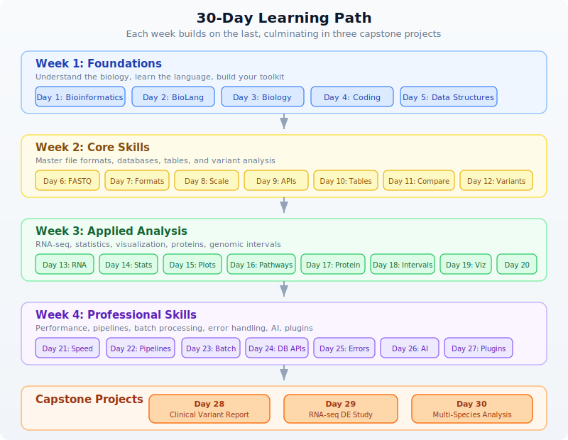

# Practical Bioinformatics in 30 Days

> *From zero to bioinformatician — a structured journey through modern bioinformatics.*

## Who This Book Is For

This book is for anyone who wants to analyze biological data but does not know where to start. You might be:

- **A biologist learning to code.** You have lab experience, you understand PCR and gel electrophoresis, but when someone hands you a FASTQ file with 40 million reads, you freeze. You have tried Python tutorials, but they teach you web development when you need sequence analysis. This book teaches you programming through biology, not the other way around.

- **A developer learning biology.** You can write code in Python, R, or JavaScript, but you do not know a codon from a contig. You have heard that bioinformatics pays well and that genomics is the future, but the terminology is impenetrable. This book teaches you the biology alongside the code, so you understand *why* you are computing GC content, not just *how*.

- **A student starting a bioinformatics program.** Your coursework assumes you already know both biology and programming. You need a structured on-ramp that builds both skills simultaneously. This book gives you that foundation in 30 days.

- **A researcher who needs to analyze their own data.** You have been sending your sequencing data to a core facility and waiting weeks for results. You want to run your own analyses — quality control, variant calling, differential expression — without becoming a full-time software engineer. This book gets you there.

No matter which category you fall into, you share one thing: you want practical skills, not theory for its own sake. Every day in this book produces something you can use.

### Your Path Through Week 1

Week 1 is designed so every reader gets the foundation they need, regardless of background. Here is which days to prioritize:

| Your background | Focus on | Skim or skip |
|---|---|---|
| **Biologist, new to coding** | Days 2 and 4 (language basics and coding crash course) | Day 3 (you already know the biology) |
| **Developer, new to biology** | Days 1 and 3 (bioinformatics intro and biology crash course) | Day 4 (you already know how to code) |
| **New to both** | Every day — they are written for you | Nothing — read it all |
| **Know both already** | Skim Days 1-4 for BioLang-specific syntax | Start coding seriously on Day 5 |

> **Complete beginner?** That is completely fine. Day 3 teaches all the biology you need (no science background assumed), and Day 4 teaches all the coding you need (no programming experience assumed). By the end of Week 1, you will be on equal footing with everyone else.

## What You Will Learn

Over 30 days, you will go from knowing nothing about bioinformatics to being able to:

- Read and write every major bioinformatics file format (FASTA, FASTQ, VCF, BED, GFF, SAM/BAM)
- Perform quality control on sequencing data
- Search biological databases programmatically (NCBI, Ensembl, UniProt, KEGG)
- Analyze gene expression data from RNA-seq experiments
- Call and interpret genetic variants
- Build publication-quality visualizations
- Write reproducible analysis pipelines
- Process datasets too large to fit in memory using streaming
- Use AI to assist your analysis
- Complete three capstone projects that mirror real research scenarios

You will learn all of this in BioLang, a language designed specifically for bioinformatics. But you will not be locked in. Every day includes comparison examples in Python and R, so you can see how the same task looks in all three languages and choose the right tool for your own work.

## How This Book Is Structured

The book is organized into four weeks plus capstone projects:

| Week | Days | Theme | What You Build |
|------|------|-------|----------------|
| **Week 1** | 1-5 | Foundations | Understand biology and code basics; write your first analyses |
| **Week 2** | 6-12 | Core Skills | Master file formats, databases, tables, and variant analysis |
| **Week 3** | 13-20 | Applied Analysis | RNA-seq, statistics, visualization, proteins, genomic intervals |
| **Week 4** | 21-27 | Professional Skills | Performance, pipelines, batch processing, error handling, AI |
| **Capstone** | 28-30 | Projects | Clinical variant report, RNA-seq study, multi-species analysis |

Each day follows the same structure:

1. **The Problem** — a motivating scenario that shows *why* you need today's skill
2. **Core concepts** — the biology and programming ideas, explained together
3. **Hands-on examples** — working code you type and run
4. **Multi-language comparison** — the same task in BioLang, Python, and R
5. **Exercises** — practice problems to cement understanding
6. **Key Takeaways** — the essential points to remember

Days are designed to take 1-3 hours each. Some days are shorter (Day 1 is mostly reading), while project days are longer. You do not have to finish a day in one sitting. Work at your own pace.

## Prerequisites

You need:

- **A computer** running Windows, macOS, or Linux
- **Basic computer literacy** — you can open a terminal, navigate directories, and edit text files
- **Curiosity** — that is genuinely it

You do *not* need:

- Prior programming experience (Day 2 and Day 4 teach you from scratch)
- A biology degree (Day 1 and Day 3 cover the essential biology)
- Expensive software (everything in this book is free and open-source)
- A powerful machine (a laptop with 4 GB of RAM is sufficient for all exercises)

If you can open a terminal and type a command, you are ready.

## The Companion Files

Every day in this book has a companion directory with runnable code. The structure looks like this:

```
practical-bioinformatics/
  days/
    day-01/
      init.bl           # Setup script — run this first
      scripts/
        exercise1.bl    # BioLang solutions
        exercise2.bl
        compare.py      # Python equivalent
        compare.R       # R equivalent
      expected/
        output1.txt     # Expected output for verification
        output2.txt
      compare.md        # Side-by-side language comparison
    day-02/
      ...
```

To use the companion files:

1. **Run `init.bl` first.** Each day's init script downloads sample data, creates test files, or sets up whatever that day's exercises need. Run it with `bl run init.bl`.

2. **Work through the exercises.** Try to solve them yourself before looking at the solutions in `scripts/`.

3. **Check your output.** Compare your results against the files in `expected/` to verify correctness.

4. **Read `compare.md`.** After completing a day in BioLang, read the comparison document to see how the same tasks look in Python and R. This is especially valuable if you already know one of those languages.

To get the companion files:

```bash
git clone https://github.com/bioras/practical-bioinformatics.git
cd practical-bioinformatics
```

Or download the ZIP from the book's website and extract it.

## Setting Up Your Environment

Full installation instructions are in [Appendix A](appendix-setup.md), but here is the short version:

```bash
# Install BioLang
curl -sSf https://biolang.org/install.sh | sh

# Verify it works
bl --version

# Launch the REPL
bl repl
```

On Windows, use the PowerShell installer:

```powershell
irm https://biolang.org/install.ps1 | iex
```

If you want to run the Python and R comparison scripts (optional but recommended), you will also need Python 3.8+ and R 4.0+. See Appendix A for details.

## The BioLang Philosophy

BioLang was designed around three principles that make it different from general-purpose languages:

**1. Biology is first-class.** DNA, RNA, and protein sequences are native types, not strings you have to wrap in objects. When you write `dna"ATGCGATCG"`, BioLang knows it is DNA and gives you biological operations — complement, reverse complement, translation, GC content — without importing anything.

**2. Pipes make data flow visible.** In BioLang, you chain operations with the pipe operator `|>`. Data flows left to right, just like reading English. No nested function calls, no temporary variables, no losing track of what feeds into what.

**3. Conciseness without crypticness.** BioLang aims for the shortest correct code, but never at the expense of readability. Function names say what they do: `gc_content`, `reverse_complement`, `find_motif`. You should be able to read BioLang code aloud and have it make sense.

## A Quick Taste

Here is what BioLang looks like in practice. This script reads a FASTQ file, filters for high-quality reads, and reports basic statistics:

> **Requires CLI:** This example uses file I/O / network APIs not available in the browser. Run with `bl run`.

```bio
let reads = read_fastq("data/reads.fastq")

reads
  |> filter(|r| r.quality >= 30)
  |> map(|r| gc_content(r.sequence))
  |> mean()
  |> println("Mean GC content of high-quality reads: {}")
```

Five lines. No imports. No boilerplate. The pipe operator makes it clear what happens at each step: read the file, filter by quality, extract GC content, compute the mean, print the result.

Here is another example — searching NCBI for a gene and analyzing its sequence:

> **Requires CLI:** This example uses file I/O / network APIs not available in the browser. Run with `bl run`.

```bio
let gene = ncbi_gene("BRCA1", "human")
let seq = ncbi_sequence(gene.id)

seq
  |> kmers(21)
  |> filter(|k| gc_content(k) > 0.6)
  |> len()
  |> println("High-GC 21-mers in BRCA1: {}")
```

You will understand every line of this by Day 9. For now, just notice how naturally the code reads: get the gene, get its sequence, break it into 21-mers, keep the GC-rich ones, count them, print.

## Week-by-Week Overview

### Week 1: Foundations (Days 1-5)

You start with the big picture. What is bioinformatics? Why does it matter? Then you learn BioLang itself — variables, types, pipes, functions. Day 3 is a biology crash course for developers. Day 4 is a coding crash course for biologists. Day 5 covers data structures: lists, records, and tables. By Friday, everyone is on the same page regardless of background.

### Week 2: Core Skills (Days 6-12)

Now the real work begins. You learn to read FASTA and FASTQ files, understand quality scores, and process data too large for memory. You explore biological databases, master tables (the workhorse of bioinformatics), compare sequences, and find variants in genomes. These are the skills you will use every day as a bioinformatician.

### Week 3: Applied Analysis (Days 13-20)

You apply your skills to real research problems. Gene expression analysis with RNA-seq. Statistical testing. Publication-quality plots. Pathway enrichment. Protein structure. Genomic intervals and coordinate systems. Biological visualization. Multi-species comparative analysis. Each day tackles a different domain of bioinformatics.

### Week 4: Professional Skills (Days 21-27)

You learn to work like a professional. Parallel processing for speed. Reproducible pipelines. Batch processing at scale. Programmatic database queries. Robust error handling. AI-assisted analysis. Building your own tools and plugins. These are the skills that separate a script-writer from a bioinformatician.

### Capstone Projects (Days 28-30)

Three full projects that integrate everything you have learned. Day 28: build a clinical variant interpretation report from whole-exome sequencing data. Day 29: conduct a complete RNA-seq differential expression study. Day 30: perform a multi-species gene family analysis with phylogenetics. Each project mirrors real research workflows.

## Learning Path

The following diagram shows how the days build on each other. Each week's skills feed into the next, culminating in the capstone projects.



## Conventions Used in This Book

Throughout this book, you will see several recurring elements:

### Code Blocks

BioLang code appears in fenced code blocks:

```bio
let seq = dna"ATGCGATCG"
gc_content(seq)
```

When a code block shows REPL interaction, lines starting with `bl>` are what you type, and the lines below are the output:

```
bl> gc_content(dna"ATGCGATCG")
0.5556
```

Shell commands use `bash` syntax:

```bash
bl run my_script.bl
```

### Python and R Comparisons

Multi-language comparisons appear with labeled blocks:

> **Requires CLI:** This example uses file I/O / network APIs not available in the browser. Run with `bl run`.

**BioLang:**
```bio
read_fasta("data/sequences.fasta") |> filter(|s| len(s.sequence) > 1000)
```

**Python:**
```python
from Bio import SeqIO
[r for r in SeqIO.parse("genes.fa", "fasta") if len(r.seq) > 1000]
```

**R:**
```r
library(Biostrings)
seqs <- readDNAStringSet("genes.fa")
seqs[width(seqs) > 1000]
```

### Exercises

Each day ends with exercises labeled by difficulty:

**Exercise 1: Sequence Length** — Write a script that reads a FASTA file and prints the length of each sequence.

### Key Takeaways

Each day concludes with a bulleted list of the most important points:

- **Takeaway in bold.** Explanation follows in regular text.

### Callout Boxes

Important notes, warnings, and tips appear as blockquotes:

> **Note:** NCBI rate-limits unauthenticated requests to 3 per second. Set `NCBI_API_KEY` to increase this to 10 per second.

> **Warning:** Streaming operations consume the stream. Once you iterate through a stream, it is exhausted and cannot be reused.

## A Note on the Multi-Language Approach

This book uses BioLang as its primary language, but it is not a BioLang advocacy book. It is a bioinformatics book. The concepts — GC content, quality filtering, differential expression, variant calling — are universal. They do not change because you switch languages.

We include Python and R comparisons for two reasons:

1. **Translation.** If you already know Python or R, seeing the BioLang equivalent helps you learn faster. If you learn BioLang first, seeing the Python and R equivalents prepares you for the real world where those languages dominate.

2. **Perspective.** Different languages make different tradeoffs. BioLang is concise for biology but young. Python has the largest ecosystem. R has the best statistics libraries. Seeing all three helps you appreciate what each brings to the table.

The `compare.md` file in each day's companion directory provides a detailed side-by-side comparison. The `compare.py` and `compare.R` scripts are runnable equivalents you can execute and compare output.

## Let's Begin

You have everything you need. The next 30 days will transform how you think about biological data. Day 1 starts with the fundamental question: what is bioinformatics, and why does it matter?

Turn the page. Your journey starts now.
