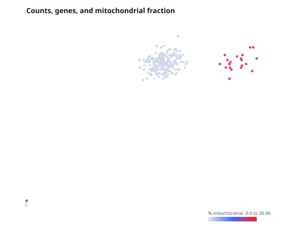

# Quality Control

*Follows HBC lessons 03 (QC setup), 04 (Cell Ranger QC), and 05 (Quality control).*

## The thing being filtered is not a cell

The matrix has one column per barcode, and the course is careful to say
*barcode* rather than *cell*, because many of them are not cells:

- **Empty droplets** that caught only ambient RNA — free-floating transcripts
  from cells that lysed during dissociation. These have few genes and low counts.
- **Dying cells**, which leak cytoplasmic RNA while mitochondria stay intact
  longer. The mitochondrial fraction rises as the cytoplasmic content drains.
- **Doublets** — two cells in one droplet, appearing as one barcode with roughly
  twice the content and an impossible hybrid identity.

Quality control is the step that removes them. It is also the step where it is
easiest to delete your result by accident, because every threshold is a
judgement call and an aggressive one removes a real cell type.

## Look before you cut

`sc.qc` computes per-cell and per-gene metrics and attaches them without
removing anything. Look first.

```biolang
import "singlecell" as sc

let raw = sc.load("nsclc_like")
let scored = sc.qc(raw)

println(head(scored.cell_qc_table, 8))
```

The three metrics that carry most of the decision:

| Metric | Low means | High means |
|---|---|---|
| UMIs per cell | empty droplet, or a small cell | doublet, or a large cell |
| Genes per cell | empty droplet, low complexity | doublet |
| % mitochondrial | usually fine | dying or stressed cell |

Note the second column. **Every one of these has a benign explanation.** A
plasma cell genuinely has fewer distinct genes because it is devoting itself to
antibody transcripts. Cardiomyocytes are genuinely full of mitochondria. A
threshold that is right for PBMCs will delete a real population in heart tissue.
This is why the course insists on plotting the distributions rather than
applying remembered numbers, and why the numbers below are examples rather than
recommendations.

## The joint view matters more than the marginals

A cell with few genes *and* few UMIs is an empty droplet. A cell with few genes
but many UMIs is a different animal — low complexity, possibly a doublet of a
cell type dominated by a handful of transcripts. You cannot see the difference
in either histogram alone.

```biolang
import "singlecell" as sc

let scored = sc.load("nsclc_like") |> sc.qc()
write_text("qc-scatter.svg", sc.plot_qc_scatter(scored))
```



Look for the diagonal. Real cells lie along a band where genes and UMIs rise
together; points off that band are the ones to interrogate.

## Applying the cuts

```biolang
import "singlecell" as sc

let raw = sc.load("nsclc_like")
let clean = raw
    |> sc.filter_genes(3)
    |> sc.filter_cells(20, 2500, 5.0)

println("before: " + str(raw.n_cells) + " cells")
println("after:  " + str(clean.n_cells) + " cells")
```

Two filters, in this order and for a reason.

`filter_genes(3)` drops genes seen in fewer than three cells. A gene detected in
one cell cannot support any statistical claim, and carrying twenty thousand such
genes costs memory and inflates the multiple-testing burden later.

`filter_cells(min_genes, max_genes, max_pct_mito)` drops barcodes. The lower
bound removes empty droplets, the upper bound catches doublets, the
mitochondrial cap removes dying cells.

> **The defaults are wrong for this fixture, deliberately.** The signature
> defaults are `(200, 5000, 25.0)`, tuned for a real experiment with ~20,000
> genes. The demo fixture has 168 genes, so a `min_genes` of 200 removes *every
> cell* — the pipeline then fails with `TypeError: empty data`. That failure is
> worth seeing once. Thresholds are not portable, and a default that silently
> emptied your object would be far worse than one that crashed.

## The mitochondrial cap needs gene symbols

`max_pct_mito` works by finding genes whose symbol starts with `MT-`. If your
features file carries Ensembl IDs (`ENSG00000198804`) rather than symbols, no
gene matches the prefix, the mitochondrial fraction is zero for every cell, and
the filter silently does nothing.

It will not warn you. Check that your gene names look like names.

## What Cell Ranger knew that you no longer do

The course spends a lesson on Cell Ranger's `web_summary.html`. **BioLang cannot
read that file**, and most of what it reports can be recomputed from the matrix
anyway — cell counts, median genes per cell, UMI distributions.

Two things cannot. **Sequencing saturation** (how much new information another
lane of sequencing would buy) and **fraction of reads mapped to the
transcriptome** are properties of the reads, and the reads are gone by the time
you have a matrix. If those numbers matter to you — and for judging whether an
experiment was deep enough, they do — read them in Cell Ranger's own viewer
before you move on.

## Judge the filter by what survives

The only real test of a QC threshold is whether the biology is still there
afterwards. Filter, cluster, and check that you still have the populations you
expected; if a cell type vanished between the raw and filtered object, the
threshold found it, not the noise.

That check needs clusters, which is [Normalization and PCA](hbc-03-normalization-pca.md)
and then [Clustering](hbc-05-clustering.md). QC is not finished until you have
been round that loop at least once.
