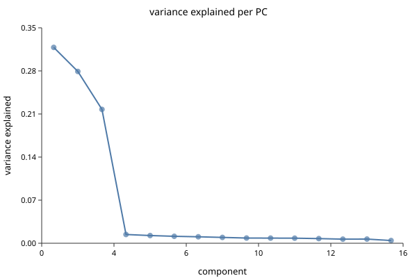

# Normalization and PCA

*Follows HBC lessons 06 (Theory of PCA) and 07 (SCTransform normalization).*

## Why the course teaches PCA first

This ordering looks wrong the first time you meet it. Normalization comes before
PCA in the pipeline, so why teach PCA first?

Because you cannot judge a normalization without a way to look at its result.
The question "did this normalization work?" means "are cells now grouped by
biology rather than by depth?", and answering it requires a projection. Teaching
the tool before the step that needs it is the right way round.

## PCA in one paragraph you can hold onto

You have a cell described by 20,000 gene measurements — a point in 20,000
dimensions. Most of those dimensions carry nothing: genes nobody expresses,
genes everybody expresses equally, genes that are pure noise. And many move
together, because genes work in programs.

PCA finds new axes as weighted combinations of genes, ordered so the first
captures the most variance, the second the most of what remains, and so on. The
first ten or twenty usually carry the structure; the rest carry noise. Keep the
first few and you have thrown away most of the noise and almost none of the
signal.

The essential intuition: **each PC is a gene program**, and a cell's coordinate
on it is how strongly that cell runs the program. PC1 is often "which broad
lineage is this", and PCs further down get more specific.

```biolang
import "singlecell" as sc

let obj = sc.load("nsclc_like")
    |> sc.filter_genes(3)
    |> sc.filter_cells(20, 2500, 5.0)
    |> sc.normalize()
    |> sc.variable_genes(50)
    |> sc.run_pca(20)

write_text("elbow.svg", sc.plot_elbow(obj, 15))
```



The elbow plot shows variance explained per PC. Read where it flattens: PCs
before the bend carry structure, PCs after carry noise. The bend is rarely
sharp, and that is fine — the cost of taking a few too many PCs is much lower
than the cost of cutting into real signal, so err high.

## Why raw counts cannot go into PCA

Two problems, and they compound.

**Depth.** One cell yields 20,000 UMIs, its neighbour 5,000. Every gene in the
first looks four times higher. PC1 becomes "how deeply was this cell
sequenced" — a technical axis, dominating the plot.

**Mean–variance coupling.** Count data has variance that grows with the mean.
Highly expressed genes vary more in absolute terms simply because they are
high. PCA maximises variance, so without a correction it selects for expression
level rather than for information.

The standard fix handles both: scale each cell to a common total, then `log1p`.

```biolang
import "singlecell" as sc

let obj = sc.load("nsclc_like")
    |> sc.filter_genes(3)
    |> sc.filter_cells(20, 2500, 5.0)
    |> sc.normalize(10000.0)

println("normalized layer present: " + str("norm_matrix" in keys(obj)))
```

`normalize(10000.0)` is counts-per-ten-thousand followed by `log1p`. The 10,000
is arbitrary and does not matter; the log is what does the work, compressing the
high end so a handful of loud genes stop dominating.

Note that `sc.normalize` **adds** `norm_matrix` rather than overwriting
`matrix`. Raw counts stay available, which matters because differential
expression should use counts, not logs.

## Variable genes

Most genes are uninformative for distinguishing cell types — either off
everywhere or on everywhere. Selecting the genes that vary more than expected
for their expression level focuses PCA on structure.

```biolang
import "singlecell" as sc

let obj = sc.load("nsclc_like")
    |> sc.filter_genes(3)
    |> sc.filter_cells(20, 2500, 5.0)
    |> sc.normalize()
    |> sc.variable_genes(50)

println("HVGs: " + str(len(sc.get_hvg_genes(obj))))
```

"More than expected for their expression level" is the important clause. A raw
variance ranking returns the highest-expressed genes, which you already knew
about. The selection bins genes by mean expression and ranks dispersion *within*
each bin, so a moderately expressed gene that switches cleanly between cell
types can outrank a loud constitutive one.

Use 2,000 for real data; 50 here only because the fixture has 168 genes.

## SCTransform

Log-normalization has a known weakness: it does not fully remove the
depth–expression relationship, and residual depth structure leaks into the PCs.
SCTransform fits a regularized negative binomial per gene with sequencing depth
as a covariate, and uses the Pearson residuals as the corrected values.

```biolang
import "singlecell" as sc

let obj = sc.load("nsclc_like")
    |> sc.filter_genes(3)
    |> sc.filter_cells(20, 2500, 5.0)
    |> sc.sctransform()

println("sctransform applied to " + str(obj.n_cells) + " cells")
```

Use it when depth varies a lot across cells, or when you are integrating samples
sequenced to different depths. Use plain `normalize` when you want something
simple, fast, and easy to explain — and note that the two produce different
downstream clusters, so pick one and keep it for the whole analysis rather than
switching partway.

## Next

You now have cells positioned in a space where distance means something. If your
data came from more than one sample, that space is probably still organised by
sample rather than by biology — which is [Integration](hbc-04-integration.md).
