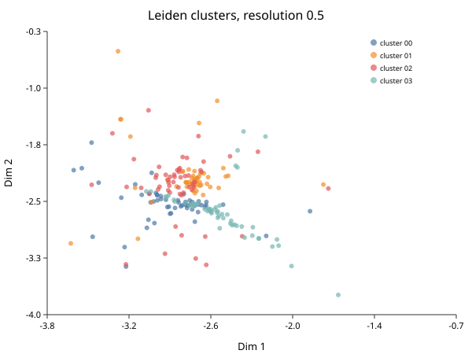

# Clustering

*Follows HBC lessons 10 (Clustering) and 11 (Clustering quality control).*

## Graph-based clustering

The method has three steps and no distance threshold anywhere, which is why it
suits this data.

1. **Build a k-nearest-neighbour graph.** Each cell connects to its k closest
   neighbours in PCA space.
2. **Weight the edges** by how much two cells' neighbourhoods overlap. Two cells
   sharing most of their neighbours get a strong edge; a chance proximity gets a
   weak one. This is what makes the result robust to the curse of
   dimensionality, where raw distances become nearly uniform.
3. **Find communities** — groups more densely connected internally than
   externally — with Leiden or Louvain.

```biolang
import "singlecell" as sc

let obj = sc.load("nsclc_like")
    |> sc.filter_genes(3)
    |> sc.filter_cells(20, 2500, 5.0)
    |> sc.normalize()
    |> sc.variable_genes(50)
    |> sc.run_pca(20)
    |> sc.neighbors(15)
    |> sc.cluster_leiden(15, 0.5)

let labels = sc.get_clusters(obj)
println("clusters: " + str(labels |> unique |> len))
for c in (labels |> unique |> sort) {
    println("  cluster " + str(c) + ": " + str(labels |> filter(|x| x == c) |> len) + " cells")
}
```

## Resolution is the knob, and it is not a truth setting

`resolution` controls how readily the algorithm splits a community. Low values
give few large clusters; high values give many small ones. The demo fixture was
built with four populations, and at `0.5` the pipeline finds four. Raise it and
four becomes ten — the extra clusters are not discoveries, they are the same
cells cut more finely.

**There is no correct resolution.** There is only a resolution appropriate to
the question. If you want broad lineages, go low. If you want to separate
activation states within a lineage, go high and expect to justify each split.

The honest workflow is to try several and see which splits survive scrutiny:

```biolang
import "singlecell" as sc

let base = sc.load("nsclc_like")
    |> sc.filter_genes(3)
    |> sc.filter_cells(20, 2500, 5.0)
    |> sc.normalize()
    |> sc.variable_genes(50)
    |> sc.run_pca(20)
    |> sc.neighbors(15)

for r in [0.2, 0.5, 1.0] {
    let c = sc.cluster_leiden(base, 15, r)
    println("resolution " + str(r) + " -> " + str(sc.get_clusters(c) |> unique |> len) + " clusters")
}
```

Report the resolution you used. An analysis that does not state it cannot be
reproduced, because the cluster count is a function of it.

## The lesson most tutorials skip

The algorithm always returns clusters. Run it on pure noise and you get clusters
— tidy, well-separated, entirely meaningless. So "I have clusters" is not
evidence of anything, and the course is right to give this its own lesson,
placed *after* clustering, because the question only becomes answerable once you
have something to interrogate.

Four checks, in the order I would run them.

**Is the cluster driven by QC metrics?** If one cluster is just the low-UMI
cells, or the high-mitochondrial cells, it is a quality artifact wearing a
cluster's clothing.

```biolang
import "singlecell" as sc

let obj = sc.load("nsclc_like")
    |> sc.standard(nil, 50, 15, 20, 2500, 5.0, nil, nil, true)

println(sc.cluster_diagnostics(obj))
```

**Is it driven by cell cycle?** Proliferating cells of different types can
cluster together by cycle phase rather than identity. `sc.cell_cycle` scores
cells so you can check.

**Is it one sample?** If a cluster is 95% one donor and the others are mixed,
suspect a batch effect that integration did not remove — or a genuinely
donor-specific population, which is a real finding but a much stronger claim
requiring much more evidence.

**Is it stable?** A cluster that dissolves when you change the resolution or the
number of PCs slightly was never a robust structure.

```biolang
import "singlecell" as sc

let obj = sc.load("nsclc_like")
    |> sc.standard(nil, 50, 15, 20, 2500, 5.0, nil, nil, true)

println(sc.cluster_stability(obj))
```

## UMAP is for looking, not for measuring

You will make a UMAP now, and it is worth being precise about what it is.

```biolang
import "singlecell" as sc

let obj = sc.load("nsclc_like")
    |> sc.standard(nil, 50, 15, 20, 2500, 5.0, nil, nil, true)

write_text("umap.svg", sc.plot_umap(obj, "Leiden clusters, resolution 0.5"))
```



UMAP preserves local neighbourhoods. It does **not** preserve distance between
clusters. Two clusters that appear adjacent are not more similar than two at
opposite ends of the plot — that spacing is an artifact of the layout algorithm,
and it changes between runs with different seeds.

So: never argue from the picture. "These populations are related because they
are next to each other" is not an argument. The clustering happened in PCA
space; the UMAP is a rendering of it, and every quantitative claim should come
from the space, not the rendering.

## Next

Clusters are numbered, not named. Turning numbers into cell types is
[Markers and Annotation](hbc-06-markers.md).
