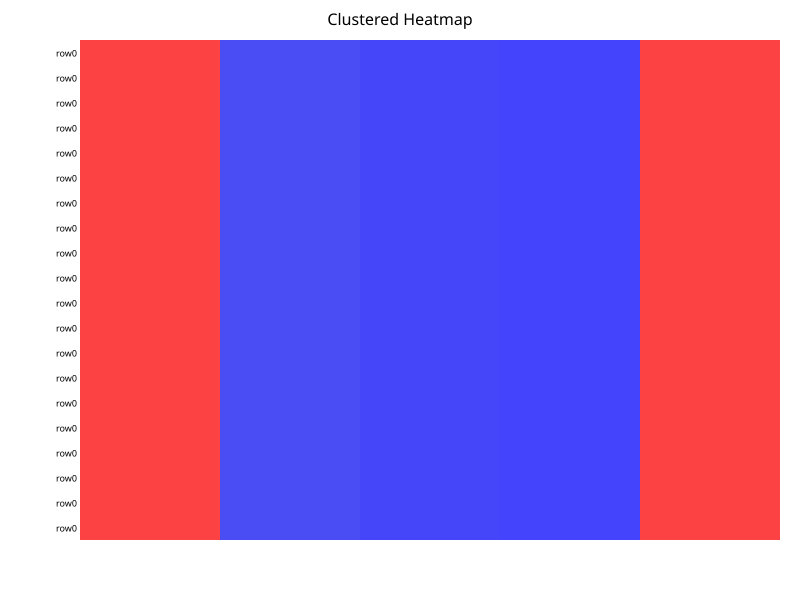
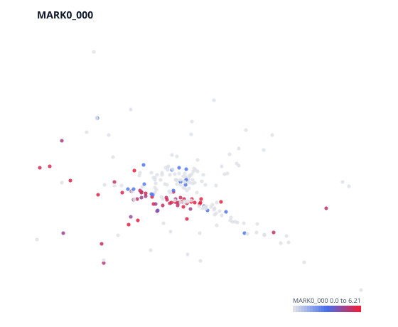
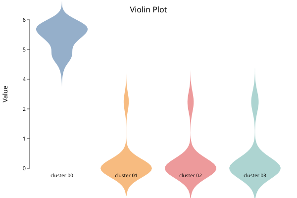
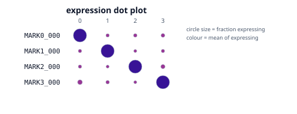

# Markers and Annotation

*Follows HBC lessons 12 (Seurat cheatsheet) and 13 (Marker identification).*

## Finding what distinguishes a cluster

A marker gene is one expressed more in a cluster than in the rest of the cells.
`sc.marker_table` compares two clusters directly:

```biolang
import "singlecell" as sc

let obj = sc.load("nsclc_like")
    |> sc.standard(nil, 50, 15, 20, 2500, 5.0, nil, nil, true)

let markers = sc.marker_table(obj, 0, 1)
println(head(markers, 6))
```

On the demo fixture this returns the planted `MARK0_*` block at the top with
`pct_a = 1.0` and `pct_b ≈ 0.09` — present in every cell of cluster 0 and almost
none of cluster 1. That is what a good marker looks like.

The columns worth understanding:

| Column | Meaning |
|---|---|
| `log2fc` | Log2 fold change between the groups |
| `pct_a`, `pct_b` | Fraction of cells in each group detecting the gene |
| `pvalue` | Raw test p-value |
| `padj` | After multiple-testing correction |
| `significant` | Whether `padj` clears the threshold |

## Read pct before you read p

The p-values here will be small — often reported as zero. **Do not take them
seriously as evidence.**

The test asks "could these two groups of cells have the same expression?", and
you already know the answer is no, because you *defined* the groups by
clustering on this same expression data. The clustering separated the cells; the
test then confirms they are separated. That is circular, and it is why marker
p-values are best read as a ranking device rather than as inference. A published
p-value of 10⁻³⁰⁰ from a marker table means "this gene ranked high", not "this
finding is certain".

The columns that carry real information are `pct_a` and `pct_b`. A gene detected
in 95% of cluster cells and 5% of the rest is a usable marker regardless of its
p-value. A gene with a huge fold change but detected in 10% of the cluster is
not — it is a few cells with high counts, and it will not replicate.

**Rank by fold change, filter by detection rate, and use the p-value only to
break ties.**

## Markers against everything else

Comparing one cluster to one other answers a narrow question. Usually you want
each cluster against all remaining cells:

```biolang
import "singlecell" as sc

let obj = sc.load("nsclc_like")
    |> sc.standard(nil, 50, 15, 20, 2500, 5.0, nil, nil, true)

write_text("markers.svg", sc.plot_markers(obj, 5))
```



The underlying `find_all_markers` builtin runs a Mann-Whitney U test per gene
per cluster and applies one Benjamini-Hochberg correction across the whole
table — not per cluster. Correcting within each cluster separately would
understate the multiple-testing burden, since the family is every test you ran.

## Looking at a marker

Three views, each answering a different question.

```biolang
import "singlecell" as sc

let obj = sc.load("nsclc_like")
    |> sc.standard(nil, 50, 15, 20, 2500, 5.0, nil, nil, true)

# Where is it expressed?
write_text("feature-MARK0_000.svg", sc.plot_feature(obj, "MARK0_000"))

# How much, and in what shape of distribution?
write_text("violin-MARK0_000.svg", sc.plot_violin(obj, "MARK0_000"))

# Several genes across all clusters at once.
write_text("dotplot.svg",
    sc.expr_dotplot(obj, ["MARK0_000", "MARK1_000", "MARK2_000", "MARK3_000"]))
```







The dot plot above is the one to study. Each marker gene lands on exactly one
cluster — a clean diagonal, large intense dots down it and small pale dots
everywhere else. That is what a well-separated annotation looks like, and it is
the fixture's four planted populations recovered exactly.

The dot plot is the one to reach for when annotating. It encodes two quantities
at once — dot **size** is the fraction of cells detecting the gene, dot
**colour** is mean expression among those cells — and that pairing is exactly
what distinguishes a real marker from an artifact. A large pale dot means
"expressed in most cells, weakly". A small intense dot means "a few cells,
strongly" and usually means you should be suspicious.

A violin plot hides this. Two clusters with identical violins can differ
completely in what fraction of their cells express the gene at all.

## From markers to cell types

This step is manual, and there is no honest way around it. You match marker
genes against known biology — literature, marker databases, or a reference
atlas — and assign names.

Three cautions the course is right to stress:

**A cluster without a clean marker set may not be a cell type.** It may be a
doublet cluster, a stressed-cell cluster, or an over-split fragment of a real
population. Not every cluster deserves a name.

**Marker genes are context-dependent.** A gene that marks a population in blood
may mark something else in tumor. Markers from a PBMC atlas do not transfer
unexamined to solid tissue.

**Record your reasoning.** "Cluster 3 = CD8 T cells" is not reproducible.
"Cluster 3: CD3D+ CD8A+ CD4−, GZMB high — cytotoxic CD8 T" is. Six months later
you will not remember, and a reviewer cannot check the first version at all.

## The Seurat verbs, translated

For readers coming from the course's R code:

| Seurat | BioLang |
|---|---|
| `CreateSeuratObject` | `sc.load` / `sc.from_matrix` |
| `PercentageFeatureSet` + `subset` | `sc.qc` → `sc.filter_cells` |
| `NormalizeData` | `sc.normalize` |
| `SCTransform` | `sc.sctransform` |
| `FindVariableFeatures` | `sc.variable_genes` |
| `RunPCA` | `sc.run_pca` |
| `ElbowPlot` | `sc.plot_elbow` |
| `FindNeighbors` | `sc.neighbors` |
| `FindClusters` | `sc.cluster_leiden` |
| `RunUMAP` + `DimPlot` | `sc.plot_umap` |
| `FindMarkers` | `sc.marker_table` |
| `FindAllMarkers` | `find_all_markers` |
| `FeaturePlot` | `sc.plot_feature` |
| `VlnPlot` | `sc.plot_violin` |
| `DotPlot` | `sc.expr_dotplot` |
| `RunHarmony` | `sc.integrate` |

The full API is in the [BioLang Single-Cell API](appendix-api.md) appendix.

## Next

Everything above, in one script you can run start to finish:
[The Whole Workflow](hbc-07-workflow.md).
